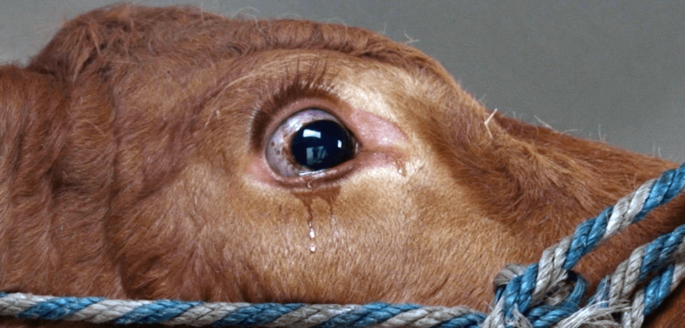
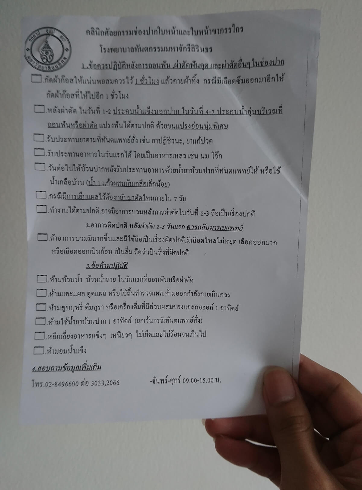
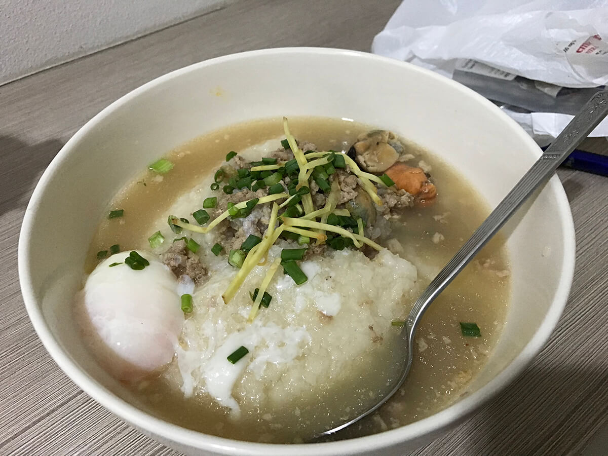
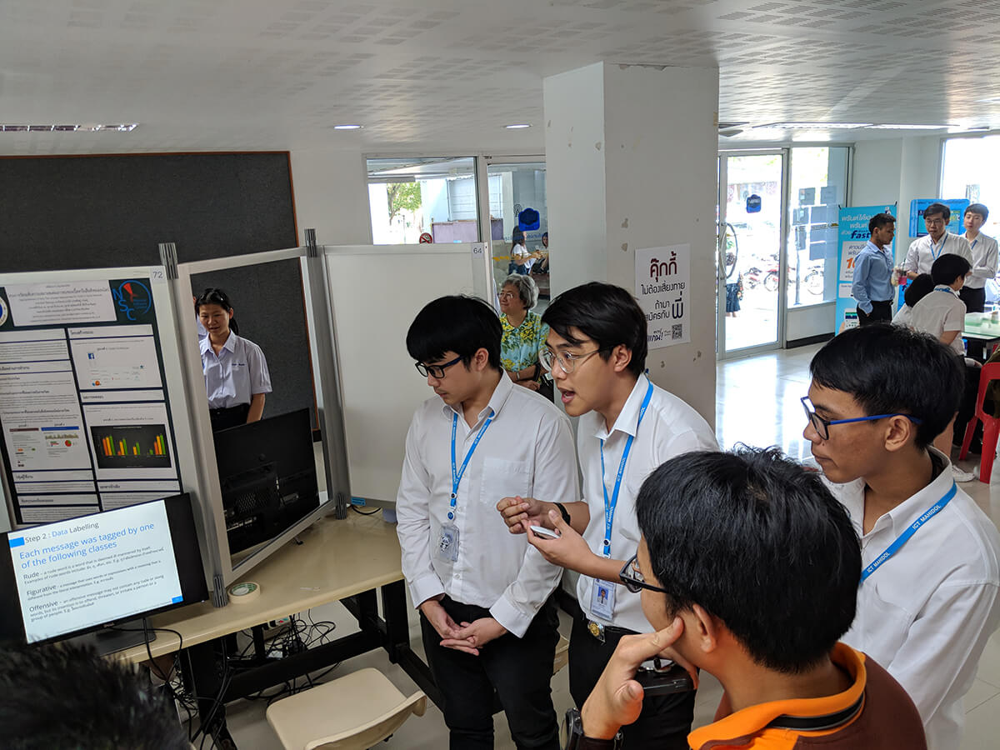
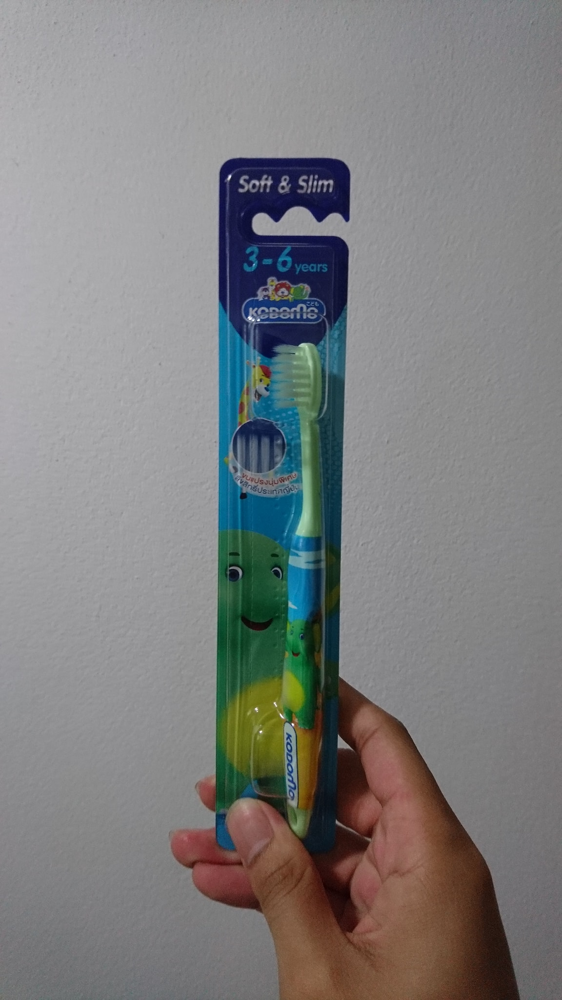

บอกตรง ๆ เลยว่าตั้งแต่เกิดมา ไม่เคยเข้าไปหาหมอฟันเลย เลยแบบเลยจริง ๆ ไม่เคยแม้แต่ไปตรวจฟัน หรือขูดหินปูนเลย สาเหตุหนึ่งเป็นเพราะกลัวมาก ๆ มากถึงมากที่สุด แต่ตอนที่จะเข้ามาเรียนที่มหิดล เราก็ต้องเข้าไปตรวจทันตกรรม ตอนนั้นก็เอาว่ะ แค่หมอเอาเครื่องมือมาจิ้ม ๆ แคะ ๆ ดูฟันแค่นั้นแหละไม่น่ากลัวหรอก

พอถึงวันนั้น ตอนที่หมอเอาเครื่องมือมาเคี่ย ๆ แคะ ๆ มันก็ไม่น่ากลัวนะ แต่มันน่ากลัวตรงที่ผลตรวจนี่แหละ อุดฟัน 7 ซี่ (เ_ย คนบ้าอะไร ฟันผุตั้ง 7 ซี่ !!!) กับอีกอันที่น่าชิบหายพอกันคือ **ฟันคุด** อีก 4 ซี่ โอ้ ไม่นะ ไม่ หลังจากนั้นเวลาก็ผ่านไป จนตอนนี้ปี 4 เทอมสุดท้ายละ ก็ด้วยความ งก หรืออะไรไม่รู้ ทำให้ตัดสินใจที่จะทำฟันให้จบ ก่อนจะเรียนจบ (จริง ๆ เพราะ งก ล้วน ๆ เลยละ เพราะถ้าเราต้องไปเรียนต่อ ค่าทำฟันที่โน้นคงไม่ใช่เรื่องตลกเท่าไหร่)

สาเหตุที่ต้องทำก่อนเรียนจบ เพราะเรามีสิทธิ์การรักษาพยาบาลของนักศึกษาอยู่ ทำให้เราสามารถหาหมอ หรือทำทันตกรรมได้ในราคาที่ถูกเหลือเชื่อ ถูกจริงจังมาก นั้นแหละ เลยทำให้ตัดสินใจไปทำก่อนจะเรียนจบ

## ไม่ได้ตรวจฟันนาน ก็ไปตรวจก่อนจะเริ่มทำอย่างอื่น
มันก็ผ่านมานานแล้วหลังจากที่ตรวจฟันล่าสุด เพราะฉะนั้นก่อนที่เราจะจัดการฟันของเราอย่างจริงจัง ก็ต้องมาตรวจฟันกันก่อน นี่ก็ไปซะเช้าเลย เพราะต้องไปจองคิว ก่อนที่จะเต็ม ซึ่งไปวันแรกก็ **นก** จ้า คิวเต็ม พอไปอีกวัน ไปอย่างเช้า เช้าแบบเจ้าหน้าที่ยังไม่มาเลย ก็ทำให้ได้คิว ก็ไปตรวจต่าง ๆ นา ๆ สรุปก็ไม่มีความเสียหายกับฟันเราเพิ่ม นอกจากที่เจอตอนปี 1 (เฮ้ออออ โชคดีไป !!) หลังจากนั้นก็นัดเพื่อทำการ อุดฟัน ขูดหินปูน และ ผ่าฟันคุด ต่อไป ก็มีแอบไปอุดข้างนอกมาก่อน

## ขูดหินปูน
การขูดหินปูนครั้งนั้นคือ เป็นการเสียซิงของปากเราให้หมอฟันครั้งแรกในชีวิตเลยนะ ไม่มีมีหมอฟันคนไหน ได้เอาเครื่องมือมากรอ หรือย่ำยีฟันเรามาก่อนเลย นี่ก็กลัวเสียงเครื่องมือหมอมาก มันดัง วีดดดดดดด โห้เ_ย เสียงมันทำร้ายขวัญกำลังใจ และโสดประสาทอย่างมาก ก่อนวันที่จะขูดคือ นั่งทำใจอยู่แบบ นานมาก นั่งคิดเลยว่า เอาไงดีฟร๊ะ ขูดแล้วมันจะเป็นยังไง มันจะเจ็บมั้ย ต่าง ๆ นา ๆ (เอาเป็นว่า วิตกจริตอยู่พักใหญ่ ๆ เลย)

และแล้ววันนั้นก็มาถึง พยาบาลเรียก “คุณอานนท์ค่ะ !” โหเ_ย !! เสียงกระดิ่งนรกชัด ๆ ตอนนั้นภาพในหัวคือ วัวที่อยู่บนรถบรรทุกน้ำตาไหล เพราะจะโดนส่งไปเฉือด มันคือที่สุดแล้ว

พอเข้าไปในห้องหมอ ถ้าใครที่เคยหาหมอฟันแล้วก็น่าจะเดาออกว่าบรรยากาศมันเป็นยังไง มันก็จะมีเก้าอี้นอนตัวนึง กับโต๊ะเครื่องมือหมอมากมาย กับไฟสุดสว่างดั่งดวงอาทิตย์ในนรก (นี่จะบรรยายอะไรของตรู) พร้อมกับคุณทันตแพทย์และผู้ช่วย ที่ปิดหน้า เตรียมพร้อมเฉือด

> ไม่เคยขูดหินปูนมาก่อนเลยใช่มั้ย

พอนอนกับไฟเปิดปุ๊ป หมอก็ถามคำถามแรกเลย นี่ก็รีบตอบเลยว่า “อ๋อไม่เคยแม้แต่หาหมอฟันเลยฮ่ะ”   หมอก็โอเคไม่ได้ว่าอะไร นั่งพินิจตรวจฟัน เอาเครื่องมือแหย่ ๆ แคะ ๆ ไปมา และก็พูดต่อว่า “มันจะเจ็บหน่อยนะ หินปูนเยอะมากเลย” ชิบหายละ นี่ตรูต้องเจ็บตัวอีกแล้ววว

หลังจากนั้นก็มีเสียง **วีดดดดดดดดดดด** โอ้ไม่นะไม่ !! โอ้แม่สาวน้อย ~~ เสียงที่เกลียดที่สุดของหมอฟัน คือเสียงอีเครื่องมือนี่แหละ ปกติจะได้ยินมันจากไกล ๆ ในห้องตรวจ รอบนี้มันอยู่ข้าง ๆ หูเลย โน้ววววว

จากนั้นเสียงนี่มันก็เข้ามาใกล้ขึ้นเรื่อย ๆ จนมันถึงฟันเรา หมอก็บรรจงเอาเครื่องมือมาขูด วีดดด วีดดด สักพักจากวีดดด ตรงฟันมันก็ค่อย ๆ เลื่อนขึ้นมาเรื่อย ๆ ตรงนั้นมันคือ เหงือกไงงง เงือกกกก พอโดนเหงือกเท่านั้นแหละ โคตรเจ็บ.... และหมอก็บอกว่า “ทนหน่อยนะ เราไม่เคยขูดเลย มันเข้าไปอยู่ใต้เหงือก” ตอนนั้นคือ เล็บนี่จิกมือยิก ๆ (ออกมานี่คือ มือแดง เลยละ) ผ่านไปสักพักเสียงก็หยุด ในใจคือ “เฮ้อเสร็จสักที” ผ่านไปสักวินึงหมอก็บอกว่า “เสร็จละ... ข้างบน” เด่ว ๆๆ นี่พึ่งผ่านไปครึ่งเดียวเองเหรออ เสียงวีดดด มันก็ดังขึ้นอีก และก็บรรจงขูดข้างล่างต่อจนเสร็จจริง ๆ หลังจากเสร็จในปากเรามันจะมีเศษ ๆ อะไรไม่รู้เต็มไปหมด หมอบอกนั้นแหละหินปูนที่ขูดออกมา โหหห เยอะมากจริง ๆ พอบ้วนน้ำเท่านั้นแหละ โห !! นี่น้ำหรือเลือด แดงได้ขนาดนี้ คือต้องบ้วนอยู่หลายครั้งมากกว่าจะหมด

จากนั้นก็ออกมานั่งรอ และเสียเงินเกือบ ๆ 400 บาท รู้สึกเหมือนฟันหายไป (จริง ๆ มันก็ไม่ได้หายไปนะ สิ่งที่หายไปคือหินปูนล้วน ๆ ถ้ารู้สึกแบบนี้คือ หินปูนมันต้องเยอะมาก ๆ) และก็กลับไปเดินตลาดวันศุกร์แดกแหลกเช่นปกติแบบไม่สะท้านอะไรทั้งสิ้น เออดี !!!

## ผ่าฟันคุด
หลังจากเหตุการณ์ขูดหินปูนไปราว ๆ 2 วันก็ถึงวันที่ต้องไปผ่าฟันคุดแล้ว ก่อนหน้านั้นก็เข้าไปนั่งอ่านเลยนะว่า มันทำยังไง มันจะเป็นยังไงอย่างละเอียด (เข้าใจว่าตัวเองเป็นคนที่กลัวกับความไม่รู้ ซึ่งมันเป็นเรื่องปกติของคนทั่วไปอยู่ละ แต่นี่เวลากลัวจะกลัวสุด ๆ ไปเลย) ประกอบกับภาพที่รู้สึกว่า การขูดหินปูนมันก็ไม่ได้แย่ขนาดนั้น มันก็เข้ามาช่วยให้เราอนุมานได้ว่า **“ถ้าก่อนขูดหินปูนเราคิดว่า มันน่าจะน่ากลัว แต่พอออกมามันก็ไม่ได้น่ากลัวขนาดนั้น การผ่าฟันคุดก็เช่นกัน”** (นี่เอา Association Rule ใน Logic มาใช้แบบนี้ก็ได้เหรอ มันใช่เหรอ !!) มันก็พอจะช่วยได้หน่อยนึง

ก็ไปลงทะเบียน และเอาใบไปยื่นและรอเรียกชื่อ วัดความดัน อะไรตามปกติ จนเสียงเรียกจากนรกก็มาถึงอีกครั้ง **“คุณอานนท์”** ไม่เคยโดนใครเรียกชื่อแล้วตกใจได้ขนาดนั้น ก็ลุกและเดินตามหมอเข้าไปในห้อง ก็เปลี่ยนรองเท้าตามปกติ และก็เดินเข้าไปในห้องหมอ

ห้องมันก็ไม่ต่างอะไรมากกับตอนขูดหินปูนมากหรอก แต่เครื่องมือที่วางอยู่บนโต๊ะนี่ อื้ม.... ชิบหายละ !! คม ๆ ทั้งนั้น หลังจากนั้น คุณหมอฟันและผู้ช่วยที่เป็นตัวละครหลักก็เข้ามาถาม ประมาณว่า ผ่าครั้งแรกใช่มั้ย มีคุดกี่ซี่ จะผ่าซี่ไหนก่อน (ให้เราเลือกด้วยยย เพราะทั้ง 2 ข้างมันจะผ่าข้างไหนก่อนก็ได้ไง) นี่ก็จัดเลยข้างซ้าย

ขั้นตอนก็เริ่มขึ้นจากการเอาผ้าเขียว ๆ มาปิดหน้าไว้เหลือแต่ปาก จากนั้นก็มีเสียงมาบอกว่า “จะฉีดยาชาแล้วนะครับ อ้าปากนะ” เ_ย อันนี้มันเป็นขั้นตอนที่น่าจะเจ็บที่สุดแล้ว !! ก็อ้าปาก หมอก็บรรจงเอาเข็มจิ้มไปที่เหงือกของเรา คือเคยฉีดยาที่อื่นมานะ แต่ลองนึกสภาพสิ จำนวนเส้นประสาทในเงือกที่มีจำนวนที่ไม่ใช่เล่น ๆ เลย เจ็บแน่ ๆ มือนี่จิกหนักว่าขูดหินปูนอีก และมันเข็มเดียวซะที่ไหน จิ้ม ๆ อยู่ 2-3 เข็มเลยมั่ง กับตอนเข็มหลัง ๆ ลิ้นก็มีรสขม ๆ ขมมาก ๆ (มันคือยาชา) ก็ห้ามกลืน ก็ค่อย ๆ โดนดูดออก ก็ไม่แย่

สักพักหมอก็ถาม “ชายัง” นี่ก็จะกวนทีนตอบว่า ชาเย็นเหรอ ก็จะเ_ยไป พอจะอ้าปากพูด อื้มมม ชาแล้วมันเป็นแบบนี้นี่เอง ชาซี่ซ้ายทั้งซี่รวมถึงลิ้นด้วย หมอก็เอาเครื่องมือมาจิ้ม ๆ ถามเจ็บมั้ย ก็บอกว่าไม่เจ็บ (คือตอนที่หมอเอาเครื่องมือมาจิ้ม ๆ เช็ค คือหน้าเราก็โดนผ้าเขียว ๆ ปิดอยู่เลยไม่รู้ว่ามันคมจริงมั้ย ก็เชื่อ ๆ ตอบหมอไป)

จากนั้นก็ไม่รู้ว่าเกิดอะไรขึ้นบ้าง ก็มีเอาเครื่องมือมาวางแถว ๆ ตัว เสียงเครื่องมือกระทบไปมา สักพักหมอก็พูดว่า “จะเสียวนิดนึงนะครับ หมอจะเลื่อยฟัน” เด่ว ๆๆๆๆ หมอออใจเย็นนะ !! เสียงวีดดดด มันก็กลับมาละ ถึงจะฉีดยาชาแล้ว มันก็ยังเสียว ๆ อยู่นะ เสียวแบบหนักกว่าตอนขูดหินปูนอีก

ระหว่างผ่าคือ เกร็งไปทั้งตัว ไม่รู้เลยว่ามันเกิดอะไรขึ้นบ้าง หลังจากเสียงเครื่องมือดับลง หมอก็บอกว่า “มันจะตึง ๆ หน่อยนะ หมอจะดึงฟันออกละ” จากนั้นคือ กีฬาชักเย่อระหว่างหมอฟันกับคนไข้ที่แท้ทรู หมอก็ดึง นี่ก็ยั้งไว้ ในใจก็ “ดี ๆ นะหมอออ ถ้าดึงหลายครั้งนี่ระบมหนักเลยนะ” ผ่านไปสักพักก็เสร็จอันนึง และก็ไปทำข้างบนอีกอัน ก็เหมือนเดิม ดึงกันไปมาอย่างเมามันส์ จนเย็บและก็เสร็จ พร้อมกับเอาผ้าก๊อทมาให้กัดไว้ พร้อมกับให้คู่มือกับผ้าก๊อทอีกชุดมา แล้วก็ในปากนี่คือเลือดมันจะออกเรื่อย ๆ ห้ามเราบ้วนเลยนะ ห้ามบ้วนทุกอย่าง เพราะจะทำให้แผลเปิด และก็ออกมารอนอกห้อง

_วิธีการดูแลรักษาแผลหลังผ่าหรือถอนฟัน_

จุดที่รู้สึกสงสัยมาก ๆ ไม่รู้ว่า เพราะในคอมพิวเตอร์เรานับเลขตัวแรกคือ 0 แล้วค่อยตามด้วย 1 เราคงชินมั่ง กับ Logic ที่ว่า กว่าเราจะผ่าเสร็จมันก็เย็นของวันแล้ว เราจะเริ่มนับวันที่เราผ่าเป็นวันที่ 1 หรือวันที่ 0 สงสัยจริงนะ แต่ก็อ้าปากถามไม่ได้ไง ตอนนั้นต้องกัดผ้าก๊อทอยู่

ตอนออกมารอก็รู้สึกแปลก ๆ อื้ม... เหมือนจะหน้ามืด เหงื่อแตกทั้งที่อยู่ในห้องแอร์ (ด้วยความที่ตอนเด็ก ๆ นี่เป็นเหยื่อของการหน้ามืดบ่อยมาก) ก็เลยลองพยายามนั่งพิงสักพักนึง มันก็ไม่ดีขึ้น สักพักการเงินก็เรียกไปจ่ายเงิน ก็มึน ๆ จนหูอื้อฟังไม่รู้เรื่อง เลยพยายามพูดว่า หน้ามืด... จากนั้นก็เกือบหาย ก็พยาบาลก็มาช่วยเอาไปนอนกับเอาแอมโมเนี่ยมาให้ดม มันก็ดีขึ้น (ในใจคือ เฮ้ยทำไมมันหน้ามืดได้ขนาดนี้ ไม่ได้เป็นแบบนี้มานานมากแล้วนะ) และก็เดินไปจ่ายตังค์ 30 บาท (คือจ่ายทั้งหมด 30 บาทเลย รวมค่ายาทั้งหมดแล้ว เพราะอันนี้มันเบิกสิทธิ์ นศ มหิดลได้) เอาใบนัดตัดไหม ตามปกติ และไปรับยา ก็ได้พวกยาฆ่าเชื้อ ลดบวม กับแก้ปวดมา ก็เบสิค ยาทุกตัวที่ได้มาคือรู้จักหมดเลย (นอกจากจะเรียนคอมแล้ว เรื่องการแพทย์ก็อ่านอยู่บ่อย ๆ) ตอนรับยาเสร็จออกมา อาการหน้ามืดมันก็หายไปแล้วนะ รู้สึกเฉย ๆ ละ มีแค่ชา ๆ จากยาชาที่ฉีดไป

## ชีวิตอันน่าอนาถหลังผ่าฟันคุด

หลังจากนั้นก็กลับมานั่งที่ MLC ก็มีคนแกล้งเว้ย !! (ไว้หาย ต้องเอาคืน !!) ก็เล่นกันไป นั่งทำงานไป (คือไปผ่าฟัน เกือบเป็นลมมา ก็ยังมีอารมณ์นั่งทำงานได้ ต้องเป็นคนยังไง !!) ผ่านไปสัก 2 ชั่วโมงมันก็เหมือนจะมาอีกแล้ว เลยไปนั่งหลับสักพัก แล้วก็จะไปกินข้าว ความหน้ามืดมันก็หนักขึ้นเลยให้น้องไปส่งที่หอ แล้วก็ฝากซื้อโจ๊กกลับมา ตอนนั้นก็ราว ๆ 6 โมงแล้วละ (ตอนผ่าคือราว ๆ  3 โมงครึ่ง) ยาชามันก็เหมือนจะค่อย ๆ เสื่อมคลายดั่งเวทย์มนต์ที่ซินเดอเรลล่าได้รับให้ไปเต้นกับเจ้าชาย โลกแห่งความเป็นจริงก็มาถึง ปวดสุด ๆ ปวดจนนอนหนีไม่หลับเลย เลยลุกขึ้นมากินพาราที่หมอให้มา สักพักมันก็ดีขึ้น น้องก็เอาโจ๊กมาให้พอดี ก็รับแล้วก็ไปนอนต่อสักพัก 3 ทุ่มก็ลุกขึ้นมากิน

นึกสภาพนะ ตอนนั้นคือ ยังไม่ได้อาบน้ำ หน้าแบบป่วยสุด นั่งหยอดโจ๊ก คือมันแย่มาก ๆ ตอนนั้นเทโจ๊กออกมา ก็ใช้สติ และสมองปลาโลมาปากขวดที่ยังเหลืออยู่คิด ก็ปิ้งไอเดียไปหยิบหลอดจากในตู้เย็นมา ดูดมันเลย ดูดไปหมูติด !! บ้าจริง นึกสภาพนะว่า เราพึ่งผ่าฟันคุดมา ฉะนั้นเวลาเราใช้หลอดดูด เราจะไม่สามารถดูดแรง ๆ ได้ แล้วหมูมันก็แน่นหลอดเหลือเกิน ฉะนั้นไอเดียนี้จึงหายไป สุดท้ายก็ไปหยิบช้อน แล้วตักทีละนิดแล้วก็ค่อย ๆ หยอดผ่านข้างที่ไม่ได้ผ่าแล้วใช้ลิ้นมันช่วยผลักโจ๊กที่เข้ามาลงคอไปเลย (เอาเป็นว่ามันลำบาก สั_ๆ) ผ่านไปเกือบ ๆ 3 ชั่วโมงก็กินโจ๊ก 1 ถุงจนหมด และกินยาไป ตอนนั้นพาราแก้ปวดมันก็ยังออกฤทธิ์อยู่ เลยตัดสินใจรีบไปอาบน้ำก่อนที่มันจะหมดฤทธิ์ (ตอนแรกกะว่า จะไม่อาบแล้วไง จะนอนต่อเลย) ออกมาก็ไข้ขึ้นเรียบร้อย วันถัดไปมีเรียนก็ลุกไปอาบน้ำออกมาไข้ที่คิดว่าหายแล้วมันก็กลับมา เลยนอนใส่เลย ไปเรียนไม่ไหว

อ๋อหลังจากที่เราผ่ามาอะ เขาจะไม่ให้เราแปรงฟันเลยประมาณ 3 วันนะ พอไม่ได้แปรงฟันอะ มันก็จะรู้สึกแปลก ๆ มากมาย และช่วงนั้นเวลาจะคุยกะใครก็จะอยู่ห่าง ๆ คิดดูเดะ ไม่ได้แปรงฟันอะ อีกเรื่องที่ดูน่ากลัวคือ เวลาเรานอน บางคนก็จะน้ำลายไหลใช่ม่ะ เราก็เป็นคนนึง หลังจากที่ผ่าใหม่ ๆ เลือดมันจะออกเรื่อย ๆ ทำให้ตื่นเช้ามานี่นึกว่าเมื่อคืนเป็นแวมไพร์ออกไปไล่ดูด(เลือด)มา 😈 ข้างปากนี่แดงเชียว

<iframe src="https://www.facebook.com/plugins/post.php?href=https%3A%2F%2Fwww.facebook.com%2Farnondora%2Fposts%2F10216136185617834&width=500" width="500" height="218" style="border:none;overflow:hidden" scrolling="no" frameborder="0" allowTransparency="true"></iframe>

ช่วงนั้นปากเรามันก็จะรู้สึกตึง ๆ ทำให้เราอ้าปากได้ไม่มาก (น้อยมาก ๆ น้อยจนพูดให้รู้เรื่องเป็นสิ่งที่ยากมาก) จนกลายเป็นเหตุการณ์ที่น่าวงวารตัวเองด้านบนนี้

การกินปกติเป็นคนที่กิน 2 มื้อคือกลางวันและเย็นเลย แต่พอมันต้องกินยาเช้า เลยต้องกินข้าวเช้าด้วย ลำบากสุด ๆ แต่ที่ลำบากกว่านั้นคือ เราไม่ได้มีเวลาระหว่างวันที่จะเสียเวลาเกือบ 3 ชั่วโมงกินโจ๊กได้ทุกมื้อ วิธีแก้ปัญหาคือ ก็กินนม 🍼 เอาในมื้อเช้าและกลางวัน มื้อละกล่อง แล้วตกเย็นค่อยไปกินโจ๊กเอา จากปกติคือกินข้าว แล้วตามด้วยขนม (ลองคิดดูถึงจำนวน Cal ดูสิต่างกันเป็นสิบเท่าได้ ก็ผ่านไปอาทิตย์นึง เสื้อนศ ที่ใส่แล้วจะแน่นหน่อย ๆ หลวมขึ้นเลย) ก็ทำแบบนี้อยู่เรื่อย ๆ นะ ยกเว้นมีวันนึง บ้าจัดเห็นโปร 50% A&W จนชวนเพื่อนไปซื้อไก่ทอด วาฟเฟิลสารพัด กินมังให้หมด เช้าหลังจากคืนนั้นคือปวดและบวมหนักกว่าเดิมอีก นอนประคบเย็นกันหลายชั่วโมง

ความลำบากอีกหนึ่งเรื่องคือ เราผ่าวันจันทร์ และวันพุธเราต้องไปแข่ง NSC ที่ต้องใช้ปาก Present  ถามว่า ทำยังไง? ก็คืนก่อนหน้านั้น พยายามค่อย ๆ อ้าปากทีละนิด ๆ แล้วก็พูดเท่าที่พูดได้แหละ กลางวันก็อยากลองกินข้าว กินไปได้ 3 คำ ยอม! เม็ดข้าวมันเข้าไปติดในแผล กว่าจะเอาออกมาได้คือน้ำตาไหล No more rice anymore!!!! 😡

คืนวันที่ไป NSC มาก็เป็นวันที่ 3 ก็จะมาแปรงฟันกัน (จริง ๆ เขาบอกวันที่ 4 ไง นี่ก็ลักไก่) แปรงปกติเราจะใช้ไม่ได้ ต้องไปซื้อแปรงเด็ก (ยืนเลือกอยู่นานมากว่า จะเอาลายไหนดี อันไหนน่ารักสุด) ที่ขนแปรงมันจะนุ่มมาก ๆ กับหัวแปรงเล็ก เพราะเราต้องแปรงไม่ให้ไปโดนแผลเย็บ ถ้าโดนนี่น่าจะชิบหายอยู่ เวลาแปรงก็กลัว เลยต้องเอามือถือมาเปิดไฟฉาย เฉิดหน้าขึ้นเล็กน้อยให้เห็นฟันในกระจก แล้วค่อย ๆ แปรง บ้วนออกมาคือ สีนี่แดงนิด ๆ เลย สุทธิเวลาไม่ต่ำกว่า 10 นาทีในการแปรงฟัน

_Tattoo Color x TPO Poster_

ผ่านไปจนวันเสาร์ โอ้ Concert **Tattoo Color x TPO** เ_ย ปากยังระบมจาก NSC อยู่เลย แรก ๆ มันก็นั่งดูเฉย ๆ สไตล์ TPO แหละ มาพาร์ทหลังนี่มีกระโดด กับแหกปากร้องกัน นี่ก็ด้วยความอยากสนุก ร้องกับกระโดดไปท่อนแรกเท่านั้นแหละ เดินกลับมานั่งเลยฮ่ะ **โคตรปวด** กับแค่เวลาปั่นจักรยานเจอสะเทือนหน่อยเดียวก็เสียวไปทั่งตัวแล้ว นี่กระโดดเลยคิดว่ามันจะเป็นยังไงละ สรุปก็เป็นการดู Concert ที่เจี๋ยมเจี๊ยมที่สุดในชีวิตเลย เศร้าสาดดด 😭

ช่วงประมาณวันศุกร์ยาวไปถึงวันอาทิตย์มันก็จะมีอาการปวดอยู่เรื่อย ๆ นะ ปวดแบบทำงานไม่ได้เลย พึ่งยาแก้ปวดอย่างเดียว วันนึงนี่กดไป 3 เม็ดเลยมั่ง คือเยอะมาก ๆ ปัญหาคือยาพวกนี้ห้ามกินติดต่อกัน 5 วัน ซึ่งเราเริ่มกินตั้งแต่คืนวันจันทร์ ทำให้เราก็กินสุดท้ายได้ไม่เกินวันศุกร์ แล้วเสาร์ อาทิตย์ที่ปวดทำไง ก็คือต้องประคบเย็น แล้วอยู่เฉย ๆ ตอนที่ปวด ทำให้มันก็จะไม่ได้งานเท่าไหร่ โชคดีที่วันอาทิตย์กับวันจันทร์ไปที่ตัดไหมมันไม่ปวดเลย ก็โชคดีไป

และวันที่รอคอยก็มาถึงคือการไปตัดไหม โชคดีที่ไม่มีอาการอะไรแปลก ๆ เช่นหนอง หรืออาการอื่น ๆ ที่อาจจะเกิดขึ้น ก็ไปลงทะเบียน เอาไปยื่น วัดความดันปกติ แต่สิ่งที่ต่างคือคำว่า “คุณอานนท์” กลายเป็นเสียงสวรรค์ซะงั้น ฮ่า ๆ เข้าไป หมอก็ถามอาการโน้นนี่นั่น และก็ให้นอนลง รอบนี้ไม่ได้เอาผ้าเขียว ๆ มาปิดนะ ก็เอากรรไกรมาค่อย ๆ แหย่ และตัดไหมในปากเรา มันก็จะรู้สึกเจ็บหน่อย ๆ (นิดเดียวจริง ๆ) และก็ออกมาเซ็นต์เอกสารแล้วก็กลับได้เลย ไม่มียาอะไรแล้ว เดี๋ยวต้องมานัดเอาอีก 2 ซี่ที่เหลือออกอีก (นี่ต้องมาทรมานอีกรอบเหรอเนี่ย)

## หลังตัดไหม
ฟิลลิ่งหลังจากตัดไหม มันก็ไม่ได้ทำให้เราอ้าปากหรือพูดได้ตามปกติขนาดนั้น มันก็ได้มากกว่าเดิมหน่อย ความตึง ๆ ตอนอ้าปากมันก็ไม่ได้มากเท่ากับตอนที่มีไหมอยู่ในปาก แต่ก็ตึง ๆ อยู่หน่อย ๆ ก็กินอะไรได้มากขึ้น และใช้น้ำยาบ้วนปากได้ ก็รู้สึกดีส์ ส่วนจะอ้าปากกว้าง ๆ เหมือนเดิมได้ ก็ต้องใช้เวลาสักหน่อย พร้อมกับแปรงสุดน่ารักต่อไปสักพัก กับปกติเป็นคนที่ชอบเอาลิ้นไปเขี้ยฟันเล่น ฟันซี่ที่ชอบเอาลิ้นไปเขี้ยคือฟันคุดนั่นแหละ มันก็จะเหงาปากหน่อย ๆ

## สรุป
ก็ไม่รู้อะไรดลใจให้มาเล่าเป็นฉาก ๆ ขนาดนี้ ชีวิตช่วงสัปดาห์ที่ผ่านมามันน่าวงวาร จริง ๆ ผ่ามันก็ไม่ได้น่ากลัวเลยนะ เพราะเราไม่เห็นอะไรเลยระหว่างผ่า ฮ่า ๆ เอาจริง ๆ มันก็ทรมานและใช้ชีวิตอย่างน่าวงวารอยู่อาทิตย์นึง พร้อมกับใช้เวลาอีกสักอาทิตย์ในการเข้าโหมด Heal ให้กลับมาเป็นเหมือนเดิม สำหรับใครที่รู้ตัวว่ามีฟันคุดเป็นบริวารในปากก็แนะนำให้รีบไปหาทันตแพทย์จัดการเอามันออกซะก่อนที่มันจะไปดันฟันซี่ข้างเคียงทำให้ฟันเราเสียไปหมดเป็นวงกว้างได้นะ ปัญหาช่องปากอื่น ๆ ด้วยนะ อย่าปล่อยไว้ รีบจัดการก่อนที่จะลามแล้วต้องเจ็บตัวกว่าเดิม
