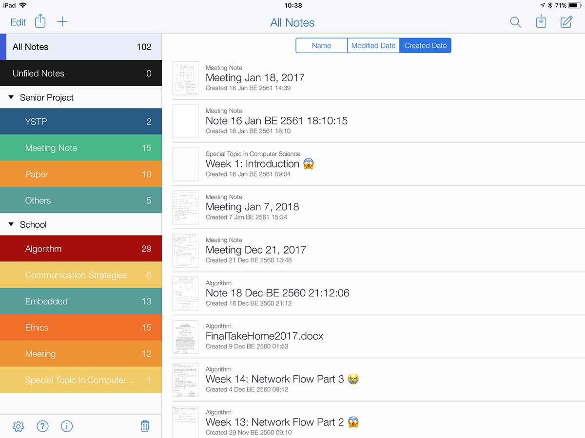
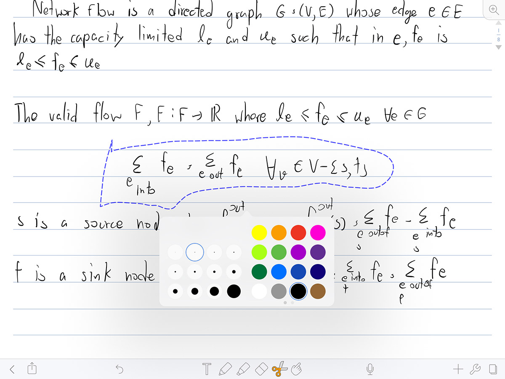
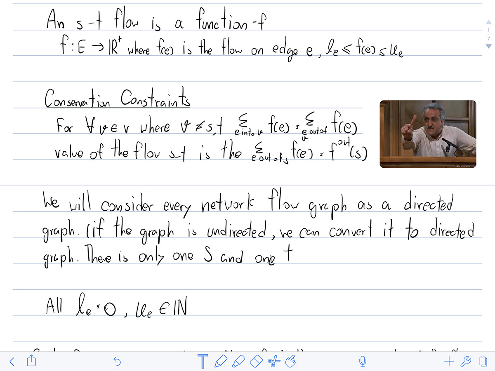
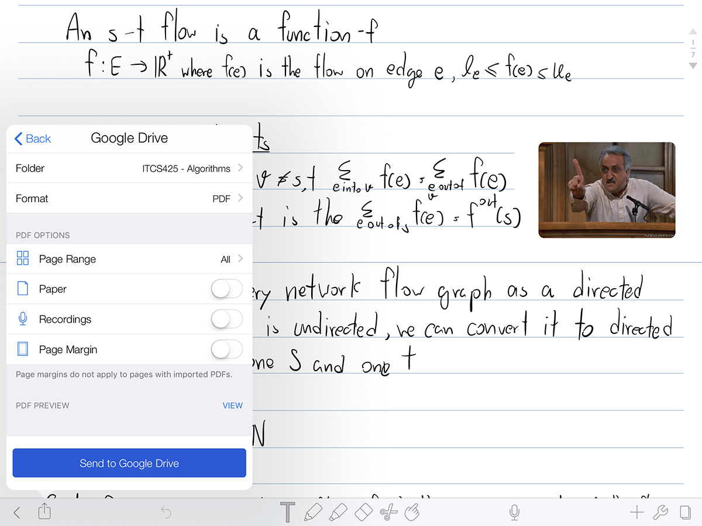
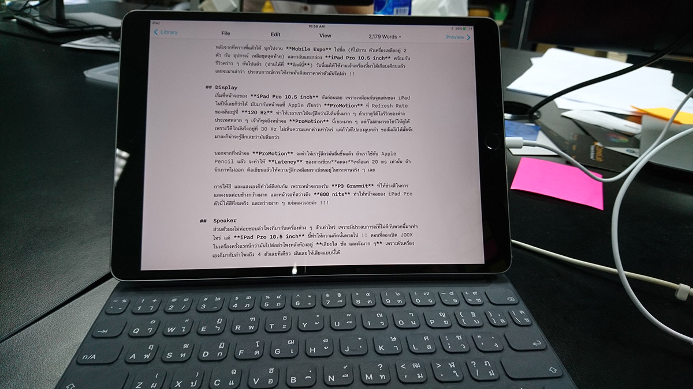
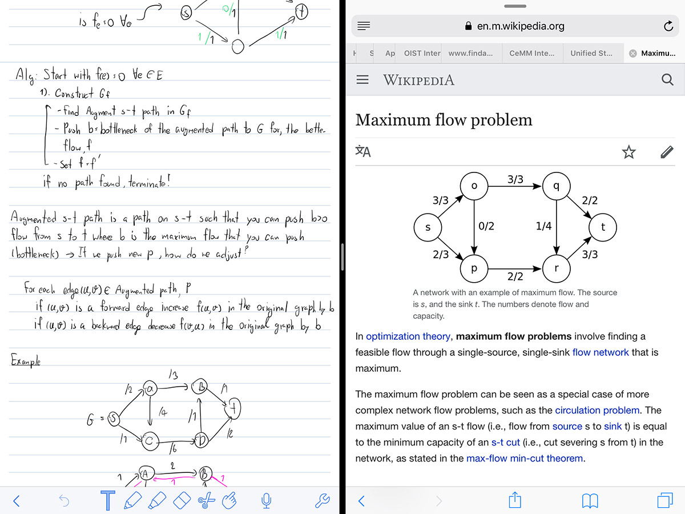
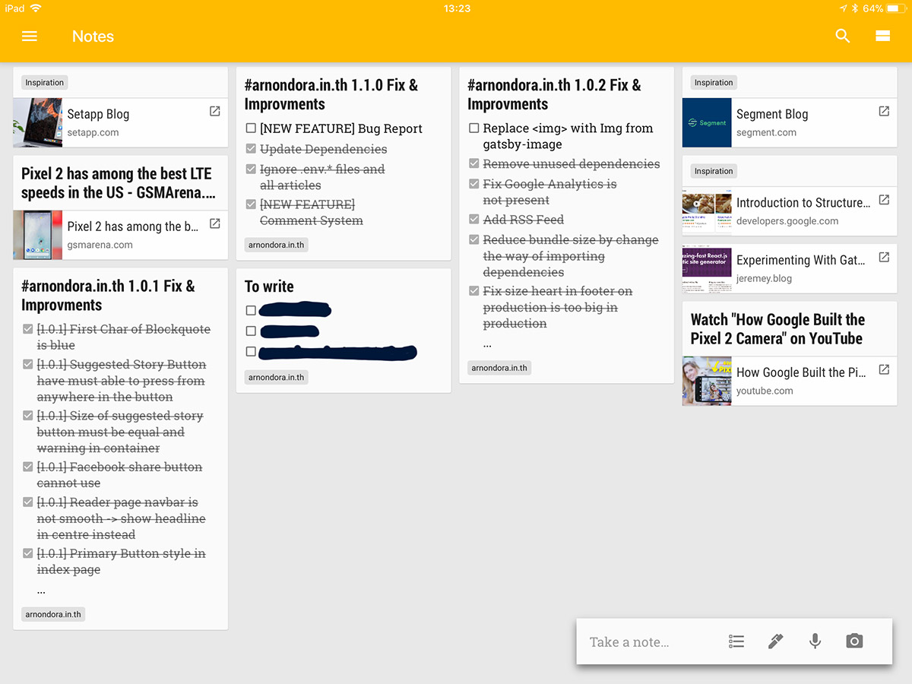
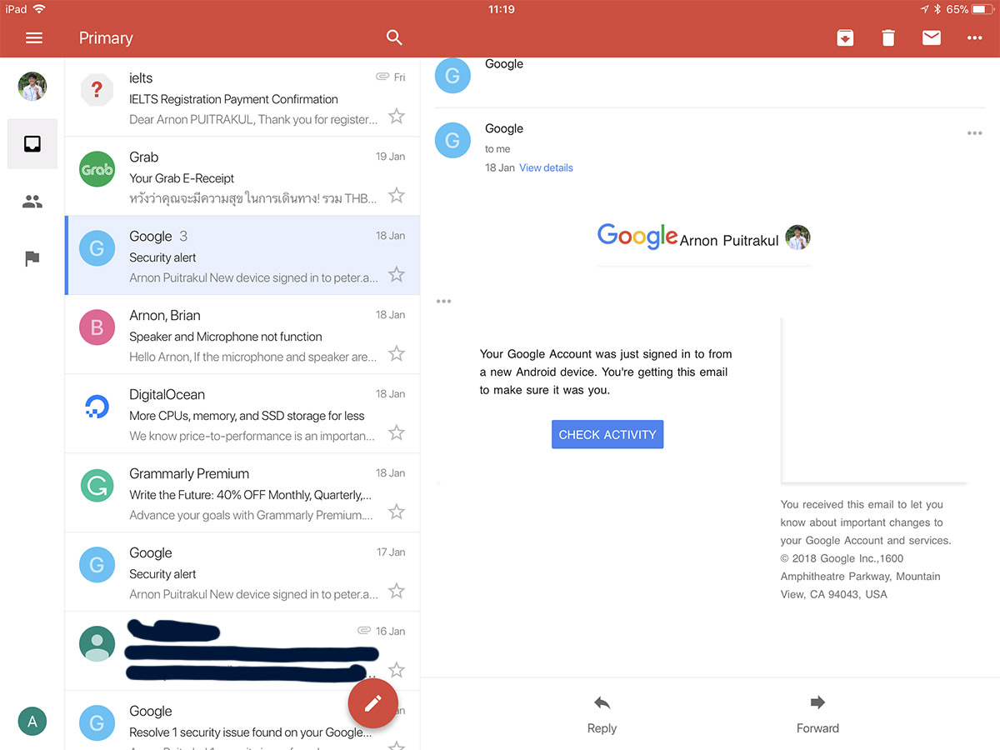

ตอนนี้อยากจะมาเล่าเรื่องละกัน เป็นเรื่องที่หลาย ๆ คนถามผมมาเยอะมาก ๆ ว่า iPad Pro 10.5 ที่ผมรีวิวไปมันเอามาใช้งานกับการเรียนได้มั้ย วันนี้เลยจะมาตอบคำถามนี้กัน

## Lecture Note ✍️
โดยทั่ว ๆ ไปแล้วคณะผมจะมีเว็บสำหรับโหลด Lecture Note อยู่แล้ว เพราะฉะนั้นก่อนเรียนผมก็จะโหลดจากเว็บมาลงเครื่องเตรียมไว้ก่อนเลย พอมาถึงก็เปิดแล้วจดได้เลย ส่วน App ที่ผมเลือกใช้ในการจด Note คือ **Notability**

ลักษณะการจัดการโน๊ตต่าง ๆ ใน Notability จะเป็นอยู่ในลักษณะของ Divider กับ Subject นึกซะว่ามันคือ Folder และ Sub-Folder เนื่องด้วยเวลาใช้งานจริง ๆ มันก็ไม่ได้มีแค่เรื่องเรียนอย่างเดียว เพราะฉะนั้นผมก็เลยแบ่ง Divider ออกเป็นงาน ๆ ไป และ แบ่ง Subject ออกเป็นแต่ละส่วนของงานนั้น ๆ

ส่วนเรื่องของการจด Lecture นั้นจะอยู่ใน Divider ที่ชื่อว่า School พอเข้าไปก็จะเป็นแต่ละวิชา ในนั้นก็จะมี Lecture Note ของแต่ละวิชาอยู่ การจัดแบบนี้มันก็ทำให้ชีวิตเราง่ายขึ้นมาก

ด้วยความที่เป็นคนจดอะไรก็เอียงตลอด พอกลับมานั่งอ่านก็ต้องเอียงอ่าน มันก็จะอ่านยากหน่อย ๆ ดังนั้นเวลาที่จด ผมเลือกที่จะเปิดเส้นบรรทัดตอนจดด้วย เพื่อช่วยลดอาการจดเอียง 📏 ทำให้ Lecture Note อ่านง่ายขึ้นมาก

ในการจดบางที ลำพังแค่จดให้ทันก็แย่แล้ว แล้วต้องมาเปลี่ยนสี เปลี่ยนขนาดหัวปากกาอีก ก็คงทำให้การจดบรรลัยได้ ซึ่งใน Notability เราสามารถที่จะจดแล้วเปลี่ยนสีทีหลังได้ โดยการ Select ส่วนที่เราต้องการจะเปลี่ยนสี และกดเปลี่ยนสีได้เลย อันนี้ส่วนตัวเป็นอะไรที่ชอบมาก ๆ

อาจจะกังวลเรื่องของความแม่นยำของปากกา ก็ขอบอกเลยว่า ProMotion บน iPad Pro 10.5 ทำให้การเขียนโดยใช้ Apple Pencil ให้ฟิลคล้ายกระดาษมาก ๆ เพราะเส้นที่เราเขียนบนจอมันออกบนจอแบบเร็วมาก ๆ และด้วยความที่หัวแข็ง ๆ ของ Apple Pencil ทำให้ฟิลและ น้ำหนักเวลาเขียนมันจะรู้สึกแปลก ๆ ในช่วงแรก แต่พอใช้ ๆ ไปเดี๋ยวมันจะชิน จนเวลาไปเจอปากกาที่หัวเป็นยางนิ่ม ๆ จะเขียนไม่ได้อีกเลย ส่วนเรื่องของ Plam Detection ก็จัดว่าดีเลย บางเครื่องที่เคยเขียนมันจะมีปัญหากับคนถนัดซ้าย แต่มาเครื่องนี้กลับแทบไม่พบปัญหานี้เลย ซึ่งถือว่าดีมาก ที่ช่วยให้คน 20% บนโลกอย่างผมมีความสุขได้

การ Import รูปภาพต่าง ๆ ก็สามารถทำได้เช่นกันทั้งเอามาจากที่ถ่าย ณ ตอนนั้น หรือจะเป็นจากที่อื่นก็ทำได้เช่นกัน เราก็สามารถ Import เข้ามาใน App ได้เลย ที่มันตลกคือ มันสามารถเอาภาพ Gif จาก **Giphy** มาได้ด้วย ส่วนใหญ่อันนี้ผมจะเอามาแปะเพื่อให้มันดูไม่เครียดเกินไป แต่ตอนที่เรา Export ออกไปเป็น PDF มันก็ไม่ขยับแล้วนะ !

> Note Taking App มีเยอะแยะใน iPad แต่ทำไมถึงเลือก Notability ?

เหตุผลมันอยู่ที่ว่า ก่อนที่ผมจะมาใช้ iPad Pro ผมใช้ Microsoft Surface 3 อยู่ ซึ่งเวลาผมจด Note ใน Surface 3 ผมจะใช้ App ที่ชื่อว่า **Drawboard** ที่มันมากับตัวเครี่อง ซึ่งลักษณะของมันจะเน้นไปทาง PDF Annotate ซะมากกว่า เพราะฉะนั้นวิธีการจัดการไฟล์คือ เราก็เปิดไฟล์แล้วเขียนโดยตรงเลย ทำให้ผมค่อนข้างชินกับการจัดการไฟล์แบบนี้ด้วย

อีกเหตุผลเป็นเพราะว่า ผมต้องการที่จะเอา Lecture Note ที่จดมาในห้องแล้วขึ้น Google Drive เผื่อผมต้องการจะเปิดจากอุปกรณ์อื่น ถ้าเป็นตอน Surface คือผมก็ลง Google Drive ลงไปในเครื่องตามปกติ แล้วเลือก Folder ให้มัน Sync ขึ้นไปก็จบแล้ว

แต่พอมาใน Notability มันทำแบบนั้นไม่ได้ เพราะมันไม่ได้ทำตัวเป็นไฟล์ PDF อย่างที่ Drawboard ทำ แต่มันมีสกุลไฟล์เป็นของตัวเอง ถ้าจะเปิดก็ต้องเปิดในโปรแกรมของมันซึ่งเสียตังค์ และไม่มีใน Android อีก ฉะนั้น ผมเลยเลือกที่จะ Export เป็น PDF แล้วอัพขึ้นไปบน Google Drive เองด้วยมือ ต่างจากตอนที่ใช้ Surface ที่มันทำเป็นอัตโนมัติ นอกจากนั้น Notability ยังมีข้อจำกัดในการจัดขอบกระดาษตอน Export ด้วยทำให้เวลา Export ออกไป ขอบกระดาษกว้างมาก กว้างเกิ้น ไม่รู้จะกว้างไปไหน

โดยสรุปของส่วนนี้คือ Workflow จะเริ่มตั้งแต่ผมโหลด Lecture Note จากเว็บของคณะ จากนั้นก็จดในห้องเรียน และ Export ออกไปเป็น PDF ลงใน Google Drive เพื่อ Backup และทำให้เครื่องอื่นเข้าถึงไฟล์ได้โดยที่ไม่ต้องซื้อ Notability ที่เครื่องอื่น ๆ

## Document 📃
งานเอกสารทั้งหมด ผมจะทำงานบน Google Drive ซะส่วนใหญ่ ตั้งแต่เริ่มยัน Export เป็น PDF เพื่อส่งงานเลย โดยใน Google Drive ผมก็จะแยกเป็นปี ๆ กับวิชา งาน หรือการบ้านต่าง ๆ ก็จะอยู่ใน Google Drive ทั้งหมด ทำให้การใช้ Google Drive ในการทำงานเป็นหลักมันเลยเป็นเรื่องง่าย

ด้วยความที่ผมซื้อ Apple Smart Keyboard มาด้วย ทำให้ผมสามารถใช้ Google Doc พิมพ์งานเอกสารได้ผ่าน iPad เลย หรือจะมีพวก Google Sheet และ Presentation อีกก็ครบแล้ว ฉะนั้นผมสามารถบอกได้เลยว่า ผมเป็นคนนึงที่ไม่ใช้ Microsoft Office ซะเท่าไหร่ เว้นแต่เขาให้ส่งเป็นไฟล์สกุลของ Microsoft Office ก็จะไปทำในคอม

งานที่เป็น Report ที่ต้องการความเป๊ะในเรื่องของ Format โดยปกติผมจะใช้ **LaTeX** ซะเกือบทั้งหมด โดยปกติแล้วผมจะพิมพ์พวกเนื้อหาต่าง ๆ บน Google Drive ใน iPad และไปทำต่อบนคอม เพราะ App ที่ทำงานกับ LaTeX มันก็ยังเก่งไม่เท่าในคอม เช่นเรื่อง Template Installaiton ที่ยังทำได้ไม่เท่าคอม

สารภาพเลยว่า Smart Keyboard บน iPad Pro 10.5 เป็น Keyboard ที่ผมรู้สึกว่า  **พิมพ์สนุก** สุดละ ถึงมันจะไม่ลึกเท่าบน Macbook Pro ที่ใช้อยู่แต่ก็เป็นอะไรที่พิมพ์สนุก เสียงดีส์มาก ๆ

ด้วย Feature ที่ชื่อว่า Multitasking ของ iOS 11 ทำให้เราสามารถเปิด App หลาย ๆ ตัวพร้อม ๆ กันในหน้าจอเดียวกันได้ นอกจากนั้น การใช้ Drag & Drop ก็ทำให้ชีวิตเราง่ายขึ้นไปอีก เพราะเราสามารถที่จะหาภาพ หรือสื่อต่าง ๆ จาก Internet และลากมาลงไฟล์เอกสารของเราได้เลย

## Keep Organise ⏰
และส่วนสุดท้ายที่ผมใช้กับเรื่องการเรียนคือพวก Organiser ต่าง ๆ เช่นปฏิทิน และ App ที่ใช้ในการจัดการต่าง ๆ

ปฏิทินที่ผมใช้คือ Google Calendar เลย เพราะส่วนตัวแล้วชีวิตผมอยู่ใน Google Ecosystem ซะส่วนใหญ่ อีกข้อดีของ Google Calendar คือเราสามารถสร้างปฏิทินแล้วแชร์ให้กับเพื่อนได้ ทำให้การจัดการเวลาในงานต่าง ๆ ทำได้ง่ายมากขึ้น ไม่ต้องนั่งไปบอกว่า วันนี้เราจะทำนี่นะ ทำนั่นนะ เราแค่เพิ่มมันลงในปฏิทินที่แชร์ให้เพื่อนแล้ว เพื่อนเราก็จะเห็นสิ่งที่เราเพิ่มลงไปในปฏิทินนั้น

ในส่วนของการจด Note ต่าง ๆ ผมใช้ Google Keep ใช่ครับ Google อีกแล้ว การจด Note ในนี้ส่วนใหญ่ที่ผมจดมักจะเป็น Note สั้น ๆ พวก Reminder ต่าง ๆ หรือ Shopping List ที่ใช้แปบเดียวก็จบแล้วอะไรทำนองนั้น ด้วย Interface ที่มันทำมาเข้ากับจุดประสงค์ในการใช้งานของผมได้ดีมาก มันเลยทำให้ผมเลือกใช้มันเป็น App ในการจด Note ต่าง ๆ

และสุดท้ายของส่วนนี้คือการติดต่อต่าง ๆ ส่วนใหญ่แล้วเวลาคุยงานกันก็จะใช้ Line กับ Slack นี่แหละ แต่ถ้างานไหนที่ต้องติดต่อกันจริงจังแล้วก็จะใช้ Email กัน และแน่นอนว่า Google มาขนาดนี้ Gmail ก็มาแน่นอน โดยปกติ ผมจะมีหลายเมล์มาก ทั้งเมล์ส่วนตัว เมล์ติดต่องาน เมล์มหาลัย เมล์บ้าบอมากมาย ที่ทั้งเป็น Gmail และไม่ เวลาในงาน ผมจะใช้ Mail Client 2 ตัวในการใช้งาน นั่นคือ Gmail App กับ Mail App ที่มากับเครื่อง

Gmail App ผมก็จะเอามาใช้กับเมล์ของ Gmail ไปเลย สาเหตุที่ต้องใช้ Gmail App เพราะว่า ใน Gmail ผมใช้ Feature ที่ชื่อว่า Tag มันเหมือนกับเราเอาป้ายมาแปะว่าเมล์นี้คือเรื่องนี้นะอะไรทำนองนั้น มันทำให้เรา Focus กับงานนั้น ๆ มากขึ้น นอกจากนั้นผมยังตั้ง Rule เพื่อให้มัน Filter ไปลง Tag ต่าง ๆ ก็ทำให้เราไม่ต้องเสียเวลานั่งลากลง Tag ด้วยมือ ส่วน Mail App ก็ใช้กับเมล์ที่เหลือ โดยความสามารถมันก็ไม่ได้อะไรขนาด Gmail แต่หลัก ๆ คือไว้อ่านและตอบเมล์เป็นหลักนั่นแหละ ไม่ได้ต้องการอะไรขนาดนั้นในเมล์อื่น เพราะมันเป็นเมล์ที่ใช้ในเฉพาะที่อยู่แล้ว ดังนั้นการจัดเรื่องหรืองานต่าง ๆ ในเมล์ก็ไม่ได้เดือดร้อนขนาดนั้น

## iPad Pro 10.5 inch ช่างแจ่มยิ่งนัก ✨
นอกจากที่สิ่งที่ได้เล่าไปเมื่อครู่กับเรื่องของการเรียนแล้ว นี่เป็นเพียงแค่น้ำจิ้มเท่านั้น จริง ๆ ยังมีใช้อีกหลาย App แหละ แต่เดี๋ยวมันจะยาวเกินเอาแค่นี้ละกัน ทั้งหมดนี่ก็ทำให้ผมทำงานทุกอย่างบน iPad เครื่องนี้ได้เลย (ทุกอย่างจริง ๆๆ) ตั้งแต่งานเอกสารง่าย ๆ, Media Consumption ยันแต่งรูปกันเลยทีเดียว มีแค่สิ่งเดียวที่ผมยังต้องพึ่ง Laptop อยู่นั่นคือการเขียน Code ถ้ามีคนทำให้ iPad รัน Node.js ได้ Laptop ก็คงวางอยู่ในหอเฉย ๆ ละแหละ ฮ่า ๆ ทุกวันนี้ไปคณะ ถ้ารู้ตัวว่าวันไหนไม่จำเป็นต้องเขียน Code ก็จะใช้กระเป๋าที่ใบไม่ใหญ่มาก และถือแค่ iPad, Apple Pencil และเครื่องเขียนไปนิดหน่อย ก็ทำให้กระเป๋าเบามาก ๆ

ก็ถ้าใครอยากรู้เรื่องอะไรเกี่ยวกับ iPad อีกก็ลอง Comment มาได้เลย เผื่อจะเอามาเขียนให้อ่านกัน สำหรับวันนี้สวีดัส สวัสดีครับ 🙏

PS. ณ วันที่ลง ระบบ Comment อาจจะยังไม่เปิดให้ใช้ใน Production ตอนนี้ใน [Staging Site](https://staging.arnondora.in.th) ลงมาก่อนแล้วลองไปใช้ตรงนั้นได้เลย
