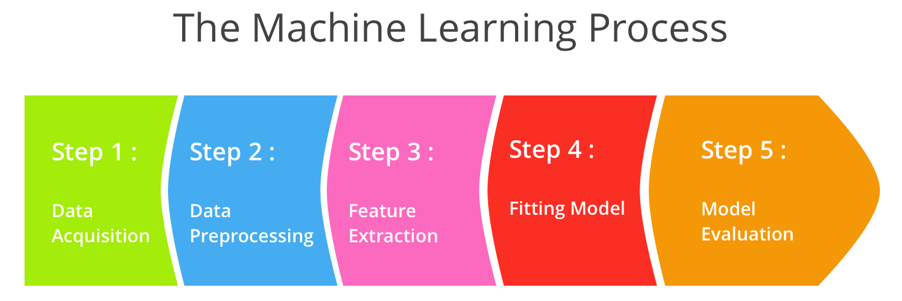
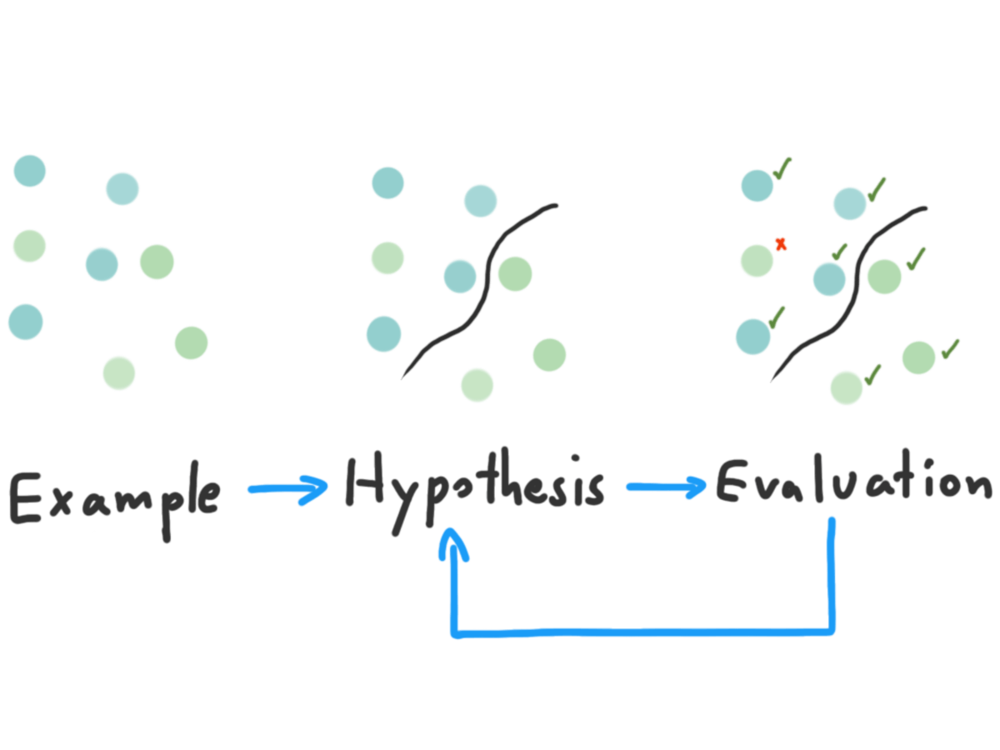
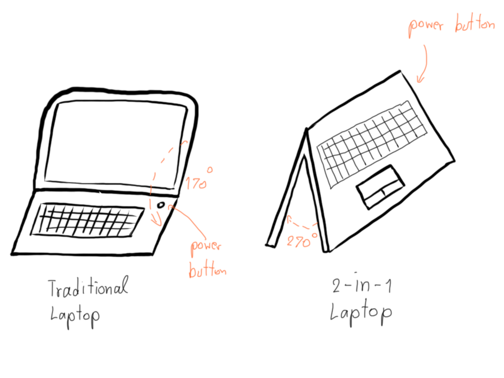
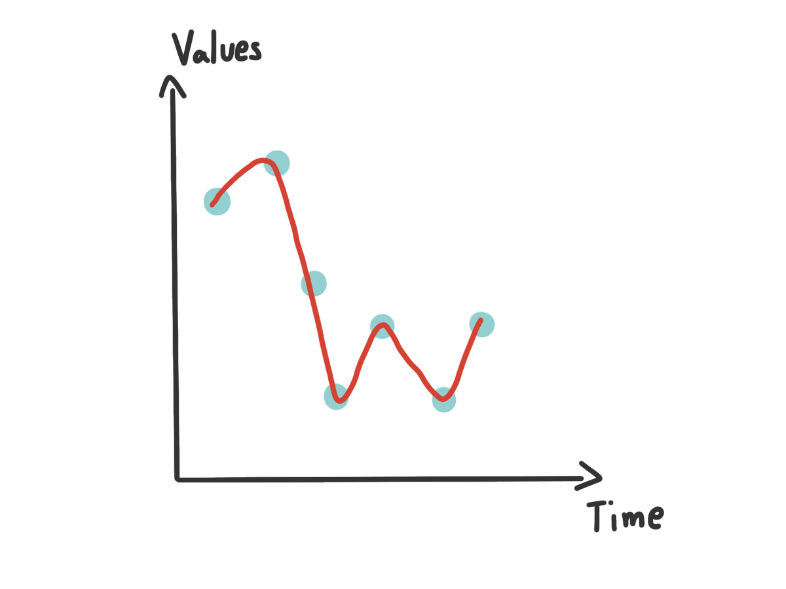
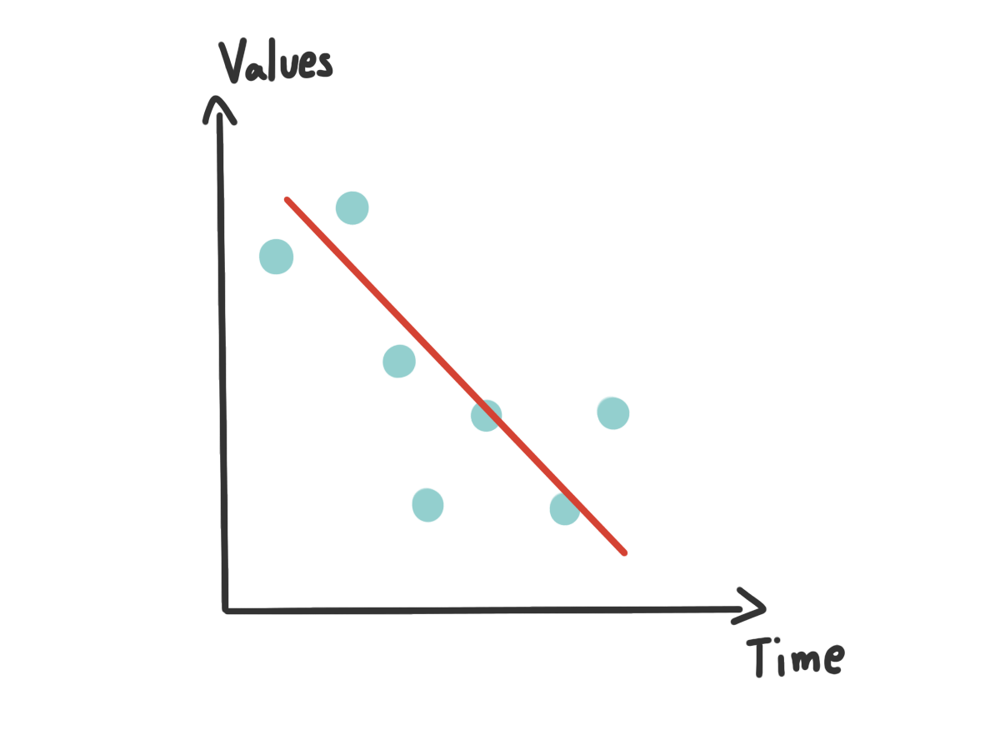
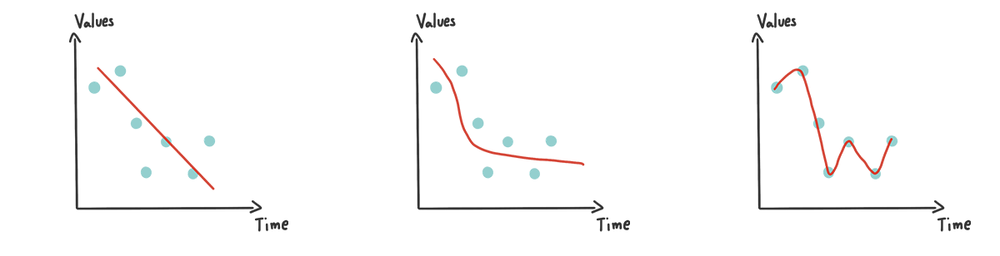
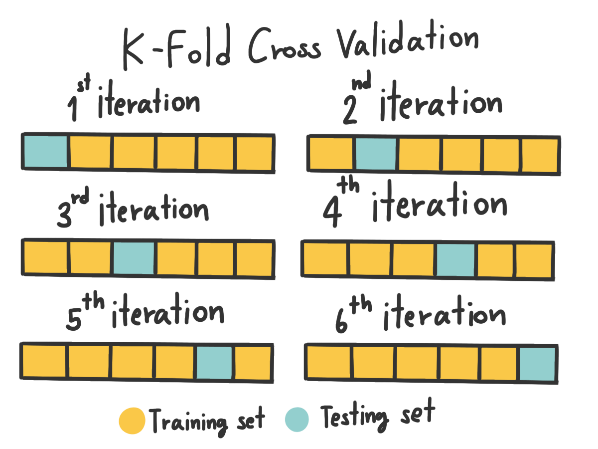
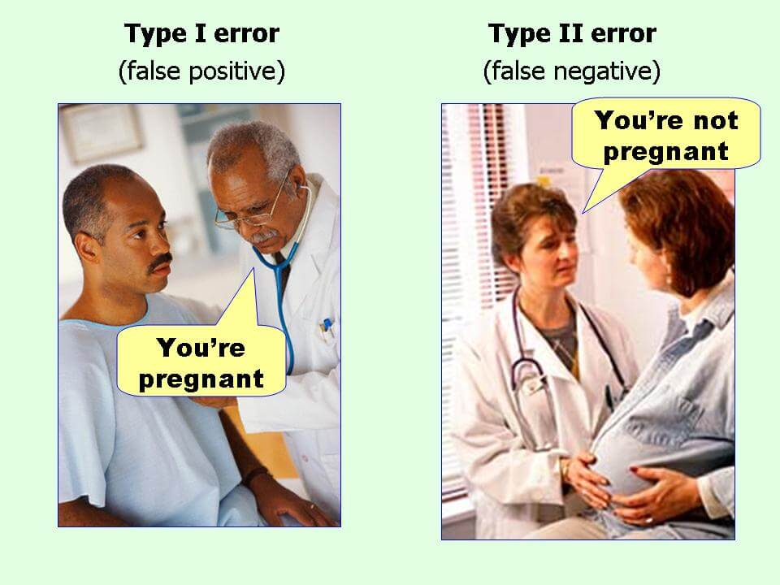

ในครั้งแรก ๆ ที่ผมได้ลองมาทำพวก Machine Learning ตอนนั้นผมก็ไม่รู้จะเริ่มยังไงเหมือนกันนะ ไหนอะไรจะ Classifier ไหนจะ Algorithm ไหนจะ Precision, Recall และ F1-Score อะไรอีกมากมายเต็มไปหมด วันนี้จะพามาดูกันว่า ถ้าเราจะสร้าง Machine Learning Model กัน เราจะต้องผ่านขั้นตอนอะไรบ้าง

_The Machine Learning Process_

ในการทำ ผมขอแบ่งขั้นตอนในการทำออกเป็น 5 ขั้นตอนใหญ่ ๆ ตามภาพด้านบนเลย ทีนี้เราจะมาดูกันว่า ในแต่ละขั้นตอนเราต้องดูและทำอะไรบ้าง

## 1. Data Acquisition
ในขั้นตอนแรก จะว่าง่ายก็ง่าย จะว่ายากก็ยาก นั่นคือการเก็บข้อมูลนี่เอง บางเคส เราสามารถหา Data มาได้อย่างง่ายดาย แต่ในบางเคส เช่นเคสทางการแพทย์ต่าง ๆ การได้มาซึ่งข้อมูลก็อาจจะเป็นเรื่องที่ลำบากสักหน่อย

_Scientific Learning_

คอมพิวเตอร์มันก็เหมือนคนตรงเรื่องนึงคือ มันก็เรียนรู้จากตัวอย่างนี่แหละ ตามภาพด้านบน เราจะเห็นว่า เราเริ่มจากการที่เราเห็นข้อมูลบางอย่าง แล้วเราก็ตั้งสมมุติฐานบางอย่างขึ้นมา และสุดท้าย เราก็พิสูจน์ว่า สมมุติฐานที่เราคิดมามันถูกมั้ย ถ้าไม่เราก็จะกลับไปดูใหม่ว่ามันเป็นยังไง กับอีกเคสคือในอนาคตเราอาจจะเห็นของที่เราเคยรู้จักแหละ แต่มันอาจจะมีความไม่เหมือนกันบ้าง เราก็จะเอาของที่เราเห็นใหม่ ๆ มาแล้วมาเปลี่ยนสมมุติฐานในหัวเราแล้วก็พิสูจน์ มันก็จะเป็นแบบนี้ไปเรื่อย ๆ

_Traditional Laptop vs 2-in-1 Laptop_

อาจจะยังมองไม่เห็นภาพ เราลองมาดูตัวอย่างกันง่าย ๆ คือ Laptop ดีกว่า เมื่อสัก 4-5 ปีก่อน เราอาจจะมองว่า Laptop คือเครื่องคอมพิวเตอร์ที่แบกไปไหนมาไหนได้ มีลักษณะเป็นฝาพับได้กว้างสุด 70 องศา ข้างบนเป็นจอ ข้างล่างเป็น Keyboard กับมี Trackpad ปุ่มเปิดปิดอยู่มุมขวาของเครื่อง

แต่พอเวลาเปลี่ยนไปหน้าตาของมันเปลี่ยนไปสักหน่อย มันอาจจะกางออกมาได้ 180 องศานาบไปกับพื้นได้เลย หรือปุ่มเปิดปิดที่มันจะอยู่ข้าง ๆ เครื่องก็ว่ากันไป พอเราได้เห็นเครื่องเก่า ๆ มาก่อนแล้วมาเห็นเครื่องใหม่ ๆ เราก็น่าจะ งง ๆ กันบ้างแหละ นั่นเพราะว่า เราเคยสมมุติฐานว่า Laptop ปุ่มเปิดมันน่าจะอยู่ตรงมุมขวา แต่ตอนนี้มันอยู่ไหนกันนะ

พอเรารู้ว่า ปุ่มเปิดมันอยู่ตรงข้างเครื่อง เราก็จะอัพเดทและจำสมมุติฐานใหม่ในหัวเราว่า มันก็มี Laptop ที่ปุ่มเปิดอยู่ข้าง ๆ เหมือนกันนะ พอมาครั้งหน้า เราเจอ Laptop ที่ปุ่มเปิดมันอยู่ข้าง ๆ เราก็จะรู้ว่า เราควรมองหาตรงข้างเครื่องด้วย แทนที่จะหาบนมุมขวาของเครื่องอย่างเดียว

คอมพิวเตอร์ก็เช่นกัน มันก็เรียนรู้จากตัวอย่างเหมือนกับเรานี่แหละ ฉะนั้นข้อมูลที่เราจะเอามาใช้สอนมันก็ต้องแน่ใจว่า เราให้ข้อมูลที่ถูกต้อง และครอบคลุมกับสิ่งที่เราต้องการให้มันเรียนรู้ได้มากที่สุดเท่าที่เราจะทำได้ ไม่ต้องคิดเลยว่า ถ้าเราเอาข้อมูลผิด ๆ ให้มัน มันก็จะเรียนรู้แบบผิด ๆ เหมือนกับเด็กเลยละ

## 2. Data Preprocessing
ในโลกแห่งความเป็นจริง หลังจากที่เราได้ Data มาแล้ว แน่นอนว่าบางครั้งข้อมูลที่หามา อาจจะไม่ได้มีคุณภาพสูง หรือขาดหายอะไรบางอย่างไป เราก็ต้องมาจัดการมันกัน อย่างที่เราบอกไปในหัวข้อเมื่อครู่ว่า ถ้าเราเอาข้อมูลผิด ๆ หรือยากมาก ๆ ให้เครื่องเรียนผลที่ได้มันก็จะไม่ดีนัก ฉะนั้นเรื่องของการทำ Data Preprocessing ก็เป็นอีกขั้นตอนที่สำคัญมาก

Data บาง Record ที่เราได้มาอาจจะมีบาง Field หรือช่องที่ขาดหายไป หรือมีแค่ข้อมูลที่ผ่านการ Aggregate แล้ว เราจะเรียกข้อมูลแบบนี้ว่า **Incomplete Data**

หรือบางข้อมูลมีความแปลกมาก ๆ เช่น เราเจอว่ามีช่องเงินเดือนเป็น -5 ซึ่งมันก็ไม่น่าใช่ถูกม่ะ ถ้าเราปล่อยข้อมูลพวกนี้เข้าไปให้เครื่องเรียนมาก ๆ มันผลที่ได้ก็จะผิด เพราะบอกเลยว่าเครื่องมันไม่รู้หรอกว่า ข้อมูลไหนผิด ข้อมูลไหนถูก มันใช้ความเชื่อจากเราเพียว ๆ อันนี้เราจะเรียกว่า **Noisy Data** อันนี้รวมไปถึงข้อมูลที่เป็นเศษ ๆ อยู่ด้วยนะ ดู Outliner อะแหละ

บาง Data มันมางงมาก ๆ เช่นเราบอกว่า Birthday 08/03/1996 ส่วน BirthMonth ได้มาเป็น April เอาละทีนี้ งง เลยละสิว่า เป็นไปได้ไง ข้อมูลพวกนี้เราจะเรียกว่า **Inconsistent Data** ส่วนใหญ่มันมักจะมากับแหล่งข้อมูลที่ไม่ค่อยได้จัดการเรื่องของ Consistency ของข้อมูลมากนัก ทำให้ข้อมูลที่เราไปดูดมามันหน้าตาแปลก ๆ ถามว่า แล้วมันทำให้เกิดความบรรลัยใน Model ของเราได้ยังไง ก็คงตอบง่ายมากว่า ก็มันผิดไง เราก็เห็น ๆ กันอยู่ว่ามันผิด... เราจะปล่อยข้อมูลผิด ๆ เข้าไปให้เครื่องเรียนแล้วได้ผลผิด ๆ เหรอ ก็คงไม่ดีใช่ม่ะ !

> ถ้าเราเจอปัญหา 3 อย่างที่ได้กล่าวไป เราจะทำยังไงได้บ้าง ?

วิธีแรกนั่นง่ายมาก เราก็ตัดมันทิ้งไปเลย ก็จัดว่าเป็นวิธีที่ง่ายที่สุดแล้ว แต่ถ้าเราบอกว่า ข้อมูลเรามีไม่เยอะ การตัดก็อาจจะไม่ใช่ทางเลือกที่ดีสักเท่าไหร่ ทำให้การตัด Field ที่เสียไปออกก็เป็นอีกหนึ่งทางเลือกที่ดี ที่ทำให้เราไม่เสียข้อมูลไปทั้ง Row อะไรทำนองนั้น ก็จริง ๆ มันยังมีอีกหลายวิธีมากมายในการจัดการกับ Data พวกนี้ ปัญหามันก็มีอีกหลายเรื่องเลยละ ก็ต้องดูเป็นเคส ๆ ไป

## 3. Feature Extraction
ข้อมูลที่เราได้มา Plain เลยเนี่ย บางครั้งเครื่องมันก็ไม่สามารถที่จะเข้าใจได้ เหมือนกับที่เวลาเราเรียนภาษาที่ 2,3,4,... เนี่ยบางครั้งเราก็ต้องเอาคำในภาษานั้น ๆ มาแปลให้เป็นภาษาแรกของเราเพื่อให้เราเข้าใจและ Map กลับไปในภาษาแรกที่เราเชี่ยวชาญได้

เครื่องก็เช่นกัน ภาษาของมันคือตัวเลข 1,2,3,4,... ดังนั้นถ้าข้อมูลของเราเป็นข้อความ หรือรูปภาพ เราก็ต้องแปลงให้มันเป็นอะไรที่เครื่องมันเข้าใจได้

แต่คำถามที่น่าจะต้องถามคือ เราจะ Extract อะไรออกมาจากข้อมูลเรา อย่างเช่น ข้อมูลเราเป็นรูปภาพ เราจะเอาอะไรออกมาจากมัน เพราะรูปภาพก็คือ Pixel ที่กองรวมกัน แต่ละ Pixel ก็ประกอบด้วยค่า 3 ค่าคือ R,G และ B หรือถ้าใช้ Colouring Profile แบบอื่นก็มีวิธีต่างกันไป ถ้าเป็น Text มันก็จะเป็น Character หลาย ๆ ตัวกับคำวางกองรวมกัน

ดังนั้น เราจะต้องมาดูว่า เป้าหมายสุดท้ายที่เราต้องการจริง ๆ คืออะไร แล้วลองกลับมาคิดดูว่า ถ้าเป็นเรา เราอยากจะแยก หรือจัดกลุ่มของที่เราต้องการนี้ เราจะแยกมันได้จากอะไรบ้าง สิ่งเหล่านี้แหละ เขาเรียกว่า Feature และแน่นอนว่า Feature ไม่จำเป็นที่จะต้องมาจาก Raw Data ตรง ๆ ก็ได้ เราอาจจะเอา Raw Data มาผ่านอะไรบางอย่างเพื่อให้เราได้ข้อมูลใหม่ นั่นก็เอามาเป็น Feature ได้เหมือนกัน โดยขั้นตอนที่เราลองหา Feature หรือทำ Feature ใหม่ ๆ เราจะเรียกว่ามันคือการทำ **Feature Engineering**

ยกตัวอย่างเช่นงานที่ผมทำ งานผมทำเกี่ยวกับพวกประโยค ผมก็ย่อย (Tokenise) ประโยคใน Dataset ของผมออกมาเป็นคำ ๆ แล้วเก็บไว้เป็น Feature อันนี้มันก็มีชื่อเรียกนะว่า Bag of Word กับถามว่า แล้วเราจะตีตัวเลขลงไปใน Feature ได้ยังไง ถ้าเรียนมาในวิชา Information Retrieval มันก็จะมี Term Weighting Scheme หลายแบบให้เราเลือกเล่นเช่น Binary, TF, TF-IDF ให้เราเลือกสรร

ส่วนคำว่า **Feature Selection** มันก็ตรงตามชื่อเลยคือการที่เราเอา Feature มากองรวมกัน แล้วเลือก Feature ที่เราคิดว่ามันสำคัญ ที่จริงมันก็ไม่ได้เป็นที่เราคิดหรอก มันคือการเอาเรื่องของสถิติมาใช้ซะมากกว่าว่าการกระจายตัวของ Feature เราเป็นยังไง Feature ที่เราเอามาดูเนี่ยมันมีความเหมือนหรือแตกต่างกันยังไง มันทำให้เราแยกของที่เราต้องการออกจากข้อมูลอื่น ๆ ได้หรือไม่ เราเรียกมันว่า **Generalisation**

> ยิ่ง Feature เยอะยิ่งดีใช่มั้ย ?

จากตรงนี้เลยทำให้ไปที่คำถามด้านบนว่า **จำนวน Feature มีผลกับ Model ของเรามั้ย ?** คำตอบคือ **ใช่** ลองนึกภาพตามดูนะครับ ว่าถ้าเราแบ่งข้อมูลของเราด้วย Feature ที่มากเกินไป มันก็เหมือนเอาออกกฏมาบอกเยอะมากขึ้นว่า สิ่งที่เราต้องการจะแยกมันหน้าตาเป็นยังไงละเอียดขึ้นเรื่อย ๆ แต่โลกแห่งความเป็นจริงมันน่ากลัวกว่านั้น บางทีสิ่งที่เราต้องการจะแยกมันดันมี Feature บางอย่างที่ไม่เข้ากับกฏที่เราตั้งไว้ แต่มันคือของที่เราต้องการจะแยกละ ?

เช่นเราบอกว่า **หมา มีสีขาว มีขน มี 4 ขา มีหาง เสียงเห่าคือฮ้ง ๆ ขนาดโตเต็มไวราว 30-40 Kg** เครื่องก็จะจำไว้แบบนั้น แต่ถ้าวันนึงมี**หมา** ย้ำนะว่า **หมา ที่ มีสีน้ำตาล มีขน มี 4 ขา เสียงเห่าคือฮ้ง ๆ ขนาดโตเต็มไวแค่ 15 Kg เท่านั้น**

_Overfiiting_

ด้วยกฏที่เราบอกไปในตอนแรกก็ทำให้เครื่องคิดว่า สิ่งที่เราป้อนเข้าไปนั้น**ไม่ใช่**หมาแน่นอน เพราะสิ่งนี้ไม่ได้มีสีขาว กับน้ำหนักน้อยเกินกว่าที่จะเป็นหมาได้ ส่งผลให้เครื่องมันเข้าใจผิดนี่เองว่านี่คืออะไรกันแน่ เราเรียกปรากฏการนี้ว่า **Overfitting** (จำว่ามันคือ **Low Bias, High Varience**)

_Underfitting_

อีกเหตุการณ์ที่ดูเหมือนจะตรงข้ามกันคือ **Underfitting** ลองมาดูเหตุการณ์สมมุติเพื่อให้เห็นภาพกัน กลับมาที่เรื่องหมาเหมือนเดิม จากรอบที่แล้วเราบอกเครื่องเยอะไปว่าหมาควรจะมีหน้าตาเป็นยังไง งั้นเราบอกใหม่ว่า หมา มีลักษณะดังนี้ **มีขน 4 ขา มีหาง** แค่นี้

แล้วถ้าข้อมูลใหม่ที่เราเอาเข้าไปเป็น **แมว** ที่ **มีขน 4 ขา มีหาง สีขาว ร้องเหมี้ยว** คิดว่าเครื่องจะบอกยังไง แน่นอนว่า **หมา** แน่นอน เพราะมันเข้ากับกฏที่เราบอกไว้ทุกประการเลย แต่ **เฉลยมันดันเป็นแมว** ไง เหตุการณ์นี้ก็เกินจากที่เครื่องรู้น้อยไปว่าอะไรคืออะไร หรือพูดก็คือมัน General มากเกินไป (พูดง่าย ๆ คือ Varience น้อยไป) จนทำให้เครื่องไม่สามารถแยกอะไรได้เลย เราเลยเรียกปรากฏการณ์นี้ว่า **Underfitting** (จำว่ามันคือ **High Bias, Low Varience**)

_Underfitting vs Good fitting vs Overfitting_

ซึ่งทั้ง **Underfitting** กับ **Overfitting** ให้ผลลัพธ์เดียวกันคือ Model ของเราให้ผลลัพธ์ **ผิด** เมื่อเราเอาข้อมูลที่เครื่องไม่เคยเห็นมานั่นเอง ดังนั้นเราจะต้องมาทดลองกับข้อมูลของเรากันเองว่า อะไรเป็นสิ่งที่เหมาะสมกับข้อมูลของเรามากที่สุด อย่างที่บอก มันไม่มีสูตรตายตัว

**พวก Math Behind อะไรพวกนั้นไม่ขอลงลึกนะ ไปอ่านกันเอง เอาให้เข้าใจ Concept พอ**

พอสุดท้ายจากขั้นตอนนี้เราก็จะได้เป็นชุดตัวเลข หรือ Boolean อะไรก็ว่ากันไปมาตามจำนวนของ Data ที่เรามี เพื่อเอามาใช้ในการทำต่อไป

## 4. Fitting Model
และแล้วก็มาถึงขั้นตอนที่ทุกคนคิดกันสักทีนั่นคือการ **สร้างโมเดล** ทั้งที่จริง ๆ แล้วเวลาส่วนใหญ่ในขั้นตอนตรงนี้ไม่ได้อยู่ที่การสร้าง Model ใหม่เลย เว้นแต่เราจะคิด Algorithm ในการสร้าง Model ใหม่ ที่ส่วนใหญ่ในเชิงของ Application จริงเราก็ไม่ได้สร้าง Algorithm เองไง

หลัก ๆ ของขั้นตอนนี้คือการเอาข้อมูลที่เรามีมาสร้าง Model ซึ่งบนโลกนี้มันก็มี Library ที่สำหรับทำ Machine Learning หลายตัวมาก ๆ เช่น **Scikit-learn** ใน Python เป็นต้น ใน Library ก็มีหลากหลาย Algorithm ให้เราเลือกใช้เช่น **Naive Bayes** และ **Support Vector Machine (SVM)** หรือถ้าใครเป็นสายถึกก็เขียนเอง ก็เอาที่สบายใจเลย ซึ่งแต่ละ Algorithm ก็มีข้อดีข้อเสียต่างกันไป หน้าที่ของเราคือ เราต้องเข้าใจว่า Algorithm ตัวไหนมีลักษณะอย่างไร ทำงานยังไง ข้อดีข้อเสียต่างกันยังไง ส่วนมันจะเหมาะกับข้อมูลของเราหรือไม่ มันก็ต้องเอามาลองดู เพราะมันไม่มีสูตรตายตัวว่าอะไรเหมาะกับอะไรชัด ๆ ขนาดนั้น

ในขั้นตอนของการสร้าง Model เรายังสามารถกำหนด Parameter ต่าง ๆ ได้เพื่อให้มันเข้ากับข้อมูลของเราได้ดีขึ้น ซึ่งในแต่ละ Algorithm ก็จะมี Parameter ที่แตกต่างกันไป อันนี้เราก็ต้องไปทำความเข้าใจถึงหลักการเบื้องหลังของแต่ละ Algorithm เราก็จะเข้าใจว่า Parameter แต่ละตัวมันคือการปรับแก้ตรงไหนบ้าง

## 5. Model Evaluation

> เราจะรู้ได้อย่างไรว่า Model ที่เราสร้างขึ้นมานั่นใช้ได้ผลจริง

เราก็ต้องมาทำการทดสอบกัน ซึ่งในการทดสอบก็ทำได้หลายวิธีมาก ๆ โดยวิธีที่ง่ายที่สุดคือการที่เราเอาข้อมูลมาให้เครื่องดูแล้วทำการแยกว่าสิ่งนี้มันคืออะไร แล้วมาดูผลว่าเครื่องมันให้ผลอย่างที่เราต้องการรึเปล่า

ลองนึกถึงเวลาเราจะสอบ ถ้าอาจารย์เอาโจทย์ที่เราเจอมาในห้องมาออกสอบแบบไม่ได้เปลี่ยนอะไรเลยแม้แต่ตัวเลข มันก็คงไม่แปลกเลยที่เราจะทำได้ เพราะเราเคยเห็นมันแล้วครั้งนึง ดังนั้นใน Machine Learning เวลาเราจะทดสอบ เราจะใช้ข้อมูลที่เรารู้ว่าคำตอบที่ควรจะได้คืออะไร แต่เครื่องต้องไม่เคยเห็นมัน

> แล้วเราจะทำยังไงไม่ให้เครื่องเคยเห็นมาก่อน ?

คำตอบง่ายมากคือ ตอนที่เราจะสร้าง Model เพื่อทดสอบเราก็แยกข้อมูลที่เราต้องการจะใช้ทดสอบออกมาซะก่อนสิ โดยปกติเวลาทำกันจริง ๆ เราจะแบ่งข้อมูลออกเป็น **80:20** โดย 80% ของข้อมูลที่มีจะเอาไปให้เครื่องสร้าง Model ส่วนที่เหลืออีก 20% จะเอามาใช้ทดสอบ

แต่หลายคนอาจจะแย้งว่า แต่บอกไปไม่ใช่เหรอว่า จำนวนข้อมูลยิ่งเยอะยิ่งดี นั่นก็จริงครับ บวกกับในบางเคสเราไม่ได้มีข้อมูลมากพอที่จะตัดแบ่งได้แบบนั้น ดังนั้นการแบ่งข้อมูลแบบ 80:20 จึงไม่ใช่ทางเลือกที่ดีซะแล้ว มันเลยนำไปถึงอีกวิธีนึงคือ **N-Fold Cross Validation**

_N-Fold Cross Validation_

หลักการของมันคือ การที่เรา **ซอยข้อมูลออกไปเป็น n ส่วนเท่า ๆ กัน** และค่อย ๆ loop เอาข้อมูลมาสลับกันสร้าง Model และทดสอบกันทีละชุดเรื่อย ๆ กล่าวคือ สมมุติเราอยู่ที่ก้อนแรก เราก็จะเอาก้อนที่เหลือที่ไม่ใช่ก้อนแรกไปสร้าง Model และเอาก้อนแรกที่เครื่องไม่เคยเห็นมาทดสอบ และเราก็ทำแบบนี้ไปเรื่อย ๆ และค่อยเอาค่าต่าง ๆ มาเฉลี่ยออกมาเป็นผล ทำให้เราสามารถใช้ข้อมูลทั้งหมดในการสร้างและทดสอบ Model ได้

นั่นแปลว่า ตอนนี้เราจะมีข้อมูลอยู่ 2 ตัวคือ ข้อมูลจริง ๆ ที่เราเขียนเฉลยไว้ กับข้อมูลที่เครื่องคิดมาให้ จากตรงนี้ เราก็สามารถที่จะดูได้แล้ว่า เครื่องคิดผิดหรือถูกมากน้อยแค่ไหน ถ้าเราใช้ความรู้ทางสถิติสักหน่อย ในนั้นมันก็จะมีค่าหลายอย่างมาก เช่น Precision, Recall, F1-Score และอื่น ๆ อีกมากมายที่จะมาช่วยทำให้เราเข้าใจผลการทดลองได้มากขึ้น

ในขั้นตอนหลังจากนี้ เราก็อาจจะเอา Model ของเราไป Deploy เพื่อให้กับระบบจริง ๆ หรือ เราอาจจะต้องเอา Model มา Fine-Tune ดู Miss-Classification และสร้าง Feature ใหม่ ๆ มาจับ ทำให้มันเก่งยิ่งขึ้นก็ได้เหมือนกัน

## สรุป
เรามาสรุปสิ่งที่เราอ่านกันมายาวเหยียดเกิน 8 บรรทัดนี้กัน เริ่มจากขั้นตอนในการทำ Machine Learning กันก่อน ผมแบ่งออกมาเป็นขั้นตอนใหญ่ ๆ 5 ขั้นตอนโดยเริ่มจากการเก็บ Data จากนั้นเอามาทำ Preprocessing เพื่อคัดกรอก หรือแปลง Data ให้มันอยู่ในรูปที่เราต้องการ แล้วก็เอาไป Extract Feature ให้มันออกมาอยู่ในรูปแบบที่เครื่องเข้าใจได้ แล้วก็สร้าง Model และทดสอบ ก็เป็นอันเสร็จสิ้นขั้นตอน

> 5 ขั้นตอนนี้ดูง่ายจังเลยนะ

แต่บอกเลยว่า แต่ละขั้นตอนมันก็มีความยุ่งยากของมัน เช่นการเก็บ Data ที่เราจะหาวิธีเก็บยังไง บางงานมันก็ไม่ได้แค่ไปคุยกับ 1-2 คน แต่คุยกับคนเป็นร้อยคนเพื่อเอา Data มาทำก็มี หรือจะเป็น Preprocessing ที่ทำให้หัวร้อนนั่งด่า Data Source รัว ๆ ว่าทำไมไม่ทำให้ข้อมูลมันดี ๆ อะไรทำนองนั้น และในแต่ละขั้นตอนมันก็จะมีเทคนิคอะไรหลายอย่างมาก ๆ เช่นเราบอกว่าเราไม่สามารถหาเฉลยให้ข้อมูลไม่ได้มาก มันก็จะมีวิธีที่เรียกว่า Co-Training มาช่วยได้อยู่ หรือจะมีการสร้าง Feature แปลก ๆ ออกมามากมาย เพื่อทำการดักจับสิ่งที่เราต้องการ

ดังนั้นการทำ Machine Learning นั่นเป็นอะไรที่มันไม่ได้ตายตัว มันเป็นเหมือนศิลปะแบบนึงเลย ที่เราต้อง ใช้จินตนาการและการลองผิดลองถูก ทั้งลองจากประสบการณ์และเซ็นส์ บวกกับแต้มบุญที่เรามี แต่การทดลองที่เป็นไปอย่างมีระบบ ก็จะเป็นส่วนสำคัญที่ทำให้การทดลองนั่นประสบความสำเร็จได้เป็นอย่างคิด จากทั้งหมดนี้เองที่ทำให้ Machine Learning กลายเป็นสิ่งที่สนุก เพราะเราได้คิด ได้ลองทำโน้นนี่นั่นเยอะแยะมากนั่นเอง
