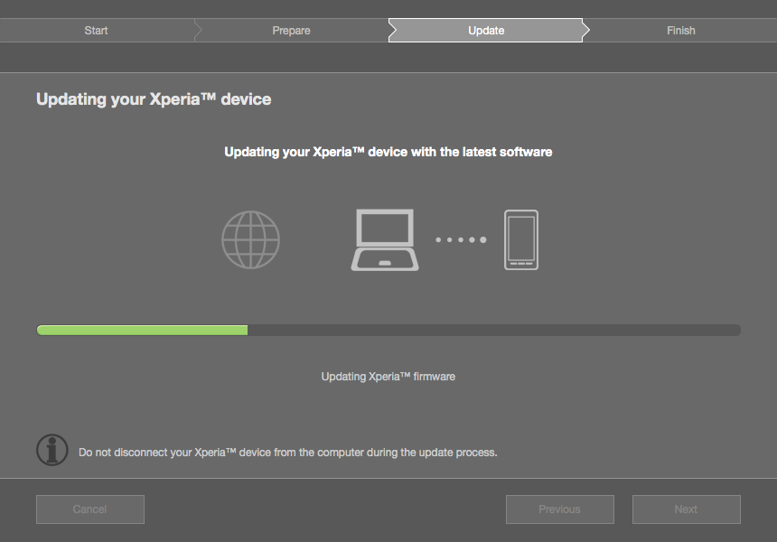
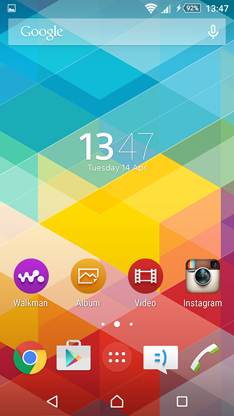
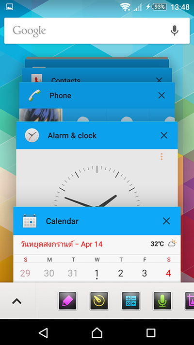
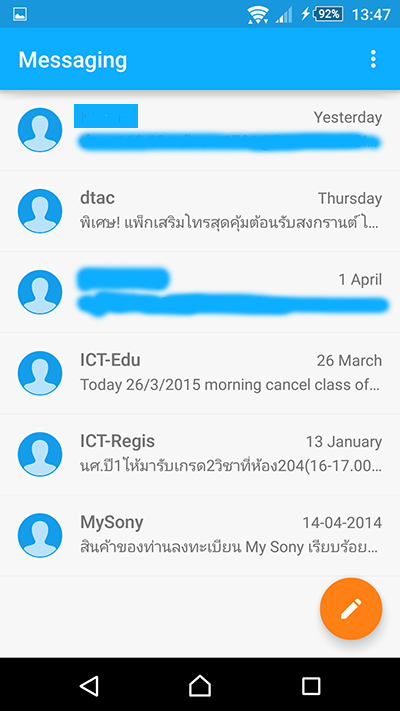

เมื่อเช้าครับ ตื่นมาเปิดคอม เช็คเมล์ อ่านอะไรไปเรื่อย (ดูว่างเนอะ) ไปเจอว่า Xperia Z1 ศูนย์ไทยได้อัพเกรด เป็น Android 5.0 Lolipop แล้ว!! จึงรีบกดอัพเกรต อย่างทันควัน!!

lol รอบนี้ไม่ได้แอ้มเจอปัญหาเหมือนตอน Digital Ocean แน่นอน อัพไวๆสิ!!

เย้!! ในที่สุดมันก็เสร็จ ใช้เวลาไปทั้งหมด ประมาณ 15 นาทีได้ ก็เร็วอยู่นะ! พอเข้ามาเราจะเห็นว่า หน้า Lock Screen มันเปลี่ยนไป เอาเป็นว่า เปลี่ยนหมดเลยอะ  แถมใน Lolipop มีการบอกด้วยว่า ชาร์ตอีกนานเท่าไหร่ถึงจะเต็ม (ซึ่งดีมาก) ส่วนอีกอย่างที่เพิ่มขึ้นมาอยู่บนหัวด้านขวาจะเป็นระบบ User ที่ในที่สุดเราก็ได้ใช้แล้ว เฮ้ๆๆ (เดียวค่อยไปอธิบายทีหลัง)

อ่อ ลืมบอกไปว่า เวลาเราเปิดเพลงจาก Walkman App มันจะเปลี่ยน Background เป็นปกเพลงด้วยนะเออ! (เลิศป่ะล่ะ?)

จากนั้นเข้าไปที่ Home Screen ถ้าสังเกต ไอคอนมันใหญ่ขึ้น เหมือนกับ Z2,Z3 เลย Widget นาฬิกาเปลี่ยนไป (มันเล็กอะ ปรับให้ใหญ่กว่านี้ไม่เป็นอ่า)  Icon ก็เช่นกัน เปลี่ยนไป ปล.Background นี้ไม่ใช่ Default ของมันนะครับ ผมโหลดมาเอง

อีกจุดที่เปลี่ยนไปใน Android 5.0 Lolipop นั่นคือหน้า Multitasking ซึ่ง Sony เองก็เลือกใช้ Interface แบบของตัว Factory จาก Google  เลื่อนขึ้น เลื่อนลงเพื่อดู App และเลื่อนข้างเพื่อปิด (แต่ยังไม่มีปุ่ม ปิดทีเดียวหมดนะ TT)

อีกอันนที่เปลี่ยนไปอย่างชัดเจนเลยคือ Notification Bar เมื่อก่อนเราต้องเลื่อนลงมาสุด แต่ใน Lolipop นี้มาตามแบบ Nexus เลย เลื่อนมาก็มีแค่นี้

เลื่อนอีกที หรือเลื่อนลงมา 2 นิ้วจะเป็นการ ปิด เปิด อะไรต่างๆของเครื่องเช่น Bluetooth, Wifi เป็นชะต้นเน้อ

ถ้าสังเกต ด้านล่างปุ่ม On Screen มันรูปร่างเปลี่ยนไป ยิ่งไปกว่านั้น มีปุ่ม Keyboard ด้านขวาโพล่มาด้วย มันคือปุ่มเลือก Keyboard เวลาเราจะต้องเปลี่ยน Keyboard ปกติมันจะอยู่ล่างซ้ายแต่นี้ย้ายลงมา ขวาล่างแทน

มาดูที่ App กันบ้าง อันแรกเลย Calculator อันนี้ก็มาแบบตาม Meterial Design ของ Google แป๊ะเลย

เลื่อนขวาออกมาก็เป็นพวก Function ต่างๆ

ส่วน Calendar ก็ไม่มีอะไรเปลี่ยนแปลงนอกจาก Design เช่นกัน!

Clock ก็ด้วย แต่ Clock นี่เหมือนของเดิมสุดๆเลยนะ

นี่สิเปลี่ยนจริงๆ Design ก็ตาม Meterial Design แน่นอน ทำให้ Design มันดูเข้ากับ Android ตัวนี้มาก มีการย้ายปุ่ม New ไปเป็นปุ่มลอยๆอยู่ด้านล่างขวา ตาม Meterial Design

Phone นี่เปลี่ยนหนักเลย ตอนแรกก็ งง เหมือนกัน กำลังหาอยู่ว่า Dailer อยู่ตรงไหน อ่อ ปุ่มเขียวๆ ด้านล่างไง กดรูป คนในกรอบ เพื่อเข้าหน้า Contact (บอกเลยว่า App นี้โคตรจะงงอะ)

จริงๆมันมีมากกว่านี้ แต่ไม่ได้เอามาโชว์ เพราะไม่ได้แคปจอมา ตรงๆเลยนะขี้เกียจด้วยแหละ 555 มันจะมีอย่างอื่นอีกเช่น หน้า Settings ที่เปลี่ยนไป แต่ก็ไม่ได้มีอะไรใหม่ (เท่าที่สังเกตนะ) อ่อ มีอีกอย่างนึง เราสามารถย้าย App ลง SD Card ได้แล้วนะ ปรบมือ!!

## ประสิทธิภาพล่ะ?
ก็ไม่ค่อยรู้สึกต่างไปจาก ตัวเก่าเลย (Android 4.4.4) เลย แต่รู้สึกว่าเวลาใช้งาน เลื่อนๆไปเลื่อนๆมา มันมีแอบกระตุกบ้างในตอนแรกๆ (น่าจะเพราะว่าระบบกำลังเริ่มอยู่ก็ได้ มันเลยช้าอยู่) แต่หลังๆก็โออยู่ ลื่นเหมือนเดิม สบาย~

## สรุป!!!
โดยรวมกับ Major Upgrade นี้ ผมค่อนข้างประทับใจอยู่ครับ ขึ้นเวอร์ชั่นใหม่ แต่มันลื่นมากๆเลย อาจจะเพราะตัว Android เองด้วย ที่กินทรัพยากรน้อยลง กว่าเมื่อก่อนเยอะ (เมื่อก่อนใช้ Galaxy Note ขึ้นเวอร์ชั่นที กระตุกขึ้นทุกวันๆ) และ App ก็สวยดีครับ ทันสมัยสไตล์ Meterial Design ตามที่ Google ว่าเป๊ะเลย และสุดท้าย Sony ก็ดีครับ ที่ยัง Support ตัว Z1 ทั้งที่ตัวเองมียัน Z3 แล้ว (Z4 ไม่ออกสักที) ผม Happy มากเลย แจกทั้ง Z เลย
