ใครติดตามผมในเฟสอยู่ก็น่าจะเห็นมาสักพักแล้วละว่าตอนนี้ผมเปลี่ยนมาใช้ **Google Pixel 2 XL** แล้ว ซึ่งมันเป็นโทรศัพท์ในตระกูล Pixel ที่สานต่อความสำเร็จจากรุ่นพ่ออย่าง Pixel และ Pixel XL ในรุ่นแรกที่ได้คะแนน **DxOMark** สูงลิงลิ่วในปีนั้น มาในปีนี้ Google ก็เปิดเรือธงรุ่นต่อไปนั่นคือ Google Pixel 2 (ธรรมดาและ XL) จะเป็นยังไง เรามาดูกันเลย

## Spec

เริ่มต้นที่สเปกโดยรวมของเครื่องกันก่อนเลย Google Pixel 2 XL มาพร้อมกับ CPU Snapdragon 835 และ GPU อย่าง Arduino 540 ที่จัดว่าเป็นสเปกเรือธง ตัวท๊อปสุดของปี 2017 และ RAM จำนวน 4 GB พร้อมกับหน่วยความจำขนาด 64 GB หรือ 128 GB โดยตัวที่เอามารีวิวในวันนี้เป็นขนาด 128 GB สีดำ (จริง ๆ ตัวที่ขายจะมี 2 สีคือ สีดำ และสีขาวดำ หรือที่เรียกว่าสี Panda 🐼)

## Unboxing

เหนือสิ่งอื่นใดเรามาเริ่มจากการแกะกล่องกันก่อนเลย เริ่มต้นที่หน้ากล่องที่มีรูปตัว Pixel 2 โชว์อยู่บนหน้ากล่องบอกให้รู้ว่า "ฉันสีดำนะ !!" อยู่ข้างหน้าพร้อมกับชื่อรุ่น กลัวเราไม่รู้ 🤪

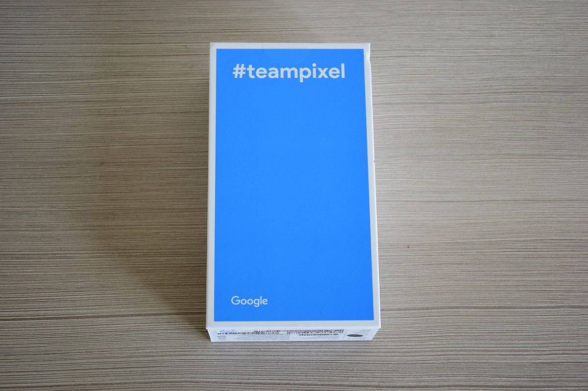

หลังกล่องอันนี้ชอบมาก มีการเขียน **#teampixel** ไว้สำหรับขาถ่ายรูปไว้ลงรูปกัน ที่ชอบที่สุดคือมันเป็นสีฟ้าาาาาาาา และเราชอบสีฟ้าาาาา ฮ่า ๆๆๆๆๆๆๆๆ

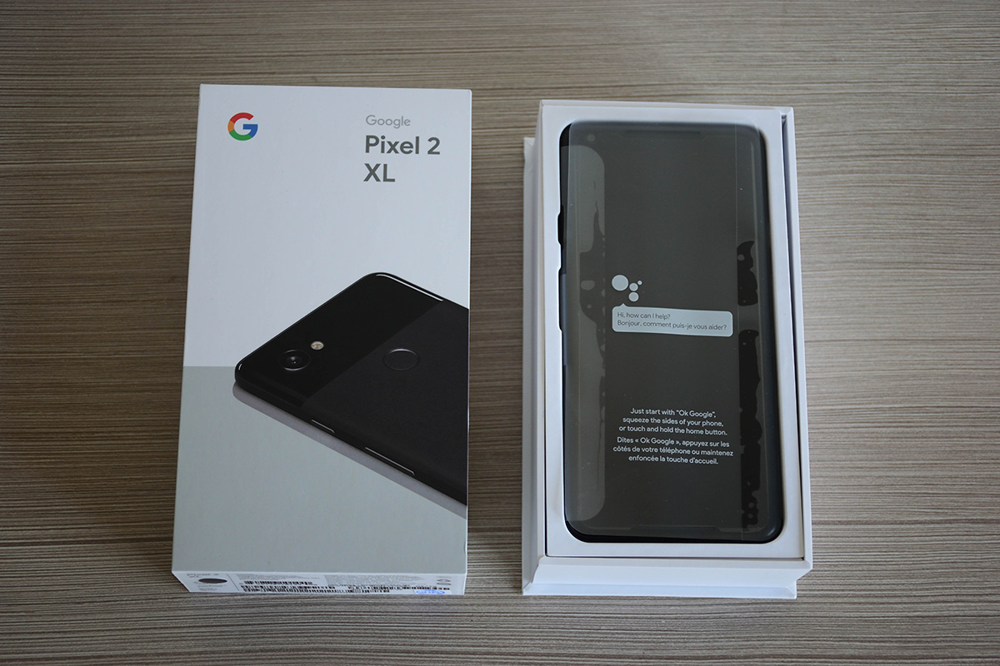

พอเปิดกล่องมา ก็ซูดดดดดดด กลิ่นกล่องของใหม่ อ่าห์ หอมชื่นใจ ~~ 🌿 เราก็จะเจอโทรศัพท์ที่เคลือบด้วยพลาสติกวางอยู่บนถาดกระดาษสีขาว

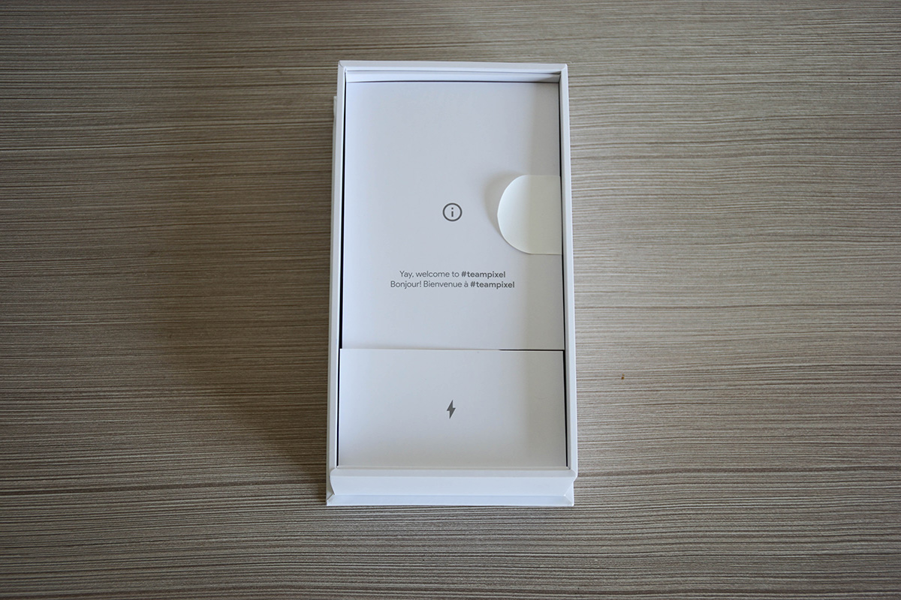

ถัดจากถาดกระดาษที่วางโทรศัพท์ ก็จะเป็นกล่องใส่พวก Paper Work ทั้งหลาย และกล่องเล็ก ๆ ข้างล่าง เดี๋ยวมาดูกันว่ามันคืออะไร

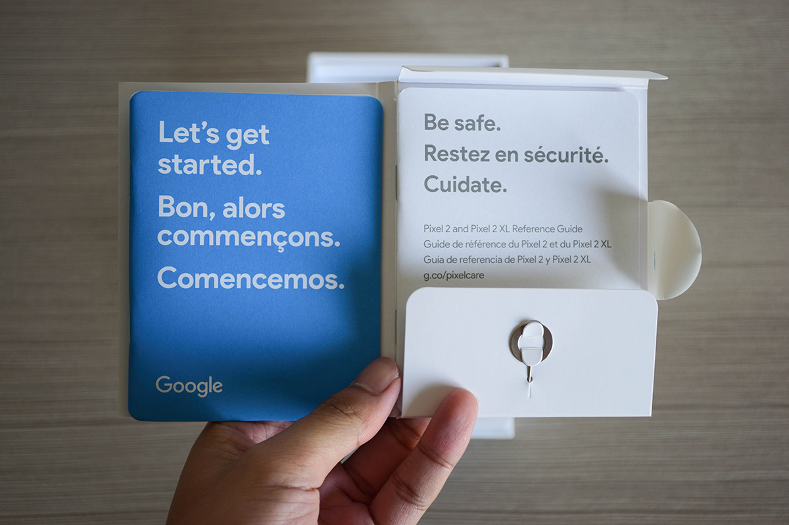

ในกล่อง Paper Work เปิดมาเราก็จะพบ คู่มือเล่มสีฟ้าาาา ~~~ ถัดจากเล่มฟ้าก็เป็นคู่มือเรื่องความปลอดภัยในการใช้โน้นนี่นั่น และที่สำคัญที่จิ้มถาดซิม จุดสังเกตคือ มันเป็นกลม ๆ คือเวลาใช้เสร็จแล้วจะเก็บมันเก็บยากมาก !!! โว้ยย 😫

ถ้าเราเอากล่อง Paper Work ออกไปเปิดออกมา เราก็จะเจอกับ USB OTG ที่ให้กับกล่องตัวเครื่องด้วย ซึ่งดีมาก

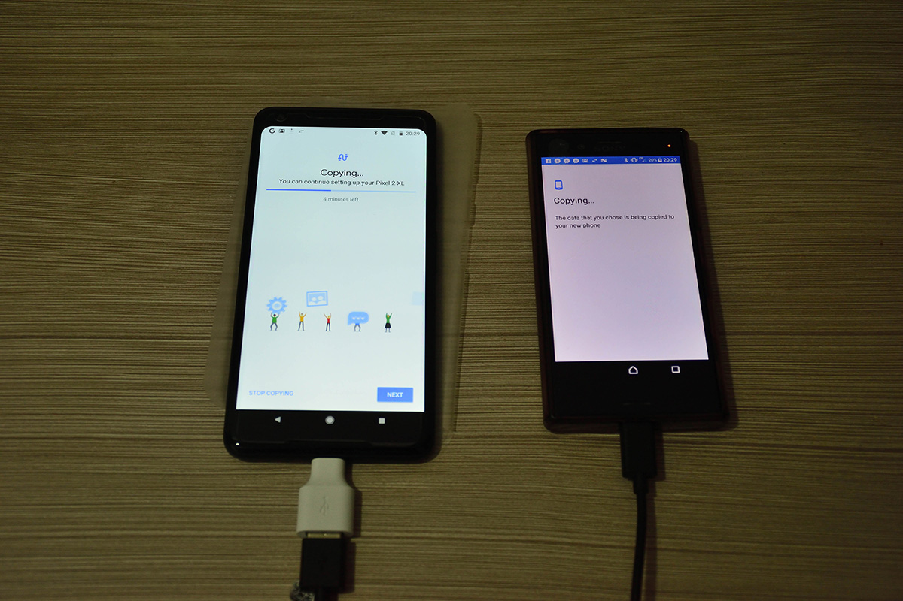

ที่มันมาให้สำหรับ Transfer เพียงแค่เราเอาสายที่มาในกล่องเสียบเข้าเครื่องเรา และเอาอีกด้านเสียบกับ OTG และเสียบเข้าเครื่อง แล้วกดย้าย มันก็จะย้ายทุกอย่างมาหมดเลย

หลังจากปที่แล้วที่ Google ไปแซะ Apple ว่า เรายังมีรูหูฟัง 3.5 อยู่น้าาาา พอมาปีนี้มันหายไปแล้วแจ้ !!! มันกลายร่างออกมาเป็นหัวแปลงจาก USB-C เป็นหัว 3.5 ออกมาแทนซะงั้น อันนี้เราค่อนข้าง Pain สำหรับผมมาก จุดสังเกตคือตัวแปลงตัวนี้สามารถใช้กับโทรศัพท์รุ่นอื่น ๆ ที่มี USB-Type C ได้ด้วย ต่างจากโทรศัพท์จาก Brand อื่นเช่น HTC ที่ตัวแปลงในกล่องไม่สามารถใช้กับโทรศัพท์ Brand อื่นได้เลย

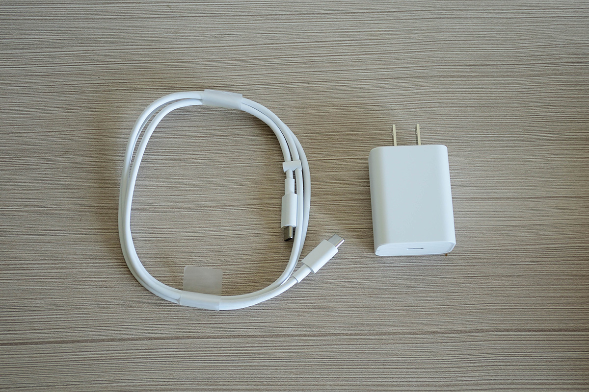

สำหรับสายชาร์จ และหัวแปลง แน่นอนว่าเป็นพวกชาร์จเร็วด้วย ที่รองรับมาตราฐาน 5v 3A/9v 2A พร้อมสาย USB-C เป็น USB-C สายค่อนข้างที่จะหนามาก เมื่อเทียบกับสายชาร์จ Lighting ที่ได้มากับ iPad Pro นอกจากนั้นยังมีที่เก็บสายมาเพื่ออำนวยความสะดวกในการเก็บสายด้วย และก็ **ไม่รองรับ Wireless Charging** นาจา

ด้วยสายที่ให้มาเป็น USB-C เป็น USB-C หัวแปลงก็ต้องเป็น USB-C ด้วยเช่นกัน

และนี่คือของทั้งหมดที่มาในกล่อง ข้อสังเกตคือ Google ตัดรูหูฟัง 3.5 ออกไป แต่ก็ยังไม่ได้แถมหูฟัง USB-C มาด้วย อย่างที่ Apple แถมหูฟังที่เป็น Lighting แถมมาในกล่องด้วย

## ตัวเครื่อง
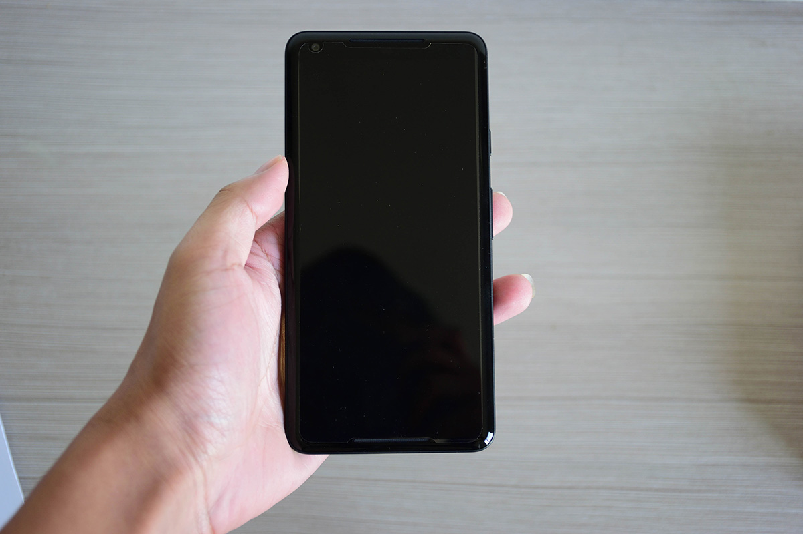

มาที่ตัวเครื่องกันบ้าง Google Pixel 2 XL มาพร้อมกับหน้าจอแบบ P-OLED โค้ง ๆ หน่อย ๆ ขนาด 6 นิ้ว ความละเอียด 1440x2880 pixel ที่คนว่ากันระนาวถึงปัญหาต่าง ๆ ที่เกิดขึ้นจากหน้าจออันนี้ แน่นอนว่าในหน้าจอนี้รองรับมาตรฐาน **P3 Gammut** แต่ Google เลือกที่จะตั้งค่าหน้าจอเป็น **sRGB** แทน แงงงง TT 😭

เรื่องของขอบจอบนล่างก็ได้รับการแก้ไข จากในรุ่นแรกที่จะเว้นมาทำไมเยอะแยะ มาใน Pixel 2 XL ได้รับการแก้ไข มันก็เล็กลง และมาพร้อมกับลำโพง Stereo อีกด้วย

มาที่ด้านหลังกันบ้าง ด้านหลังของเครื่องนี้ก็ยังให้กลิ่นอายของความ Pixel อยู่เหมือนเดิมด้วยการใช้กระจกและโลหะผสมกัน โดยมาในรุ่นนี้ส่วนของที่เป็นกระจกน้อยลงไป พร้อมกับตรงที่เป็นโลหะก็มีการเคลือบทำให้สัมผัสคล้าย ๆ กับพลาสติก Google บอกว่าทำเราสามารถจับได้ง่ายขึ้น ทำให้มันดูสวยขึ้นหน่อย ๆ นะ (ไม่รู้นะส่วนตัวคือชอบแบบนี้มากกว่า) และอีกจุดนึงคือเรื่องของกล้องที่ได้อันดับ 1 ใน DxoMark (เดี๋ยวเรื่องกล้องรีวิวในหัวข้อต่อไป) ที่ความละเอียด **12.2 MP f/1.8** ที่ให้ภาพดีแม้ในที่แสงน้อย แต่จุดนึงที่ผมไม่ค่อยชอบคือ ตัวเลนส์กล้องมันยื่นออกมาจากตัวเครื่องทำให้ตัวเครื่องแอบวางไม่นาบกับโต๊ะสักเท่าไหร่ และด้านล่างก็จะมีโลโก้ Google อยู่

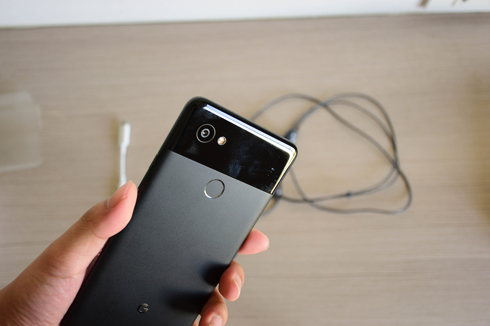

กระจกด้านหลังเวลาใช้แนะนำให้ระวังนิดนึง เพราะมันจะเป็นรอยนิ้วมือได้ง่าย ส่วนรอยขนแมวนี่ยังไม่เจอเลย แต่เห็นในรีวิวต่างประเทศบอกว่ามันเกิดขึ้นได้ง่ายมาก

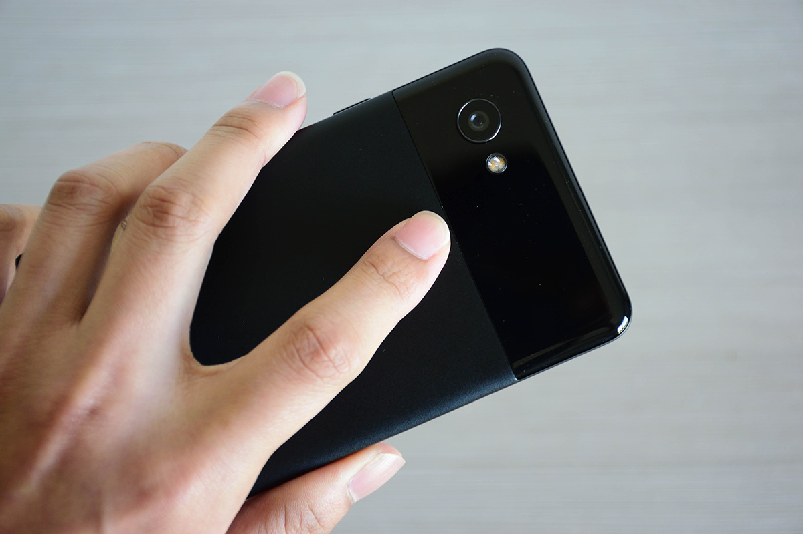

และที่สำคัญคือมาพร้อมกับ **Fingerprint Sensor** ที่ Google เรียกว่า **Google Imprint** ที่สแกนลายนิ้วมือได้เร็วมาก ๆ Google ถึงกับเคลมเลยว่าเร็วกว่า Pixel รุ่นแรกถึง 2 เท่า คือรุ่นแรกลองเล่นมันก็เร็วแล้ว มาในรุ่นนี้โคตรเร็ว เร็วโคตร ๆ ⚡️ ถึงกับแค่เอานิ้วเลื่อนผ่านมันก็เข้าเครื่องได้แล้ว (เดี๋ยวนะ ยังปลอดภัยอยู่ใช่มั้ยฮ่า ๆ) จุดที่วาง Sensor ตอนแรกก็คิดว่ามันจะจับยังไง พอมาจับแล้วมันดีมาก ๆ

ด้านซ้ายของตัวเครื่อง จะเป็นช่องสำหรับใส่ซิม โดยจะต้องใช้ที่จิ้มซิมจิ้มออกมานะ อย่าไปแงะเล่นละ

โดยเมื่อเราจิ้มออกมาแล้ว เราจะพบถาดสำหรับใส่ซิมที่เป็น Nano Sim และแน่นอนว่าไม่มีช่องสำหรับใส่ SD Card มานะ เพราะฉะนั้นตอนซื้อก็คิดดี ๆ ว่าจะเอารุ่น 64GB หรือ 128GB และรองรับ eSim (สำหรับเครือข่ายและประเทศที่รองรับเท่านั้นนะ)

สำหรับตัวเครื่องข้างขวา จะมีปุ่ม Power สำหรับเปิดปิดและล๊อคเครื่อง และปุ่มเพิ่ม/ลด เสียง ปุ่มค่อนข้างที่จะกดง่าย แต่ก็ไม่ง่ายขนาดจะลั่นได้ง่าย ๆ รวม ๆ ก็กลาง ๆ กดง่ายแต่ไม่ลั่น แต่ก็ยังไม่ใช่ปุ่มที่ดีที่สุดอยู่ดี ถ้าเรากดปุ่มล๊อคเครื่อง 2 ครั้งพร้อมกันก็จะเป็นเมนูลัดสำหรับเข้าเมนูกล้องได้ทันที

จากทั้งหมดของตัวเครื่องทำให้เราเห็นได้ว่าเรื่องของงานประกอบทำออกมาได้ดีมาก ๆ **สอบผ่าน !!** ✅ ตัวเครื่องจับแล้วรู้สึกแพง ไม่มีชิ้นส่วนชิ้นไหนดัง เอี๊ยด ๆ ถึงแม้เราจะบีบเครื่องก็ตาม เพราะทุกชิ้นถูกทำและประกอบมาพอดี ทำให้เรามั่นใจได้ว่ามันจะไม่พังคามือเพราะงานประกอบแน่นอน

## หน้าจอ
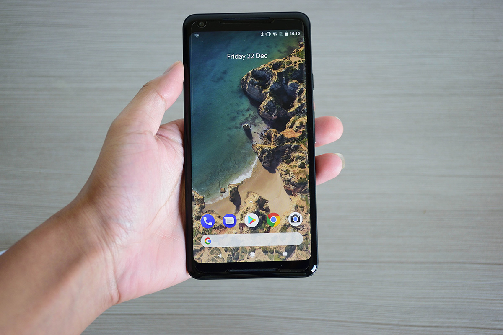

มาที่เรื่องของหน้าจอกันบ้าง หน้าจอของ Pixel 2 XL นั้นมาพร้อมกับขนาด 6 นิ้วแบบ **P-OLED** ในอัตราส่วน **18:9** ที่อาจจะแปลกไปสักหน่อย แต่ถ้าเอามาดูพวกตัวอย่างหนังมันจะดูเต็มตามากขึ้นแบบอลังโคตร !!! แต่เวลาเราดูวีดีโอต่าง ๆ ที่ใช้อัตราส่วน 16:9 มันทำให้มันรู้สึกแปลก ๆ ไปสักหน่อย

เรื่องของสีจอให้สีตามมาตรฐาน **P3 Gammut** อย่างที่บอกไปตอนแรก ตัวหน้าจอเองที่ทาง Google บอกว่ามันโค้ง ซึ่งจริง ๆ แล้วมันแสดงผลไม่ถึงโค้งนะ (โค้งปลอม ๆ ฮ่า ๆ เรียก 2.5D ละกัน) จุดสังเกตอีกอย่างคือ ขอบของจอ มันจะเป็นโค้ง ๆ แทน ส่วนตัวคือชอบนะ มันดูแล้วแปลกตาดี แต่ถ้าเราไม่ได้สังเกต ก็ไม่ได้น่าเป็นจุดสนใจที่จะทำให้เราเห็นอะไรขนาดนั้นนะ

อย่างที่ทุกคนน่าจะได้ข่าวหรือได้อ่านมาจากเว็บอื่น ๆ ถึงเรื่องปัญหาของ Panel จอใน Google Pixel 2 XL (เป็นเฉพาะรุ่น XL เท่านั้น ตัวเล็กไม่เป็น) ซึ่งเกิดมาจาก Panel จอของ LG ปัญหาที่ดูจะร้ายแรงที่สุดน่าจะเป็น Screen Burn-in

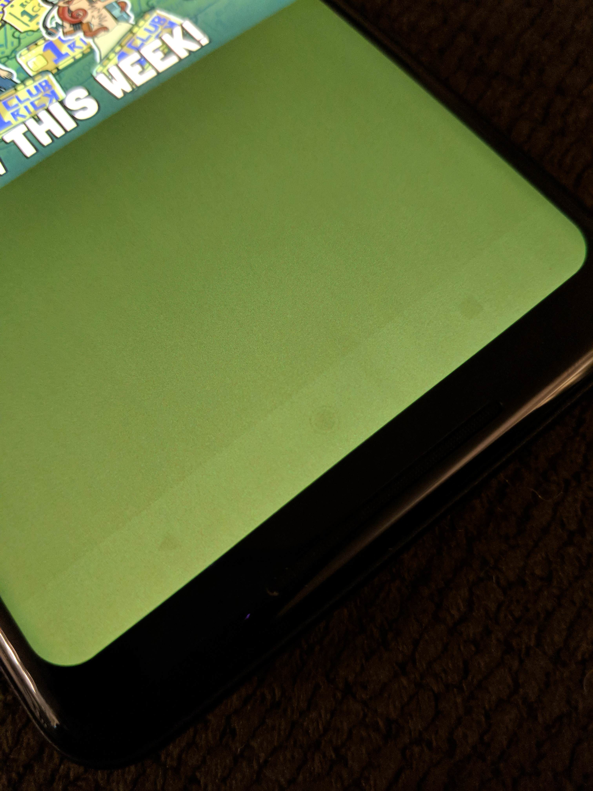
_Source : My Pixel 2 XL Screen Burn Experience by taytortot in Reddit_

Screen Burn-in เป็นอาการที่เป็นเรื่องปกติของ Panal จอประเภท OLED แต่ปัญหาคือ มันดันเกิดขึ้นเร็วมาก มีผู้ใช้ใน Reddit พบปัญหานี้หลังจากที่ใช้งานไปแล้วเพียงแค่ 1 อาทิตย์เท่านั้น ที่มันบูมเป็นเพราะว่า มือถือเรือธง และราคาแพงขนาดนี้ แต่มันเกิดขึ้นเร็วได้ขนาดนี้ ซึ่งในปัญหานี้ทาง Google เองก็รับทราบ และทำการ Update Software ให้มีการเปลี่ยนแปลงสีของ Navigation Bar ด้านล่างของจอไปตามสิ่งที่แสดงผล เพื่อไม่ให้หน้าจอมันแสดงผลของอย่างเดียวกันค้างไว้ และยังยืดระยะเวลาในการรับประกันเพิ่มเป็น 2 ปี (แต่เอาจริง ๆ เราก็คงไม่ได้ใช้หรอก) แต่ตัวเครื่องที่ผมกำลังใช้อยู่ก็ยังไม่เจอนะ

<iframe width="560" height="315" src="https://www.youtube.com/embed/yys3Lxfe8nQ?rel=0" frameborder="0" allow="autoplay; encrypted-media" allowfullscreen></iframe>

อีกหนึ่งปัญหาคือ Blue Tint ก็เป็นปัญหาปกติของ OLED เช่นกันกับ Screen Burn-in โดยที่ถ้าปกติเรามองจอมุมไหนมันก็ควรจะให้สีที่ใกล้เคียงกัน แต่มาใน Pixel 2 XL นั้น เวลาที่เรามองด้านที่ไม่ได้ตรง ๆ จอมันจะออกฟ้า ปัญหานี้ผมเจอจริง ๆ แต่มันก็ไม่ได้มีผลกับการใช้งานมากขนาดนั้นเพราะเวลาเราใช้โทรศัพท์ เราก็คงไม่ได้เอียงเล่นแน่นอน

<iframe width="560" height="315" src="https://www.youtube.com/embed/VOfnbQ3nx6c?rel=0" frameborder="0" allowfullscreen></iframe>

ปัญหาถัดไปคือ Black Smear คือปัญหาตอนที่หน้าจอของเรามันจะเปลี่ยนการแสดงผลจาก Pixel ดำ ๆ ให้กลายเป็น Pixel ที่มีสี ซึ่งเวลาเราเลื่อนมันจะให้อารมณ์เหมือนกับว่ามันกระตุก ๆ เพราะตัวเครื่องมันรันวิ่งไปก่อนที่จอจะชาร์จไฟเข้าแต่ละเม็ด Pixel เสร็จ ถามว่ามันเป็นปัญหาอะไรขนาดนั้นมั้ย ตอบเลยว่าไม่ เพราะตั้งแต่ใช้มาก็ไม่รู้มาก่อนเลยว่ามันมีปัญหานี้ จนกระทั่งเล่นโทรศัพท์ในโรงหนังก่อนหนังจะฉาย เราก็ต้องปรับแสงให้มันมืดหน่อย เพราะในโรงหนังมันมืด แล้วพอเราเลื่อนปุ๊บ อาการมันก็มาเลย แต่มันก็ไม่ได้อะไรขนาดนั้น พอเราเอามาเล่นในที่สว่างหน่อยก็หาย เท่าที่ลองเล่นในที่มืดในหอก็ไม่เป็นนะ ก็ยังงง ๆ ว่าทำไมโรงหนังมันสว่างกว่าห้องปิดไฟตอนกลางคืนแต่ดันไม่เป็น

ถ้าใครได้มาลองเล่นแล้ว จะเห็นว่าหน้าจอมันดู **ซีด ๆ** นั่นเป็นเพราะ Google บอกว่า ใช้ตามมาตรฐานสี **sRGB** ทำให้มันจะซีด ๆ หน่อย แต่ใน **Update ใหม่มี Settings เพิ่มเติม** เพื่อให้เราสามารถปรับสีของหน้าจอได้ ส่วนตัวผมเอง ผมก็ใช้ค่า Default แรก ๆ มันก็จะดูซีด ๆ แต่พอใช้ ๆ ไปมันก็ชินไปซะแล้ว พอกลับไปดูจอ iPad มันเหมือนไม่รู้สึกต่างกันมากขนาดนั้น ฉะนั้นเรื่องของความซีด ก็ไม่ได้เป็นปัญหาอะไร หรือถ้ารู้สึกว่าซีดเกิ้นนน ไม่ไหวก็สามารถเข้าไปปรับได้ใน Settings นอกเหนือจากปัญหาที่ว่ามาแล้ว หน้าจอของมันจัดว่า**คม**มาก ๆ

## เสียง
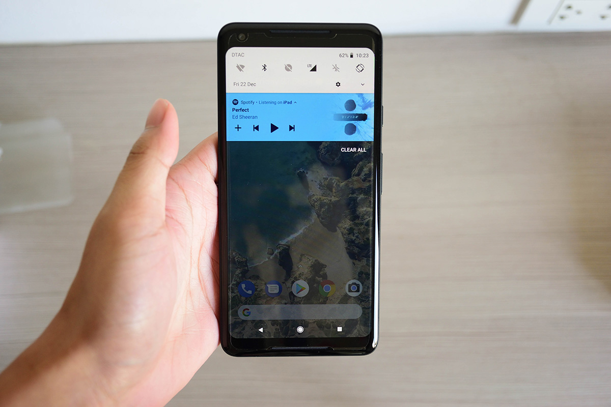

Pixel 2 และ 2 XL มาพร้อมกับลำโพงคู่ด้านหน้าที่ให้เสียง ดังและชัดเจน เท่าที่ลำโพงที่มันอยู่ใกล้กันขนาดนี้จะได้ เบสมีหน่อย ๆ ข้อดีของการววางลำโพงไว้ข้างหน้าคือเวลาเราเล่นเกม หรือดูวีดีโอแนวนอน **มือเราก็จะไปพังลำโพง** เพราะฉะนั้นการเอาลำโพงมาอยู่ข้างหน้าปัญหานี้ก็ตัดไป

และแน่นอนว่าใน Pixel 2 ไม่มีรูหูฟัง 3.5 นะแจ๊ะ (ปีที่แล้วยังไปแขวะ Apple อยู่เลย ไหงไม่มีแล้วละ !!) สำหรับใครที่ใช้หูฟัง Bluetooth อยู่แล้วในตัวเครื่องก็รองรับ Codex สำหรับการเล่นเสียงแบบ High Definition อีกด้วย แต่สำหรับใครที่ใช้หูฟังมีสาย ในกล่องก็ได้แถมหัวแปลงจาก USB-C เป็น 3.5 มาให้ซึ่งเสียงของมันก็ไม่ได้ดีขนาดนั้น (Xperia X Compact  ยังดีกว่าเยอะเลย) เอาเป็นว่าก็แค่พอฟังได้ แต่ถ้าเป็น Audiophile แล้วละก็แนะนำให้ซื้อ DAC มาต่อเพิ่มเอานะครับ น่าจะดีกว่า

ด้วยการที่ถ้าเราต้องการใช้หูฟังไป การที่ไม่มีรูหูฟังมาให้ทำให้เราไม่สามารถใช้หูฟังแบบมีสายโดยที่ชาร์จแบตพร้อม ๆ กันไม่ได้ อันนี้เศร้าใจจริม ๆ 😢

## ประสิทธิภาพ 🚀
<iframe width="560" height="315" src="https://www.youtube.com/embed/jL2jWQo25ac?rel=0" frameborder="0" allow="autoplay; encrypted-media" allowfullscreen></iframe>

เรื่องของ CPU ไม่ต้องเป็นห่วงเลย เพราะมันมาพร้อมกับ CPU ระดับเรือธงอย่าง Snapdragon 835 และ RAM 4GB ที่ดูแล้วก็ไม่ได้เป็นสเปกสูงขนาด Razer ที่มาพร้อมกับ RAM 8 GB และก็ไม่ได้แปลกอะไร เพราะมือถือเรือธงค่ายอื่น ๆ ก็เอามาใช้กัน เป็นเรื่องปกติเฉยมาก

ในการทำงานจริง ด้วยความที่มันเป็น Pure Android ทำให้การทำงานนั้นลื่นไหล คือมันจัดว่าเป็น **Android Phone ที่ใช้แล้วลื่นที่สุดเท่าที่เคยใช้มาเลย** อาจจะเป็นเพราะเรื่องของการ Optimise Software เองให้เข้ากับตัวเครื่อง เพราะ Google เป็นคนทำ Android และเครื่อง Google ก็ออกแบบ ทำให้มันเกิดความเข้ากันของ Hardware และ Software เหมือนที่ Apple ทำกับอุปกรณ์ตระกูล i ทั้งหลาย เช่น iPhone, iPad

ขนาดเล่น ROV ปรับสุดมันหมดทุกอย่าง ตอนบวกกัน FPS ก็ไม่ลงต่ำกว่า 60 เลยซึ่งเรื่องนี้ทำออกมาได้ดีมาก ๆ และถึงแม้ว่า Pixel 2 จะมาพร้อมกับ RAM แค่ 4 GB เท่านั้น แต่ก็ไม่ได้แปลว่าจะช้ากว่าเครื่องที่แรมเยอะกว่า นั่นเป็นเพราะตัวเครื่องถูก Optimise มาทั้ง Software และ Hardware เพื่อรีดประสิทธิภาพสูงสุดของเครื่องเรานี่เอง

## กล้อง 📷
ถ้าเราจะป้ายยาให้เพื่อนซื้อ Pixel เหมือนเรา **เปิดกล้องแล้วถ่ายรูปแล้วส่งให้มัน!!!** 😼 บอกเลยว่ามัน **มหัศจรรย์มาก!!** และยังเป็นกล้องโทรศัพท์ที่ได้รับคะแนนจาก **DxOMark** สูงถึง 98 คะแนน แซงหน้า iPhone 8 Plus และ Galaxy Note 8 ไปเลย

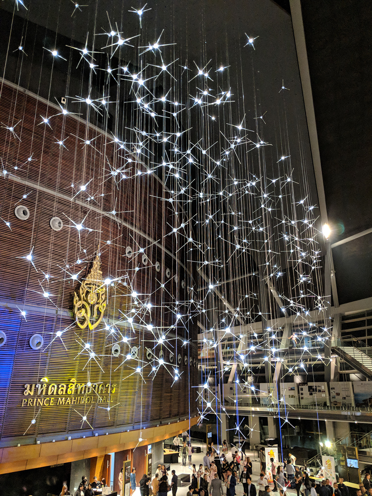
_"Neuron" in Prince Mahidol Hall_

กล้องหลังมาพร้อมกับความละเอียดที่ **12.2 MP f/1.8 บวกกับ OIS และ EIS** ที่สวนกระแส **ความกล้องคู่** ไปกันหมด ภาพที่ออกมาถือว่าให้ สีและความคมชัดต่าง ๆ ที่ดีมาก ๆ แถม OIS และ EIS ก็ทำให้ภาพถ่ายในที่แสงน้อยก็ทำออกมาได้ดียิ่งขึ้นไปอีก วีดีโอนี่วินไปเลยเรื่องการลดสั่น และ HDR Mode ที่จะช่วยให้รูปของเราดูสวยงามมาขึ้นตามสมัยนิยม

_Prince Mahidol Hall_

นอกจากโหมด **HDR** แล้ว ก็ยังมีขั้นกว่าไปอีก นั่นคือโหมด **HDR+** ที่จะเหนือกว่า HDR นิดนึงคือมันจะเก็บภาพมา 10 ภาพ แล้วมันจะพยายามเอา 10 ภาพนี้มารวมกัน ทำให้เราได้ความ Dynamic มากขึ้น แต่ก็ต้องแลกด้วยการที่กว่ามันจะถ่ายเสร็จก็กินเวลาเกือบวินาทีเลยแหละ

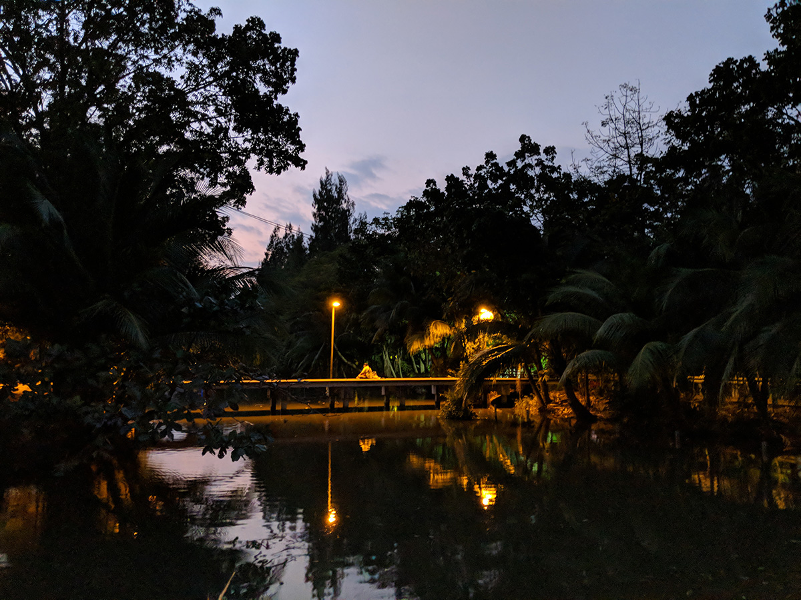

Google Pixel 2 ก็ยังทำได้ดีในการถ่ายภาพในสภาวะแสงน้อย ข้อสังเกตของมันคือ จำนวน Noise ของมันก็ยังเยอะอยู่เมื่อเทียบกับโทรศัพท์รุ่นอื่น แต่นี่ก็เป็นทั้งข้อดีและข้อเสีย สำหรับคนที่ต้องการเอาภาพไปแต่งต่อ อันนี้จะเป็นข้อดีมาก เพราะเราสามารถปรับแต่งอะไรได้มากขึ้น ในขณะที่คนที่เป็นสาย **#nofilter** อาจจะเซ็งหน่อย ๆ

Google พัฒนาเทคโนโลยีกล้องที่เรียกว่า **Dual Pixel** ที่จะใช้หลักการของการวาง Pixel คู่กัน ผสมกับ AI ที่จะทำให้คอมพิวเตอร์สามารถแยกความลึก ตื้นของวัตถุได้ โดยที่มีกล้องแค่ตัวเดียว (เอาจริง ๆ มันก็คือกล้อง 2 ตัววางเหลื่อมกันมั้ยอะ ?) เพื่อเอามาให้กับ Feature สมัยนิยมอย่าง **Portrait Mode** ที่จะทำให้เราสามารถถ่ายภาพหน้าชัดหลังเบลอได้ดียิ่งขึ้น จากการได้ลองเล่นดูแล้ว ก็พบว่าภาพที่ออกมานั้นแจ่มแมวเวอร์ !!

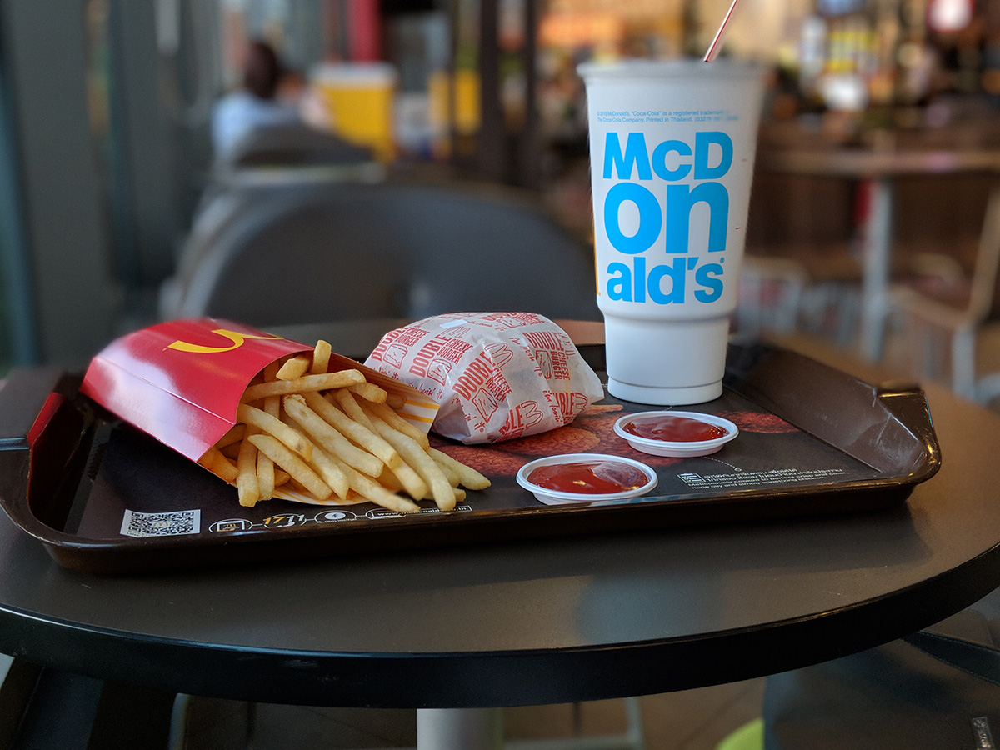

นอกจากที่มันจะสามารถแยกคนแล้วทำออกมาเป็นหน้าชัดหลังเบลอได้แล้ว มันยังแยกสิ่งมีชีวิตและส่งของอื่น ๆ ได้ด้วย เช่นรูปด้านบนนี้เป็นต้น ข้อเสียจุดนึงของการใช้เทคนิคนี้ในการถ่ายภาพคือ มันไม่สามารถที่จะแยกวัตถุที่มีความซับซ้อนได้ดีนัก บางทีถ่ายมาข้างหน้ามันก็โดนเบลอเฉยก็มี แต่ไม่ต้องกลัว เพราะภาพที่ถ่ายด้วย Portrait Mode นั้นมันจะเก็บภาพต้นฉบับให้เราไว้ด้วยเผื่อเราไม่ต้องการที่ใช้ภาพหน้าชัดหลังเบลอ

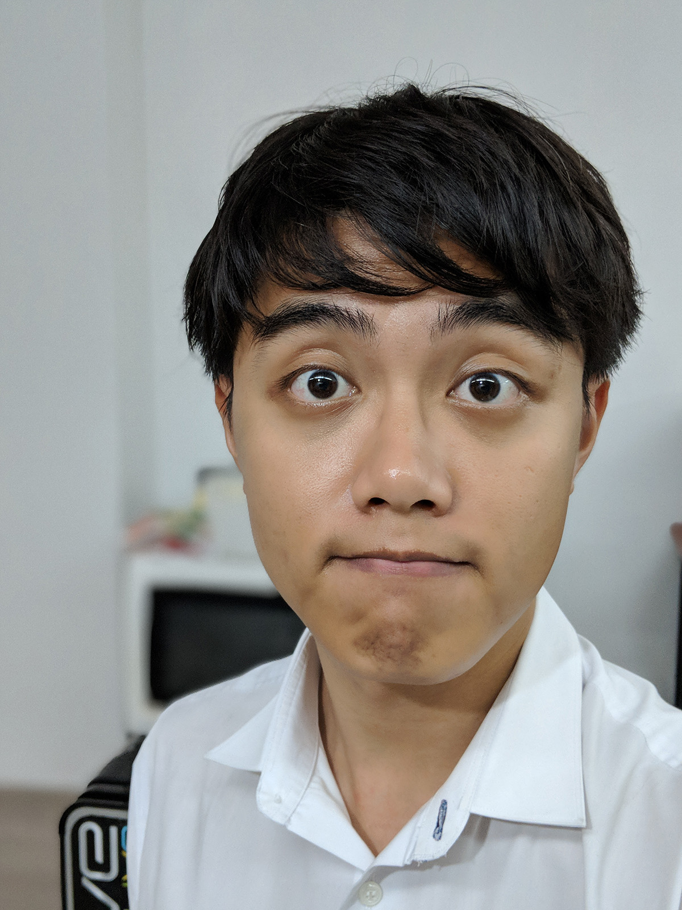

ประสิทธิภาพของกล้องหน้าก็ไม่แพ้กัน มาด้วยความละเอียดที่ **8 MP f/2.8** ไม่มี Dual Pixel ในกล้องหน้านะ แต่ถึงแม้ว่าจะไม่มี Dual Pixel แล้วเราก็ยังสามารถใช้ Portrait Mode ได้อยู่ดี เท่าที่สังเกตมันก็จริงแหละ มันก็ทำเท่าที่ได้จริง ๆ เพราะลองเอามาถ่ายในหลาย ๆ สถานการณ์มันก็ไม่ได้ดีขนาดนั้น ทำให้คิดว่าสรุปแล้ว การที่เราใช้ Portrait Mode ได้นี่เป็น **ฝีมือของ Dual Pixel หรือ AI กันแน่ ???**

ไม่แน่ใจว่า เป็นเพราะกล้องหน้าไม่มี Dual Pixel หรืออย่างไร บางครั้งเวลาที่เราถ่าย Seflie หลาย ๆ คนแล้ว หน้าของคนถ่ายมันก็จะไม่ถูกเบลอในขณะที่หน้าของคนที่เหลือโดนหมด เอิ่ม... 😅

อีกจุดที่ทำให้หลาย ๆ คนเลือกซื้อ Google Pixel นั่นเป็นเพราะ Google ให้ผู้ใช้เก็บรูปภาพและวีดีโอที่ถ่ายจะ Pixel ด้วยความละเอียดเต็มบน **Google Photos** ได้ถึงปี 2020 กันเลยทีเดียว

## Active Edge + Google Assistant + Google Lens

มาที่อีกหนึ่ง Feature ที่ดูเหมือนจะเป็น Gimmick ของโทรศัพท์รุ่นนี้กันหน่อย นั่นคือเรื่องของ **Active Edge** ที่เป็นการบีบตัวเครื่องแล้วจะเป็นการเรียก **Google Assistant**  หรือก็คือ ผู้ช่วยอัฉริยะจากทาง Google นั่นเอง ที่เราสามารถ ถามหรือสั่งให้มันทำหลาย ๆ อย่างเช่นการจด Note หรือถามเรื่องต่าง ๆ ได้ ซึ่งโดยส่วนตัวผมเป็นหนึ่งในคนที่ใช้ Google Assistant เป็นประจำอยู่แล้ว

ตอนแรกที่อ่านรีวิวจากเว็บอื่นก็คิดนะว่า Active Edge มันน่าจะเป็นแค่ Gimmick ที่ทำให้โทรศัพท์มันดูน่าสนใจไปงั้นแหละ แต่พอใช้จริง ๆ มันทำให้ผมใช้ Google Assistant มากขึ้นไปอีกนะ มันเหมือนกับเราตัดขั้นตอนการเรียก ที่บางทีมันต้องใช้ความพยายามสักหน่อย คือตอนใช้เครื่องเก่าคือต้องปลดล๊อคแล้วกดแถบ Search แล้วกดไมค์ พอมาใน Google Pixel 2 ก็คือสามารถบีบแล้วพูดได้เลย มันทำให้คนที่ใช้ Google Assistant สะดวกขึ้นมากเลย

Google Lens เป็นบริการที่คล้าย ๆ กับ Google Goggles ที่ทำให้เราสามารถค้นหาอะไรบางอย่างจากภาพได้ เช่นเบอร์โทรศัพท์ที่อยู่บนป้าย หรือ Landmark ต่าง ๆ ซึ่งในตอน ณ ที่เขียนตอนนี้ Google Lens ยังอยู่ในสถานะ Beta อยู่ ซึ่ง Google ก็เปิดให้เฉพาะโทรศัพท์ในตระกูล Pixel ได้เล่นก่อนนั่นเอง

ถามว่า มันดีขนาดนั้นมั้ยก็คงตอบว่า **ไม่** ด้วยความที่มันไม่ได้เก่งขนาดนั้นเลยนะ อาจจะเพราะว่ามันยังเป็น Beta อยู่รึเปล่าไม่รู้ แต่ก็รู้สึกว่ามันยังไม่ได้ใช้ประโยชน์ได้ขนาดนั้นเลยเฉย ๆ

## Always-on Display + Now Playing
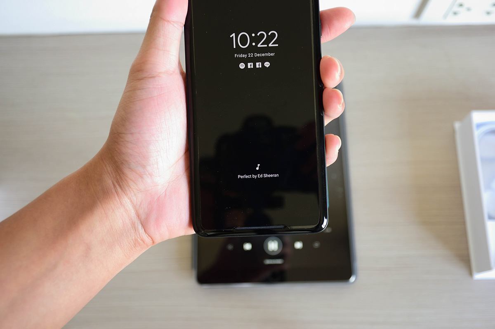

ด้วยความที่ Google Pixel 2 XL มาพร้อมกับจอแบบ P-OLED ทำให้หน้าจอสามารถเปิดปิดบางส่วนของหน้าจอได้ ส่งผลให้เราสามารถเปิดหน้าจอบางส่วนไว้แสดงผลอะไรบางอย่างไว้ตลอดได้โดยที่ไม่กินพลังงานอะไรมากนัก ซึ่ง Google เรียกมันว่า **Always-on Display** ที่จะแสดงนาฬิกา และ Notification ต่าง ๆ ที่เราได้รับ ด้วยความที่แรก ๆ ไม่ชิน ก็ทำให้เราชอบไปมองเครื่องบ่อย ๆ เพราะว่าหน้าจอมันเปิดอยู่ ทำให้นึกว่าลืมล๊อคหน้าจอนั่นเอง ฮ่า ๆ

และที่สำคัญคือ มันจะแสดงเพลงที่มันได้ยินอยู่อีกด้วย เรียกว่า **Now Playing** ตอนแรกก็คิดนะว่า มันจะมีมาทำไม แต่พอมาใช้จริง ๆ อื้ม... เฮ้ยมีมันก็ดีนะ คือมันจะมีหรือไม่มีก็ได้อะ ไม่ได้จำเป็นอะไรขนาดนั้น แรก ๆ ที่ใช้ก็รู้สึกน่ากลัวหน่อย ๆ นะ เหมือนโทรศัพท์มันแอบดักฟังเราอยู่ตลอดเลย แต่พอใช้ ๆ ไปมันก็ชินนะ ดีซะด้วยซ้ำ เพราะส่วนตัวเป็นคนที่ชอบดูหนัง แล้วถามตลอดว่าเพลงที่มันเปิดตรงนี้คือเพลงอะไร ตอนนี้ก็ไม่ยากเลย แค่เราหยิบโทรศัพท์ออกมาดูก็รู้เลย ถ้าเราอยากฟังบน Spotify เราก็แค่กดที่ชื่อเพลง แล้วกด Play in Spotify ได้เลย โคตรสะดวก

สิ่งที่น่าตกใจของ Feature Now Playing คือ Google บอกว่ามันไม่ได้เชื่อมต่อไปที่ Server หรือ Internet ใด ๆ เพื่อหาชื่อเพลงออกมา แต่ทั้งหมดถูกทำบนเครื่องเราหมดเลย แล้วประเด็นคือมันแม่นมาก ๆ (เฉพาะในเพลงที่เป็นภาษาอังกฤษนะ) ส่วนเพลงไทยยังใช้ไม่ได้ ซึ่งคาดว่าในอนาคตคงได้รับการปรับปรุงให้ดีกว่านี้แน่นอน

## Battery
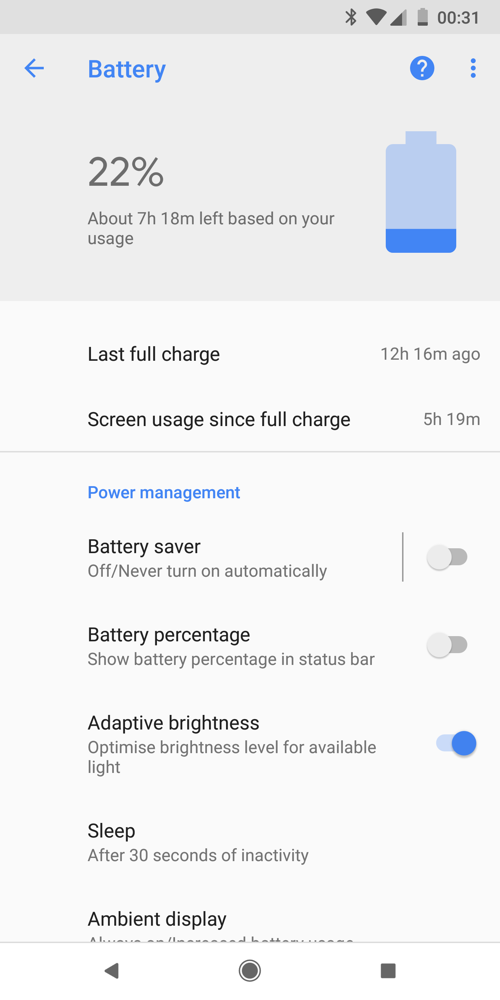

สำหรับเรื่อง Battery ก็ไม่น้อยหน้าใคร เพราะ Google อัด Battery มาให้ถึง **3520 mAh** แบบถอดเปลี่ยนเองไม่ได้ (โทรศัพท์สมัยนี้ถอดเปลี่ยนเองไม่ได้ ทำไม !!) ที่ทำให้เราสามารถใช้มันได้ตลอดวัน เอาเป็นว่าตั้งแต่ใช้มาก็ไม่เคยเหลือต่ำกว่า 35% ตอนถึงหอเลยนะ รวม ๆ ก็ใช้ 4G บ้าง Wifi บ้าง และ ROV ไม่ต่ำกว่า 3-4 เกม กับใช้งานพวก Search และ Spotify อะไรทำนองนั้น ก็ยังไม่เคยหมด และด้วย Doze ที่มาใน Android เวอร์ชั่นใหม่ที่ทำให้ Battery อยู่ได้นานขึ้นอีก เพราะมันจะเข้าไปจัดการเรื่องพลังงานเวลาที่เราไม่ได้ใช้นั่นเอง

แต่ถ้าแบตหมดก็ไม่ต้องกลัว เพราะ Adapter ที่มาในกล่องรองรับมาตรฐาน **Fast Charge** ⚡️ ที่ Google เคลมว่า ชาร์จเพียงแค่ 15 นาทีก็สามารถทำให้ใช้งานโทรศัพท์ไปได้อีกหลายชั่วโมงเลย จุดที่ชอบของ Adapter ที่มาในกล่องคือ **เวลาชาร์จแล้วมันไม่รู้สึกว่าร้อน** เมื่อเทียบกับ Adapter ที่มาในกล่องของ iPad Pro แล้วที่ร้อนโคตร ๆ 🔥

## Connectivity
แน่นอนว่า Pixel 2 XL ก็ไม่ได้น้อยหน้าใครเรื่องของการเชื่อมต่อ เพราะมันมาพร้อมกับ Model  ตัวท๊อปอย่าง **Qualcomm Snapdragon X16 LTE** ที่ให้ความเร็วระดับ Gbps ใน LTE (CAT16 ในภาค Downlink และ CAT13 ในภาค Uplink) และยังรองรับ 256-QAM และ 4x4 MIMO อีกด้วย และยังรองรับ VoLTE (ในเครือข่ายที่รองรับ ซึ่งในไทยขนาดขายยังไม่มีขายเลย ฉะนั้น VoLTE ก็อดนาจา)

เรื่องของ Sim จะรองรับแค่ Sim เดียวเท่านั้นโดยขนาดที่ใช้จะเป็น **Nano Sim** และนอกจากนั้นยังรองรับ **eSim** ที่เป็น Sim ฝังเครื่องอีกด้วย ทำให้เวลาเราไปไหน เราก็ไม่จำเป็นที่จะต้องเปลี่ยนซิมไปมาอีกต่อไป เราก็แค่เอาเครื่องของเราไปลงทะเบียนกับเครือข่ายที่เราต้องการใช้ เท่านี้ก็ได้แล้ว แต่ ณ ตอนที่เขียน ยังไม่มีเครือข่ายไหนในประเทศไทยรองรับนาจา 😢

นอกเหนือจากเรื่อง Cellular ที่ได้กล่าวไปแล้ว WiFi ก็รองรับจนถึงมาตรฐาน **ac** กันเลยทีเดียว มาพร้อมกับ **Bluetooth 5.0 + Low Energy** ที่ทำให้เราสามารถเชื่อมต่ออุปกรณ์ไร้สายได้ง่ายขึ้นและประหยัดพลังงานยิ่งขึ้น **NFC** และ **GPS** ก็ยังอยู่เหมือนเดิมไม่ได้ไปไหน

## Software

Pixel 2 XL ก็มาพร้อมกับระบบปฏิบัติการ Android (แหงแหละ ก็โทรศัพท์เครื่องนี้ Google ทำนี่หว่า) ซึ่ง ณ ตอนที่เขียนตอนนี้ก็ได้อัพเกรดเป็น **Android 8.1 Oreo** เป็นที่เรียบร้อยแล้ว มันก็มาพร้อมกับหลาย ๆ Feature มากมาย

และอย่างที่เรารู้กันว่าโทรศัพท์จาก Google จะได้รับ Software Update ใน Day 0 หมายความว่า พอ Google เปิดตัว Android ใหม่ปุ๊บ เราก็จะได้อัพเกรด หรืออัพเดท **ในทันที** ต่างจากค่ายอื่นที่ต้องรอให้แต่ละ Brand ใส่โน้นนี่นั่นลงไปใน Rom ของค่ายตัวเองเพื่อให้มี Feature อลัง ๆ นอกจากนั้น Google Pixel 2 ได้รับการประกัน Software จาก Google ถึง 3 ปีทำให้เรามั่นใจได้ว่า เราจะไม่โดนลอยแพก่อน 3 ปีแน่นอน ซึ่งเอาจริง ๆ โทรศัพท์ Android ที่จะได้อัพเดทนานขนาดนี้มันต้องเป็นโคตรเรือธงเลยละ แต่สุดท้ายก็คงเป็นโทรศัพท์รุ่นเดียวในโลกที่ได้รับการอัพเดทก่อนใคร และ**ประกัน Software นานถึง 3 ปี** ก็คงมีแค่โทรศัพท์จาก Google เองเท่านั้น

เนื่องด้วยตัว Software มันมาจากทาง Google เองทำให้ Android ที่เรารันอยู่ใน Google Pixel 2 มัน **เป็น Android ที่ให้ประสบการณ์การใช้งานที่ดีที่สุด** ย้ำว่าดีที่สุดตั้งแต่เคยใช้มาแล้ว ด้วยหน้าจอที่เรียบง่าย เลื่อนขึ้นเพื่อเปิด App Drawer และ Recent App ต่าง ๆ ทำให้การใช้งานมันลื่นไหลมาก ตัว Rom ก็โล่งมาก ๆ (บางทีก็รู้สึกโล่งไปหน่อย) เพราะมันไม่มีพวก Bloatware มาให้รกเครื่อง รกหูรกตาเลยสักนิดเดียว ฟิลลิ่งของมันคือ Android อย่างที่ Google อยากให้เป็นมาก ๆ

ตั้งแต่ใช้ Android มายังไม่เคยเจอตัวไหนที่มันจะลื่นติดนิ้วขนาดนี้มาก่อน ปกติ Android เครื่องก่อน ๆ ที่ใช้มา เวลาใช้ ๆ ไปมันจะรู้สึกว่าช้าลง แต่อันนี้ึคือไม่ นางเสมอต้นเสมอปลายมาก ๆ ลื่นยังไงก็ลื่นอยู่อย่างงั้น คือดีงามเวอร์ ! ถ้าอยากอ่านรีวิว Software เต็ม เดี๋ยวจะเขียนแยกให้นะ

## ความเห็นส่วนตัว

เท่าที่ใช้งานมา อยากจะบอกเลยว่ามันเป็นโทรศัพท์ที่ให้ประสบการณ์การใช้งานโทรศัพท์ที่มันเป็นโทรศัพท์จริง ๆ เพราะส่วนตัวผมแล้วผมไม่ได้ใช้โทรศัพท์เพื่อโทรซะเป็นส่วนใหญ่ ผมมักจะใช้โทรศัพท์เพื่อ **Get things done** นั่นคือการใช้คุยงาน ทำงานซะมากกว่า ซึ่ง Google Pixel 2 XL เครื่องนี้ก็ทำให้ผมสามารถจัดการงานหลาย ๆ อย่างได้ง่ายขึ้น ด้วยขนาดของตัวเครื่องที่ทำให้ผมสามารถพิมพ์ได้อย่างสะดวก และ Google Assistant ที่เป็นเหมือนผู้ช่วยของผม ที่ทำให้ผมสามารถจัดการอะไรหลาย ๆ อย่างได้ดีขึ้นเยอะมาก ๆ ด้วยการแค่บีบเรียก... กับเรื่องของกล้อง 📷 ที่ทำให้ความจำเป็นในการหยิบกล้องใหญ่น้อยลงมาก ๆ มันทำให้ผมอยากที่จะถ่ายภาพมากขึ้นมาก ๆ ภาพที่ได้ออกมามันดูสวยมาก ๆ โคตรชอบ !

อีกเหตุผลคือ ส่วนตัวผมเป็นคนที่ใช้งานหลาย ๆ Service อยู่ใน Google Ecosystem ทำให้การทำงานมันก็ค่อนข้าง Seamless มาก ๆ เช่นผมมักจะใช้ Google Keep ในการจด Short Note หรือ Email เองผมก็ใช้ Gmail อยู่แล้ว

## สรุป Google Pixel 2 XL เป็นโทรศัพท์ที่...
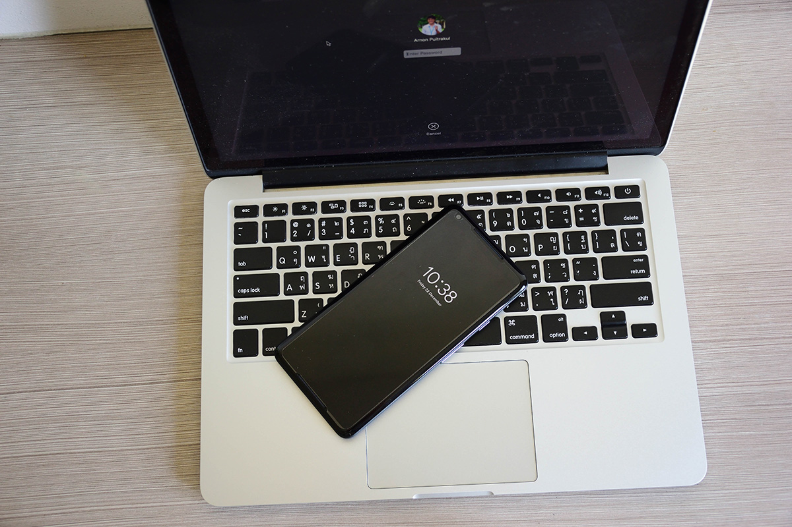

โดยสรุปแล้ว Google Pixel 2 XL เป็นโทรศัพท์ที่น่าซื้อเครื่องนึงเลย ถึงแม้มันจะไม่ได้มี DAC ดี ๆ อย่าง LG V30 หรือ S-Pen อย่าง Galaxy Note 8 หรือ Feature ต่าง ๆ ที่ดูเป็น Gimmick แต่
> มันเป็นโทรศัพท์ที่เรายิ่งใช้เราจะยิ่งรักมันเข้าไปเรื่อย ๆ ❤️

จากความที่ Minimal และอัฉริยะในหลาย ๆ ด้านโดยการหยิบ AI เข้ามาช่วย มันก็ทำให้ชีวิตเราง่ายขึ้น กับกล้องที่ **เออ มึ_เอาไปเหอะ !!** บางทีถ่ายแล้วอัพลงเฟสไปคนนึกว่าเอากล้องใหญ่ไปถ่าย

แต่สำหรับใครที่อยากได้ ก็ไม่มีขายในไทยนะแจ๊ะ ก็ลองหาเครื่องหิ้ว แต่สิ่งนึงที่ต้องยอมรับกับเรื่องของเครื่องหิ้วคือ **ประกัน** ก็ถ้าใครคิดว่าปัญหานี้เป็นปัญหาใหญ่แนะนำให้ไปหารุ่นอื่นดีกว่า เพราะมันค่อนข้าง Pain มากกับเรื่องประกันในประเทศเรา ส่วนเรื่องจอเท่าที่ใช้มายังไม่เคยเจอ ยกเว้น **Blue Tint** ที่ไม่ได้มีผลอะไรกับชีวิตเลย รวม ๆ ก็เป็นโทรศัพท์อีกเครื่องที่อยากแนะนำต่อเลยละ ถ้าใครคิดจะซื้อก็แนะนำ ซื้อเลย โคตรแจ่ม !
