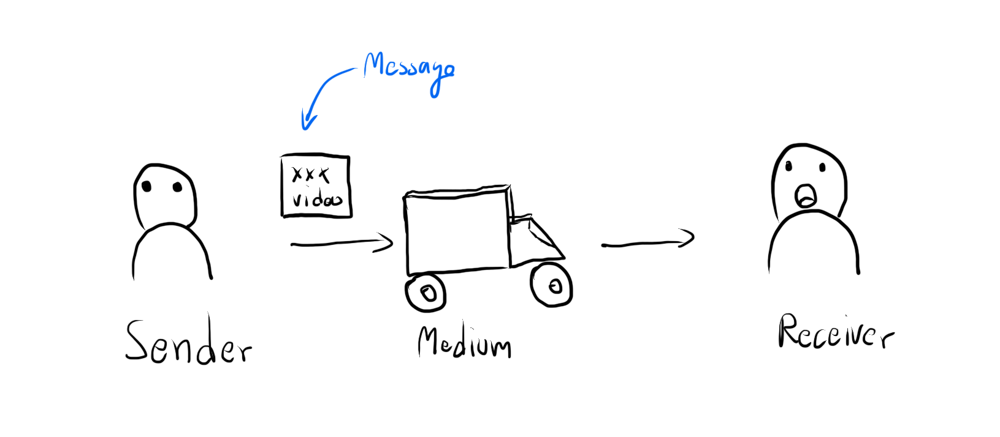
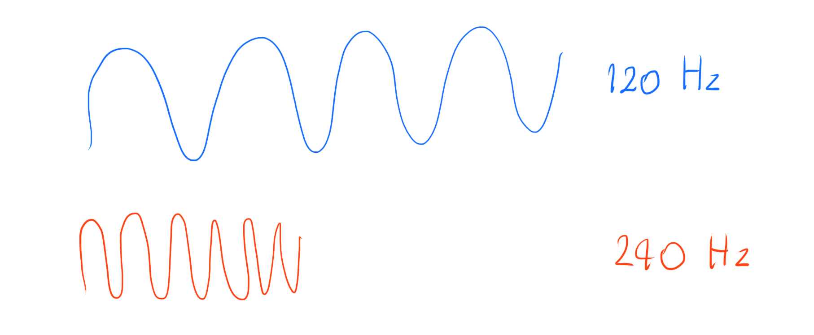
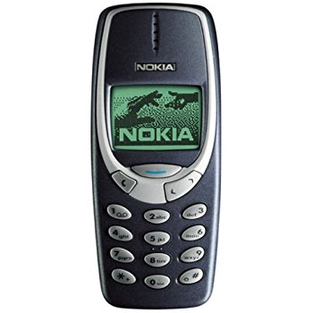
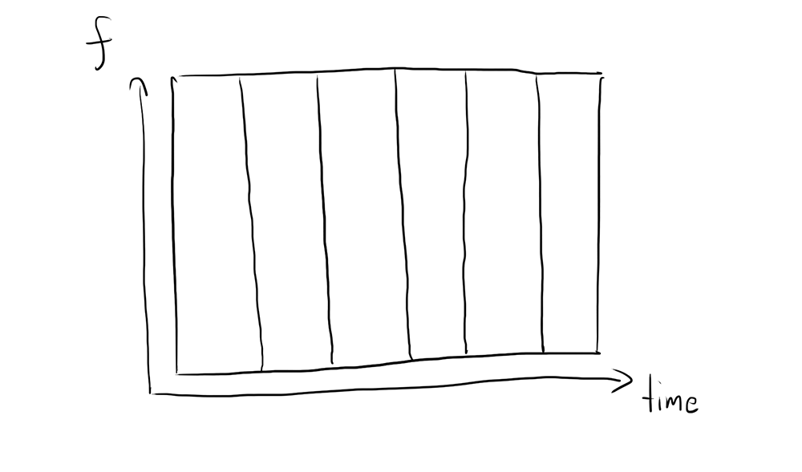
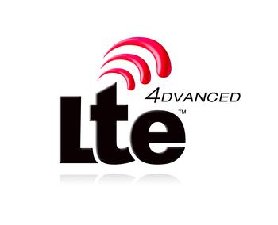
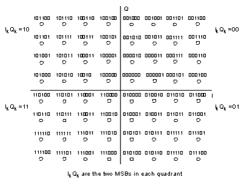
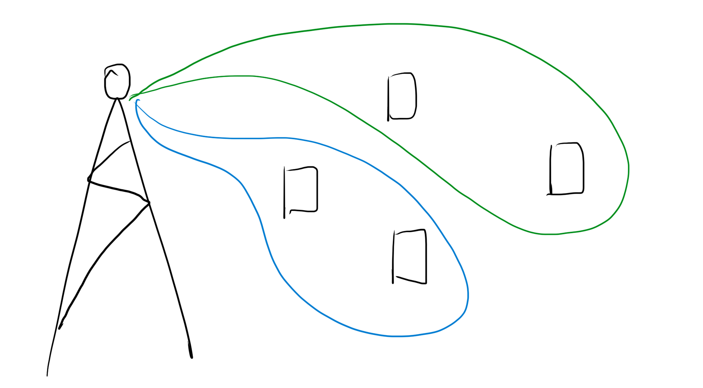

จุดเริ่มต้นของบทความนี้คือพึ่งเครือข่ายไปใช้ของค่ายเขียว (Nvidia แน่นวล #ผิด) เพราะค่ายฟ้ามันช้าซะเหลือเกินประกอบกับเปลี่ยนไปใช้ Pixel 2 XL ที่มาพร้อมกับ Modem X16 จาก Snapdragon ที่โคตรจะเร็ว ฟิลลิ่งเหมือนกับเอารถสปอร์ตไปวิ่งบน กทม เลย วันนี้ก็เลยจะมาไขความ งง ของเทคโนโลยีที่อยู่เบื้องหลังของเทคโนโลยีการสื่อสารที่เราใช้กันบนอุปกรณ์เคลื่อนที่กัน

**คำเตือนมันจะมีบางส่วนที่อาจะลงลึก ถ้ายาวไปไม่อ่านก็ข้ามส่วนที่เป็น Technical ไปได้**

## ส่วนประกอบของการสื่อสาร

การสื่อสารเราจะประกอบด้วย ผู้ส่งสาร, สาร, ตัวกลาง และผู้รับสารใช่ม่ะ ในการสื่อสารไร้สาย ผู้ส่ง และ ผู้รับสารก็คือเครื่องโทรศัพท์ สารคือข้อมูลที่ผู้ส่งสารต้องการส่งถึงผู้รับสาร และ ตัวกลางก็คงไม่ใช่บุรุษไปรษณีย์ แต่เป็นอากาศ

_James Maxwel ทางซ้าย และ Guglielmo Marconi ทางขวา_

ใช่ครับ ณ ตอนนี้เราส่งข้อมูลผ่านอากาศกัน ซึ่งถามว่าแล้วเราจะส่งยังไง อันนี้ต้องย้อนกลับไปเมื่อปี 1867 ที่คุณลุง Maxwell พิสูจน์แล้วว่า คลื่นแม่เหล็กไฟฟ้ามีอยู่จริง และในปี 1896 ที่ Guglielmo Marconi คุณลุงเจ้าพ่อแห่ง Wireless ส่งสัญญาณไปที่เรือที่อยู่ห่างจากฝั่ง 29 km ได้ 📻 จากนั้นมาเราก็ใช้หลักการที่คุณลุง Marconi (ชอบเรียกว่า มักกะโรนี เพราะมันอร่อย 🤩) มาสร้างเป็นวิทยุ และกลายเป็นสัญญาณโทรศัพท์ที่เราใช้จนถึงปัจจุบัน

ถ้าเราพูดถึงคลื่น **กสทช บอกว่า คลื่นคือสมบัติของชาติ** (แต่ชาติไม่ได้สร้าง แต่ก็ช่างเถอะ) เพราะเราถือว่าคลื่นเป็นสิ่งที่มีอยู่อย่างจำกัด และต้องการการจัดระเบียบ ลองนึกดูนะครับว่าถ้าเราฟังวิทยุช่อง A ที่ความถี่นึง แล้วพอเดินไป 5 ก้าวช่องความถี่เดิมแปลงร่างเป็นอีกช่องนึงคงจะงงมากมาย

ฉะนั้น กสทช เข้ามาทำหน้าที่ในการจัดสรรคลื่นความถี่ อย่างที่เราเคยได้ยินกันว่า กสทช จะเปิดประมูลคลื่นความถี่นี้ ๆ นั้น ๆ ออกมา ก็คือ กสทช กำลังจะเปิดประมูลให้เช่า (ย้ำนะว่า **เช่า**) คลื่นความถี่ไปใช้กันผ่านการให้สัมปทาน เพราะฉะนั้นผู้ให้บริการอย่าง AIS, DTAC และ True ก็คือถือสัมปทานบอกว่า ฉันสามารถปล่อยคลื่นสัญญาณที่ความถี่นี้ ๆ เพื่อทำใช้ในการทำ 4G 3G อะไรก็ว่ากันไป

จากตรงนี้จะทำให้เราเห็นว่าแต่ละผู้ให้บริการได้รับการจัดสรร คลื่นความถี่ **อย่างจำกัด** (อย่าเรียกว่าเขาได้ **จัดสรร** เลย เรียกว่าเขา **เช่า** ได้จำกัดละกัน)

_High vs Low Frequency Comparison_

คลื่นความถี่แต่ละย่านก็จะให้ข้อดี ข้อเสียต่างกัน เหมือนที่เราเรียนกันในฟิสิกส์กันแล้วว่า ความถี่แปรผกผันกับระยะทาง หมายความว่า ยิ่งความถี่สูงก็ยิ่งส่งข้อมูลได้ไกลน้อยลงนั่นเอง แต่ความถี่สูงก็มีข้อดีที่สามารถส่งข้อมูลได้รวดเร็วกว่า (ส่วนเพราะอะไร ไม่ขอเล่าละกัน จะยาวเกิน ไว้ถ้าใครอยากรู้ก็ลองไปหาดูครับ มันเรียนในฟิสิกส์เด็ก ม.ปลาย) ด้วยความถี่ที่แปรผกผันกับระยะทางทำให้ การที่เครือข่ายจะทำให้ตัวเองครอบคลุมทั่วมากขึ้นก็คือการเพิ่ม **เสา** (Cell Site)

ปัญหาก็มาอีก คือยิ่งเพิ่มเสาเยอะก็ทำให้เกิด Operation Cost เยอะขึ้นนั่นเอง เพราะฉะนั้นวิธีการแก้ปัญหาง่าย ๆ อย่างหนึ่งคือการถือครองย่านความถี่ต่ำไว้สักหน่อย เพื่อให้เพิ่มพื้นที่ครอบคลุมได้ง่ายขึ้นนั่นเอง

**เพิ่มเติม** ลืมเล่าไปว่าพวก Network พวกนี้เราเรียกมันว่า **Cellular Network** เพราะว่า เรามองว่าคลื่นที่ไปได้ใน 1 เสาคือ ช่อง ๆ นึง พอรวมกัน มันก็จะเป็น Grid เราเลยเรียก Network พวกนี้ว่า Cellular Network

## วิวัฒนาการของเทคโนโลยีไร้สารจาก 1G สู่ 4G
<iframe width="560" height="315" src="https://www.youtube.com/embed/wiWXQEkO5ws?rel=0" frameborder="0" gesture="media" allow="encrypted-media" allowfullscreen></iframe>

ปีนี้ 2018 คงไม่มีใครที่ไม่รู้จักคำว่า 4G กันแล้ว

> 4G ที่แท้จริงแล้วนั้นมันคืออะไรกันแน่ ? 🧐

คำว่า 4G จริง ๆ แล้วมันย่อมาจากคำว่า **4th Generation** หรือรุ่นที่ 4 นั่นเอง แปลว่า ถ้ามีรุ่นที่ 4 มันก็จะต้องมีรุ่น 1, 2, 3 แน่นอน และแน่นอนอีกว่าหลาย ๆ คนน่าจะเคยผ่านยุคเหล่านั้นมาแล้วแน่นวล 🙀

_Nokia Talkman_

เริ่มต้นกันที่ยุคของ 1G หรือ 1st Generation กัน ในยุคนั้นการสื่อสารไร้สายยังคงอยู่ในรูปแบบ Analog (นึกภาพง่าย ๆ นึกถึงวิทยุบนรถ) ที่ส่งได้แค่เสียง หรือก็คือโทรคุยกันได้เพียงอย่างเดียวเท่านั้น ไม่สามารถส่งข้อความหรือเชื่อมต่ออินเตอร์เน็ตได้เลย 🗑

_Frequency Division Multiple Access_

แน่นอนว่าเราคงไม่ซื้อเครือข่ายนึงไว้ใช้คนเดียวแน่ ๆ ทำให้เราจะต้องมีเทคนิคในการทำให้คลื่นที่เรามีอยู่จำกัดใช้ได้หลายคนมากที่สุด เทคนิคที่ใช้ในตอนนั้นคือ **Frequency Division Multiple Access** หรือ **FDMA** มองภาพง่าย ๆ ว่า เครือข่ายหรือผู้ให้บริการ ถือคลื่นอยู่ก้อนนึง เช่น 20 MHz ก้อนนึง เราเปรียบเหมือนถนนเส้นนึงที่กว้าง 20m ก็ได้

แต่ถนนเส้นนี้มีข้อจำกัดของมันคือ ถนนเส้นนี้จะถูกวิ่งได้โดยรถของเจ้าของคนเดียวในเวลาเดียวกัน พอคนแรกใช้เสร็จคนต่อไปถึงจะเข้ามาใช้ต่อ FDMA คือแนวคิดที่เอาถนนเส้นใหญ่ ๆ ที่วิ่งได้ทีละคน ฉีกมันออกมาให้กลายเป็นหลาย ๆ เส้นเพื่อให้คนหลาย ๆ คนสามารถวิ่งหรือใช้งานเครือข่าย ณ ที่นั้น ๆ ได้พร้อมกันหลาย ๆ คนนั่นเอง

แต่ข้อจำกัดมันอยู่ที่ว่า เราไม่สามารถที่จะซอยถนนออกมาได้เยอะมาก ๆ แบบเป็นหลายร้อยได้ เพราะถ้าเราซอยของให้ออกมาจำนวนชิ้นมากขึ้นสิ่งที่จะตามมาคือ ของมันก็จะชิ้นเล็กลง นึกสภาพว่ามันคือถนน ถ้าเราบอกว่า เรามีถนนกว้าง 20 เมตร รถคันนึงกว้าง 1 เมตร ฉะนั้นความกว้างของถนนน้อยที่สุดที่จะเป็นไปได้คือฉีกออกมาเส้นละ 1 เมตร ไม่ต้องพูดถึงน้อยกว่าเมตรเลย ไม่งั้นเราคงได้ตัดรถออกมาแล้ววิ่งไปทีละเสี้ยวแล้ว

แต่ในความเป็นจริงแล้ว การที่รถเรากว้าง 1 เมตร แล้วถนนเราซอยออกมาเส้นละ 1 เมตรก็คงวิ่งกันลำบาก เพราะต้องมานั่งกลัวว่า ฉันจะไปเฉียวใครมั้ย เสียวไปหมด ฉะนั้นถนนก็ควรจะแบ่งให้เกิน 1 เมตร เพื่อให้รถวิ่งสวนไปมาได้สะดวกมากขึ้น ในเชิงของการแบ่งสัญญาณเราเรียกสัญญาณที่เราแบ่งเกินมาว่า **Guard Band** นั่นเอง ตัวอย่างที่เราเห็นได้ง่ายที่สุดจากการใช้ Guard Band คือในวิทยุ เคยสงสัยมั้ยว่า ทำไมเราถึงไม่มีช่อง FM 103.25 หรือ FM 105.14 แต่ทุกช่องดันเพิ่มขึ้นมาทีละ 5 เช่น 105.5, 95.5 สาเหตุก็มาจากการแบ่งเป็น Guard Band นี่ละ

ซึ่งเทคโนโลยี 1G ก็มีหลายตัวออกมาใช้กันทั่วโลก เช่น Advance Mobile Service (AMPS) ที่ใช้ใน US ส่วนในไทยตอนนั้นใช้เป็น Total Access Communication System (TACS) ที่วิ่งอยู่บนย่านความถี่ 900 MHz

_Nokia 3310_

มาในยุคของ 2G ก็มีการพัฒนาในเรื่องของการส่งข้อมูลจากส่งเป็น Analog ใน 1G มาใน 2G ก็เปลี่ยนไปใช้การส่งแบบ Digital แทน ข้อดีของมันคือ เรื่อง Security เพราะเราสามารถทำการเข้ารหัสสัญญาณได้ดีขึ้น (ถ้าเป็น Analog การเข้ารหัสสัญญาณนั้นทำได้ยากกว่า Digital เยอะ) อีกหนึ่งข้อดีคือเราสามารถส่งข้อมูลประเภทอื่น ๆ ที่ไม่ใช้เสียงได้ SMS ที่ใช้ส่งข้อความ และ **General Packet Radio Service (GPRS)** ที่เป็นการรับส่ง Data ก็เกิดมาในยุคของ 2G นี่แหละ กับ **Enhanced Data-rates for Global Evolution (EDGE)** ที่ตามมาในยุค 2.5G

_Time Division Multiple Access_

เนื่องจาก FDMA ใน 1G ทำให้เราซอยคลื่นสัญญาณเพื่อให้คนใช้เป็นจำนวนมากทำได้ยาก ใน **2G** จึงมาพร้อมกับสิ่งที่เรียกว่า **Time Division Multiple Access** หรือ **TDMA**  ⏱ ที่จะไม่ได้ซอยคลื่นความถี่ละ มันมาซอยเวลาแทน ทำให้ถนนเส้นเดียวกันสามารถแบ่งกันวิ่งได้หลาย ๆ คนในเส้นเดียว แต่แค่ต้องแบ่งเวลาวิ่งเท่านั้น ทำให้รับผู้ใช้งานได้เป็นจำนวนที่มากกว่า FDMA

นอกจากนั้นการมาถึงของเทคโนโลยี 2G ทำให้เกิดมาตรฐานในการคุยกับเสา และวิธีการในการส่งข้อมูลระหว่างเสาที่เป็นมาตรฐานมากขึ้น ทำให้เกิดระบบที่เรียกว่า **Global System for Mobilization (GSM)** ทำให้มือถือเครื่องเดียวสามารถเดินทางไปใช้ในหลาย ๆ ประเทศได้หรือที่เราเรียกกันติดปากว่า **Roaming**

_GSM System Architecture_

อธิบายลงลึกเข้าไปอีก อันนี้ **Geek Only** ในระบบ GSM มันก็จะมีหน้าตาแบบภาพด้านบนเริ่มจากอุปกรณ์เช่นโทรศัพท์, Tablet อะไรก็ว่าไปจะเชื่อมต่อไปที่ Base Transceiver station หรือ BTS (จำว่าจะไปรถไปฟ้า 🚝) จากนั้น BTS ก็จะส่งข้อมูลไปที่ Base Station Controller หรือ BSC และแต่ละ BSC ก็จะเชื่อมต่อไปที่ Mobile Switching Centre หรือ MSC ที่มีหน้าที่เหมือนกับ Router ในการเปลี่ยนเส้นทางคู่สายต้นทางไปถึงปลายทาง นอกจากนั้น MSC ยังเชื่อมต่อกับ 4 Database นั่นคือ

- Home Location Register (HLR) จะเก็บพวกข้อมูลต่าง ๆ ของผู้ใช้บริการเช่น เบอร์โทรที่ใช้งาน ชื่อ และข้อมูลอื่น ๆ อีกมากมาย
- Visitor Location Register (VLR) ลักษณะการเก็บข้อมูลจะเหมือนกับ HLR ทุกประการ แต่จะใช้ถูกใช้ในกรณีที่เราทำ Roaming นั่นก็คือ เวลาเรา Roaming จาก Network A ไป B ข้อมูลของเราใน HLR ของ Network A ก็จะวิ่งไปที่ VLR ของ Network B
- Equipment Identity Register (HIR) จะเก็บเลข IEMI ของอุปกรณ์ที่ลงทะเบียนไว้ คล้าย ๆ กับเลขบัตรประชาชนของโทรศัพท์ละกัน อุปกรณ์เคลื่อนที่ทุก ๆ เครื่องบนโลกจะมีหมายเลขประจำตัว หรือ IEMI ที่ไม่เหมือนกันเลยสักเครื่อง
- Authentication Centre (AUC) จะเก็บพวก Authentication Key สำหรับดูแลเรื่องของการเข้ารหัสต่าง ๆ

ทีนี้ถามว่าแล้วเราจะเข้ารหัสสัญญาณได้อย่างไร การที่เราจะใช้งานเครือข่ายได้ เราก็ต้องมี **SIM** หรือเต็ม ๆ คือ **Subscriber Identity Module** คล้าย ๆ กับเราถือ Visa ในการใช้งานเครือข่าย ซึ่งใน SIM ก็จะมีข้อมูลหลายอย่างเช่น **Personal Indentification Number** หรือ **PIN**, **PUK** หรือ **PIN Unblocking Key**, **Temporary Subscriber Identity** หรือ **TIMSI**

และส่วนที่สำคัญมากคือ **International Mobile Subscriber Identity** หรือย่อ ๆ ว่า **IMSI** เพราะมันจะประกอบด้วยของ 3 อย่าง **Mobile Country Code (MCC), Mobile Network Code (MNC) และ Mobile Subscriber Identity (MSIN)** ความยาวทั้งหมดจะอยู่ที่ **128 Bits** ที่เป็นการบอกว่า เรา Register อยู่ประเทศไหนผ่าน MCC, เครือข่ายอะไรผ่าน MNC และ ID อะไรผ่าน MSIN เพราะฉะนั้นการที่เรากดเบอร์โทรศัพท์ก็เหมือนกับเราใส่รหัสเพื่อให้เราสามารถเข้าถึงสายปลายทางได้นั่นเองงง

และแน่นอนว่าเทคโนโลยี 2G ก็มีอยู่หลายตัวด้วยกันเช่น **Personal Digital Cellular (PDC)** ที่ใช้ในญี่ปุ่น ถ้าในไทยก็จะเป็น **Global System for Mobile (GSM)** ที่อยู่บนย่านความถี่ 900 และ 1800 MHz

_Code Division Multiple Access_

มาในยุคของ **3G** ที่ทำการแก้ไขปัญหาที่ว่า ถนนมันต้องแบ่งกันวิ่ง แต่เราอยากให้ถนนเส้นเดียว ทุกคนวิ่งอยู่พร้อม ๆ กันได้ เหมือนกับถนนทั่ว ๆ ไปในโลกแห่งความเป็นจริงที่ รถคันที่ 1 ไปสถานที่ A ก็วิ่งอยู่บนถนนเดียวกับรถคันที่ 2 ไปสถานที่ B ได้ **Code Division Multiple Access (CDMA)** จึงถูกนำมาใช้ในการแก้ไขปัญหานี้ ซึ่งดั่งเดิมของมันถูกนำมาใช้ในเชิงของการทหาร เพื่อป้องกันการถูกดักฟัง และอีกหนึ่งข้อดีของมันคือทนต่อคลื่นรบกวนค่อนข้างมาก

ซึ่งวิธีในการส่งสัญญาณจะไม่เหมือนกับ FDMA และ TDMA ที่เป็นการแบ่งย่านความถี่ และเวลากัน เพราะ CDMA จะใช้ลักษณะคล้าย ๆ กับการแปะป้ายว่าข้อมูลก้อนนี้มาจากไหน

**คำเตือน Geek Only ไม่ใช่ Geek ลงไปอ่านข้างล่างต่อตรง Non-Geek Resume** วิธีการทำงานของมันจะเริ่มต้นจาก ทุกคนจะมีข้อมูลชุดนึง เรียกว่า **Shift Code** จำนวนหลักก็จะขึ้นอยู่กับผู้ให้บริการจะตั้ง

_Encoding Rule in CDMA ( '-' for slient)_

เนื่องจากเรามี 3 สถานะในการส่งคือ ส่ง 1, ส่ง 0 และไม่ส่ง มันก็จะแทน +1 เป็นการส่ง 1 แทน 0 เป็นการไม่ส่ง และส่ง -1 เป็นการส่ง 0

_CDMA Multiplexer_

จากภากข้างบนเป็นตัวอย่างว่า เรามีอยู่ทั้งหมด 6 สถานี ทำให้เรามี Shift Code ทั้งหมด 6 ตัว ณ เวลานึงมี Station 1 ต้องการจะส่ง Bit 1 และ Station 2 ต้องการส่ง Bit 0 เราก็จะแปลงด้วยกฏที่พึ่งพูดถึง แล้วก็เอามาคูณกับ Shift Code ของแต่ละสถานี แล้วก็เอาผลลัพธ์จากทุกสถานีมาบวกกัน ก็เรียบร้อย มันก็เหมือนกับเราเอาข้อมูลมาแปะป้ายแสดงความเป็นเจ้าของแล้วจับมันอัดรวมกันลงกล่องแล้วส่ง

_CDMA Demultiplexer_

เมื่อฝั่งขารับต้องการจะถอดค่ากลับมาเป็น Bit เหมือนเดิมสิ่งที่ต้องมี Shift Code ของสถานีที่ต้องการ ก็จับค่าที่รับได้มาคูณกับ Shift Code ของสถานีนั้น ๆ เรียงตัวไป, จับบวกกันให้หมด, หารด้วยจำนวนสถานี (ในข้อนี้คือ 6) แล้วก็แปลงผ่าน Rule เราก็จะได้ Bit กลับมา ปกติก็เป็นอันเสร็จ ด้วยความงามของคณิตศาสตร์ตรงนี้ทำให้คนที่ไม่มี Shift Code ก็ไม่สามารถถอดสัญญาณที่เราไม่มี Shift Code ไม่ได้

**Non-Geek Resume** ซึ่งแน่นอนเหมือนกับ 1G และ 2G ที่ 3G ก็มีหลายเทคโนโลยีเช่นกัน เช่น **CDMA2000** และ **Universal Mobile Telecommunication**
**System** หรือ **UMTS**

_3GPP Logo_

มาในยุคของ 4G ที่ต้องการความเร็วที่สูงขึ้น 3G ที่ตอนนั้นถือว่าเร็วก็ช้าไปเลยเมื่อเจอ 4G ต้นกำเนิดของมันมาจาก **3rd Generation Partnership Project** หรือ **3GPP** ได้พัฒนาเทคโนโลยีตัวนึงที่**เร็วกว่า 3G ถึง 10 เท่า** ซึ่งได้ถูกตั้งชื่อว่า **Long Term Evolution** หรือย่อว่า **LTE** ดั่งที่เรารู้จักกัน

เบื้องหลังของความเร็วในเทคโนโลยี 4G นั้นมาจากการใช้ **Orthogonal Frequency Division Multiplexing** หรือ **OFDM** ที่เป็นเทคนิคเดียวกับ WiFi (IEEE 802.11 a/g) ที่ถูกคิดจากนักวิจัยใน Bell Labs ในปี 1996 เพื่อทำให้สามารถรองรับการจราจรได้เป็นจำนวนมากขึ้น และยังรองรับการส่งข้อมูลความเร็วสูงมากขึ้นอีกด้วยถึง 100 Mbps Downlink และ 50 Mbps Uplink โดยใช้ความกว้างของสัญญาณอยู่ที่ 20 MHz และยังรองรับการใช้งาน **Multiple-Input-Multiple-Output** หรือ **MIMO**

_Orthogonal Frequency Division Multiplexing_

แนวคิดของ OFDM คือจับคลื่นมาซอยออกเป็นชิ้น ๆ เยอะ ๆ เรียกว่า **Sub-Carrier** ซึ่งแต่ละ Sub-Carrier ก็จะถูก Modulate โดย **Modulation Scheme** ต่าง ๆ แล้วแต่กำหนดเช่น **ASK, FSK, PSK หรือ QAM** (ขอไม่เล่าพวก ASK อะไรพวกนั้นนะ ไม่งั้นยาวว) แล้วจับแต่ละ Sub-Carrier มารวมกันเป็นคลื่นเดียวโดยอาศัยเทคนิค **Fast Fourier Transform (FFT)** ซึ่งจะขอไม่ลงลึกไปมากกว่านี้ก่อนที่จะพาไป Proof ที่มาของมัน

ในเวลาเดียวกันที่เทคโนโลยี LTE ออกมา **Worldwide Interoperability for Microwave Access** หรือ WiMax ที่เป็นลูกหลานของ **CDMA2000** ก็ออกมาตามกัน ทำให้มี 2 เทคโนโลยีเกิดขึ้นมาในยุคของ 4G ซึ่งหลาย ๆ ประเทศส่วนใหญ่ทั่วโลกก็ไปใช้ LTE กัน แต่ WiMax ก็ไม่ได้หายไปไหน เพราะมีอยู่อีกหลายประเทศเช่นกันที่นำ WiMax มาใช้ เช่นญี่ปุ่น

_LTE-A Logo_

ทีนี้เวลาผ่านไป ความเร็วมันก็ไม่เคยพอสักที **LTE-Advanced** หรือ **LTE-A** ก็ได้ออกมา หลัก ๆ ก็คือ LTE นี่แหละ แต่มีการเติมเรื่องของ Carrier Aggregation, MU-MIMO ที่โหดขึ้น และเริ่มใช้ Modulation Scheme ที่โหดขึ้นไปถึง **256-QAM** (จาก LTE ปกติอยู่ที่ 64-QAM) เข้ามาทำให้ทำความเร็วสูงสุดได้มากขึ้นไปอีกถึง 1 Gbps บน Downlink และ 500 Mbps บน Uplink ในทางทฤษฏี (นอกจาก CA, MU-MIMO และ Modulation Scheme แล้ว LTE-A ยังมี Key Technologies อื่น ๆ ที่เกี่ยวข้องอีกเช่น [Coordinated Multipoint](http://www.radio-electronics.com/info/cellulartelecomms/lte-long-term-evolution/4g-lte-advanced-comp-coordinated-multipoint.php), [LTE Relaying](http://www.radio-electronics.com/info/cellulartelecomms/lte-long-term-evolution/4g-lte-advanced-relaying.php) และ [Device 2 Device](http://www.radio-electronics.com/info/cellulartelecomms/lte-long-term-evolution/4g-lte-advanced-d2d-device-to-device.php))

_256-QAM Constellation Mapping
Source: [http://edadocs.software.keysight.com/display/ads2011/Mapper](http://edadocs.software.keysight.com/display/ads2011/Mapper)_

อาจจะสงสัยกันว่า **QAM** คืออะไร ? มันย่อมาจาก **Quadrature amplitude modulation** คือ Modulation Scheme ตัวนึงพูดง่าย ๆ มันเป็นเทคนิคหนึ่งในการจับ 2 ข้อความมารวมกัน (Modulating) นึกภาพง่าย ๆ ว่ายิ่งเลขหน้า QAM เยอะยิ่งแปลว่าสามารถส่งข้อมูลได้เยอะกว่าเดิมเพราะ 1 Symbol สามารถแทนจำนวน Bit (0/1) ได้มากขึ้น เช่น 1 Symbol ใน 64-QAM ที่ใช้ใน LTE สามารถแทนได้ 6 Bits หรือ 256-QAM ที่ใช้ใน LTE-A ก็จะแทนได้ 8 Bits ทำให้เราสามารถส่งข้อมูลได้เร็วขึ้นไปอีก (ในเชิงทฤษฏีการใช้ 256-QAM ทำให้สามารถข้อมูลได้เร็วขึ้นประมาณ 30% เมื่อเทียบกับ 64-QAM)

**ทีนี้ถามว่าในภาพมันคืออะไร ?** ก่อนอื่นข้อให้มีภาพ Sine Wave อยู่ในหัวก่อน เริ่มต้นที่ 0 แล้วเหวี่ยงขึ้นไป 90 ไปเรื่อย ๆ ใช่ม่ะ อันนี้ก็เหมือนกัน จุดแต่ละจุดใน Constellation Map จะบอกว่า ถ้ามันเหวี่ยงไปองศานี้มันคือค่าก้อนนี้นะ อย่างในภาพคือ 256-QAM ดังนั้น 1 จุดนึงมันแทน 6 Bits ฉะนั้นเวลาส่งข้อมูลไปเป็น Analog ถ้า Wave เหวี่ยงไปที่ไหน ตัวอ่านก็จะเอามาเทียบกับ Map แล้วแปลค่าออกมาเป็น 6 Bit ตามที่เราเห็นใน Map

## อะไรคือ Carrier Aggregation?
<iframe width="560" height="315" src="https://www.youtube.com/embed/c4n5SF7Sloc?rel=0" frameborder="0" gesture="media" allow="encrypted-media" allowfullscreen></iframe>

**Carrier Aggregation** หรือ **CA** คือการที่เราเอาย่านความถี่ หรือเรียกว่า Carrier หลาย ๆ ย่านมารวมกัน ต้องเล่าก่อนว่า ก่อนที่เราจะเอา CA มาใช้ การที่ผู้ให้บริการมี 1 คลื่นความถี่ขึ้นไปในเครือข่าย และ ณ เวลาและสถานที่หนึ่งที่มีผู้ใช้จำนวนน้อยมากก็อาจจะได้ใช้แค่ ย่านความถี่เดียว ทำให้ย่านที่เหลือก็ไม่ได้ใช้งาน จึงเกิดไอเดียที่ว่า

> มันจะดีกว่ามั้ยถ้าเราสามารถใช้งานย่านที่ไม่มีใครใช้มาใช้ด้วย

เช่นเราบอกว่าตอนนี้ Carrier A มีคนใช้อยู่ ในขณะที่ Carrier ที่เหลือโล่งเชียว CA เลยบอกว่า โอเค !! งั้นเราให้ทุกคนจับหลาย ๆ ย่านเลย แล้วแบ่งกันส่งข้อมูล ส่งผลให้เราสามารถทำความเร็วได้สูงขึ้นถึง 2-3 เท่าจาก LTE ปกติ เพราะเราหยิบย่านความถี่หลาย ๆ ย่านมาส่งข้อมูลพร้อม ๆ กันนั่นเอง

Operator | CA | Frequency | Bandwidth | Expire |
---|---|---|---|---|
AIS |3CA|  1800|15MHz|2033|
|||900| 10MHz|2030|
|||2100| 15MHz|2027|
TRUE |3CA| 1800| 15MHz| 2033|
||| 900| 10MHz| 2030|
||| 2100| 15MHz| 2027|
|| |850| 15MHz|2025|
DTAC|-| 2100| 15MHz| 2027|
||| 1800| 25MHz|2018|
|| |850| 10MHz| 2018|

ซึ่งในปัจจุบัน ผู้ให้บริการหลาย ๆ เจ้าก็เปิดให้บริการ LTE-A ที่ใช้ CA แล้ว เช่น AIS 2CA และ True ที่เปิด 3CA กลับมาดูที่ DTAC ที่บอกว่ามีคลื่น 1800 ที่กว้างที่สุดถึง 25MHz ทำให้ไม่จำเป็นต้องใช้เครื่องที่รองรับ CA ก็ทำให้ได้ความเร็วสูงถึง 150 Mbps (ในทางทฤษฏี) ได้ทันที แต่ในความเป็นจริงเท่าที่ใช้มาก็อื้มม... นะ ก็ลื่นปรื๊ดเลย... 🤐

แน่นอนว่า การที่จะใช้ CA ได้ไม่ใช่แค่เครือข่ายรองรับ แต่โทรศัพท์ก็ต้องรองรับด้วย เพราะฉะนั้นตรวจสอบสเปกโทรศัพท์กันก่อนนะว่ารับ CA มั้ย และถ้ารับจะรับที่ 2CA หรือ 3CA แล้วแต่รุ่นกันไป และแน่นอนว่าการใช้งาน CA ย่อมทำให้อายุการใช้งาน Battery ต่ำลงไปอีก เพราะมันต้องเกาะอยู่หลาย ๆ เสาพร้อมกัน

## MIMO

_Traditional MIMO_

แต่การที่เครื่องจะเกาะได้หลาย ๆ ย่านความถี่พร้อม ๆ กันเสาเดียวเกรงว่าจะไม่สามารถทำได้ เทคโนโลยี **Multiple-Input-Multiple-Output** หรือ **MIMO** จึงเกิดขึ้นมา เพื่อรองรับการเกาะหลายย่านความถี่ในเวลาเดียวกันนั่นเอง แค่นั้นเลย ซึ่งมันจะขยายไปได้ตั้งแต่ 2x2MIMO, 4x4MIMO และ 8x8MIMO ซึ่งในทางทฤษฏีบอกว่าการเพิ่มจาก 2x2MIMO เป็น 4x4MIMO ทำให้ทำความเร็วทางทฤษฏีเพิ่มขึ้นจาก 150 Mbps เป็น 300 Mbps ได้เลยทีเดียว

จากเมื่อก่อนใน MIMO ปกติเวลาเสาส่งสัญญาณออกมา (เราเรียกว่า Beam ละกัน) ก็จะ Beam ออกมาเป็นแค่ Beam เดียวอาจจะผ่าน 2 เสาส่งสัญญาณ ทุกเครื่องก็จะได้ 2 เสาเท่ากัน และเสาก็ต้องสลับการใช้งานระหว่าง User อีก (มันกินเวลาอยู่แค่หลัก ms เท่านั้น เราไม่รู้สึกแน่นอน แต่ถ้าสลับมาก ๆ เข้าก็มีรู้สึกบ้างแหละ)

_Beam Forming_

แต่พอมาใน MU-MIMO ก็มีการพัฒนาทำให้ 1 Cell Site สามารถ Beam สัญญาณออกมาได้หลาย Beam มากขึ้น 🔫 โดยการเพิ่มจำนวนเสาส่งต่อ Cell Site เข้าไป และตั้งจูนให้แต่ละเสาส่ง ส่งสัญญาณไปยังทิศทางต่าง ๆ (การจูนให้สัญญาณออกไปในทิศทางต่าง ๆ เราเรียกว่า Beam Forming) ทำให้เครื่องที่เกาะเสาอยู่ก็ไม่ต้องแบ่งกับใคร หรือแบ่งน้อยลง ส่งผลให้เวลาที่เสาต้องสลับคิวส่งข้อมูลก็น้อยลงมาก ทำให้เราสามารถรับส่งข้อมูลได้เสถียรมากขึ้น

## สรุป

_Source [http://blog.commscopetraining.com/cellular-wireless-watch-the-evolution/](http://blog.commscopetraining.com/cellular-wireless-watch-the-evolution/)_

เฮ้อ... เหนื่อยเขียนจนเหนื่อย 😰 และทั้งหมดนี่ก็คือวิวัฒนาการของเครือข่ายไร้สายตั้งแต่ 1G จนถึง 4G ที่เราใช้อยู่ในปัจจุบัน เทคนิคและเทคโนโลยีที่เกี่ยวเกือบทั้งหมด นี่คือนั่งเขียนจากสิ่งที่เรียนตอนปี 3 (จำได้ไงฟร๊ะ !! 😱 ความแฟนพันธุ์แท้ Wireless ที่แท้ทรู คนที่เรียนคณะเดียวกันกะเราจะรู้ดีส์ ~~ IEEE802.15 จับเวลาครับ !!! 3 2 Zigbee ครับ !!! ⏳) จริง ๆ ยังมีอีกหลายจุดที่ยังไม่ได้อธิบายโดยเฉพาะพวก Math ที่เป็นเบื้องหลัง ถ้า Request กันมาก็จะมาเขียนให้อ่านกันนะ
