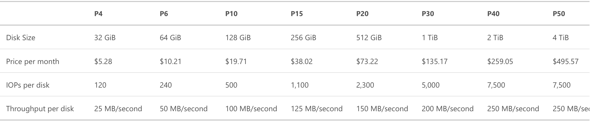
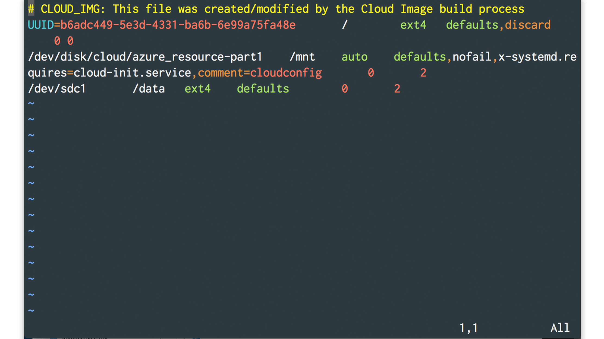
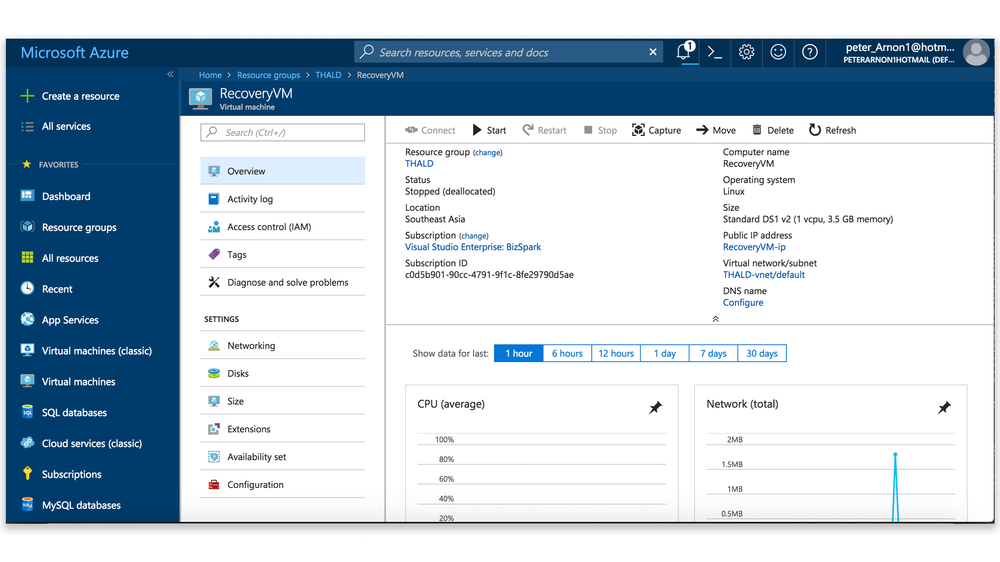

เรื่องมันมีอยู่ว่า เมื่อวานก็พึ่งตรัสรู้ (แสงวาบ ๆ ออกมา !) ว่าการที่เราสั่ง Resize VM นั่นไม่ได้เพิ่ม I/O ที่ของ Disk เลยคือเราต้องเสียตังค์เพิ่มในการที่จะเปิด Disk ลูกใหม่เพิ่มอีก โอเคได้ เมื่อวานก็จัดไปเลย 1TB โดยที่ไม่ได้ดูราคา

ตกกลางคืน นึกอะไรไม่รู้จู่ ๆ ก็เปิดดู เชี้ย !!!! โหดสาด เลยต้องลดขนาดลง (เพิ่มเติม ขนาดของ VHD มีผลต่อความเร็วของ Disk ด้วย ก็เลือกดี ๆ ละกันนะ) ซึ่งเวลาลด เราไม่สามารถที่จะสั่งลดตรง ๆ ได้ แต่ถ้าเพิ่มอะได้นะ

วิธีง่าย ๆ ในการที่จะลดคือสร้าง Disk ใหม่และเอาข้อมูลจาก Disk เก่าไปลงใน Disk ใหม่ และลบ Disk เก่าทิ้ง งงม่ะ ฮ่า ๆ เราก็งง 😕

## fstab คืออะไร?

ก่อนจะไปถึงความบรรลัย มาเข้าใจกันก่อนว่า **fstab** คืออะไร เพราะมันคือสิ่งที่ทำให้บรรลัยในครั้งนี้เกิดขึ้น

**fstab** เป็น Configuration File ตัวนึงของ Linux ที่อยู่ใน **/etc/fstab** ซึ่งมันจะถูกอ่านโดยใช้คำสั่ง **mount** ที่จะรันทุกครั้งตอน Boot เครื่อง พูดง่าย ๆ คือ มันเป็นไฟล์ที่ไว้ Config เครื่องเราว่า จะให้ Mount อะไรบ้างตอนที่เรา Boot เครื่องมา

## ปัญหามันอยู่ตรงไหน?
ก็ทำตามขั้นตอนที่บอกไปเรื่อย ๆ ละครับ แต่ปัญหามันมาเกิดหลังจากที่ผม สร้าง Disk ใหม่ และ Restore Data ลงไปแล้ว ก่อนจะ ปิดเครื่องเพื่อจะลบ Disk เก่าออก ก็เข้าไป Config **fstab** เพื่อที่จะ Mount Disk ลูกใหม่เข้าไป

ซึึ่งในการที่จะเขียน Config ลงในไฟล์ได้ เราจะต้องรู้ก่อนว่า Disk ที่เราจะ Mount มันอยู่ตรงไหน ซึ่งตอนนั้นมันจะมี Disk อยู่ 3 ลูกคือ

- OS Disk -> /dev/sda
- Disk ลูกเก่า -> /dev/sdc
- Disk ลูกใหม่ -> /dev/sdd

ดังนั้นเราจะต้องเอา **sdc** ที่เป็นลูกเก่าออก แล้วเอา **sdd** ที่เป็นลูกใหม่ใส่เข้าไปแทน หลังจากนั้น ก็สั่งปิดเครื่อง และเอา Disk ลูกเก่าออก

หลังจากนั้นก็เปิดเครื่องใหม่ เราก็รอ เออ เครื่องมันจะเปิดเมื่อไหร่ ก็รอไป รอไปสักพัก SSH เข้าไปมันก็โดน **Connection refused** ก็เอาละ ชิบหาย!! เอาไงดี !

เลยลองเข้าไปดูในเมนู Boot diagnostics ว่ามันเกิดอะไรขึ้น ปรากฏว่าพอมันอ่าน **fstab** แล้วมันหา **/dev/sdd** ไม่เจอ อ้าวเฮ้ย มันเกิดอะไรขึ้น !!!

ปรากฏ มารู้ทีหลังว่า Disk ลูกใหม่ หลังจาก Boot แล้วมันไปอยู่ **sdc** แทน บรรลัยแล้วไง แต่พอเอาปัญหานี้ไปหาดู ก็พบว่า ไม่ได้เป็นปัญหาที่ Rare เลยจริง ๆ คือ **โดนกันถ้วนหน้า** โชคดีไปที่ใน Support ของ Azure มี Solution สำหรับปัญหานี้มาให้

## วิธีแก้ปัญหา

อันนี้อ้างอิงมาจาก [Support](https://support.microsoft.com/en-hk/help/3206699/azure-linux-vm-cannot-start-because-of-fstab-errors) ของ Microsoft นะ โดยให้ทำตามขั้นตอนดังนี้
- ปิด และลบ เครื่อง VM ที่มีปัญหา (โดยหลังจากลบ ตัว OS Disk ของเครื่องที่มีปัญหามันจะไม่ถูกลบไปด้วย)
- ให้เปิด VM ใหม่ขึ้นมาตัวนึง พร้อมกับ Mount OS Disk ของเครื่องที่มีปัญหาลงไปเป็น Data Disk
- SSH เข้าไปใน VM ใหม่ และเข้าไปใน OS Disk ที่มีปัญหา เพื่อแก้ **fstab** ที่มีปัญหาออกไป
- ปิดเครื่อง VM ที่สร้างใหม่ และเปิด VM อีกเครื่องนึงโดยใช้ OS Disk ที่พึ่งแก้ไป
- ลบ VM ตัวที่สร้างมาเพื่อแก้ไฟล์ทิ้ง

ก็ดูยุ่งยากไปนิดแต่ก็ดู Straightforward ดี แต่ตอนนั้นคือ ทำด้วยความกลัวสุดใจ เพราะข้อมูลที่อยู่ในนั้นคืองาน Senior Project ถ้าหายไปนี่สนุกแน่ ต้องมานั่งเก็บข้อมูลใหม่ทั้งหมดคงไม่ตลก ก็นั่งทำแบบไม่ตลกนี่แหละ

ตอนนั่งทำในขั้นตอนแรก เราต้องลบ VM เครื่องที่มีปัญหาทิ้งไป ด้วยความที่ไม่ค่อยถนัดเรื่องอะไรพวกนี้อยู่แล้ว ทำให้ยิ่งกลัวเลย ว่าถ้าเราลบ VM ไปแล้ว Disk ที่ต่อกับ VM อยู่จะโดนไปด้วยมั้ย อะ ! ยอม ! กดป้าปปปป รอดดดดดด 😂 จุดประสงค์ที่ต้องทำแบบนี้เป็นเพราะว่า เราไม่สามารถ Detach OS Disk ที่ติดกับ VM ออกได้ ทำให้เราต้องลบ VM เพื่อบังคับให้ OS Disk มันไม่มีที่อยู่ และไป Attach กับ Service อื่นได้

ขั้นตอนต่อ ๆ ไปก็ไม่ยากละ แค่เราเอา Disk ไร้บ้านนี้ไป Mount ใส่ VM ใหม่แล้วแก้ไฟล์ให้เรียบร้อย แล้วก็เอาออก ก็เป็นอันเกือบเสร็จ

มาในขั้นตอนสุดท้ายที่เราต้องสร้าง VM อีกตัวขึ้นมาแทนตัวที่เราลบทิ้งไปในขั้นตอนที่ 1 มันก็ไม่ยากอะไร เพราะมันมีปุ่มให้กดจาก Disk ไร้บ้านได้เลย แต่เวลาสร้าง ถ้าไม่อยาก Config ทุกอย่างใหม่ก็ Assign พวก Component ที่เกี่ยวข้องเป็นอันเดิมก็เรียบร้อย จุดที่สร้างความ งง อย่างรุนแรงคือ พอสร้าง VM ใหม่ปุ๊บ SSH เข้าไปไม่ได้ !!!

ก็ลอง Reset Credential ก็ไม่รอด ทำยังไงก็ไม่รอด (ใช้เป็น Username, Password ในการ Authentication) เลยมาลองทำผ่าน Public Key ดูอ้าวรอดเฉย !!!

สรุปสุทธิเวลาทั้งหมดในการทำอยู่ที่ราว ๆ เกือบ 3 ชั่วโมง จากการที่เรา SSH เข้าไปและกด D เพื่อเข้าไปแก้ไม่ได้ ถ้าเป็นเครื่องจริงคือ ตอนที่มันเตือนขึ้นมา เราสามารถกด D เพื่อเข้าเครื่องไปแก้ได้เลย แต่นี่เป็น Cloud ไง ถ้าจะทำอะไรกับเครื่องก็ต้อง SSH เข้าไปอย่างเดียว มันเลยจบด้วยวิธีการดั่งที่เล่าไป

## เรื่องนี้สอนให้รู้ว่า....
จากความบรรลัยที่เกิดขึ้นในวันนี้ ทำให้เสียเวลาโคตรนาน และความลุ้นจนตัวโก้ง ในการแก้ปัญหานี้สอนให้รู้ว่า **อย่าขี้เกียจ** จริง ๆ ปัญหาของ sdc sdd นี่ก็เดาไว้อยู่แล้ว แต่คือขี้เกียจไง ขี้เกียจรอมัน Reboot หลาย ๆ รอบเลยลักไก่เปลี่ยนมันล่วงหน้าเลย เลยทำให้เสียเวลามากกว่าเดิมเช่นนี้ และสำหรับใครที่เจอความบรรลัยนี้อยู่ก็หวังว่าเราจะเป็นเพื่อนกันนะ ฮ่า ๆ 🔥
