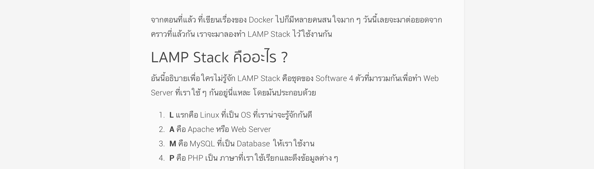
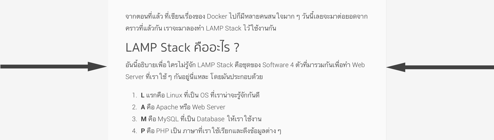
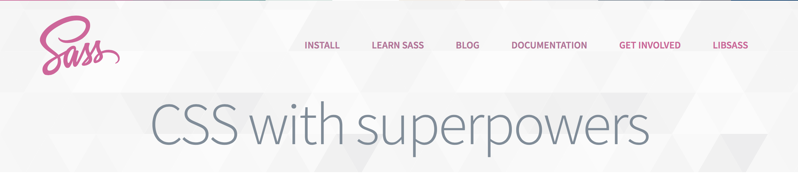
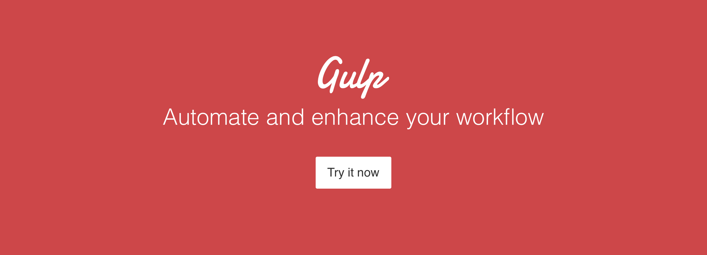
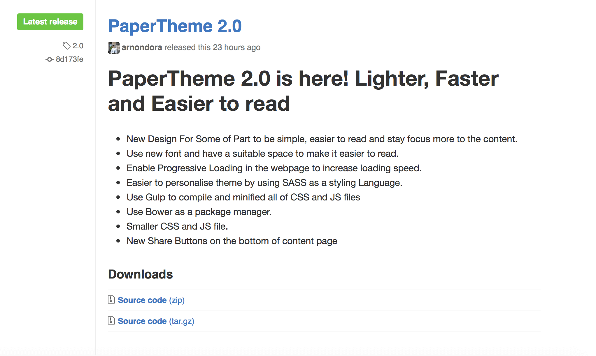

หลังจากที่เมื่อปีที่แล้ว ที่ผมเปลี่ยนหน้าเว็บใหม่หมดไฉไลกว่าเดิม ปีนี้ก็เช่นกัน เราก็ต้องทำอะไรบ้างแล้วแหละ เลยจัดซะเลย ผมใช้เวลา เสาร์ อาทิตย์ที่ผ่านมานั่งทำอยู่ ตอนนี้ก็เสร็จเรียบร้อยแล้วตอนนี้ก็อะเรียบร้อยหมดแล้ว ตามสัญญาที่โพสต์เอาไว้ในเฟส จะมาเขียนให้อ่านกันว่า มันมีอะไรใหม่ ๆ เพิ่มเข้ามาบ้าง มาดูกันเลย

## Font ใหม่อ่านง่ายกว่าเดิม

จากอันเดิมที่ใช้ Roboto ที่ไม่รองรับภาษาไทย เพราะฉะนั้นเวลาแสดงผล เครื่องก็จะเลือกเอา Font มาตราฐานมาใช้ทำให้ มันแสดงผลต่างกันในล่ะล่ะ OS อีก ซึ่งมันไม่สวยเลย ตอนนี้เราเปลี่ยนใหม่แล้ว ถ้าสังเกตจุดใหญ่ ๆ เราใช้ Sukhumwit Set ที่มาพร้อมกับ macOS แต่มันก็ติดเรื่องของ License อีก เพราะว่า Sukhmwit Set ที่มาพร้อมกับ macOS นั้นห้ามเอามาทำเป็น Font-Face ลงบนเว็บ เลยทำให้ต้องไปหาอีก Font นึงที่หน้าตาคล้าย ๆ กันนั่นคือ Thai Sans Lite ดังนั้น ถ้าใครที่ใช้ macOS เปิดเว็บมาก็จะแสดงเป็น Sukhumwit ส่วนที่เหลือก็จะเป็น Thai Sans Lite กันไปตามระเบียบ นอกจากจะเปลี่ยน Font ที่ใช้แล้ว ผมยังเพิ่มการเว้นระยะห่างของตัวหนังสือ เพื่อให้สามารถอ่านได้สบายตามากขึ้น และอีกเหตุผลนึง อันนี้เป็นผลพลอยได้คือ ภาพรวมแล้วหน้าเว็บดูสะอาดมากขึ้นมากด้วย

ถ้าสังเกตมากหน่อยจะเห็นได้ว่า ความกว้างของการแสดง Content มันดูแคบลงมากอยู่พอสมควร โดยเฉพาะคนที่ใช้หน้าจอเล็ก หรือบน Laptop ผมก็เหมือนกัน ที่ทำแบบนี้เพราะว่า ผมอยากสร้างประสบการณ์การใช้งานที่ดีกว่า โดยที่เราสามารถอ่านได้โดยที่เราไม่ต้องกวาดสายตาไปมามาก ทริกนี้จริง ๆ มีรุ่นน้องแนะนำมา เลยทำซะหน่อย ซึ่งออกมามันก็อ่านแล้วสบายตากว่าจริง ๆ ด้วย

## เปลี่ยน Design ยิบย่อย

อย่างเช่น ทางแถบ Sidebar ก็เปลี่ยนช่อง Search ใหม่ให้ดูกลืนไปกับหน้ามากขึ้น เพราะสิ่งที่เราต้องการแสดงในหน้านั่นคือ Post ล่าสุดทำให้คนที่ใช้ สนใจกับโพสต์ปัจจุบันนั่นเอง นอกจากแถบ Search แล้วยังมีเรื่องของ ส่วนที่แสดง Tag และ Catagories ด้านล่างด้วย  ที่เปลี่ยนเพราะว่า อยากให้มันกลืนไปกับหน้ามากขึ้น เฉย ๆ ไม่มีอะไรเลยอันนี้ 5555

## Share to Social Media Easier than before!

อ่าาาา เดี๋ยวนี้ เรามีปุ่มแชร์ไปยัง Social Media แล้วด้วยนะ จริง ๆ จะทำออกมาตั้งแต่ปีที่แล้ว แต่ติดว่า ตอนนั้นไปอ่าน Document แล้วมันดูยากจังเลยไม่ทำ (เอิ่ม...) แต่ด้วยเมื่อสักวันพุธที่แล้วไปเจอเว็บนึงคือ ทำง่ายมาก ๆ คือตัว Social Media เขาจะมีลิงค์มาให้ แล้วให้เราเอาลิงค์เราไปวางต่อ มันก็จะเป็นการแชร์ไปยังหน้านั้นได้เลย ซึ่งเวลา Implement เราก็ใช้แค่ลิงค์ธรรมดาก็ได้แล้ว เลยทำซะเลย
สิ่งอีกสิ่งหนึ่งที่ ถ้าใครสังเกต นั่นคือ **"ทำไมปุ่มมันต้องวางด้านขวาล่างด้วย ?"** มันมีเหตุผลของมันอยู่ อันนี้เกิดจากการสังเกตจากการไปอ่านเว็บต่าง ๆ ของตัวผมเอง และเพื่อน ๆ ว่า เวลาเราอ่านทุกอย่างเลย เราจะอ่านจาก ซ้ายไปขวา เสมอ ดังนั้น ถ้าเอาเอาปุ่มไว้ด้านซ้าย แน่นอนว่า คนอ่านก็ต้องเห็นแน่ ๆ แต่ถามว่า มันควรให้เห็นตอนนั้นมั้ย คำตอบคือ ไม่ เพราะว่า เขายังอ่านไม่จบเลย แต่ถ้าเราวางมันไว้ด้านขวา ก็เหมือนกับเราอ่านจบ แล้วเหลือบตาไปมอง ก็น่าจะทำให้มีโอกาสกดมากกว่านั่นเอง (เดาเอาล้วน ๆ ไม่ต้องหาสาระจากผมเลย ไม่มี อิอิ)

## Lighter and Faster
จากเมื่อปีที่แล้วที่ได้กล่าวไปว่า Theme ตัวนี้พยายามทำให้มันเบาและ Render ได้เร็วที่สุด ปีนี้ก็แน่นอนว่า เราต้องคำนึงถึงเรื่องพวกนี้ด้วยเช่นกัน ภาพด้านล่างคือ ของเก่าที่ใช้เวลาโหลด 4.39 วินาที และต้องโหลด 467 kb ใน 1 หน้า

มาที่ของใหม่ใช้เวลาอยู่ที่ 3.12 วินาที กับ 333 kb เท่านั้น ในหน้าเดียวกัน และในการทดสอบ ผมใช้เน็ตจากที่เดียวกัน นั่นคือ **เน็ตหอ** ที่เต่าเรียกลุงนี่เอง

สาเหตุที่ทำให้มันโหลดเร็วขึ้นเพราะว่า ผมพยายามจัดความสำคัญของ Class และการจัด Style ต่าง ๆ ใน CSS ทำให้มันสามารถวิ่งเข้าไปหา Class นั้น ๆ ได้เร็วขึ้นนิดหน่อย Style อันไหนที่อยู่รวม ๆ กันได้ ก็จับมาเป็น Class เดียวกันอะไรแบบนี้ จะได้ลดขนาดลงไปด้วย ส่วนสาเหตุที่เล็กลงนั้น เดี๋ยวจะมาอธิบายในหัวข้อถัด ๆ ไป

## ใช้ SASS ในการทำ CSS แล้วล่ะ

เมื่อก่อน ผมก็เขียน Stylesheet โดยใช้ CSS ธรรมดานี่แหละ จนกระทั่งเมื่อไม่นานมานี้ผมก็กลับมานั่งเรียน Laravel อีกครั้ง เลยทำให้ได้เจอกับ SASS อีกครั้ง เลยยอมกลับมาใช้ก็ได้ ดีเหมือนกัน งานจะได้เร็วขึ้น กับงานนี้ ทำให้เราสามารถจัดการสีได้ง่ายขึ้นมาก (สำหรับคนที่เอาไปแก้อะนะ) เพราะผมประกาศเป็นตัวแปรไว้ให้หมด แก้ทีเดียว ก็จบตรงนั้นเลย สบายมาก ๆ

## ใช้ Gulp แพคไฟล์ทุกอย่างรวมกัน

และนี่คือเหตุผลว่า ทำไมขนาดของเว็บที่โหลดมันถึงเล็กลง เพราะว่า เราใช้ Plugin ตัวนึงของ Gulp ช่วยเรารวมไฟล์ Dependencies ทั้งหมด และ Minify ให้อัตโนมัติ แค่เราเซฟไฟล์ มันก็จัดการให้เราเองเลย สะดวกมาก ๆ สำหรับคนที่ Clone มาทำต่อก็สามารถใช้ได้เหมือนกัน เพราะผมเอา `gulpfile` ไว้ให้ด้วย ไม่ต้อง config อะไร เรียก gulp watch แล้วก็เซฟไฟล์ มันก็จะจัดการให้เรียบร้อยเลย ถ้าเป็นเมื่อก่อน ผมต้องก๊อป CSS ของ Bootstrap มาวาง ก๊อปของตัวเองมาวางเซฟ แล้วก็ใช้ YUI สั่ง Minify ลำบากมาก ๆ ตอนนี้ง่ายมาก ๆ สบาย และเล็กลงอีกด้วย

## เริ่มใช้ npm และ bower เป็น Package Manager

ตอนเวอร์ชั่นก่อนหน้านี้ วิธีการลง Bootstrap ผมใช้แค่โหลดแล้วก๊อปแปะลงใน Project เลย ทำให้มันไม่ค่อยเป็นระเบียบ และทำการอัพเดท Dependencies ได้ยาก ตอนนี้ผมเปลี่ยนมาใช้ Bower ซึ่งเป็น Package Manager มาจัดการให้ ดังนั้น Dependencies ทั้งหมดจะอยู่ใน Folder `bower\_components` ทั้งหมด และสามารถทำการอัพเดทผ่าน Command Line ได้เลย

ส่วน npm ผมเอามาใช้กับ Gulp เลยเพราะมันต้องใช้ ไม่มีอะไรเลยจริง ๆ 5555

## พึ่งรู้จักคำว่า "Progressive Loading"
ถ้าใครที่ตาไว ๆ หน่อยจะเห็นว่าตอนโหลดหน้า ตอนแรกมันจะเป็น Font อันเดิมนี่แหละ แล้วจู่ ๆ มันก็เปลี่ยนเป็น Font อีกตัวนึง ที่เป็นแบบนี้เพราะผมใช้เทคนิคที่เรียกว่า Progressive Loading เป้าหมายก็คือ การทำให้หน้าเว็บเรา **ดูเหมือน** โหลดเร็วกว่าเดิม แต่จริง ๆ แล้วก็เท่าเดิมแหละ แค่เราทำให้ User เห็น Content ได้เร็วขึ้น
วิธีที่ผมใช้ ถ้าใครอ่านใน Code ผมทำการแยก CSS File ออกมาเป็น 2 ไฟล์คือ

* Style หลักที่มีเรื่องของสี และการจัดหน้าต่าง ๆ
* Font ที่จะมี Style ของการจัดเรียง Font และสีต่าง ๆ ของ Font อยู่รวมกัน
เวลาโหลดจริงมันก็จะโหลดการจัดวางหน้า พวกกล่องอะไรต่าง ๆ ลงมา แล้วแสดงผล สุดท้ายจึงโหลดตัว Font Stylesheet มาแล้วค่อยเอามาใช้กับหน้าอีกครั้งนึง ทำให้เราสามารถ **หลอก** ตาได้ว่า หน้าเราโหลดเร็วขึ้น (จริง ๆ มันโหลดและ Render เร็วขึ้นจริง ๆ นะ)

## It's just the beginning

เขียนเหมือนของปีที่แล้วเลย ปีที่แล้วบอกว่า มันยังไม่ค่อยสมบูรณ์เท่าไหร่ ก็ต้องพัฒนากันไป แต่รอบนี้สิ่งที่จะบอกคือ ผม Release มันออกมาเป็นเวอร์ชั่น 2.0 ใน [Github ผมรอเสียงตอบรับอยู่นะครับ ส่วน Development Cycle ของรอบปีนี้จะเป็น Minor Change ทั้งหมด และจะ Major Change ในช่วงมิถุนายนปีหน้า หรือไม่ก็ออก Theme ใหม่เลย (แต่ [Theme เก่า][11]ยัง Support ให้อยู่นะเออ) สำหรับวันนี้ สวัสดีครับ !!

[11]: https://github.com/arnondora/wordpress-paper-theme
