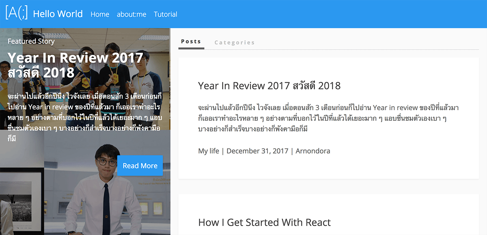
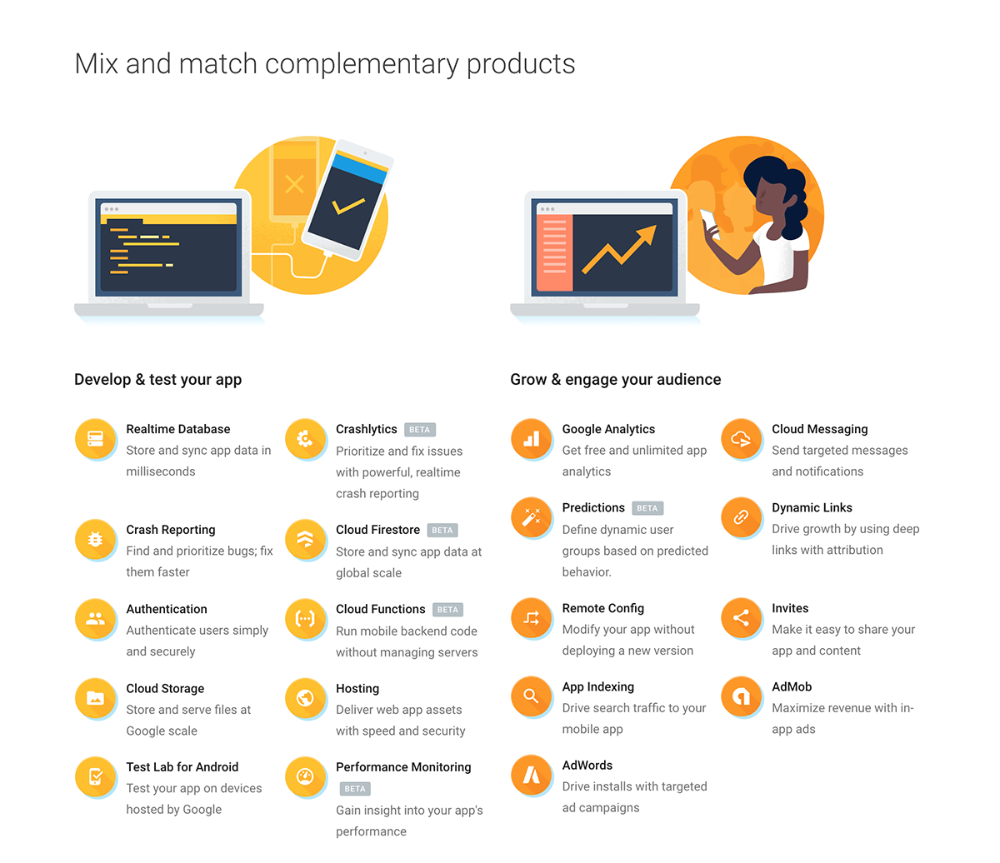
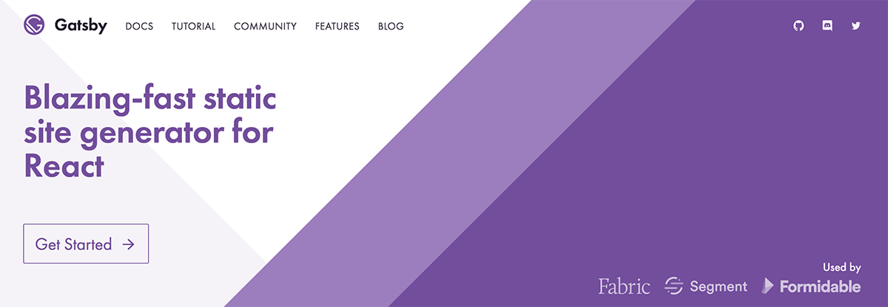

เข้ามาในหน้าเว็บในตอนนี้น่าจะสังเกตความเปลี่ยนแปลงไปจนนึกว่าคนละเว็บ เพราะเราเปลี่ยนหน้าเว็บใหม่แล้วเย้ ~~~ ถ้าใครที่อ่านมานานก็น่าจะรู้ว่า ผมจะเปลี่ยนหน้าเว็บแบบ Major Update เป็นประจำทุกปีเพื่อเป็นการกระตุ้นให้ตัวเองได้เรียนรู้อะไรใหม่ ๆ เรื่อย ๆ รอบนี้ก็เป็นการเปลี่ยนแปลงในแบบที่ว่า **ยกเครื่อง** ที่แท้ทรูสุด ไปดูกันว่ามีอะไรเปลี่ยนไปบ้าง

## Brand New Design

อย่างที่ได้ทุกคนเห็นว่า Design ของหน้าเว็บถูกเปลี่ยนใหม่ทั้งหมด แต่ก็ยังคงสีเดิมอยู่ เพราะแน่นอนว่าผมชอบ **สีฟ้า** ฉะนั้นเว็บนี้ก็จะเป็นสีนี้ไปเรื่อย ๆ เอาให้เบื่อกันไปเลย​ ฮ่า ๆ โดยที่ Design ในครั้งนี้ผมเน้นไปที่การสร้างประสบการณ์เข้าถึง และอ่านบทความที่ดีขึ้น ทั้งหมดเกิดจากการเข้าไปนั่งดูการเข้าใช้เว็บจาก Google Analytics ที่ทำให้ผมเห็นอะไรที่น่าสนใจจากผู้อ่านเยอะมาก ๆ เรื่องเต็ม ๆ ไว้จะเอามาเล่าในอีกบทความเช่นเดิม ติดตามอ่านกันนะฮ่ะ

## Firebase 🔥 as a backend

เมื่อปีก่อน Credit ใน Digital Ocean ก็หมดลงหลังจากใช้มานานแรมปี หลังจากนั้นก็ได้เปลี่ยนไปใช้ Hosting ในไทย ซึ่งผลที่ได้คือ ความเร็วที่ต่างกันราวฟ้ากับเหว และล่มกันทุกวัน วันละอย่างน้อย 1 ครั้ง (ก็นะ เว็บนี้เราไม่ได้เงินอะไรเลย จะเอามาซื้อ Hosting แพง ๆ ก็ยังไงอยู่) ก็น่าจะทำให้ผู้อ่านออกจะหงุดหงิดหน่อย ๆ ประกอบกับช่วงนี้ใช้ Firebase ในการลงงานจริงเยอะมาก เลยอยากจะเอามาใช้สักหน่อย เริ่มเปิดประเดิมโดยการใช้ **Firebase Hosting** ก่อน ที่เป็น **Static Web Hosting** พูดง่าย ๆ คือเป็น Web Hosting ที่ทำได้แค่ Serve ไฟล์ออกไป ไม่ได้มีการประมวลผลอะไร แต่จุดที่มันเจ๋งคือมัน Deploy ได้ง่าย และ Content ทั้งหมดยังถูก Cache บน Global CDN ของ Google ทำให้เรามั่นใจได้ว่าเว็บเราจะไม่ล่ม และทุกคนสามารถเข้าถึงได้ด้วยความรวดเร็วนั่นเอง

แต่จริง ๆ แล้ว Firebase มีอีกหลาย Service ให้เราใช้เช่น Realtime Database หรือจะเป็น Cloud Function ณ ในวันที่เรียนตอนนี้ผมหยิบแค่ Firebase Hosting ออกมาใช้ก่อน ในช่วงปีนี้ผมจะทำการอัพเดทหลาย ๆ ฟีเจอร์ขึ้นมาโดยการใช้ Service ที่เหลือของ Firebase นี่ละ ฉะนั้นเว็บนี้จะยืนหยัดด้วย Firebase เท่านั้นเลย

## Static Site Generator using Gatsby

โจทย์ในการออกแบบตัวระบบเว็บครั้งนี้ผมพุ่งเป้าไปที่เรื่องของ **Performance** เป็นหลัก เพราะเว็บเก่ากว่าจะเปิดขึ้นนี่เตาคลานยังไวกว่าเลย 🐢 เท่าที่ลองดูมันเป็นเพราะ Hosting ที่ใช้ตอนนั้นมันเป็น Shared Hosting ทำให้ Resource ต่าง ๆ ก็ต้องแบ่งกันใช้ ประกอบกับ Wordpress มันใช้ง่ายจริง แต่มันก็แลกมากับพื้นที่ และความเร็วในการโหลดที่ช้าหน่อย (ถ้า Optimise ดี ๆ กับ Hosting ดี ๆ นี่โคตรเร็วเลยละ)

ประกอบกับปีนี้ได้ไปฝึกงานแล้วได้ทำ **React** มา ([ลองอ่านได้ตรงนี้][1]) ก็ทำให้ปีนี้อยากได้เว็บที่ทำด้วย React เพราะตอนนั้นก็กำลังชินกับการเขียน React พอดี ถ้าได้ใช้ก็คงไม่เลว แต่โจทย์อีกข้อคือ SEO Friendly เพราะเว็บนี้คนที่เข้ามาส่วนใหญ่เข้าผ่านการ Search ใน Google ทั้งนั้นเลย ซึ่ง React มันทำให้ทุกอย่าง Render ในฝั่ง Client ทั้งหมดทำให้ Search Engine อย่าง Google เข้ามาวิ่งเล่นในเว็บไม่ได้ จึงต้องหาวิธีต่อไป

เทคนิคนึงที่ได้ใช้ตอนฝึกงานคือ **Server-Side Rendering** (ขอย่อเป็น SEO นะ) ที่ทำให้ React ของเรา Render หน้าทั้งหมดในฝั่ง Server ทั้งหมดเลย ทำให้มัน SEO Friendly มาก ๆ แต่ปัญหาต่อไป การจะใช้ SEO เราก็ต้องมี Web Server ที่ใช้งาน **Node.js** คำถามคือ

> แล้วตรูจะหาจากไหน ???

ไม่นับ Cloud นะที่มันมีพวกนี้อยู่แล้วเยอะแยะ แต่ไม่เอาเพราะมันแพงเกินไปไม่ไหว กับไม่มี Shared Hosting ตัวไหนในไทยเลยที่ใช้ Node.js ได้ ฉะนั้น SEO กับ React ก็เลยตัดไป จนได้ไปคุยกับน้องภูมิเรื่องนี้ ก็แนะนำ **Gatsby** ที่เป็น **Static Site Generator** มา

ข้อดีของ Static Site คือ เร็ววัวตายควายล้ม 🐄🐃☠️ เร็วสายฟ้าฟาด ⚡️ (อย่างน้อยก็เร็วกว่าเว็บเก่าเกิน 3 เท่าได้) และ SEO Friendly โคตร ๆ ✅ เพราะหน้าทั้งหมดถูก Render ไว้แล้วโดยผมเองผ่านการ Build ในเครื่องตัวเอง ทำให้เวลาคนเข้ามาก็แค่โหลดไฟล์ที่พร้อม Render ลงมา Render ได้เลย ไม่ต้องมี Logic อะไรทำให้เสียเวลาเลย ประกอบกับ Gatsby ใช้ React ในการเขียน ทำให้ผมเองที่เขียน React อยู่แล้วปรับตัวได้อย่างง่ายดาย (ถึงตอนแรกมันจะ งง ก็เถอะนะ) สามารถใช้ Library ที่คุ้นเคยอย่าง Styled-Components และอื่น ๆ ได้เลยโดยที่ไม่ต้อง Config อะไร นอกจากนั้นยังนำมาใช้กับ Firebase Hosting ที่เป็น **Static Web Hosting** ได้แบบตรง ๆ เลยทีเดียว ตอนนี้ขอขายของก่อนฮ่า ๆ เดี๋ยวไปเล่าความบรรลัยกับเจ้า Gatsby ต่อในบทความต่อ ๆ ไป

## More Features will be come out soon! 🧐
ณ ตอนี่เขียนตอนนี้ก็ยังไม่ได้มี Feature อะไรมากมาย เพราะเราไม่ได้ใช้ของสำเร็จรูปอย่าง Wordpress อีกแล้ว ตอนนี้ก็นะครับ เขียนมือล้วน ๆ ก็อีกหลาย ๆ Feature จะตามมาเรื่อย ๆ เช่น Search ที่เดาว่าหลาย ๆ คนน่าจะได้ใช้ และ Suggested Article ที่ใช้ [Collaborative Filtering][2] ที่เป็น Algorithm เดียวกับที่ Spotify ใช้ในการแนะนำเพลงให้กับ User ผมก็จะหยิบมาใช้กับเว็บนี้แหละ 🤫 และ Feature อื่น ๆ อีกมากมายจะตามมาเรื่อย ๆ เมื่อผมว่าง ฮ่า ๆ สำหรับใครที่ต้องการเล่น Feature ใหม่ ๆ เพราะผมจะพยายาม Release Version ใหม่ในทุกสัปดาห์ ตอนนี้เรามี Staging Site แล้วที่ [staging.arnondora.in.th][3] ถ้ามี Bug หรือ Suggestion ก็แจ้งผ่านอีเมล์ [peter.arnon@gmail.com][4] ได้เลยนะครับ

บทความที่จะมาเล่าเบื้องหลังในการออกแบบต่าง ๆ จะออกมาเร็ว ๆ นี้นะแจ๊ะรออ่านได้เลย 🙏🏻 และที่สำคัญมากนั่นคือทิศทางในการเขียนบทความของปีนี้คือ **อยากเขียนอะไรก็เขียน** เฮ้ยนี่จริง ๆ และปีนี้ผมก็ปี 4 แล้วก็มี Senior Project และเรื่องของการเรียนต่อ แต่ก็จะพยายามปล่อยสัปดาห์ละ 1-2 บทความ ทำให้เป็นเวลามากขึ้น สัญญาลูกเสือ 2 นิ้ว 🤞 ถ้าอยากให้เขียนเรื่องอะไร ก็ลองเมล์มาได้เลยฮ่ะ จะเขียนเลย (ถ้ามีเวลาอะนะ !)

[1]: https://www.arnondora.in.th/likeme-internship
[2]: https://en.wikipedia.org/wiki/Collaborative_filtering
[3]: https://staging.arnondora.in.th/
[4]: mailto:peter.arnon@gmail.com
