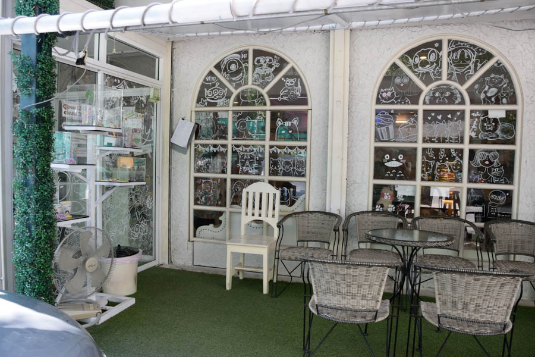
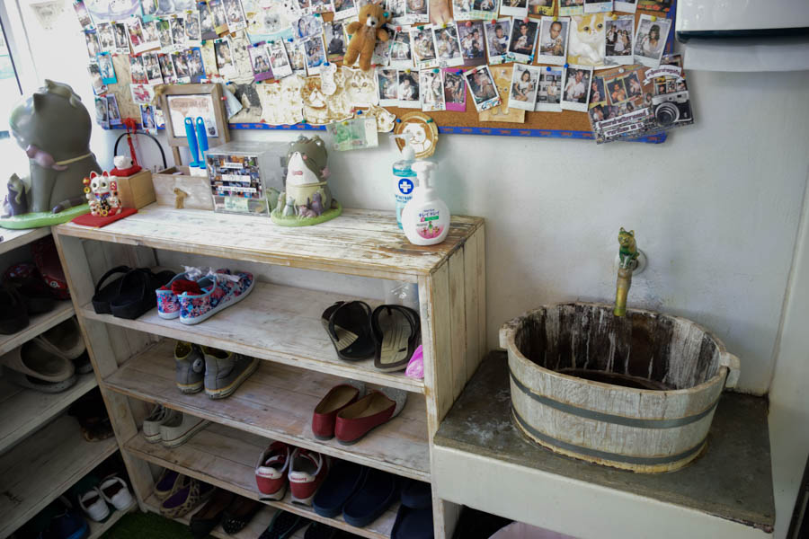
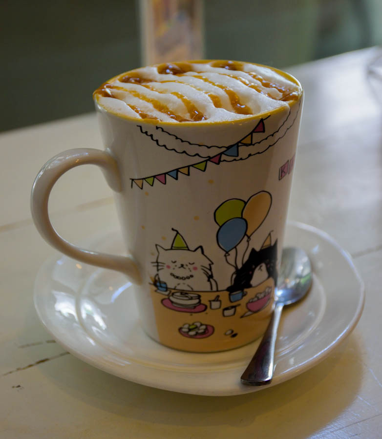
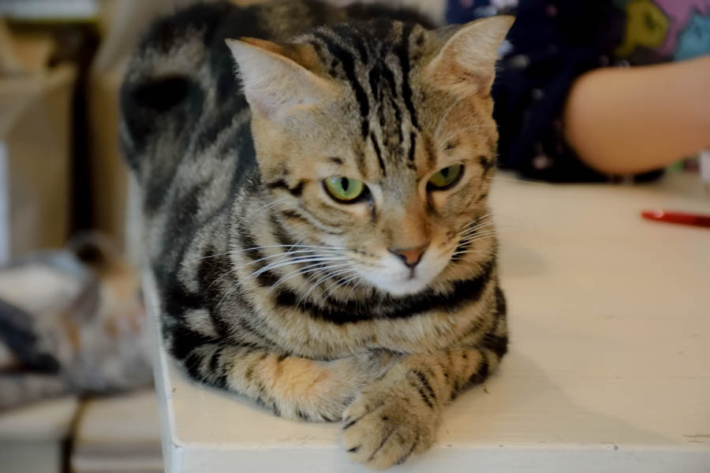

ทุก ๆ วันนี้ในกรุงเทพเมืองหลวงของเราก็มี คาเฟ่แมว พุดขึ้นมามากมายเพื่อตอบสนองทาสแมวทั้งหลาย ที่ชอบแมว แต่ไม่สามารถเลี้ยงแมวได้ หรือไม่มีเวลา คาเฟ่แมวจึงเป็นสถานที่ ที่ทำให้เราผ่อนคลายโดยการมาเล่นกับแมวได้

คาเฟ่แมวที่ผมไปมานั่นคือ Caturday Cat Cafe ร้านจะอยู่ในโครงการ Co Co Walk ติด BTS ราชเทวี วิธีเดินทาง เราก็แค่ขึ้น BTS ไปลงสถานีราชเทวี แล้วเดินออกทาง ทางออกที่ 2 ร้านจะอยู่บริเวณ ในสุดของโครงการเลย ถ้าเข้าไป เดินออกด้านขวาสุด ซอยสุดท้ายของโครงการ แล้วเดินเข้าไปในสุดเลย เราก็จะเจอร้านตั้งอยู่ มีรูปปั้นแมวอยู่หน้าร้านด้วย

แต่ก่อนจะเข้าไปในร้าน เราก็ต้อง ถอดรองเท้า และล้างมือก่อน เพื่อความสะอาด ทางร้านจะมีที่วางรองเท้า และอ่างล้างมือ ที่เด็ดคือ ก๊อกรูปแมวด้วย ชอบ ๆ

หลังจากล้างมือ เราก็ได้ฤกษ์แล้วครับ เข้าไปในร้านกันเลย ร้านก็ตกแต่งสบาย ๆ  เปิดเพลงที่เป็นภาษาญี่ปุ่น ที่นั่งที่ร้านจะค่อนข้างเล็กหน่อย มีประมาณ 7-10 โต๊ะเท่านั้นเอง แล้วก็จะมีโต๊ะนั่งพื้นก็ได้ นั่งโต๊ะก็ได้ เนื่องด้วยผมไปในวันธรรมดา คนเลยน้อยดีเหมือนกัน เลยนั่งพื้นล่ะกัน เพราะแมวจะได้เดินมาเล่นกับเราง่าย แต่ตอนบ่าย แมวนิยมหลับได้หลับดีเลยจริง ๆ เลยแอบเซ็งนิดหน่อย

[DSC_0035](./DSC_0035.jpg)]

ข้างหน้าก็จะเป็นที่จ่ายเงิน และ ขายของที่ระทึกด้วยนะ ราคาก็นั่นเลยครับ น่ากลัวมาก เลยไม่ได้จัดมา บนพนังก็มีรูปแมวอยู่ด้วย

สำหรับคนที่ไม่เคยไปคาเฟ่แมวนะครับ คาเฟ่แมวก็เหมือนร้านกาแฟปกติเลย แต่แค่ทางร้านจะมีแมวให้เราได้เล่น จับอะไรได้นิดหน่อย แต่ที่นี่เขามีกฏนะครับ ว่าห้ามอุ้มแมวเด็ดขาด แต่ถ้าเราเสียเงินเพิ่มอีก 89 บาท (มั้งจำไม่ได้) ทางร้านจะให้เราอุ้มแมวและจะถ่ายรูปด้วยกล้องโพลารอยด์ให้เรา 1 รูปเลย ซึ่งผมก็ไม่ได้ถ่ายแบบนั้น เสียจุยมาก ๆ ส่วนเมนูในร้านก็เหมือนร้านกาแฟทั่ว ๆ ไปเลย แต่ราคานั้นก็หลักร้อยต่ออย่าง แต่ก็คุ้มค่าดี รอบนี้ผมลืมถ่ายเมนูมาให้ดู เอาเป็นว่าหลักร้อยเกือบหมดล่ะกัน ส่วนที่ผมสั่งมาวันนี้ก็เป็น กาแฟคาราเมล สักอย่างนึง จำไม่ได้ lol ติดแมวอยู่ ส่วนแก้วก็น่ารักมาก ๆ เลยล่ะ มันมีขายในร้านด้วยล่ะ แต่ราคามันไม่ไหวและ เลยไม่เอาล่ะกัน แง่ง ๆๆ

เมื่อได้กาแฟ จิบหน่อย ๆ เริ่มหายร้อนและ มาเริ่มเล่นกับแมวกันเลยทีกว่า ทางร้านจะมีของเล่นให้เล่นกับแมวด้วยนะ จะวางอยู่ในตะกร้า ซึ่งในนั้นก็จะมี หนูของเล่น หูแมวอะไรแบบนี้อยู่ด้วยล่ะ เราสามารถที่จะไปหยิบเพื่อมาเล่นกับแมวได้

]

เนื่องจากผมเป็นทาสแมวสุด ๆ เลย เอากล้องไปกดเฉพาะแมวไปเกือบ 200 รูป ทุกอิริยาบทของมันจริง ๆ จริง ๆ ก็เสียใจ ไปผิดเวลามาก ๆ เลย เพราะแมวมันนอนเกือบหมดเลย เซ็งมาก ๆ

จริง ๆ แล้วมันจะมีชื่อแมวอยู่ที่เมนู แต่ตอนนั้นสั่งกาแฟอยู่เลยไม่ได้ดูชื่อแมว จำไม่ได้เลย....

ถ่าย ๆ อยู่เงยหน้าขึ้นมา เจอแมวขาวอ้วนจ้องหน้าอยู่ สะพรึ่งเลยทีเดียว น่าร้ากกกกกก

ช่วงบ่ายแบบนี้มันก็ง่วงแบบนี้แหละครับ...

## สรุปเลยนะครับว่าเป็นอีกสถานที่นึงที่ทาสแมวอย่างเรา ไม่ควรพลาด เลยครับ

อาหารและเครื่องดื่มก็ดีนะครับ อยู่ในราคาที่พอรับได้ ถึงมันจะแพงแต่มันก็สมกับราคาของมันมากเลย เดินทางสะดวกแค่ลงทางออก 2 BTS ราชเทวี ติดอย่างเดียว ร้านแคบไปหน่อย ไปบางทีอาจจะต้องรอ แต่ก็เป็นอีกร้านนึงที่เข้าไปแล้ว ไม่อยากออกเลย บางทีจะออกก็มีแมวมาอ้อน ออกไม่ลงเลย !!! อยากไปอีก
