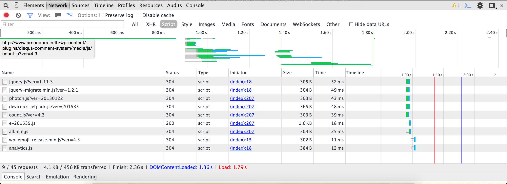
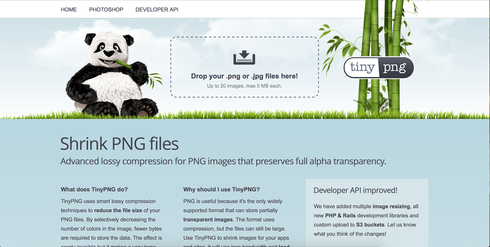

ตอนนี้หลายๆ เว็บรวมทั้งเว็บผมด้วย กำลังมีปัญหาอันนึงที่ใหญ่มากๆ อันเนื่องมาจาก **"เว็บมันใหญ่มาก!!!"** คือเราพยายามจะ Optimize แล้ว ขนาดมันก็ยังใหญ่โตอลังการอยู่ เลยเข้าไปลองหาดูว่า การที่เว็บเราขนาดมันใหญ่เนี่ยมันเกิดจากอะไร ลองมาดูกันเลยดีกว่า

ก่อนอื่นผมก็ลองเปิด Dev Tool ของ Google Chrome ขึ้นมาเพราะอยากรู้ว่า หน้าแรกของเรามันขนาดเท่าไหร่นะ ผลที่ได้คือถึงกับผง่ะเลยทีเดียว เพราะว่ากินไป 456 kb ในหน้าเดียว!

ถ้าเรามาดูที่ตัวโค๊ตของเว็บก็จะเห็นว่า ขนาดมันเล็กมากแค่ 4.1 kb หรือคิดเป็น 0.89% เท่านั้นเอง เพราะโค๊ตทั้งหมดได้ผ่านการ Minify ให้มันเล็กลงไปแล้ว เพราะฉะนั้นตรงนี้ไม่น่าจะใช่ปัญหาที่เราหาอยู่

มาดูที่รูปภาพกันบ้าง อันนี้แหละของจริง จากที่เราเห็น แค่รูปภาพอย่างเดียวมันกินไป 438 kb หรือคิดเป็น 96.05% เลยทีเดียว ซึ่งมันเยอะมากๆ เพราะฉะนั้นถ้าการใช้รูปในเว็บจะต้องคิดดีนึดนิง เพราะว่าขนาดมันค่อนข้างเยอะ แต่วันนี้เราจะมาดูกันว่า ทำยังไงถึงขนาดรูปจะไม่อลังการงานสร้างมากนัก

## สกุลไฟล์ก็สำคัญนะ
สกุลไฟล์ของรูปภาพที่เราใช้ในเว็บส่วนใหญ่ตอนนี้ก็คงหนีไม่พ้น .jpg และ .png แน่นอน ก่อนอื่น เราลองมาดูคุณสมบัติของมันกันก่อน ว่ามันต่างกันตรงไหนยังไง

## ไฟล์ .png

* สามารถทำพื้นหลังใสได้ (Alpha)
* ถ้าสีน้อยไฟล์จะขนาดเล็กสบายเว็บมาก แต่ในทางกลับกันถ้าสีเยอะไฟล์จะหนักแบบหนักสุดๆ ไปเลย
* ไฟล์พวกนี้เหมาะสำหรับเอามาทำพวก Art ต่างๆ ที่สีไม่ได้เยอะมาก และขนาดก็ไม่ได้ใหญ่มากเช่นกัน

## ไฟล์ .jpg

* ทำพื้นหลังใสไม่ได้ ทึบอย่างเดียวเลย
* เก็บสีได้ถึง 16 ล้านสี ซึ่งเยอะกว่า .png
* เหมาะสำหรับรูปที่มีสีเยอะๆ เช่นรูปถ่ายเป็นต้น

## แล้วจะเลือก PNG หรือ JPG ดี ?
อันนี้มันก็แล้วแต่ภาพเลย เพราะจากที่ผมใช้มาในเว็บนี้ จะเห็นว่าพวกที่เป็น Thumbnail ผมจะเลือกใช้เป็น .png เพราะว่าส่วนใหญ่จะเป็นไฟล์รูปที่มีสีน้อยมากๆ แค่ 2 สีเท่านั้นเอง แต่ในทางกลับกัน ถ้าเป็นรูปที่มีสีเยอะๆ หรือพวกรูปภาพเลยผมจะเลือกใช้เป็น .jpg ดีกว่า เพราะมันเบากว่ากันเยอะเลย ลองดูจากตัวอย่างนี้เลย ผมลอง Save Thumbnail จากไฟล์ .psd ออกมาเป็น .jpg และ .png มาเทียบกันว่า ใครขนาดใหญ่กว่ากันดู

อย่างที่ได้บอกไปว่า Thumbnail ก็ไม่มีอะไรเลย สีก็น้อยเพราะฉะนั้นการที่เราเลือกเป็น .png ก็เป็นทางเลือกที่ดีเลยให้การเอามาใช้ เพราะขนาดมันเล็กมากต่างกัน เกือบๆ เท่าตัวเลยทีเดียว เอาจริงๆ ถึงแม้ว่ามันจะไม่เยอะมาก แต่ User หลายๆ คนโหลดก็ทำให้เราเสีย Bandwidth เยอะอยู่เหมือนกัน และกลับกัน Performance ทางฝั่ง User ก็แย่ลงเหมือนกัน เพราะฉะนั้นการ เลือกสกุลไฟล์ให้เหมาะก็เป็นเรื่องที่เราน่าจะทำอยู่เหมือนกัน

## ลองใช้เครื่องมือบีบอัดภาพดูสิ !

เครื่องมือที่ใช้ในการบีบอัดภาพมีเยอะแยะเลย แต่ที่จะเอามาเสนอในวันนี้คือ [TinyPNG][4] มันเป็นเว็บที่เราสามารถที่จะอัพไฟล์รูป PNG เข้าไปและมันจะย่อขนาดให้เราและ ให้เราดาวน์โหลดกลับมาได้ สะดวกมากๆ เลยล่ะ[][3]

เราสามารถอัพเข้าไปได้ทีล่ะ 20 ไฟล์เท่านั้นแน่นอนว่า มันก็มีเวอร์ชั่นเสียตังอีกด้วยเหมือนกัน แต่เป็น Plugin ของ Photoshop ในราคา 50 USD เท่านั้นหรือคิดเป็นเงินไทยก็ประมาณ 1,7xx บาทเท่านั้นเอง ถ้าคุณโทรมาใน 10 นาทีนี้ คุณจะได้รับเงินคืน xxx บาท เฮ้ยไม่ใช่และ!!

## สรุ
เรามีวิธีเยอะแยะมากในการที่จะย่อขนาดไฟล์รูปในเว็บของเรา วิธีที่มานำเสนอในวันนี้เป็นการ **เลือกสกุลไฟล์ให้ถูก ถ้าไฟล์เรามีสีเยอะก็ให้เลือก .jpg ไปเลย แต่ถ้าภาพนั้นสีไม่เยอะ ก็แนะนำให้ใช้ .png** ดีกว่า นอกจากนั้นก็ยังมีเครื่องมือที่เราสามารถ ย่อภาพได้โดยใช้เครื่องมือต่างๆ ไม่สิโดยใช้เว็บ [TinyPNG][6] ดีกว่า พูดอยู่แค่เว็บเดียวเอง (ไม่ได้ค่าโฆษณาอะไรเลยนะ!! จริงๆ) วิธีแค่นี้ก็น่าจะทำให้ขนาดรูปภาพในเว็บลดลงไปเยอะอยู่เหมือนกัน (ว่าจะทำอยู่ตั้งนานและ ไม่ได้ย่อสักที)
ถ้าหากใครมีวิธีดีๆ อย่างอื่นก็ลองมาคอมเม้นที่ด้านล่างกันได้เลย !
Reference : [Smaller PNG File - Google Developer][7]

[6]: http://tinypng.com
[7]: https://www.youtube.com/watch?v=2TUvmlGoDrw
