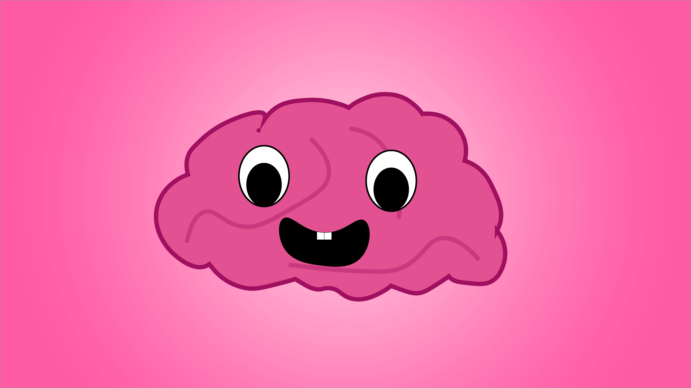

ผมเชื่อว่า หลาย ๆ คนที่กำลังหัดเขียน Code อาจจะคุ้นเคยกับการเขียน Code ในแบบที่ตัวเองชอบ หรือคุ้นเคย แต่ Programming ในชีวิตจริง นั่นต่างไปจากที่เราหัดอยู่ตอนนี้มาก ๆ เราอาจจะสงสัยว่าคำว่า **Good Code** ที่เขาพูดกันมันเป็นยังไง เพราะเราไม่ได้อยู่คนเดียวบนโลกใบนี้ Programming ก็เช่นกัน การที่เราจะสร้างโปรแกรมที่เราเห็น และใช้งานกันอยู่ในปัจจุบัน ส่วนใหญ่นั้นไม่ได้ถูกเขียนขึ้นมาด้วยคนคนเดียว แต่ต้องอาศัย Programmer นับร้อย หรือนับพันชีวิต เพื่อสร้างสรรค์โปรแกรมขึ้นมาเลยก็มี

> Programming จะมีอะไรมากละ !! มันก็แค่ Algorithm กับ Code

แต่เรายังหลงลืมไปว่า **Programming ก็เป็นศิลปะชนิดหนึ่ง** เหมือนกับการถ่ายภาพและการทำกับข้าวเหมือนกัน มันก็มีทั้งส่วนที่เป็นหลักการ และส่วนที่เป็นศิลปะ เช่นในการถ่ายภาพ เรื่องของหลักการของกล้องก็เป็นเรื่องของหลักการที่คนถ่ายภาพต้องเข้าใจว่ากล้องที่เราใช้มันทำงานยังไง เพื่อให้เราเข้าใจอุปกรณ์ที่เราใช้มากขึ้น และ เราก็ต้องมีศิลปะในการจัด และสร้างสรรค์ภาพออกมา Programming ก็เช่นกัน มันก็มีเรื่องของ Algorithm และ Problem Solving ที่เป็นหลักการที่เราต้องเรียนรู้ **แต่เขียนอย่างไรให้ มีศิลปะ เขียนแล้วคนทำต่อไม่ด่าพ่อง อันนี้สิยาก** วันนี้เลยจะหยิบ Tips จากประสบการณ์ของผม ที่ง่าย ๆ มาแบ่งปันกัน

## Cleverness != Good Code

ข้อแรกนี่สังเกตได้จากพวกตัวท๊อป ๆ ที่พึ่งหัดเขียน Code ใหม่ ๆ ไม่รู้มันมาจากไหนเหมือนกัน แต่เหมือนอยากลองวิชา เฮียแกก็จัดมาเลยจ้าา เรียก Function อะไรไม่รู้ หรือไม่ก็ใช้ Loop แบบมึน ๆ ถามว่ารันได้มั้ย ก็รันได้ ให้ผลถูกมั้ยก็ถูก แต่ถ้าถามว่า Debug ง่ายมั้ย ตอบเลยว่า ส่วนใหญ่จะไม่ เว้นแต่ เซียนจริง ๆ หรือไม่ก็วิธีที่ใช้มันแบบ โอ้โห Amazing มาก ๆ ผมไม่ได้ต่อต้านการเขียน Code แบบอลัง ๆ นะ แต่เราต้องเข้าใจว่าเราต้อง Work Smart ไม่ Work Hard เราอาจจะบอกว่าก็นี่ไง Code ออกมา Lean และ Clean มาก นี่ไง Work Smart อยากจะบอกเลยว่า คิดสั้นมากหนู !! (พึ่งดู The Face มาอินเนอร์มาเต็ม) ขั้นตอนของการเขียน Code มันเป็นเพียงแค่ส่วนเล็ก ๆ เรียกว่า เศษเสี้ยว ของการพัฒนาโปรแกรมเลยเถอะ เวลาส่วนใหญ่เราจะไปอยู่กับ การออกแบบ ซะมากกว่าว่าโปรแกรมเราจะออกมาเป็นยังไง ทำงานยังไง มากกว่าการเขียนซะอีก เวลาอีกส่วนที่ต้องใช้คือ Debug เชื่อเถอะว่า ยากมากที่โปรแกรมของเราจะเขียนออกมาแล้ว รันได้ รันถูก ในครั้งแรก บางทีมันอาจจะมี Bug หรือข้อผิดพลาดต่าง ๆ โดยที่เราไม่รู้ ส่วนนี้ละครับ จัดว่ายาก ถ้า Code ที่เขียนออกมาไม่ดี การ Debug ก็ทำออกมาได้ยากมาก ๆ เช่นกัน ทำให้เสียเวลาโดยไม่ควร ฉะนั้น Code ที่ดีอย่างแรกเลยคือ Debug และอ่านแล้วเข้าใจได้โดยง่าย อย่าท่าเยอะ คนอ่านต่อ งง เฟ้ย!! พูดง่าย ๆ คือ เขียนให้ Straightforward ให้มากที่สุด ใช้ท่ายากเท่าที่จำเป็น และก็ต้อง Optimise Performance ให้มากที่สุดเช่นกัน ไม่เอาแบบ เอออ่านง่ายจริงแต่ O(n3) แบบนั้นไม่เอานะ

## Naming is GODDAMN HARD

อีกหนึ่งปัญหาที่มักเกิดเวลาเราเขียน Code ทั้งในมือใหม่ และมือเทพ ก็คือ **Naming Convention** หรือภาษาบ้าน ๆ คือ **การตั้งชื่อ** ไม่ว่าจะเป็นชื่อตัวแปร ชื่อ Class หรือ Method กุ้งหอยปูปลา อะไรก็แล้วแต่ เคยเจอประมาณว่า ตั้งชื่อตัวแปรว่า **a b c d e** แล้วปรากฏว่าเขียนออกมาแล้วผลออกผิด ทีนี้แหละต้องมาช่วยมันนั่ง Debug แล้วนึกสภาพนะครับ กว่าจะหาเจอคือต้องไล่ Code ขึ้น ๆ ลง ๆ อยู่ประมาณชั่วโมงนึง เพื่อจะหาว่าเขียนอะไรผิด หัวร้อนและเกี้ยวกราดมากตอนนั้นฮ่า ๆ แต่ในการเขียนโปรแกรมกันจริง ๆ เราจะมีข้อตกลงกันอยู่นะว่า ถ้าเราจะตั้งชื่อของสักอย่าง เราจะมีกฏในการตั้งอย่างไร เพื่อให้เวลาที่เราเขียนด้วยกัน จะได้เขียนออกมาเป็นแนวเดียวกัน พอคนอื่นเอาไปแก้ต่อ ก็แค่ดูว่า Naming Convention ของ Project นี้เป็นอย่างไรแล้วก็เรียกได้เลย ไม่ต้องไปไล่ Code ดูแล้วด่าพ่องไปพลาง ๆ ฉะนั้น การตั้งชื่อ ถือว่าเป็นอีกหนึ่งเรื่องที่โคตรจะสำคัญมาก ๆ เวลาจะตั้งชื่ออยากให้เราดู 2 อย่างก่อนจะตั้งชื่อ อย่างแรกดูก่อนว่าถ้าเราทำงานกับทีมแล้วมี Naming Convention อยู่แล้วก็ให้ปฏิบัติตาม หรือถ้าในเคสที่รู้สึกโดดเดียว เหงา อารมณ์เปลี่ยว ทำงานคนเดียว แนะนำให้ไปศึกษา Code ในภาษานั้น ๆ ที่เราเขียน หรือตั้งชื่อให้อ่านแล้วเข้าใจได้ทันที และอย่าลืม อย่าประกาศตัวแปรมั่วซั่ว อันไหนไม่ใช้ ไม่ต้องไปประกาศมัน ประกาศเท่าที่ใช้ และถ้าภาษาไหนต้องคืนแรม ก็อย่าลืมคืน Memory ด้วย เดี๋ยว Memory Leak นี่ไม่รู้ด้วยนะ

## Comment is also important

นอกจากที่เราจะเขียนให้ตัว Code อ่านได้ง่ายแล้ว บางครั้ง Code เราก็ต้องอาศัยท่ายาก หรือการเขียนบางแบบที่อ่านได้ยาก เพื่อให้เราสามารถเขียนออกมาได้อย่างสะดวกมากขึ้น Comment จึงเป็นสิ่งจำเป็น เพื่อช่วยให้คนที่เข้ามาอ่าน Code ของเรา เข้าใจ Code ที่เราเขียนได้ง่ายขึ้น ลดเวลาที่เขาจะต้องเปิดอ่านหลาย ๆ ส่วนเพื่อให้เข้าใจ ฉะนั้น การเขียน Comment ที่ดีควรจะเป็น Comment ที่อธิบายว่าทำไมต้องมี Code ส่วนนี้มากกว่าที่จะอธิบายว่า มันทำอะไร เพราะถ้าเราเขียน Code ให้อ่านได้ง่ายแล้ว คนอ่านเข้ามาอ่านก็ต้องเข้าใจว่ามันทำอะไร แต่คนอื่นจะไม่เข้าใจเลยว่า ทำไมมันต้องมีส่วนนี้อยู่ ดังนั้น

> Comment ที่ดีควรจะเป็น Comment ที่อธิบายว่าทำไม มากกว่าอะไร

อีกจุดของการ Comment คือการที่เราเขียน Code และเหมือนกับเราจะไม่เอาส่วนนั้นแล้ว เราเลย Comment มันไว้ เผื่อต้องใช้ในโอกาสหน้า แบบนี้จัดว่า **ห้ามทำ** โดยเด็ดขาด ถึงแม้ว่ามันจะไม่ส่งผลต่อการทำงานก็ตาม แต่มันส่งผลกับความสะดวกในการอ่านมหาศาลเลย คำแนะนำคือ ให้เราไปใช้พวก **VCS (Version Control System)** ที่ฮิต ๆ กันเช่น **Git** มันก็จะเก็บไว้ว่าเราเคยพิมพ์อะไรไว้ แล้วพอเราต้องการมันอีกครั้ง เราก็สามารถที่จะ Revert มันกลับมาได้ โดยที่เราไม่ต้อง Comment ให้รก Code เลย

## Write and Re-Write

เมื่อตอนที่เขียน Academic Writing อาจารย์บอกเคล็ดลับของการเขียนคือ **Write and Re-Write Again** หรือก็คือ **เขียนแล้วเขียนใหม่อีก** หมายความว่า เมื่อเราเขียนออกมาแล้ว ให้เราอ่านแล้วลองเขียนมันอีกรอบ เราจะเห็นว่า เนื้อความที่ออกมาจะกระชับ และได้ใจความกว่าเดิมเยอะมาก ๆ เทคนิคนี้ก็เอามาใช้กับ Programming ได้เช่นกัน ตอนที่เราเขียน Code ส่วนหนึ่งครั้งแรก เราอาจจะเขียนให้มันรันผ่าน รันถูกไป แต่เมื่อเรากลับมาเขียนอีกรอบ ผลที่ออกมาคือ Code เราจะดูสวย สะอาด และสั้นมากขึ้น นั่นเป็นเพราะว่า ตอนที่เราเขียนครั้งถัด ๆ ไป เราโฟกัสกับคุณภาพ Code มากกว่า ให้มันรันผ่าน เพราะครั้งแรกเราสนตรงนั้นไปแล้ว รอบนี้เราก็แค่เขียนให้มันดีขึ้นเท่านั้นเอง ส่วนใหญ่ Output มันก็เหมือนเดิมอยู่แล้ว เพราะเราไม่ได้แก้อะไรมันมาก แค่เรื่อง Style เท่านั้นเอง

## Learn From The Master

[Learn from the master](./writing-good-code-writing-good-code-programming-101-good-code-learning-from-master.png)

> โตแล้วเรียนลัด - ดร.สุธี ผู้เจริญชนะชัย

ประโยคด้านบนเป็นคำพูดของ ดร.สุธี ผู้เจริญชนะชัย ที่ผมได้ไปฟังมา เป็นประโยคที่ทำให้ผมแบบ เออหว่ะ !! ขึ้นมาในหัว เพราะจริง ๆ แล้ว เราไม่จำเป็นที่จะต้องหาเองก็ได้ ปัจุบันนี้มี Code ดี ๆ ที่ถูกเขียนโดย Programmer ทั่วโลกถูกปล่อยออกมาทุกวัน ฉะนั้น Pattern ที่ดี Best Practice ที่ดีก็ออกมาจากคนพวกนี้ทุกวินาที ทุกวัน  หรือลองถามเอาจากคนอื่นเอาได้ ผ่านเว็บไซต์ทั่วไป (เหมือนกับที่เราชอบถาม [StackOverflow](https://stackoverflow.com) นั่นแหละ) เราไม่จำเป็นที่จะต้องหามันเองเสมอหรอก วิธีที่ง่ายที่สุดคือ เราก็เอา Code ที่คนคิดว่ามันแจ่ม มานั่งอ่าน แต่อย่าแค่อ่าน **จงตั้งคำถาม** ว่าทำไมเขาต้องเขียนแบบนี้ ทำไมต้องทำแบบนั้น ในที่สุดมันจะทำให้เราสามารถเขียน Code ที่ดีออกมาได้ในที่สุด ส่วนตัวผมมองว่า มันเป็นอีกหนึ่งข้อดีของ Open Source ที่เปิดโอกาสให้เราเข้าไปอ่าน Source Code ของ Programmer เก่ง ๆ มันก็เป็นเหมือนการส่งผ่านองค์ความรู้ที่ดี ช่วยให้เราเก่งได้เร็วขึ้น (มันก็ไม่ใช่ทางลัดนะ) ครั้งแรกที่ผมได้เข้าไปอ่าน Code จาก Repository ใน Github ครั้งแรก ผมพูดเลยว่า โหมันสุดยอดมาก !! คิดได้ยังไง ? และมันก็เป็นแรงบันดาลใจให้ผมได้ลองเขียน Code ในรูปแบบใหม่ ๆ แปลก ๆ ออกมาเรื่อย ๆ แต่ก็อย่าลืมกลับไปดูข้อแรกด้วยนะว่า **Cleverness != Good Code**

## Good Code is just the "WORD"

หน้าที่ของ **ภาษา** คือใช้สื่อสาร ภาษาอย่าง ภาษาไทย หรือภาษาอังกฤษ ก็ไม่ต่างจากภาษาที่เราใช้พูด เขียนกันอยู่ทุกวัน แต่ในฝั่งของ Programming Language คือ ระหว่างเราและ Compiler แต่เมื่อเราเขียนโปรแกรมกับคนในทีม เราก็ต้องใช้ Code เราสื่อสารกับทั้ง Compiler และคนอื่น ๆ ในทีมของเรา ฉะนั้นคำว่า "Good Code" ของแต่ละทีมอาจจะนิยามต่างกันไปในแต่ละทีม Tip ที่ผมหยิบมาให้อ่านกันในวันนี้ ก็ถือว่าเป็นเบื้องต้นละกัน แต่ละทีม แต่ละคนที่เราทำงานด้วย อาจจะให้ความหมายของคำว่า "Good Code" ต่างกัน ก็อยากให้ทำความเข้าใจกันแล้วสร้างสรรค์ Code ที่ดีออกมาเพื่อแก้ปัญหาที่อยู่ตรงหน้าเรา และขอให้ Coding ให้สนุก ปลอด Bug กันนะครับ **ปล.** เปิด Category ใหม่คือ Programming 101 ที่มาเล่าเรื่องเกี่ยวกับ Programming ที่จำเป็นต้องรู้ ถ้าอยากให้เขียนอะไรเกี่ยวกับ Programming ที่อยากรู้ หรือสนใจ ก็ลอง Comment มาได้เลยนะครับ
