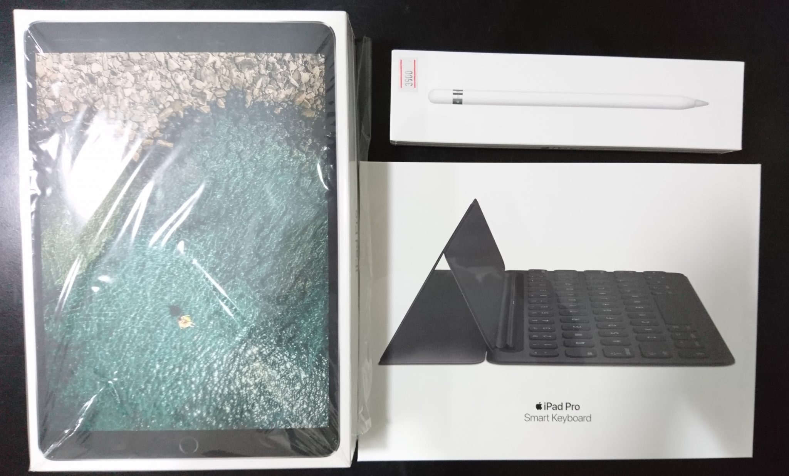
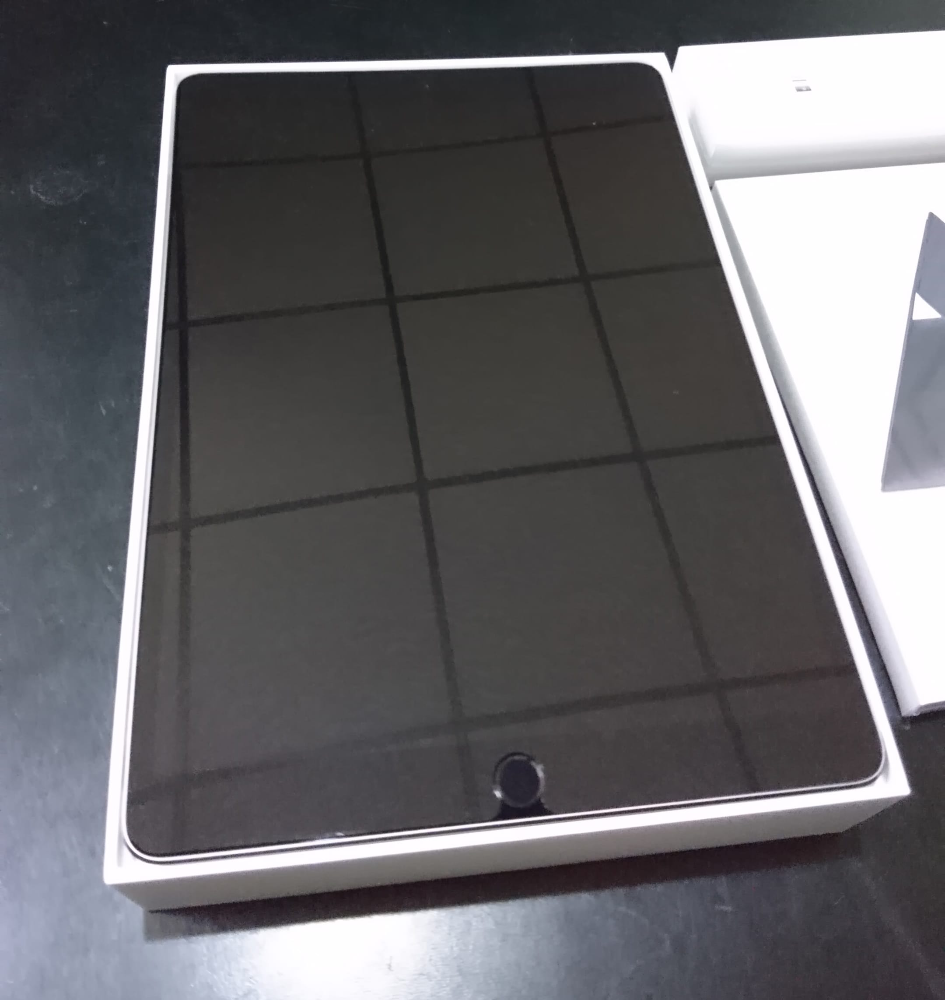
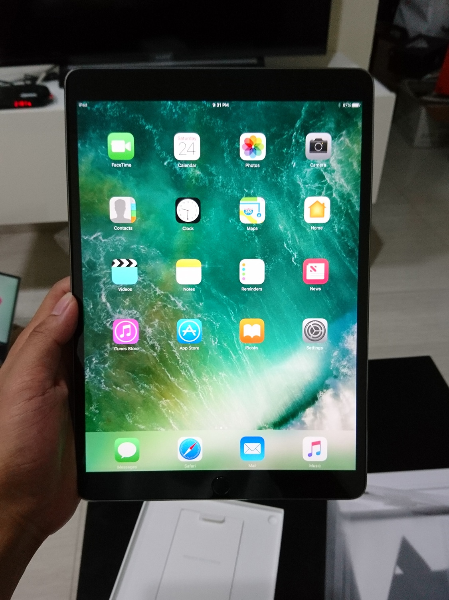
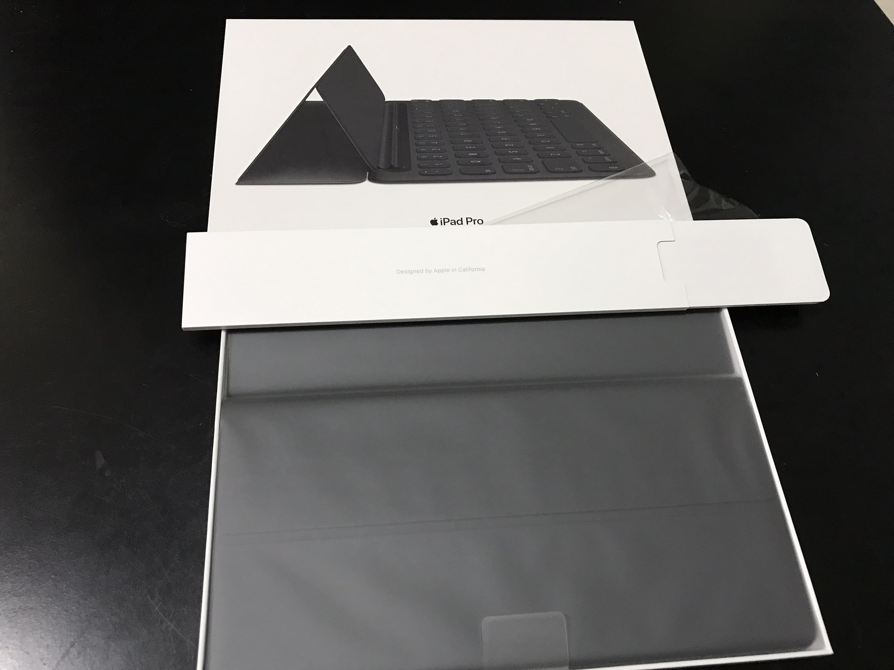
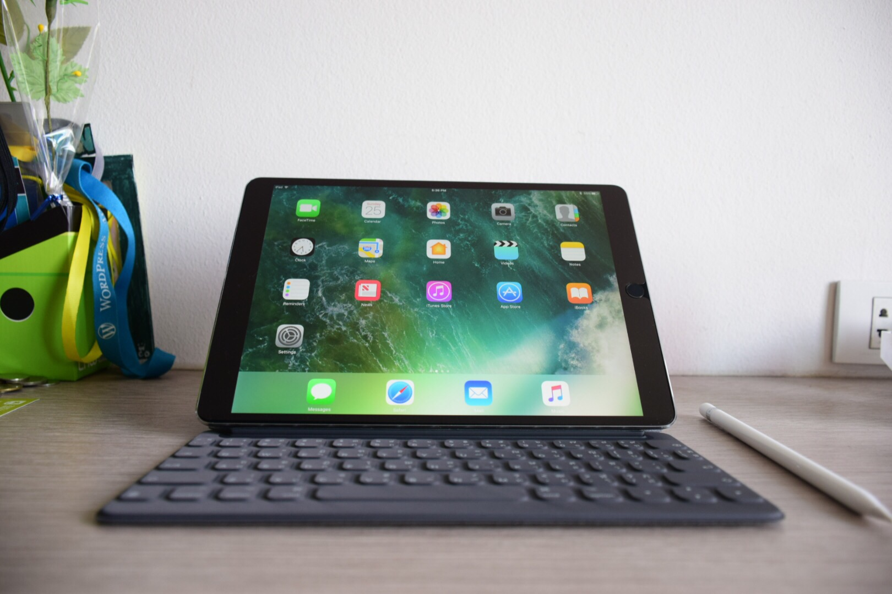
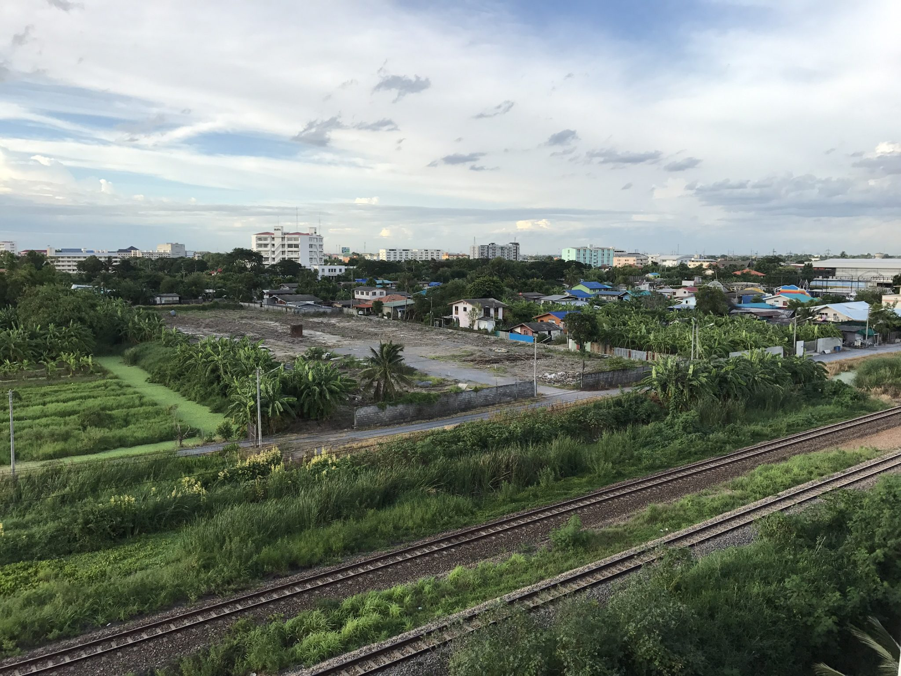

เมื่อปีก่อน Apple ก็ได้เปิดตัว iPad Pro รุ่นแรกคือรุ่น 9.7 นิ้วและ 12.5 นิ้วที่ขายดีกันแบบวัวตายควายล้ม ปีนี้ Apple กลับมาอีกครั้งด้วย iPad ขนาดใหม่ที่มาแทน 9.7 นิ้วคือ iPad Pro 10.5 inch

จริง ๆ บอกเลยว่า ไม่ใช่คนที่ชอบ iPad เท่าไหร่ แต่ด้วยขนาดที่ออกมา 10.5 นิ้วคือขนาดที่ชอบมาก เพราะมันไม่เล็กและใหญ่เกินไป พกพาสะดวก เลยซื้อมาใช้แทน Surface 3 เครื่องเก่าที่ช้ามาก ๆ

## Unboxing

แน่นอนว่าไหน ๆ ก็ซื้อแล้ว ก็เอามาหมดทั้งเครื่อง Keyboard และปากกา เรามาเริ่มแกะกันที่ละอย่างกันเลยดีกว่า

เริ่มจากพระเอกของเราในวันนี้กันก่อน นั่นก็คือ **iPad Pro 10.5 inch** ตัวนี้ซื้อมาเป็นขนาด **256 GB Wifi สี Space Grey**

หน้ากล่องก็บอกอย่างชัดเจนว่าเราเป็น iPad และก็มี Wallpaper อยู่ ดูตอนแรกนึกว่าจอแตก ฮ่า ๆ

หลังจากเปิดกล่องมา เราก็จะพบกับตัวเครื่องวางอยู่ (จริง ๆ มันมีพลาสติกหุ้มนะ แต่ก่อนหน้านั้นเอาไปติดฟิล์มกันรอยมาเลยต้องแกะออก)

สำหรับด้านหน้าตัวเครื่องก็ไม่มีอะไรมาก ก็มีจอขนาด 10.5 นิ้ว Retina Display ที่โคตรละเอียด และปุ่ม **Touch ID 2nd Generation** ที่ได้รับการปรับปรุงใหม่ ให้สามารถตรวจสอบลายนิ้วมือได้เร็วยิ่งขึ้น และยังมีกล้องหน้าสำหรับการถ่ายภาพ และ Video Call อีกด้วย

ถ้าใครเคยได้เห็นรุ่นก่อนแล้วจะเห็นได้ว่า ตัวเครื่องนั้นมีขนาดไม่ต่างกันมาก ถึงขนาดหน้าจอจะใหญ่ขึ้นก็ตาม เป็นเพราะขนาดของขอบหน้าจอที่แคบลงนั่นเอง

มาที่ด้านหลังกันบ้าง ก็จะมีกล้องหลังสำหรับการถ่ายภาพ พร้อม **Flash แบบ Two-Tone** เช่นเดียวกับ iPhone7 ถ้าเป็นในรุ่น Cellular ก็จะมีเสาอากาศอยู่ข้างบน และที่เห็นรู ๆ อยู่ข้างบนเป็น Microphone สำหรับอัดเสียง ที่มาพร้อมกับ Microphone 2 ตัวสำหรับตัดเสียงรบกวนได้อีกด้วย

]

สัมผัสแรกที่ได้ยกขึ้นมาครั้งแรกคือ **เบา** คือไม่คิดว่ามันจะเบา และเล็กได้ขนาดนี้

]

นอกจากตัวเครื่องแล้วก็ยังมี Adapter สาย Lighting ขนาด 1m และ Paperwork ต่าง ๆ

ถัดมาก็เป็นอีกหนึ่งอุปกรณ์เสริมที่โคตรจะแพงนั่นก็คือ **Apple Smart Keyboard** กล่องก็เป็นกล่องเรียบ ๆ หน้ากล่องก็มีรูป Keyboard บอกอยู่บอกว่า เป็น Smart Keyboard
สำหรับด้านหลังกล่องก็จะเป็น สรรพคุณต่าง ๆ ว่าเราสามารถพับได้ยังไงบ้าง ก็จะมี Mode ที่ใช้ Keyboard, Mode สำหรับตั้งดูหนัง หรือสื่อต่าง ๆ และ Cover Mode ที่เป็นการปิดหน้าจอเพื่อป้องกันหน้าจอเราได้รับความเสียหาย

หลังจากที่เราเปิดกล่องมา เราก็จะพบกับ Smart Keyboard ของเราห่อพลาสติกมาอย่างดี พร้อมกับ Paperwork ต่าง ๆ ภายในซองกระดาษขาว ๆ

สำหรับด้านหลังของ Keyboard ก็จะเป็นพวก Microfibre ที่ใช้ครอบจอเราไม่ให้เป็นรอย

ถ้าเราเปิดส่วนด้านล่างออกมา มันก็จะเป็น Keyboard และแน่นอนว่ามีภาษาไทยมาให้พร้อมเลย พร้อมกับที่ชอบคือปุ่มเปลี่ยนภาษาที่มีทั้งด้านล่างซ้าย และตรงกลางด้านซ้ายที่ต่างกันคือ ถ้าเป็นปุ่มตรงกลางด้านซ้ายคือจะเป็นปุ่มสำหรับการเปลี่ยนภาษาไทยและอังกฤษเท่านั้น และอีกปุ่มสำหรับเปลี่ยนภาษาทุกตัวที่เรามี

เพราะถ้าเครื่องเราตั้งภาษาพิมพ์ไว้หลายภาษา เวลาเราเปลี่ยนภาษา มันก็ต้องกดไปเรื่อย ๆ เพื่อให้เราได้ภาษาที่ต้องการ แต่ใน Keyboard เรามีแค่ ไทยและอังกฤษ ฉะนั้นปุ่มนี้จะช่วยให้เราพิมพ์ได้เร็วขึ้นมาก เวลาเราต้องเปลี่ยนภาษาบ่อย ๆ เวลาพิมพ์ เช่นการเขียน Blog เป็นต้น

และด้านหน้าก็จะเป็นอะไรไม่รู้ ฮ่า ๆ สีดำด้าน ก็สวยดี

และของอย่างสุดท้ายคือ **Apple Pencil** นั่นเองงง หน้ากล่องก็ไม่มีอะไรมาก ก็เป็นรูปดินสอเหมือนกับของชิ้นอื่น ๆ (มีป้ายราคาด้วย ฮ่า ๆ)

ส่วนด้านหลังกล่อง ก็จะเป็นรายละเอียดต่าง ๆ พร้อมกับรูปที่บอกให้เราเสียบมันเข้ากับตัว iPad

ภายในกล่องก็ไม่มีอะไรมาก ก็จะมีตัว **Apple Pencil, หัวสำรอง สำหรับเปลี่ยนหัว และตัวแปลง Port Lighting เป็น Lighting** (เดี๋ยวจะอธิบายว่าทำไมต้องมี)

## iPad Pro 10.5 inch

iPad Pro 10.5 inch มาพร้อมกับจอ **Retina Display** ขนาด 10.5 นิ้วที่ความละเอียด **2224x1668 Pixel** ที่สว่าง ให้สีที่สดกว่ารุ่นก่อน ๆ ถึง **50%** นอกจากนั้นยังรองรับมาตรฐาน **P3 Wide Colour** พร้อมกับ **True Tone Display** ที่จะปรับโทนสีหน้าจอให้เหมาะกับสภาพแสงในห้องนั้น ๆ ได้

ขนาดหน้าจอ 10.5 ยังมีข้อดีอีกอย่างคือ มันจะมาพร้อมกับ Keyboard ที่เป็นแบบ **Full-Size** หมายความว่า ตัว Keyboard ที่เราได้ใช้ในเครื่องจะเป็นขนาดเดียวกับที่เราใช้ในคอมพิวเตอร์ทั่ว ๆ ไปเลย ทำให้เราพิมพ์ หรือสร้างสรรค์งานได้อย่างราบลื่น ไม่หัวร้อน

ที่เด็ดอีกคือหน้าจอยังมาพร้อมกับเทคโนโลยีหน้าจอใหม่อีกอันอย่าง **ProMotion** ที่ทำให้มี **Refresh Rate** ของหน้าจออยู่ที่ **120 Hz** ที่สูงกว่าหน้าจอปกติอยู่เท่าตัวเลยทีเดียว ทำให้การทำงาน การเล่นเกมต่าง ๆ ดูลื่นขึ้นแบบเห็นได้ชัด ชัดมากจริง ๆ คือแค่เลื่อนเว็บก็รู้สึกได้เลยว่ามันลื่นขึ้นจริง ๆ

เจ๋งกว่านั้นคือ ถ้าเราดูไฟล์วีดีโอ ตัวเครื่องมันจะเข้าไปดูว่า Frame Rate ของวีดีโอเป็นเท่าไหร่ แล้วปรับ Refresh Rate ของหน้าจอ ทำให้อาการ **Visual Artifact** ที่เกิดกับเวลา Frame Rate ของ Content และ Refresh Rate ของหน้าจอไม่เท่ากัน หายไปเลย

เจ๋งขึ้นไปอีก ด้วยหน้าจอ ProMotion ที่เพิ่ม Refresh Rate ทำให้การใช้งานร่วมกับ Apple Pencil โหดขึ้นไปอีก เพราะมันลด Latency Time เหลือเพียง 20ms ที่ทำให้เราได้ประสบการณ์ที่เหมือนกับเขียนบนกระดาษมากขึ้นไปอีก สำหรับคนที่ต้องจดบันทึก หรือวาดภาพต่าง ๆ ก็น่าจะรู้สึกถึงความแตกต่างได้เลย

นอกจากนั้น ยังสามารถที่จะลด Refresh Rate เมื่อเราดู Content ที่ไม่ต้องการ Refresh Rate สูง ๆ เพื่อเป็นการประหยัดแบตได้อีกด้วย

สำหรับตัวขุมพลัง ไม่ต้องกลัวว่าจะน้อยหน้าใครเลย เพราะมันมาพร้อมกับ **A10X Fusion** และ **RAM** ขนาด **4 GB** ที่รองรับ App ระดับเทพได้ทุกอย่าง เปิดทุกอย่างได้แบบไม่สะดุด ไม่ว่าจะเป็นการเปิดเว็บหนัก ๆ หรือกระทั่งตัดต่อวีดีโอขนาด **4k** กันเลยทีเดียว

ได้ลองเอา **Raw File** จากกล้องสด ๆ มา Process กันในตัวเครื่องผ่าน Photoshop Lightroom พบว่ามันลื่นมาก ๆ เอาเป็นว่าประสบการณ์ความลื่นที่ได้มากกว่าใช้บน MacBook Pro 13 ที่ใช้อยู่ตอนนี้ซะอีก

เท่าที่ได้ลองเล่นทั้งเกมหนัก ๆ และ App สำหรับทำงานต่าง ๆ ก็ไม่มี App ไหนเลยที่ **กล้า** แสดงอาการกระตุกออกมาให้เห็นแม้แต่นิดเดียวเลยจริง ๆ เชื่อเลยว่า CPU มันแรงจริง ๆ ที่น่าสนใจกว่านั่นคือ เราสามารถเปิด App ค้างไว้ได้เท่าไหร่

จากที่ได้ลองเล่นไปเรื่อย ๆ แบบไม่ได้ไล่ปิด App อะไร ผลที่ได้คือ App ที่เปิดไว้เมื่อวานมันก็ยังอยู่ไม่ได้โดนปิด งานนี้ต้องขอบคุณแรม 4 GB ที่มาพร้อมกับ iPad Pro ตัวนี้เลย โหดมาก ๆ

CPU ว่าแรงแล้ว ถึงจะเป็น Tablet กล้องก็ไม่ทิ้ง เพราะใช้กล้องสเปกเดียวกับ iPhone7 กันเลยทีเดียว พร้อมกับรองรับ **Optical Image Stabilizer (OIS)**

จริง ๆ เรื่องกล้องนี่ไม่ต้องพูดอะไรมากเลย เก็บรายละเอียดได้ดีแม้ที่แสงน้อย และ **HDR** ก็ทำให้ภาพดูมีมิติมากขึ้น ในที่ที่แสงต่างกันมาก ๆ คือโอเคเลย

ภาพในสภาวะแสงน้อยก็ทำได้ดีเช่นกัน แต่ข้อสังเกตคือ เอากล้องสูง ๆ มาใส่ใน Tablet เราต้องการจริง ๆ รึเปล่า เพราะเราคงไม่เอา Tablet ใหญ่ ๆ มายืนชูถ่ายรูปกันแน่ ๆ เว้นแต่สแกนเอกสาร แต่ก็นะ มีก็ดีกว่าไม่มีนะ

ลำโพงก็มาพร้อมกับลำโพง 4 ตัวรอบทิศ ที่ให้เสียงที่ค่อนข้างดัง และเป็นมิติจนน่าตกใจมาก ๆ เพราะส่วนตัวเป็นคนไม่ชอบใช้ลำโพงฟังเพลงสักเท่าไหร่ แต่พอมาเจอนี่เข้าไปก็หลงเลย ถ้าใครที่ชอบฟังเพลง หรือดู YouTube อะไรต่าง ๆ ก็น่าจะถูกใจอยู่

อีกเรื่องที่สำคัญคือ แบตเตอรี่ ที่ Apple บอกว่ามันสามารถอยู่ได้ถึง **10 ชั่วโมง** กันเลยทีเดียว ถ้าเอามาเปิดเว็บเล่น (ถ้าเอามาเล่นเกม ก็อาจจะลดลงอีก)

และยังมาพร้อมกับเทคโนโลยี **Fast Charging** เหมือนเจ้าอื่น ๆ ที่ทำให้เราสามารถชาร์จแบตได้เร็วขึ้น แต่ Adapter จะต้องใช้ขนาดที่สูงกว่านี้ ตัว Adapter ที่มาในกล้องไม่ได้เป็น Fast Charge นะ

## Apple Smart Keyboard

มาถึงตัวอุปกรณ์เสริมกันบ้าง เริ่มต้นด้วยของแพงอย่าง **Smart Keyboard** ที่เชื่อมต่อผ่าน **Smart Connector** เล่าเฉพาะฟิลลิ่งในการใช้งานละกัน โดยรวมตัวปุ่มก็ทำมาดีมาก ให้สัมผัสเวลาพิมพ์ที่ค่อนข้างสนุก พิมพ์แล้วมันส์มือมาก เพราะตัวปุ่มค่อนข้างตื้น เสียงเวลาพิมพ์มันจะ แจ๊ะ ๆๆๆ ไม่ต้องออกแรงกดมาก (แหงแหละ ก็มันเป็น Cover ด้วยนี่น่า ไม่งั้นก็หนักตายพอดี)

ระยะห่างระหว่างปุ่มรู้สึกว่าแคบไปนิด ทำให้ต้องปรับตัวอยู่หน่อย ๆ แต่ก็ไม่มากเท่าไหร่ แรก ๆ คือพิมพ์ผิดเยอะมาก พอใช้ไปเรื่อย ๆ ก็ค่อนข้างจะดีเลย เพราะเป็นคนที่ใช้ Keyboard เยอะมาก ๆ

ข้อสังเกตคือตัว Keyboard เวลาตั้งออกมามันจะไม่ติดกับตัวโต๊ะ มันจะลอยอยู่หน่อย ๆ อันนี้เป็นเรื่องปกติ (เผื่อใครซื้อมาแล้ว เห็นมันลอย ฮ่า ๆ ตอนแรกก็ตกใจเหมือนกัน) เวลามันลอยแล้วเราพิมพ์มันจะเซ็ง ๆ เพราะจะกระดกไปมาทำให้รำคาญอยู่พอสมควร

สิ่งที่ชอบคือ **ปุ่มเปลี่ยนภาษา** เพราะมันมีมาให้ 2 ปุ่มที่เป็นปุ่มสำหรับเปลี่ยนระหว่าง ไทย/อังกฤษ และเปลี่ยนภาษาอื่น ๆ แยกกันเลย ทำให้เวลาเราพิมพ์ก็จะเร็วขึ้น สำหรับคนที่ใช้มากกว่า 2 ภาษาในเครื่อง

## Apple Pencil

มาดูของเล่นที่สนุกอย่าง **Apple Pencil** กันบ้างที่เป็นดินสอ (เขาเรียกว่าดินสออะนะ) จาก Apple กัน จะขอแอบเทียบกับ Surface Pen ที่ได้เคยใช้มาก่อนด้วยเลยละกัน

หลังจากที่เราแกะกล่องแล้ว การ Setup ทำได้ง่ายมาก ๆ สไตล์ Apple เลยเพียงแค่เราถอดฝาที่หัวออก โดยฝาจะมีแม่เหล็กกันฝาหล่นหายด้วย ซึ่งเปิดออกมาจะได้เป็นหัว Lighting แล้วเสียบเข้ากับตัวเครื่อง มันก็จะทำการเปิด Bluetooth และจัดการกันเอง คือโคตรง่าย

หรือเราสามารถใช้ตัวแปลงที่มาในกล่องเพื่อให้เราเสียบโดยใช้สายก็ได้เหมือนกัน แต่นี่คือขี้เกียจแกะออกมาเลยไม่ได้ใช้ และในตัวปากกาก็จะมีแบตเตอรี่อยู่ ฉะนั้นเราก็ต้องมีการชาร์จอยู่เรื่อย ๆ ซึ่งวิธีชาร์จก็เหมือนกับที่เราใช้เชื่อมกันตอนแรกเลยคือ เปิดฝาแล้วเสียบเอาที่เครื่องได้เลย แต่ข้อสังเกตคือมันให้ความรู้สึกแปลก ๆ เวลาเสียบ และควรจะวางเครื่องนอนลงแล้วค่อยเสียบ เพราะกลัวช่องเสียบมันเสียได้

นอกจากนั้นตัวดินสอมันยังปิดตัวเองเพื่อประหยัดแบตได้อีกด้วย เมื่อเราไม่ได้ใช้ไปสักพักนึง มันก็จะปิดตัวเองไป และพอเราหยิบขึ้นมามันก็จะเชื่อมต่อกับเครื่องเราอีกครั้งโดยอัตโนมัติ

สัมผัสเวลาจับจะค่อนข้างลื่น ๆ เงา ๆ และ**ยาวกว่า Surface Pen** ที่เคยใช้มาก ๆ เวลาเขียนลงไปให้ความรู้สึกที่ต่างออกไปจาก Stylus ตัวก่อน ๆ ที่เคยใช้อย่างรุนแรงมาก โดยเฉพาะหัวที่เป็นพลาสติก เขียนแล้วลื่น ๆ

ต่างจากอันก่อน ๆ ที่เป็นยาง เวลาเขียนแล้วมันจะหนืดนิด ๆ แต่อันนี้ไม่เลยคือลื่นกริบ เวลาเรากดลงไป เราจะไม่รู้สึกเลยว่านี่คือเข้มหรืออ่อน ต่างจาก Stylus ที่หัวเป็นยางอย่างสิ้นเชิง แต่ทั้งหมดกลับชินภายในไม่เกิน 2 วันเท่านั้น และให้การกดน้ำหนักที่ดูลื่นกว่ายี่ห้ออื่น ๆ ที่เคยใช้

## สรุป

โดยรวมแล้ว iPad Pro 10.5 เป็น Tablet ที่เจ๋งตัวนึงเลย ด้วยสเปกที่ให้มาอย่างล้นเหลือจนไม่รู้จะเอาไปทำอะไร แบตเตอรี่ที่อยู่ได้นานถึง 10 ชั่วโมง แต่น้ำหนักกลับเบาอย่างไม่น่าเชื่อ มาพร้อมกับหน้าจอ **ProMotion** ที่ให้ประสบการณ์การใช้งานได้ดีอย่างไม่น่าเชื่อ เมื่อใช้งานร่วมกับ Apple Pencil และ Apple Smart Keyboard มันก็จะกลายร่างเป็น **Productivity Machine** ได้อย่างดีเลย

ข้อสังเกตคือราคาที่ค่อนข้างสูงไปหน่อยเมื่อเทียบกับ Brand อื่น ๆ แต่แนะนำให้ลองเลย แล้วจะ**ติดใจ** สำหรับการรีวิวเบื้องต้นก็จบลงเท่านี้ เดี๋ยวจะมาเขียนประสบการณ์ในการใช้งานเพิ่มให้อย่างละเอียดในคราวหน้า สวัสดี

และสำหรับใครที่อ่านแล้วรู้สึกเหมือนโดนป้ายยา ตอนนี้ตัวเครื่องและอุปกรณ์ต่าง ๆ เข้าขายที่ iStudio แล้วนะ หรือสามารถสั่งซื้อผ่าน [Apple Store][21] ได้เลย และ **\#เขาไม่ได้จ่าย** นะ

[21]: https://www.apple.com/th/shop/buy-ipad/ipad-pro
