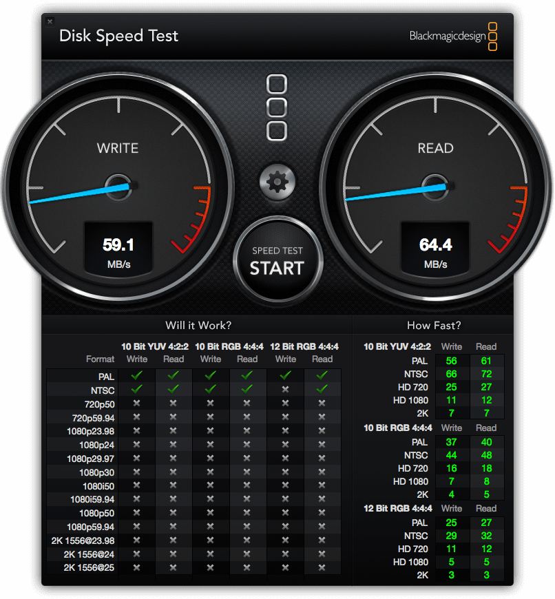

เหตุมันเกิดมาจากว่า เมื่อตอนเดือนธันวาคมในปีที่ผ่านมา External HDD ลูกเก่า My Passport Studio ลูกเก่าก็เริ่มแสดงอาการอันน่ากลัว นั่นคือ เสียบติดบ้าง ไม่ติดบ้าง หลังจากการใช้มา 3 ปีเกือบ 4 ปี ตอนนี้เลยได้ฤกษ์หาลูกใหม่มาสักที เลยไปจัด My Passport Ultra มาแทนซะเลย

## แกะกล่องกันเลย

รูปร่างตัวกล่องก็เป็น Design ง่าย ๆ สีน้ำเงิน มีเขียนชื่อรุ่นเป็น My Passport Ultra โดยตัวที่เอามาให้ดูในวันนี้เป็นขนาด 2 TB ใหญ่เกือบสุดแล้ว แต่ถ้าใครอยากได้ใหญ่กว่านี้ สูงสุดที่ขายจะอยู่ที่ 3 TB กันเลย

และบนกล่องก็มีรหัสเอาไว้ไป Redeem เพื่อทดลองใช้งาน Prime Time ซึ่งเป็นบริการพวก Movie Streaming อะไรพวกนี้แหละ เดี๋ยวมารีวิวในคราวถัด ๆ ไป โดยทาง WD ให้มา 60 วัน หรือ 2 เดือนนั่นเอง

สิ่งที่มาให้ในกล่องก็ไม่มีอะไรมาก มันจะมีอะไรเยอะแยะล่ะโธ่ ! นั่นก็คือ พระเอกในงานนี้ของเรานั่นก็คือตัว HDD สีดำตัวเก่งนี่เอง, สาย USB ที่เป็น USB 3 แต่สามารถใช้งานกับ USB รุ่นก่อน ๆ ได้นะ ไม่ต้องเป็นห่วง และ คู่มือที่มีหลากภาษามาก ๆ แต่ แน่นอนว่า เราเป็นคนไทย อ่านมันมั้ย ตอบเลยว่าไม่ !!!!

## ขนาด มิติ และการพกพา

ขนาดของมันจะกว้างอยู่ที่ 81.5 mm ยาว 110 mm และหนา 15.8 mm ทำจากพลาสติกสีดำทั้งตัว ก็ถือว่า เป็นขนาดที่ไม่ใหญ่มากเท่าไหร่ สามารถพกพาได้สบายเลยล่ะ เมื่อเทียบกับ My Passport Studio ลูกเก่าแล้ว ถือว่า เปลี่ยนชีวิตได้เลย เพราะว่า My Passport Studio ตัว Body ทำจากอลูมิเนียมซึ่งทำให้มันระบายความร้อนได้ดีมาก ๆ แต่ก็แลกมาด้วยน้ำหนักที่เยอะขึ้นมาก

เมื่อลองเอาความหนามาเทียบกันแล้วก็ดูบางกว่าอย่างเห็นได้ชัด ทำให้เราสามารถพกพาได้สะดวกสบายมากขึ้น

## Performance
เมื่อเราแกะกล่องออกมาแล้วเสียบ ทางโรงงานจะทำการ Format ออกมาให้เป็น NTFS แต่เดี๋ยวก่อน ผมใช้ OSX ก็เลยต้องทำการ Format ใหม่ให้มันกลายเป็น ExFAT ที่จะทำให้ทั้ง OSX และ Windows สามารถอ่านเขียนได้ ในการทดสอบ ผมจะใช้โปรแกรม BlackMagic Disk Speed Test มาทำการทดสอบกัน

ผลที่ได้ค่อนข้างดี สำหรับ HDD ตัวแค่นี้ สามารถอ่านเขียนได้ถึง 100 MB/s เลยทีเดียว ถ้าเอามาทำงานพื้นฐานก็ได้อยู่ แต่ถ้าคิดจะเอามาทำงานด้านวีดีโอสูง ๆ แล้วล่ะก็ ไม่พอแน่นอน

อันนี้ลองเอามาเทียบกับ My Passport Studio ที่ไม่มีแค่ USB2 และ Firewire 800 เท่านั้น ในการทดสอบนี้ผมเสียบผ่าน Firewire 800 ซึ่งความเร็วที่ได้ออกมานั้นก็แค่ 59 MB/s สำหรับการเขียน และ 64 MB/s สำหรับการอ่าน
เราจะเห็นได้ชัดเลยว่า ค่อนข้างที่จะต่างกันมาก ๆ ยิ่งโดยเฉพาะที่เราลองเปิดไฟล์วีดีโอใหญ่ ๆ ดู จะเห็นได้ว่าลูกใหม่ สามารถ Scroll แล้วแทบไม่สะดุดเลย ในขณะที่ลูกเก่านั้นแอบมีอาการช้า หน่วง ๆ บ้าง ทั้งนี้ก็เป็นเพราะ Interface ที่ใช้เชื่อมต่ออย่าง USB3 ที่ให้ความเร็วที่สูงกว่า Firewire 800 ในยุคเก่านั่นเอง

## เป็น Ex.HDD For Windows แล้ว Mac User จะใช้ได้มั้ย ?
คำถามนี้โดนหลาย ๆ คนถามมามากเลย ขอตอบในนี้เลยล่ะกัน จริง ๆ แล้วมัน **ใช้ได้** แต่ Ex.HDD ของ WD ที่เขาบอกว่า For Mac เนี่ย มันคือ HDD รุ่นเดียวกันกับที่ขายปกตินั่นแหละ แต่แค่ Format เป็น File System ที่ OSX อ่านเขียนได้มาจากโรงงานมาพร้อมเลย นั่นคือ Ready To Use พร้อมเลย และเรื่องของ Design ทาง WD ก็จะ Design ให้มันแตกต่างกับที่ขายในรุ่นทั่ว ๆ ไป ให้มันเข้ากับเครื่อง Mac รุ่นต่าง ๆ นั่นเอง อ่อ ลืม และมีอีกอย่างนึงคือ ในรุ่นใหญ่ ๆ ของที่เป็น For Mac เขาจะใช้ Interface ความเร็วสูง สูงปรี๊ดอย่าง Thunderbolt ที่เครื่อง PC ทั่ว ๆ ไปรุ่นปกติอาจจะไม่มี แต่ในเครื่อง Mac แล้ว ถือว่าเป็นมาตราฐานปกติที่ต้องมีเลยยกเว้น Macbook ธรรมดา
ที่เขียนมายืดยาวเลย สรุปคือ ใช้ได้ โอเคนะ แต่แค่ต้องเอามา Format ให้เข้ากับ OS ใช้ ก็เสียเวลาไม่นาน ไม่ถึง 3 นาทีเอง แลกกับราคาที่ถูกว่าเยอะ ก็ถือว่าคุ้มเลยล่ะ

## บทสรุปการรีวิว My Passport Ultra
จากการใช้งานจริง ๆ เมื่อเทียบกับลูกเก่าอย่าง My Passport Studio แล้ว เห็นได้เลยว่า ประสิทธิภาพที่ได้นั้นแตกต่างอย่างเห็นได้ชัดเลยจริง ๆ (แหงแหละ !! ก็เทคโนโลยีมันต่างกันนี่หว่า !!) ทั้งในเรื่องของความเร็ว ที่เชื่อมต่อผ่าน Interface ความเร็วสูงอย่าง USB3 ที่ทำให้เราสามารถโอนถ่ายไฟล์ขนาดใหญ่ ๆ ได้สบายเลย (แต่เครื่องและ Port ที่เสียบและเครื่องต้องรองรับ USB3 ด้วยนะ), ขนาดที่ไม่ใหญ่มากเกินไป และนำ้หนักที่ค่อนข้างเบาเพียงแค่ 100 กว่า ๆ กรัมเอง และที่สำคัญ ราคาก็ยังอยู่ที่ช่วงที่ไม่แพงมาก ตัวที่นำมาให้ดู 2 TB ก็อยู่ที่ 3190 บาท เมื่อเทียบกับคุณภาพของ HDD ที่ได้มาและการรับประกันแล้วก็ถือว่าเป็น Ex.HDD ที่คุ้มมากตัวนึงเลย
