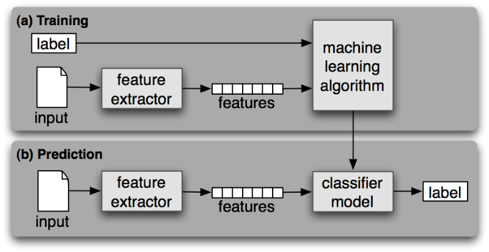

เมื่อช่วงปิดเทอมใหม่ ๆ ก็ มีเวลา แอบไปนั่งเรียน Machine Learning ใน Udacity มา วันนี้เลยจะมาเล่าให้อ่านกันดีกว่า ว่ามันคืออะไรกันแน่น้อ แล้วมันต่างจาก Data Mining กับ AI ยังไง (ว่าแต่รูป Cover มันเกี่ยวอะไรกับเรื่องที่เขียน !!!)

## Machine Learning คืออะไร ?
Machine Learning มันก็คือ การที่เราให้คอมพิวเตอร์เรียนรู้เรื่องอะไรสักเรื่อง โดยที่เราไม่ต้องไปเขียนโปรแกรมเพื่อบอกมันสักบรรทัด ง่าย ๆ จุดมุ่งหมายของเราคือ ให้คอมพิวเตอร์พยายามเข้าใจรูปแบบความสัมพันธ์ของข้อมูล แล้วพยายามตีความว่า ควรทำยังไงกับข้อมูลที่ได้มันมาดี เพราะฉะนั้น ไม่ว่าในอนาคตมันจะมีข้อมูลรูปแบบใหม่ ๆ มา เราก็ไม่จำเป็นที่จะต้องไปนั่งเขียนโปรแกรมใหม่ เพื่อให้มันรองรับข้อมูลรูปแบบใหม่ ๆ แล้ว เพราะว่า ตัวของคอมพิวเตอร์มันสามารถตีความและตอบสนองได้แล้ว
มาลองดูตัวอย่างกัน ถ้าผมบอกว่า ถ้าเจอรูปทรงที่เป็น สามเหลี่ยม ให้มัน Print เลข 3 ออกทางหน้าจอ

    if (shape1.getType == "Triangle") print("3")

แล้วถ้าในอนาคตมี 4 เหลี่ยมอีกล่ะ เราก็ต้องเขียนเพิ่มเข้าไปอีก

    if (shape1.getType() == "Triangle") print("3")
    else if (shape1.getType() == "Rectangle") print("4")

ถ้าในอนาคตข้อมูลที่เข้ามาอาจจะเป็น ห้าเหลี่ยม หกเหลื่ยมอีกล่ะ เราก็ต้องเขียนโปรแกรมบอกมันอีก แต่ถ้าเราเอาหลักของ Machine Learning มาใช้ เราไม่จำเป็นต้องมาบอกทุกข้อมูลว่า ให้มันตอบสนองมันยังไง อาจจะให้มันแยกประเภทของข้อมูลออกมา แล้วให้เรา Label ลงไป หรือไม่บอกเลยก็ได้ มันมีอยู่หลายวิธี เดี๋ยวจะกล่าวใน หัวข้อถัด ๆ ไป

## Machine Learning อยู่รอบ ๆ ตัวเรา
จากที่ผมยกตัวอย่างมาอาจจะยังเห็นได้ไม่ชัด และไกลตัวไปหน่อย แต่ลองมาดูตัวอย่างใกล้ ๆ ตัวเรามั่งดีกว่า อย่างเว็บที่ How-Old.net ที่ Microsoft ทำขึ้นมาเพื่อ Promote Module Machine Learning ใน Microsoft Azure คนทั่วไปอาจจะไม่รู้ว่า Microsoft ทำเพื่ออะไร แล้วเบื้องหลังการทำงานของมันทำยังไง ? ลองมาดูกัน

อย่างที่เรารู้กันว่า วิธีใช้มันง่ายมาก ๆ เพียงแค่เราเอารูปของเราป้อนลงไปในโปรแกรม จากนั้นโปรแรมจะ Output เพและอายุของเราออกมา ถูกบ้างไม่ถูกบ้าง ขั้นตอนของมันก็คือ เอารูปเข้าไป และพยายามหาว่าหน้าคนที่อยู่ในรูปว่าอยู่ตรงไหนบ้าง
จากนั้นมันจะล๊อคตำแหน่ง และเอาหน้าของเราที่ถูกตัดออกมาไปเทียบว่า หน้าที่เอาเข้ามามันอยู่ในช่วงอายุไหน และเพศอะไร จากนั้นมันก็ Output ออกมาเป็นเพศและอายุ ตามที่เราเห็น
แต่โปรแกรมเมอร์ไม่เคยไปบอกคอมพิวเตอร์เลยนะว่า คนอายุ 30 หรือ 15 หน้าจะเป็นยังไง ต่างกันยังไง ทั้งนี้เกิดจากการจัดกลุ่มกันเอง จากโปรแกรมทั้งนั้นเลย ทำให้ผลที่ได้ออกมา อาจจะผิดบ้าง ถูกบ้าง

## นอกจากนี้เอามาทำอะไรได้อีก
จริง ๆ Machine Learning สามารถทำอะไรได้สารพัดเลยนะ อยู่ที่จินตนาการของคนเขียนล้วน ๆ เลย ในปัจจุบันมีคนเอาหลักการของ Machine Learning ไปใช้ง่านสารพัดเลย เช่น ทางฝั่ง Google Search Engine  เจ้าใหญ่ เขาก็เอาไปใช้เพื่อให้ ค้นหาข้อมูลได้ตามที่เราต้องการมากขึ้น เช่น ถ้าเราเขียนคำผิดไป มันก็สามารถแก้คำผิดให้เรา และค้นหาให้เราได้อย่างรวดเร็ว
หรือจะมาทางฝั่ง Facebook Social Network ที่เราใช้กันอยู่ทุกวันก็ใช้เหมือนกัน เช่นว่าเราลงรูป มันสามารถที่จะถามว่า นี่คือ คนนี้ใช้มั้ย ? โดยดูจากรูป นี่ก็เป็นตัวอย่างที่เราน่าจะเคยเห็นได้ในชีวิตประจำวันของเราที่เอาหลักการของ Machine Learning เข้ามาช่วย

## Machine Learning ทำงานยังไง ?

ก่อนอื่น เราก็ต้องป้อน Input เข้าไป จากนั้นมันจะพยายาม Extract ข้อมูลต่าง ๆ ออกมาจากตัว Input ของเราเพื่อให้มันสามารถเอาไปทำงานต่อได้ เราจะเรียกขั้นตอนนี้นี้ว่า Feature Extraction ด้วยวิธีนี้ทำให้เราสามารถลดการใช้ Resource ได้เยอะเลย
หลังจากที่เราทำ Feature Extraction แล้ว เราก็จะได้ข้อมูลก้อนหนึ่งออกมา เราจะเรียกว่า Feature แต่ Feature ที่ Extract ออกมา อาจจะมีสิ่งที่ไม่ต้องการอยู่ก็ได้ ในขั้นตอนนี้ เราก็ต้องมาไล่หาว่า อะไรไม่สำคัญ อะไรสำคัญแล้วพยายามลบสิ่งที่ไม่สำคัญออกไป เพื่อให้ข้อมูลเรียบง่ายขึ้น เล็กลง เพื่อลด Resource ในการทำขั้นตอนต่อไป
หลังจากขั้นตอนที่เราแล้ว เราพยายามตัดส่วนที่ไม่สำคัญออกไป สิ่งที่เราจะได้จะเรียกว่า Model ทีนี้แหละ ถึงเวลาแล้วที่ จะต้องเอา Model ที่ได้ออกมา มาเทียบกับ Model ที่มั่นใจแล้วว่าถูกต้อง เพื่อหาว่า Model ที่หามามันมีความถูกต้องมั้ย ถ้าใช่ มันก็จะเก็บไว้ เพื่อไว้ทำนาย หรือตรวจสอบความถูกต้องกับข้อมูลชุดต่อ ๆ ไป ขั้นตอนนี้เราจะเรียกว่า **Cross-validation**
จริง ๆ แล้วขั้นตอนจะมีความยุ่งยาก และซับซ้อนมากกว่านี้ แต่ในที่นี้ เอามาสรุปให้เข้าใจได้ง่ายขึ้นในเวลาอันรวดเร็วทันใจ ดั่งไปรษณีย์ไทย รวดเร็ว ทันใจ รับน้าาาา

## คำว่า Machine Learning VS Data Mining กับ AI
ตอนแรกที่ผมเรียนไปสักพัก ก็เกิดคำถามไปประมาณว่า

    "เออว่ะ!! แล้ว 3 คำนี้มันต่างกันยังไง ?"

ผมเลยเอาไปถามอาจารย์ท่านหนึ่ง เลยได้คำตอบมา แต่ก่อนอื่นเรามาดูกันทีล่ะคำดีกว่า
AI หรือ Artificial Intelligence เป็นเพียงการสร้างโปรแกรมที่ตอบสนองอย่างชาญฉลาด เราก็เรียกสิ่งนั้นว่า AI แล้ว แค่นี้เลย
คำว่า Data Mining คือ การทำยังไงก็ได้ โดยส่วนใหญ่เราจะใช้ Algorithm จาก Machine Learning, AI มาช่วยให้เราได้ข้อมูลเชิงลึก หรือภาษาอังกฤษเรียกอย่าง กิ๊บเก๋ว่า Insight นั่นเอง
แต่พอมาดูที่คำว่า Machine Learning เราจะเห็นว่าผลของ Machine Learning ไม่ใช่ การได้มาซึ่งข้อมูลเชิงลึก หรือ การโต้ตอบอย่างชาญฉลาด แต่ผมนิยามให้มันเป็นคำว่า **ทำนาย**
ฉะนั้นแล้ว 3 คำนี้เป็นคำที่ค่อนข้างที่จะเกี่ยวข้องกัน อันนี้เอานิดนึงของอันนี้ไปใช้ หรืออันโน้นเอาไป ทำให้เราไม่เห็นความแตกต่างกัน แต่ถ้าเราลองมองที่นิยามของมันดี ๆ แล้ว จริง ๆ มันต่างกันนะ ต่างกันที่ **เป้าหมาย** ของการทำนั่นเอง

## จริง ๆ แล้ว Machine Learning มีหลายแบบด้วยนะ
โดยหลัก ๆ เท่าที่ผมได้เรียนมา เราจะแบ่งเป็น 3 ประเภทตามรูปแบบการเรียนรู้ได้ด้วยกันนั่นคือ supervised learning, unsupervised learning และ semi-supervised Learning เราลองมาดูที่แต่ล่ะแบบกันดีกว่า

## Supervised Learning

Supervised Learning แปลง่าย ๆ คือ เรียนแบบได้คำแนะนำ วิธีของมันเล่าแบบง่าย ๆ คือ เช่นเราต้องการจะสอนในคอมพิวเตอร์แยก แมว กับ สิ่งของอื่น ๆ เราก็จะเอาภาพของแมว ให้คอมพิวเตอร์ดู แล้วแถมบอกมันด้วยว่า **"นี่คือแมวนะ !!"** จากนั้น คอมพิวเตอร์มันจะพยายาม**Extract Feature** ออกมาจากภาพของแมวที่เราป้อนเข้าไป อย่างที่ได้เล่าไปเมื่อหัวข้อก่อนหน้านี้ เช่น มี 4 ขา, มี 1 หาง บลา ๆ อะไรแบบนี้ ถ้าให้พูดง่าย ๆ มันก็คือ **classification** นั่นเอง ด้วยขั้นตอนพวกนี้ทำให้คอมพิวเตอร์สามารถแยก แมว ออกจากสิ่งอื่น ๆ ได้แล้ว นี่คือวิธีของ Supervied Learning ที่เราใช้กันในปัจจุบัน จะประมาณนี้แหละ

## Unsupervised Learning

วิธีนี้จะออกแนวกวนประสาทเล็กน้อย คล้าย ๆ กับ Supervised Learning เลย แต่ต่างกันตอนที่เราเอาข้อมูลให้มันดู เราจะไม่บอกว่า สิ่งที่ให้มันดูคืออะไร เช่นให้ดูรูปแมว เราก็แค่ให้รูปแมวไป แต่ไม่ได้บอกว่า **"นี่คือแมวนะ"** แล้วก็จากไปเลย เพราะฉะนั้นสิ่งที่คอมพิวเตอร์จะทำได้คือ การทำ Feature Extraction แล้วพยายามแยกของจาก Feature ที่ Extract ออกมาได้ แต่ไม่รู้จริง ๆ ว่านี่คืออะไร เราจะเรียกกลุ่ม ๆ ของข้อมูลพวกนั้นว่า Cluster แค่นี้เอง Unsupervise Learning จริง ๆ ข้างในนี่บรรลัยมาก (หรือว่าเพราะพึ่งเรียนมาก็ไม่รู้นะ)

## Semi-Supervised Learning

ในวิธีนี้มันเกิดจากปัญหาของ Supervised Learning ที่เราจำต้องมีทั้ง ข้อมูลตัวอย่าง (Training Dataset) และ Tag เพื่อให้คอมพิวเตอร์เรียนรู้ แต่ในชีวิตจริง ข้อมูลเนี่ยหาง่าย แต่ข้อมูลมักจะไม่มากับ Tag ด้วยไง ประเด็น !! ถ้าเราจะต้องเอาข้อมูลนับล้าน ๆ มาดูเอง แล้ว Tag เองก็คงไม่ไหวเหมือนกัน (หรือถ้าใครอึดพอก็เอาเลยนะ ไม่ว่ากัน) หลักการของ Semi-Supervised Learning คือ เรามากันคนล่ะครึ่งทาง
กลับมาที่ รูปแมวของเรากัน เริ่มต้นจากเรามีรูปแมวและรูปอื่น ๆ ที่อาจจะปนมาเยอะมาก ๆ บางรูปก็มี Tag บอกว่านี่คือรูปของแมว บ้างก็ไม่มี วิธีก็ไม่ยาก มันจะพยายามหา Feature ของรูปแมวมา และพยายามคาดเดาว่า อันนี้น่าจะเป็นแมว แล้วก็เติม Tag ให้มันไป และทำแบบนี้ไปเรื่อย ๆ จนหมด อะไรทำนองนี้ ยังหาวิธีที่ง่ายและถูกต้องกว่านี้ในการอธิบายจริง ๆ

## เรายังแบ่งโดยใช้เงื่อนไขอื่นได้อีก
นอกจากที่เราจะสามารถแบ่งประเภทได้ตามวิธีการเรียนรู้แล้ว เรายังสามารถแบ่งตามความเหมือนต่าง ในการจัดข้อมูลได้ด้วยล่ะ แต่จะไม่ขอลงรายละเอียด เพราะยาวมาก

* Regression Algorithms
* Instance-based Algorithms
* Regularisation Algorithms
* Decision Tree Algorithms
* Bayesian Algorithms
* Clustering Algorithms
* Association Rule Learning Algorithms
* Artificial Neural Network Algorithms
* Deep Learning Algorithms
* Dimensionality Reduction Algorithms
* Ensemble Algorithms

นอกจาก 11 Algorithms ที่กล่าวมายังมีอีกหลาย Algorithm เลย ลองไปเปิดในเน็ตเอาล่ะกัน เพราะผมก็จำไม่ได้หมดเหมือนกัน แค่นี้ หน้าก็สั่นแล้ว !!!! ภาพด้านบนเป็น Mindmap ที่รวม Algorithm ออกมา ได้มาจากเพื่อนคนนึงนี่แหละ เลยเอามาให้ดู เพื่อใครอยากจะเอาไปหาเล่น ๆ

## สรุปส่งท้าย ท้ายสุด
ทั้งหมดที่เขียนมาถือว่าเป็นน้ำจิ้มเล็ก ๆ น้อย ๆ จากการที่ได้เรียนมาใน Udacity ทำให้ผมรู้สึกว่าศาสตร์ของ Machine Learning เป็นอะไรที่ใกล้ตัวเรามาก ๆ ตั้งแต่เราตื่นนอนยันเรานอนเลยทีเดียว และมันก็สนุกมากด้วย ลองทำไป 3 Projects นี่ทำให้รู้เรื่องเลย ถ้าใครอยากลองเรียนดูเข้าไปได้เลยใน [Udaciy][2] และทาง Udacity ก็มี Machine Learning Nanodegree ด้วยนะ (แต่เสียตังนะนาย !!) ส่วนเราไม่มีตัง ก็ได้แค่เข้าไปนั่งเรียน แต่ไม่ได้ส่ง Project ไว้มีตังก่อน เดี๋ยวจะไปสอบ

[1]: https://www.linkedin.com/pulse/machine-leaning-machines-learning-jeffrey-strickland-ph-d-cmsp
[2]: https://www.udacity.com
