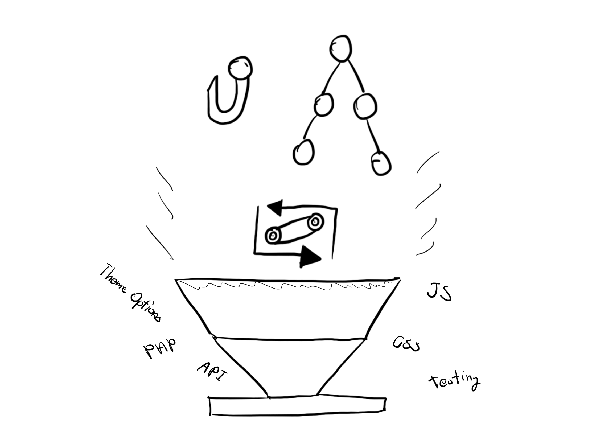

หลังจากที่ปล่อยบทความเกี่ยวกับ [PaperTheme](https://www.arnondora.in.th/papertheme-3-programming/) ไปก็มีหลายคนถามมาว่า **ถ้าจะทำ Wordpress Theme บ้างต้องรู้อะไรบ้าง?** วันนี้เลยจะมาเล่าละกันว่า ถ้าอยากจะทำบ้าง ต้องรู้อะไรบ้าง?

## Wordpress Theme Hierarchy

เรื่องนี้สำคัญมาก ไม่รู้ก็ไม่น่าจะทำได้เลยนั่นคือ **Theme Hierarchy** เพราะ Wordpress เป็น CMS ที่มันถูกโปรแกรมมาก่อนแล้วว่าให้ทำอะไรยังไงบ้าง ฉะนั้นถ้าเราจะทำ Theme ที่ใช้ใน Wordpress ก็ต้องทำตามที่ Wordpress กำหนดไว้ Theme Hierarchy เป็นคล้าย ๆ กับข้อกำหนดของ Wordpress ว่าจะให้ตัว Wordpress เข้ามาอ่านและแสดงผลหน้าไหนก่อนเป็นหน้าแรก โดยใน Theme Hierarchy มันจะบอกอยู่เลยว่า แต่ละไฟล์มันชื่ออะไร ถ้าเราเข้าไปอ่านใน Document มันจะบอกเลยว่าไฟล์แต่ละไฟล์มันคืออะไร และควรมีอะไร ในช่วงเริ่มต้นแนะนำให้ทำตามที่ Document บอกมาก่อน แล้วถ้าวิชาเริ่มกล้าแกร่งแล้ว ก็ค่อยพลิกไปเรื่อย ๆ Wordpress ถึงตัวมันจะเกิดมาเพื่อ Blogging แต่ด้วยหลาย ๆ ท่ายาก (จริง ๆ ก็ไม่ได้ยาก) ก็ทำให้เราสามารถสร้างเว็บอะไรก็ได้โดยที่เราไม่ต้องเขียนส่วนของหลังบ้านเลย นอกจากนั้นใน Theme Hierarchy เรายังสามารถทำให้เราทำหน้า Custom สำหรับหมวดหมู่ หรือ Tag นั้น ๆ ได้ด้วย ถ้าเราเข้าไปดูใน Document มันจะอยู่ในส่วนของ Custom Slug ได้เลย

## Hooks

**Hooks** จัดว่าเป็นเรื่องสำคัญอีกเรื่องที่ควรจะรู้ มันช่วยทำให้เราสามารถ Custom Theme ของเราได้มาขึ้นเยอะมาก ๆ **Hook คือ Function ที่จะต้องใช้ผ่าน Action และ Filter เพื่อเปลี่ยนค่าบางอย่างในตัว Wordpress** เช่นการ Import Stylesheet และการแก้ไข Excerpt อะไรทำนองนั้น อธิบาย Action กับ Filter ง่าย ๆ คือ Action จะถูกทำเมื่อมีเหตุการณ์บางอย่างเกิดขึ้น เช่น เราต้องการที่จะ Import JavaScript เข้าไป จะเป็นแบบ Code ด้านล่างนี้

<pre>function papertheme_enqueue_scripts () {
wp_enqeue_script('papertheme-main-script', 'app.js');
}
add_action('wp_enquqeue_scripts', 'papertheme_enqueue_scripts');
</pre>

จาก Code ด้านบนเราจะเห็นว่า เราทำการสร้าง Function ที่ Import Script ลงไปในหน้าของเรา และด้านล่างเป็นการบอกว่า ถ้า Wordpress เรียกคำสั่ง **wp_enqueue_scripts** ให้เรียก Function **papertheme_enqueue_scripts** ก่อนทุกครั้ง ซึ่งเวลาที่ Wordpress จะเรียก **wp_enqueue_scripts** คือตอนที่ Wordpress จะ Render หน้าใหม่ ผลคือ Script ที่เราใส่เข้าไปก็จะถูกโหลดในทุกหน้า เช่นเดียวกับ Stylesheet เราก็สามารถใช้ Action เรียกได้เช่นกัน มาที่อีกตัวคือ **Filter** จะต่างกับ Action ไปเลย เพราะมันไม่ได้ถูกเรียกเมื่อเกิดเหตุการณ์บางอย่างขึ้น แต่มันจะอารมณ์เหมือนกับ **เอาตัวเองไปแทน Function นั้น ๆ** แทน เช่น เราต้อง Fix ความยาวของ Excerpt เราก็สามารถสร้าง Filter มาจัดการได้ ตามตัวอย่างนี้

<pre>function papertheme_excerpt_length( $length ) {
return 15;
}
add_filter( 'excerpt_length', 'papertheme_excerpt_length');
</pre>

จากตัวอย่างนี้จะคล้าย ๆ กับ Action เมื่อครู่ คือเราสร้าง Custom Function ตัวนึงขึ้นมา และเรียก **add_filter** ขึ้นมาเพื่อบอก Wordpress ว่าเราจะขอแทน **excerpt_length()** ด้วย **papertheme_excerpt_length()** เสมอ อารมณ์ของมันคือการ Bind Function ไปทำนองนั้น **ข้อควรระวัง** ลองสังเกตชื่อ Function ที่ผมใช้ ผมจะเริ่มต้นด้วย **papertheme** และตามด้วยชื่อ Function เหตุผลที่เป็นแบบนั้นก็เพราะว่า PHP ไม่สิ ทุกภาษาแหละ **ไม่ชอบชื่อซ้ำกัน** ลองนึกดูนะครับว่า เวลาเราใช้ชื่อซ้ำกัน หรือคำสงวน (Reserved Word) มันจะเกิดอะไรขึ้น ก็บึ้มไง นอกจากนั้น Wordpress 1 Site คงไม่ได้ลง Theme และ Plugin ตัวเดียวแน่ ถ้ามีใครมาซ้ำก็บึ้มเลย ฉะนั้น เพื่อป้องกันปัญหาที่อาจจะเกิดขึ้น เราจึง**เติมชื่อ Theme หรือ Plugin ไว้ข้างหน้า แล้วค่อยใส่ชื่อ Function ตาม** เพื่อป้องกันปัญหาดังกล่าวนั่นเอง

## The Loop

เรื่องนี้ก็สำคัญ (เออ มันก็สำคัญทุกเรื่องแหละ ไม่งั้นจะเอามาเขียนทำไม!!!) เพราะถ้าเราไม่มี The Loop ละก็ เราจะโยน Content ออกมายังไง ฮ่า ๆ เอาง่าย ๆ **The Loop คือชุดของ Function** ที่มากับ Wordpress เพื่อให้เราสามารถ**จัดการ Content** บนหน้าได้อย่างง่ายดาย โดยที่เราแทบจะไม่ต้องรู้ PHP เลย อาจจะไม่เห็นภาพ ลองดู Code จริง ๆ กันเลย อันนี้ขอตัดมาจาก Document ของ WordPress

<pre>if ( have_posts() ) {
   while ( have_posts() ) {
     //post Content here!
     the_post();
   }
}</pre>

เรามาลองดูกันทีละบรรทัดกัน มันจะเริ่มจาก If เพื่อเช็คก่อนว่า มี Post มั้ย ? หมายความว่า หน้าที่เราเปิดขึ้นมา เช่นเราเปิดหน้า Tag ขึ้นมา Tag นั้นมีบทความมั้ย ถ้าไม่มีก็ไม่ให้ทำอะไร แต่ถ้ามีก็ให้วน While Loop ไปเรื่อย ๆ และในแต่ละรอบก็ให้มันพ่น Content ของแต่ละบทความออกมาผ่าน **the_post()** ก็จะประมาณนั้น จะเห็นว่ามันง่ายมาก ๆ เลย เราแค่รู้ว่า เราจะทำอะไร แล้วก็เรียก Function ได้เลย (ส่วนใหญ่ Wordpress มีมาให้หมดแล้วละ) นอกจาก Function สำหรับการแสดงผลแล้วยังมี Function สำหรับการเช็คค่าต่าง ๆ ด้วย เช่น **is_home()** สำหรับเช็คว่าหน้านี้เป็นหน้าแรกรึเปล่า อะไรแบบนี้ เพราะถ้าเราดูจาก Theme Hierarchy แล้วจริง ๆ ไฟล์ที่จำเป็นเลยจริง ๆ คือ **index.php** ซึ่งถ้าเราไม่ได้เขียนไฟล์อื่น เช่น เราไม่ได้เขียนหน้า Tag ไว้ เราก็สามารถใช้ index.php ได้ และใช้ **is_tag()** เช็คได้

## สรุป

จริง ๆ ยังมีอะไรอีกเยอะเลยที่ต้องรู้ ซึ่งวันนี้ที่หยิบมาให้อ่านกัน 3 อย่างก็เป็นอะไรที่ผมว่า มันจำเป็นมากที่สุดแล้วในการสร้าง Theme สักอันนึงขึ้นมา (นี่ยังไม่นับว่า **ควรจะ** รู้ PHP, JS, CSS ด้วยก็ดี) และในแต่ละเรื่องที่ยกขึ้นมา มันก็ยังมีท่ายากของมันในการใช้งานอีกนะ อันนี้ก็แนะนำให้ไปอ่านใน Document กันเลย มันเขียนส่วนใหญ่ไว้เกือบหมดแล้วละ ท่ายากกว่านั้นคงต้องอาศัยจินตนาการกันแล้วละ

> **"**เพราะการเขียนโปรแกรม รู้แค่ Logic เราก็ไม่ต่างอะไรกับหุ่นยนต์ที่เขียนโปรแกรมได้ แต่ถ้าเรามีจินตนาการ และความคิดสร้างสรรค์ เราก็จะสามารถสรรสร้างสิ่งใหม่ ๆ วิธีใหม่ ๆ ได้เสมอ**"**

สำหรับใครที่สนใจในการเขียน Wordpress Theme ก็ลองไปอ่าน 3 เรื่องนี้ก่อน และแนะนำว่าให้ลองไปหาพวก **Boilerplate** และลองศึกษาดูว่า มันมีส่วนประกอบอะไรยังไงบ้าง เขียนยังไง แล้วลองเอามาทำตามก็น่าจะช่วยได้อยู่ สำหรับวันนี้สวัสดีครับ
