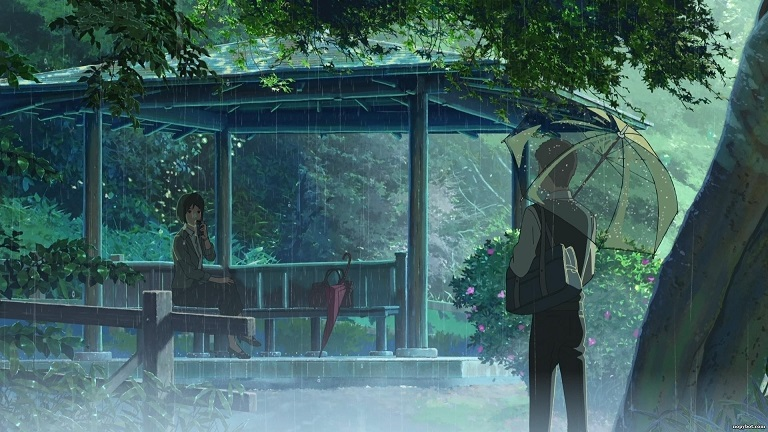
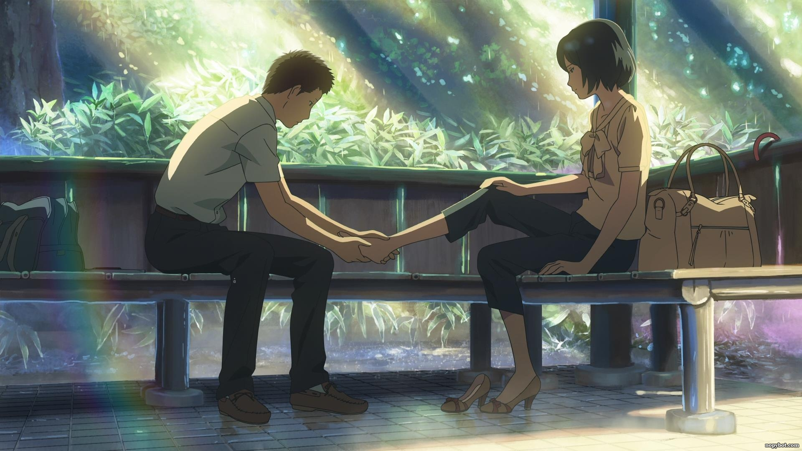

## **The Garden of Words - ยามสายฝนโปรยปราย**

**"เราคงจะได้พบกันอีก ถ้าฝนตกล่ะนะ"**

เป็นอีกผลงาน Anime ของ**[มาโคโตะ ชินไค][0] **ที่เคยเรียกเสียงได้อยู่เยอะพอสมควรจาก  **[5 Centimeters Per Second][1] ในปี 2007** เรื่องนี้เป็นเรื่องของเด็กหนุ่ม ม.ปลายที่ชอบโดดเรียนตอนเช้าในวันที่ฝนตก เพื่อไปนั่งขีดเขียนอยู่ในสวนสาธารณะ และเขาได้พบกับหญิงสาวคนหนึ่ง ที่โดดงานมานั่งเหมือนกันและยัง ชอบมานั่งดื่มเบียร์แกล้มช๊อคโกแลต เมื่อฝนตกพวกเขาจะได้มาเจอกันโดยที่ไม่ได้นัดหมาย หัวใจของพวกเขาก็เปิดรับกันมากขึ้น

ตัว Anime ก็ 46 นาที แต่ตอนผมดู 46 นาทีผมรู้สึกว่ามันเหมือนผ่านไปเพียง 15 นาทีเองครับ การดำเนินเรื่องออกแนวเรียบๆ แต่เจ๋งมาก ส่วนเรื่องของภาพก็ยังเนียบอยู่เหมือนเดิมครับ ผมชอบมากโดยเฉพาะมุมกล้อง มันทำให้ Anime เรื่องนี้ดูมีชีวิตชีวาเยอะขึ้นมากเลย ยิ่งรวมกับเนื้อเรื่องโรแมนติกกลางสายฝนแล้วด้วยล่ะก็ น่าจะทำให้ใครหลายๆคน หัวใจพองโต กันได้เลยล่ะครับ

**The Garden Of Words** เป็น **Anime** ที่ดูฆ่าเวลาก็ฟินดี และถ้าดูเอาฟิลก็ได้ดีเหมือนกันครับ ผมนั่งดูไปก็ตื่นเต้นไป มันดีมากๆเลย และถ้าชอบเรื่องที่เดินเรียบๆ แต่ในเรื่องอัดแน่นไปด้วยความรู้สึก ผมบอกเลยว่า เรื่องนี้มันดีมาก!!

**ปล. ดูมาทั้งเรื่องฟินฉากวัดเท้าสุดและ ฟิน~~~**

**"ทุกเช้าที่ฉันใส่เสื้อไปโรงเรียน ฉันกลัว ยังไงก็ไม่อยากไป ในสถานที่นั้น นายได้ช่วยไว้"**
\[embed\]https://www.youtube.com/watch?v=\_XlH7gSvAkc\[/embed\]
**ตบท้ายด้วย ost. ของ Anime เรื่องนี้ความหมายดีมากครับ**

[0]: http://www.imdb.com/name/nm1396121/?ref_=tt_ov_dr
[1]: http://www.youtube.com/watch?v=SDBH4xCE9ys
