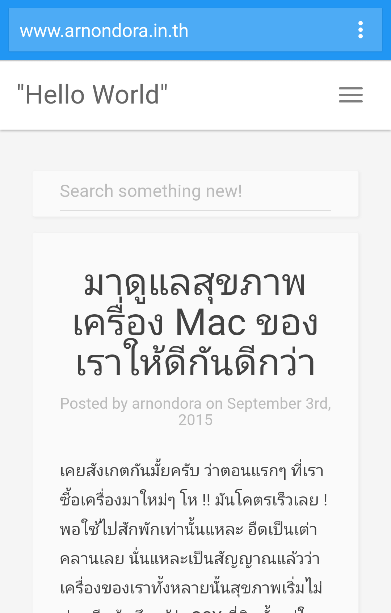

หลังจากเมื่อเดือนมิถุนาที่ผ่านมาก็ได้ อัพเกรด ย้ำว่า อัพเกรด เว็บใหม่หมด ยกเครื่องกันรัวๆ แต่วันนี้ไม่ได้มาอัพเกรด แต่แค่อัพเดทพอ ทำไมไหว lol ส่วนใหญ่ก็จะเป็นการจัดการเรื่อง Performance เป็นสักส่วนใหญ่ เพราะไปเห็นเว็บอื่นแล้วเกิดอารมณ์ "อิจ" เพราะเว็บเขาเร็วกันมากๆ เลย อยากได้บ้างเลยจัดซะเลย มาดูกันว่า การอัพเดทครั้งนี้มีอะไรบ้าง!

#### เพิ่ม Tag meta theme-color เรียบร้อยแล้ว

[][0]

อันนี้จะไม่ค่อยได้เห็นผลกันเท่าไหร่ เว้นแต่ว่า จะเป็นคนที่ใช้ Chrome ใน Android เปิด จะสังเกตได้ว่า ที่แถบ address bar และ system bar จะเปลี่ยนสีเป็นสีฟ้า น้อววว ที่ต้องเป็นสีฟ้า เหตุผลง่ายมากๆ เพราะผมชอบสีฟ้า จบนะ!

#### ในที่สุดเว็บเราก็มีไอคอนเป็นของตัวเองแล้ว!!!

คืออยากทำมานานแล้ว ไอคอนเนี่ย เมื่อวันก่อนนึกคึกอะไรก็ไม่รู้ เลยทำซะเลย ที่มาของมันก็ ไม่มีอะไรเลย ตัว A มาจากชื่อผมเอง และแน่นอนว่า เราเป็นโปรแกรมเมอร์ สิ่งที่คนทั่วๆ ไปน่าจะนึกถึงคือ พวกวงเล็บอะไรก็ไม่รู้เต็มไปหมดเลยเอามาเล่น เป็นหน้าคนซะเลย เหมือนกับที่เราเล่นกันในอินเตอร์เน็ต เช่น :) ก็จะเป็นหน้ายิ้มอะไรแบบนี้ น่ารักดี

#### Optimise Image!

[][1]

Traffic ส่วนใหญ่ที่เราใช้โหลดกันตอนนี้ ก็น่าจะมาจากไฟล์รูปนี่แหละ ซึ่งเว็บนี้ก็เช่นกัน ก็เลยจับมันมาย่อซะเลย โดยใช้เว็บ [tinyPNG][2] ที่เคยเอามาให้ดูตอน [PNG VS JPG][3] เพื่อลดขนาดของไฟล์ภาพ เอาจริงๆ ก็ลดไปได้อยู่พอสมควรเลยทีเดียว คุ้มมากๆ

#### เราเปลี่ยนไปใช้ Webp เกือบทั้งหมดแล้วนะ

Webp มันเป็นมาตราฐานไฟล์ใหม่ของรูปภาพที่ Google ออกมาเพื่อสู้กับ JPG และ PNG โดยเฉพาะกันเลยทีเดียว ด้วยขนาดไฟล์ที่สามารถบีบอัดได้มากกว่า ในคุณภาพที่ใกล้เคียงกันกับ JPG และสามารถทำไฟล์ใสได้ด้วย ด้วยคุณสมบัติทั้งหลาย เหล่านี้ทำให้เว็บเราเลือกใช้มันมาได้สักพักแล้วล่ะ ตอนนี้ก็ได้ทำการแปลงไฟล์ภาพประมาณ 90% มาใช้ Webp หมดแล้ว

#### รองรับ HiRes Display เต็มตัวแล้ว
ถ้าใครที่เข้ามาอ่านหน้าเว็บผมแล้วใช้ความละเอียดของหน้าจอสูงๆ โดยเฉพาะเครื่อง Mac ที่เป็น Ratina Display เวลาดูภาพในเว็บมันจะหงุดหงิดหน่อยๆ เพราะว่ารูปที่ผมอัพขึ้นไปมันเล็กซะเหลือเกิน แต่ตอนนี้ภาพบางส่วนผมได้อัพใหม่ให้มีขนาดใหญ่ขึ้น และเรียก [retina.js][4] มาช่วยจัดการเรื่องไฟล์ภาพอีกรอบนึง ทีนี้แหละพวกหน้าจอดีๆ จะได้เข้าเว็บดีๆ แบบนี้แล้ว อิอิ

#### Lighter a bit
ตัว Theme ของเว็บนี้นั่นคือ [Paper Theme][5] ที่ผมปล่อยอยู่ใน Github ตอนนี้ก็ได้รับการปรับปรุงทำให้ตัวหน้าเว็บมันค่อนข้างเบาขึ้นเล็กน้อยทำให้ใช้เวลา Render เร็วขึ้นและน้อย แต่ก็จะพยายาม Optimise ให้มันดีขึ้นไปเรื่อยๆ นะครับ

[0]: http://www.arnondora.in.th/wp-content/uploads/2015/09/newcolor-theme-2.png
[1]: http://www.arnondora.in.th/wp-content/uploads/2015/09/reducePNGFile.png
[2]: https://tinypng.com
[3]: http://www.arnondora.in.th/dev-tip-jpg-vs-png/
[4]: http://imulus.github.io/retinajs/
[5]: https://github.com/arnondora/wordpress-paper-theme
