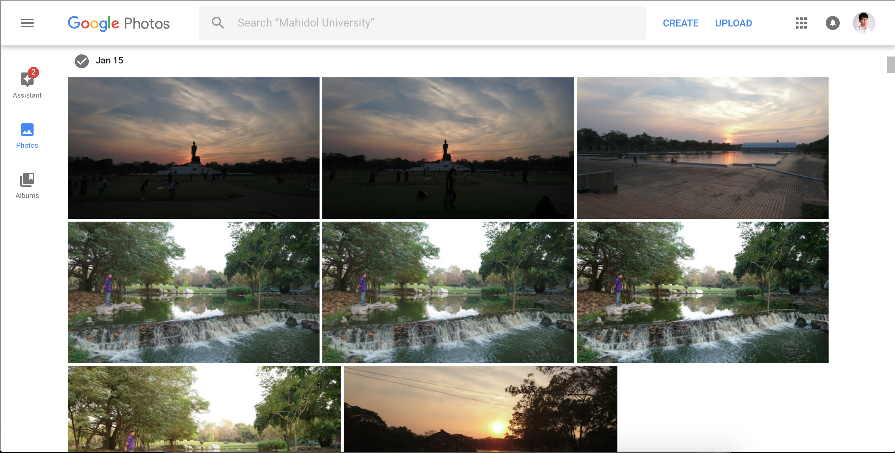
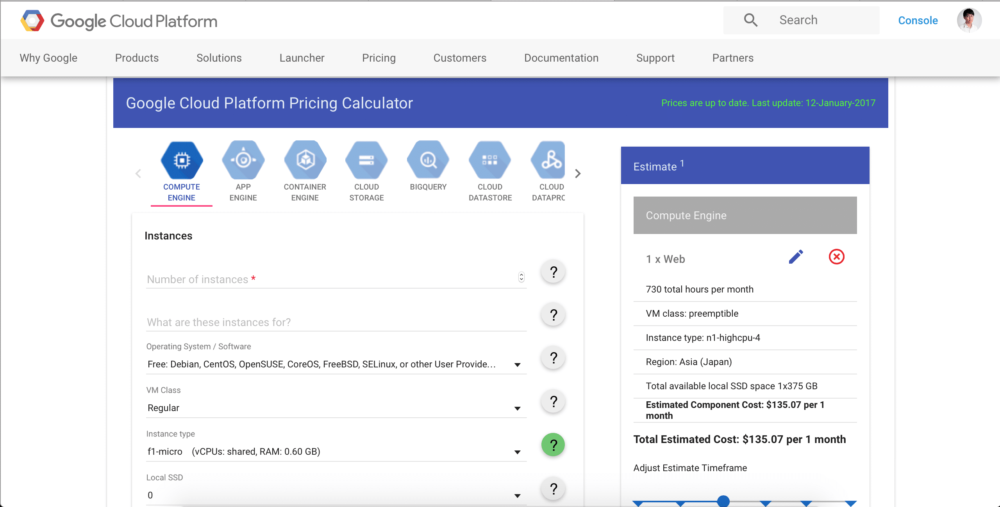
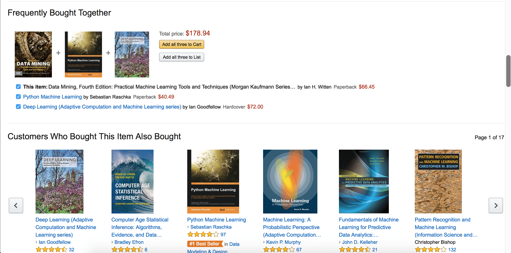
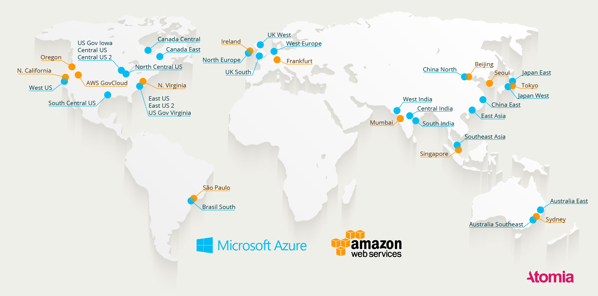

ทุกวันนี้เราคงปฏิเสธไม่ได้แล้วว่า เราอยู่ในยุคที่เราใช้ข้อมูลในการตัดสินใจสิ่งต่าง ๆ มากขึ้น (**Information-Driven**) จะเห็นได้ว่า ทุกวันนี้เราเสพข้อมูลมากแค่ไหน จากทั้ง Social Network และสื่อบนอินเตอร์เน็ตต่าง ๆ ทำให้สิ่งที่เรียกว่า **Cloud Computing** เข้ามาเป็นอีกหนึ่งปัจจัยในการดำรงชีวิตของเราไปโดยที่เราไม่รู้ตัวเลย ตั้งแต่ที่เราตื่นนอน จนไปถึงเรานอนอีกวันนึงเลย

#### Cloud Computing คืออะไร ?
จริง ๆ คำ ๆ นี้ก็มีหลาย ๆ คนได้ในคำนิยามไว้เยอะมาก แต่ผมขอให้คำนิยามว่า **มันเป็นการเก็บ ประมวลผล และเรียกใช้ ข้อมูลจากที่ไหน และเมื่อไหร่ก็ได้** เหมือนกับก้อนเมฆที่ลอยอยู่บนท้องฟ้า

#### ย้อนกลับไปหน้านั้นหน่อย
จริง ๆ ก่อนคำว่า Cloud Computing จะเข้ามา มันมีอีกคำก่อนหน้านั้นอีกนั่นคือ **Client-Server** ที่จะมี Server ไว้สักตัวออนไลน์เอาไว้ และให้ผู้ใช้ที่เป็น Client เข้ามาในระบบเพื่อดึง หรือบันทึกข้อมูลลงไปได้ ตามที่ผู้พัฒนาได้โปรแกรมไว้

แต่วิธีนี้เองก็มีข้อเสีย เพราะถ้าเกิด Server ที่เก็บข้อมูลนั้นล่มขึ้นมา ตัว Client ก็จะไม่สามารถเข้าถึงข้อมูลใด ๆ ได้เลย หรือในกรณีที่แย่ที่สุดคือ Server เกิดความเสียหายจนทำให้ข้อมูลหายไป

อีกหนึ่งข้อเสียคือ การเข้าถึงข้อมูล ถ้า Server ตั้งอยู่ที่ USA และเราที่อยู่ประเทศไทย ต้องการจะเข้าถึงข้อมูลนั้น ก็จะเป็นไปได้ด้วยความเร็วที่ต่ำ **เพราะกว่าข้อมูลจะวิ่งข้ามทะเลมาหาเราย่อมใช้เวลามากกว่า ดึงข้อมูลจากหน้าปากซอยบ้านคุณแน่นอน** และ Server เองก็ไม่สามารถที่จะตั้งหลายที่ได้ขนาดนั้น เพราะด้วยเหตุผลเรื่องของเงินทุน และการลงทุนที่ต้องใช้เม็ดเงินที่สูงพอตัวอยู่ในการวาง Server สักที่นึง (Site)

#### เพราะแบบนี้ Cloud Computing จึงเริ่มเข้ามา
ด้วยเหตุผลเมื่อครู่ ก็เป็นหนึ่งในเหตุผลที่ทำให้ Cloud Computing เกิดขึ้นมา โดยเราจะสามารถแบ่งประเภทของ Cloud ตามลักษณะการให้บริการ ได้ใหญ่ ๆ อยู่ 3 ประเภทด้วยกัน

* **IaaS** หรือ **Infrastructure-as-a-Service** ที่จะเป็นลักษณะในการเช่าเครื่อง โดยเราสามารถเลือก ระบบปฏิบัติการ และโปรแกรมต่าง ๆ ตามที่เราต้องการได้ทั้งหมด โดยผู้ให้บริการจะทำการจัดเตรียม เครื่องหรือทรัพยากรต่าง ๆ ให้เราเท่านั้น ตัวอย่างเช่น Amazon AWS, Digital Ocean เป็นต้น
* **PaaS** หรือ **Platform-as-a-Service** ที่เป็น Layer ที่สูงขึ้นมาหน่อย เพราะทางผู้ให้บริการจะจัดเตรียมเครื่องและสิ่งที่จำเป็นมาให้เราทั้งหมด ซึ่งทำให้เราสามารถโฟกัสกับ Application ของเราได้มากขึ้น ไม่ต้องกังวลในเรื่องของ Infrastructure (Resource เช่น CPU, RAM และเวอร์ชั่นของ OS ที่ใช้รัน) ตัวอย่างเช่น Microsoft Azure, Google
* **SaaS** หรือ **Software-as-a-Service** ที่เป็นประเภทที่ทุกคนน่าจะเคยใช้กัน แต่ไม่รู้ว่ามันคือ SaaS เช่น Microsoft Office 365, Google Drive, iCloud, Saleforce ที่เป็น Software ให้เราได้ใช้งานได้เลย โดยที่เราไม่ต้องกังวล หรือหาคนมาดูแล Infrastructure และคนมาสร้าง Application ให้เรา เพราะทุกอย่างได้ถูกจัดเตรียมมาโดยผู้ให้บริการเรียบร้อยแล้ว

หรือสามารถแบ่งตามลักษณะการใช้งานได้อีก 3 ประเภทคือ

* **Public Cloud** คือ Cloud ที่เปิดให้บริการกับผู้ใช้ทั่วไป โดยมีการแบ่งทรัพยากรกัน คือเป็นใครก็ได้เข้ามาขอเช่า ซึ่งการให้บริการในลักษณะนี้อาจจะไม่เหมาะกับธุรกิจที่มีการเก็บข้อมูลที่เป็นความลับสูง ๆ อย่างธนาคารเท่าไหร่ เพราะเราต้องเก็บข้อมูลไว้กันคนอื่น
* **Private Cloud** คือ Cloud ที่องค์กรนั้น ๆ เป็นผู้เปิดเอง เพื่อนำมาใช้ภายในองค์กรเท่านั้น
* **Hybrid Cloud** คือ Cloud ลูกผสมระหว่าง Public Cloud กับ Private Cloud ที่จะมีข้อมูลส่วนหนึ่งวิ่งและเก็บอยู่ภายใน Private Cloud เพราะข้อมูลมีความอ่อนไหว (ไม่รู้จะใช้คำว่าอะไรเลย) ไม่สามารถเก็บไว้บน Public Cloud ได้ และมีบางส่วนที่เก็บไว้บน Public Cloud

ทุก ๆ วันนี้มี Cloud Computing เปิดให้บริการอยู่หลายเจ้าด้วยกัน ถ้าเป็นเจ้าใหญ่ ๆ ก็จะเป็น **Microsoft**, **Google** และ **Amazon**

#### เราได้ประโยชน์อะไรจาก Cloud Computing ?
ประโยชน์จาก Cloud Computing นี่**คิดได้ทั้งวันก็ไม่หมดเลยครับ** หลัก ๆ จะเป็นเรื่องของการลดต้นทุนให้กับองค์กร เพราะไม่ต้องซื้อและดูแล Server เป็นจำนวนมาก เพียงแค่เช่าซื้อ เมื่อต้องการ และปรับลดขนาดตามความต้องการ ณ เวลานั้นได้ทันที

ทำให้เราสามารถ สร้างระบบใหม่ขึ้นมาใช้ได้อย่างรวดเร็ว ถ้าเป็น Server ของตัวเอง เมื่อเราทำการสร้าง Application หรือระบบใหญ่ ๆ ขึ้นมา อีกหนึ่งขั้นตอนที่สำคัญคือการ Deploy ขึ้น Production Server ที่กว่าเราจะเตรียมเครื่องเสร็จคงใช้เวลาไม่น้อย แต่ถ้าเปลี่ยนมาใช้ Cloud เวลาในการเตรียมจากเป็นหลัก วัน หรือสัปดาห์ (ในระบบที่มีขนาดใหญ่มาก ๆ) จะเหลือเพียงแค่หลัก วินาที ถึงนาทีเท่านั้น ส่งผลให้สามารถลด **Operation Cost** ได้แบบถล่มทลาย

เมื่อเราทำการกองข้อมูลรวมกัน ทำให้ Cloud นั้นเหมือนกับ กองข้อมูลขนาดใหญ่ ที่สามารถเอามาทำอะไรได้มากมาย ตัวอย่างเช่น **Google Photo** ที่ให้เราสามารถอัพโหลดรูปภาพได้ฟรี แต่จริง ๆ แล้ว Google ก็ได้รูปภาพมาให้คอมพิวเตอร์ของ Google เรียนรู้ ทำให้มันสามารถสร้างภาพ หรือบอกได้แม้กระทั่งว่าในรูปภาพนั้นมีอะไร ถ้าในฝั่งของ Computer Science คือเรื่องขอ **Artificial Intelligence (AI)** ที่จะเข้าเป็นส่วนสำคัญกับชีวิตประจำวันของเราในอีกไม่ช้า

#### Cloud Computing ปลอดภัยแค่ไหน ?
แน่นอนว่า การที่เราสามารถเข้าถึงก้อนเมฆของเราได้ตลอดเวลา ผู้ไม่ประสงค์ร้าย (Hacker) ก็สามารถโจมตีเราได้ตลอดเวลาเช่นกัน ฉะนั้นเรื่องของระบบรักษาความปลอดภัยจึงเป็นอีกหนึ่งเรื่องที่สำคัญมาก

ในระบบ Cloud ของผู้ให้บริการ Public Cloud เจ้าใหญ่ ๆ ในปัจจุบัน ก็มีระบบรักษาความปลอดภัยที่ค่อนข้างจะแข็งอยู่แล้ว เผลอ ๆ มากกว่าบางระบบที่ธุรกิจรายเล็ก ๆ ใช้อยู่ซะอีก

แต่ในบริษัทที่ใหญ่มาก ๆ มันคนละเรื่องกัน เพราะพวกเขามี **เงิน** ในการลงทุนซื้อ Server และระบบรักษาความปลอดภัยมาใช้เอง ฉะนั้นการเก็บข้อมูลเองในบริษัทอาจจะปลอดภัยกว่าการเก็บไว้บน Public Cloud อาจจะทำให้บริษัทใหญ่ ๆ พวกนี้จะต้องตัดสินใจเลือก การใช้งานตามแต่บริษัทนั้นเอง

#### การเลือกใช้ Cloud ในองค์กร
อ่านมาถึงตอนนี้ บางคนก็น่าจะกำลังคิดว่า ถ้าองค์กรสักที่นึงต้องการเปลี่ยนมาใช้ Cloud จะต้องคำนึงถึงอะไรบ้าง ?

อย่างแรก และเป็นสิ่งที่สำคัญที่สุดคือ **การประเมินความลับของข้อมูล** ถ้าข้อมูลในองค์กรเราเป็นข้อมูลที่ต้องเป็นความลับ และมีความอ่อนไหวสูง การไปเช่า Public Cloud อาจจะไม่ใช่คำตอบเท่าไหร่ อาจจะมีการลงทุนเพื่อสร้าง Private Cloud หรือ อาจจะทำออกมาให้รูปแบบของ Hybrid Cloud เพื่อลดค่าใช้จ่ายก็ได้เช่นกัน

[][1]

เรื่องถัดมาคือเรื่องของ **ค่าใช้จ่าย** ใน Cloud Service นั้นจะมีรูปแบบการคิดเงินที่เรียกว่า **Pay-as-you-go** หรือก็คือ จ่ายเท่าที่ใช้ ซึ่งในเว็บของผู้ให้บริการ Cloud ก็จะมีหน้าสำหรับการคำนวณค่าใช้จ่ายล่วงหน้า ดังภาพด้านบนที่เป็นของ Google Cloud ที่เราแค่ป้อนว่าเราจะใช้อะไรบ้าง เท่าไหร่ ลงอะไรบ้าง ตัวเว็บก็จะคำนวณราคาออกมาให้เรา

จากเรื่องค่าใช้จ่ายจึงทำให้ไปในประเด็นต่อไปคือ **ความคุ้มค่า** อันนี้ก็อยู่ที่จะประเมินกันในองค์กรแล้วว่า การย้ายระบบขึ้น Cloud มันคุ้มรึเปล่า แต่กับ Startup และ ธุรกิจขนาดเล็กที่ยังไม่ค่อยได้มีทรัพยากรทางด้านไอทีมาก การหันมาใช้ Cloud ก็เป็นอีกหนึ่งทางเลือกที่ดี เพราะเราไม่ต้องจ้างคนเพิ่มมาดูแลระบบให้เรามากนัก และราคาในการเช่าก็ถูกมากกว่า การซื้อ Server ทั้งเครื่องมารัน ไหนจะค่าไฟ ค่าอุปกรณ์ และอีกหลาย ๆ ปัจจัยที่อาจจะเกิดขึ้นได้ เช่น Server มีขนาดไม่พอรองรับคน ณ ขณะนั้น หรือไฟดับอะไรขึ้นมา

#### Case Study : Cloud Computing กับ CRM ในยุคปัจจุบัน
ในยุคปัจจุบันที่คอมพิวเตอร์เล็กและราคาถูกลง และอินเตอร์เน็ตกลายเป็นปัจจัยพื้นฐานของผู้คนในปัจจุบัน ทำให้จำนวนคนที่สามารถเข้าถึงอินเตอร์เน็ต นั้นเพิ่มสูงขึ้นเรื่อย ๆ และทำให้เกิดอีกสิ่งที่ทำให้โลกอินเตอร์เน็ตนั้นเดินหน้าต่อไปได้นั่นคือ **User Generated Content (UGC)** หรือข้อมูลที่ User เป็นผู้สร้างนั่นเอง

สิ่งที่เกิดขึ้นตามมาคือ เรามีข้อมูลจำนวนมากวิ่งผ่านอินเตอร์เน็ตของเรามากขึ้นเรื่อย ๆ ซึ่งข้อมูล (Data) เหล่านี้ ถ้าแค่วิ่งผ่านมันอาจจะไม่มีค่าอะไร แต่ถ้าเราสามารถค้นหาความหมายจากข้อมูลนั้นและแปลงมันให้กลายเป็น ข้อมูลที่สามารถนำไปใช้ต่อได้ (Information) มันจะช่วยพลักดันในภาคธุรกิจมากแค่ไหนเชียว

ทุกวันนี้ หลาย ๆ บริษัทใหญ่ ๆ ก็เริ่มเปลี่ยนแปลงเพื่อตอบรับกับเทรนดังกล่าว โดยเริ่มนำข้อมูลของลูกค้ามาประมวลผล เรียนรู้ เพื่อสร้างประสบการณ์ที่ดีที่สุดให้กับลูกค้าของตน อาจจะมองภาพไม่ออก ลองมาดูตัวอย่างกันดีกว่า

คงไม่มีใครในที่นี้ไม่รู้จักเว็บ **E-Commerce** ชื่อดังอย่าง Amazon แน่นอน เพราะเขาขายของมันแทบจะทุกอย่าง แต่ต้นจริง ๆ ของเขาเกิดจากการเป็นเว็บเพื่อขายหนังสือ ในตอนนี้ Amazon มีสำนักงาน และ Werehouse อยู่หลายแห่งทั่วโลก พร้อมกับมีหลาย ๆ บริการ เช่น **Amazon Fulfillment** ที่เป็นบริการ จัดการ และส่งสินค้าให้กับผู้ขายในที่ต่าง ๆ ทั่วโลก และตัวบริษัท Amazon เองก็ต้องรับลูกค้าเป็นจำนวนมากทุกวัน หนักกว่านั้นคือช่วงเทศกาลที่คนแห่เข้ามาสั่งซื้อของเข้ามาเป็นจำนวนมากกว่าปกติถึงหลายเท่าตัว

ถ้าเราเข้าไปซื้อของในเว็บ Amazon ในหน้าแรกเลย จะเห็นสินค้าที่เราเคยค้นหา หรือเกี่ยวข้องกับสิ่งที่เราเคยค้นหามาก่อน วางอยู่บนหน้าแรก สร้างกิเลสให้เราเข้าไปกดซื้อกันเลยทีเดียว

หรือถ้าเราเข้าไปในหน้าของลายละเอียดสินค้านั้น ๆ เลื่อนลงมาหน่อย ก็จะเจอประมาณว่า ซื้อพร้อมกัน 3 ชิ้นนี้สิ ลดราคาด้วยนะ มันก็ตามมาสร้างกิเลสของเราไปเรื่อย ๆ (มือมันสั่นไปหมด อยากกด Purchase) กันเลยทีเดียว

สิ่งที่ต้องการจะบอกคือ ถ้าเป็นเมื่อก่อน จริงอยู่ที่เราอาจจะเก็บ Transaction ในการเข้าถึงเว็บไซต์ของลูกค้าแต่ละคนได้ แต่คงจะไม่มีพลังในการประมวลผลที่เพียงพอในการจะแนะนำสินค้าที่เหมาะกับคนทีละคน เป็นจำนวนหลายแสนคนได้แน่ ๆ (จะไม่ขอพูดถึงเบื้องหลังว่ามันทำงานยังไงนะ บทความนี้เราให้มนุษย์อ่านนะจา)

แต่ด้วย Cloud Computing การประมวลผลข้อมูลในระดับนี้มันจะหลายเป็นเรื่องจิ๋วไปเลย เพราะคอมพิวเตอร์ที่มาใช้ในการประมวลผลมีจำนวนมากขนาดตั้งเป็น Data Centre กันเลยทีเดียว และไม่ได้มี Data Centre ที่เดียว แต่มีอยู่หลายที่กระจายอยู่ทั่วโลกเลย

ซึ่งใน Case นี้ Cloud Computing ทำให้เกิดสิ่งที่เรียกว่า Customer Personalisation ขึ้นมา ทำให้ลูกค้านั้นมีประสบการณ์การใช้งานที่ดียิ่งขึ้น และระบบนี้ได้เพิ่มยอดขายให้กับ Amazon ได้อย่างมหาศาล

## Case Study : Amazon EC2
อย่างที่บอกไปใน Case Study ว่า Amazon นั้นต้องรับลูกค้าที่เข้ามาซื้อของเป็นจำนวนมากแต่ละวัน ซ้ำร้ายกว่านั้น ในช่วงเทศกาล จะมีผู้เข้ามาซื้อของมากกว่าปกติหลายเท่าตัว ทำให้อาจจะประสบปัญหา Server ไม่สามารถรองรับจำนวนคนใช้ที่มากขนาดนั้นได้

ทำให้ Amazon ต้องหาทางแก้ไขปัญหานี้ โดยการ ซื้อ Server เพิ่มมันเลย (ก็ใหญ่นิ เงินหนา ซื้อออะไรก็ได้ ~~ ) แต่มันทำให้วิ่งไปหาอีกปัญหาอีก เพราะคนจะเข้ามาใช้เยอะในช่วงเทศกาลเท่านั้น แต่เทศกาลมันไม่ได้มีทุกวันนี่หว่า !!

มันทำให้ Amazon ต้องเสีย Operation Cost ในการดูแล Server ทั้งหมด แต่ใช้อยู่ไม่ถึงครึ่งเท่านั้น มันจะกลายเป็นการสิ้นเปลืองไปเลย

ในเมื่อ Processing Power มันเหลือในช่วงที่ไม่ใช่เทศกาล Amazon ก็เอามาเปิดให้บริการเป็น Cloud ซะเลยในชื่อของ [**Amazon EC2**][7] จนถึงตอนนี้ Cloud ของ Amazon ก็กลายเป็น Cloud Provider อีกหนึ่งเจ้าที่ได้รับความนิยมอยู่สูงมาก

#### สรุป
จากที่ได้เล่ามาทั้งหมดเป็นบอกได้เลยว่า Cloud Computing เป็นเทคโนโลยีที่กำลังมาแรง และเข้ามามีบทบาทกับชีวิตประจำวันของเรา ในทุกขณะที่เรายังเสพข้อมูลจากโลกอินเตอร์เน็ตอยู่ มันซ่อนอยู่โดยที่เราไม่รู้ตัวเลยว่าเรากำลังใช้งานมันอยู่ และเปลี่ยนชีวิตของเราไปได้อย่างไร ทางฝั่งของธุรกิจ ก็ทำให้สามารถเข้าใจฐานลูกค้าของตนเองได้มากขึ้น ส่งผลให้ธุรกิจสามารถทำกำไรได้มากขึ้นเหมือนกับที่ยกตัวอย่าง Amazon ไป เขียนมายาวมาก (ยาวกว่าบทความปกติที่เขียน) และก็หวังว่าบทความนี้จะมีประโยชน์กับผู้ที่สนใจนะครับ สำหรับวันนี้สวัสดีสวีดัสครับ

[7]: https://aws.amazon.com/ec2
