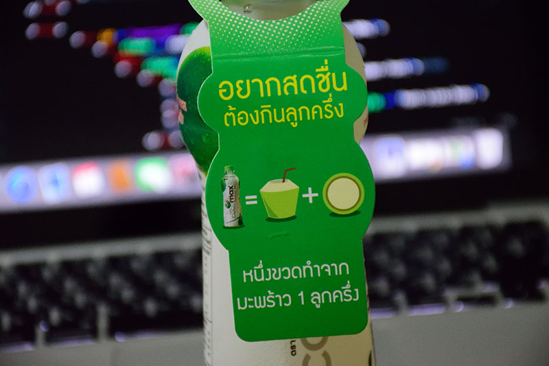

เมื่อ 2-3 สัปดาห์ก่อน อากาศร้อน ๆ ก็เข้าไป 7-11 เพื่อหาซื้อน้ำอะไรดื่มตามปกติ แต่ก็ไปสะดุดตากับขวด น้ำมะพร้าวแบรนด์นึงอยู่ในตู้เย็นที่ร้าน เลยจัดมาเลย แต่ไหน ๆ ก็จัดมาแล้ว ก็เอามารีวิวซะเลยว่า มันกินได้มั้ย ?
เอาจริง ๆ ก่อนหน้านั้นไม่นาน ก็เคยเจอ น้ำมะพร้าวแบนด์นี้ขายอยู่ใน Top แล้วล่ะ แต่ไม่นึกว่ามันจะมาขายยันร้านขายทุกอย่าง อย่าง 7-11 เลยจริง ๆ

จริง ๆ ขวด การบรรจุ ผมว่า เขาทำมาได้ดีเลยนะ อีกทั้ง Design ขวดที่ดู สลิม ผอม สวยงาม น่าจับต้องเช่นนี้ (เดี๋ยวนะ นี่พูดถึงอะไร ?) มันทำให้สะดุดตามากในตู้เย็นตามร้านขายของทั่วไป

ตอนที่เห็นในโฆษณาครั้งแรก เขาบอกว่า**"น้ำมะพร้าวลูกครึ่ง"** ตอนแรกก็นึกว่า มะพร้าวพันธุ์อะไร ลูกครึ่งอะไร ไทย-เกาหลี เหรอ ? (มุข 5 บาท 10 บาทก็เล่นเนอะ) อ่อที่ไหนได้ มันผลิตมาจาก มะพร้าว 1 ลูก กับอีกครึ่งลูกนั่นเอง ตรง ๆ เลย ผมก็ชอบ Design ขวดมันนะ ดูสลิม สวย จับง่าย ล่อลวงลูกค้าได้ดีเลยล่ะ ชอบ !!!

แต่ความเจ๋งของมันเลยคือ มันเป็น น้ำมะพร้าว 100% ที่ไม่ใส่วัตถุกันเสีย ที่กินแล้วเหมือนน้ำมะพร้าว 100% จริง ๆ เพราะความหวานของมันธรรมชาติมาก ไม่ค่อยหวานเหมือนกับเจ้าอื่นเลย เรียกกว่า แทบจะไม่หวานเลยดีกว่า

อันนี้ตกใจจริง ถึงแม้ว่า มันจะไม่ใส่วัตถุกันเสีย แต่อายุมันยาวมาก ปีนึงเลย !! หมดอายุอีกทีปีหน้าโน้นเลย โคตรนานอะ แต่เขาก็เขียนนะว่า ถ้าเปิดแล้วควรที่จะดื่มให้หมดใน 1 วันเท่านั้น แต่ถ้ายังไม่เปิดก็ลองเลยครับ เก็บไว้ปีนึงไปเลย

ถึงแม้ว่า มันจะเป็นน้ำมะพร้าวบรรจุขวด ไม่ใช่มะพร้าวที่พึ่งเฉาะออกจากลูกสด ๆ แต่คุณค่ามันก็อยู่ครบ แต่ก็อย่างที่เรารู้กันดีว่า น้ำมะพร้าวมีโพรแทสเซียมสูง ฉะนั้นคนที่เป็นโรคไตก็ไม่ควรที่จะดื่มเยอะมาก เพราะอาจจะทำให้ไตเราทำงานหนัก แต่กับคนทั่วไปก็ดื่มไปได้เลยครับ มีประโยชน์ !! มีประโยชน์ตั้งแต่เรามีชีวิต ยันตายอะ

เขียนอะไรมาเยอะแยะ มาดื่มกันเลยดีกว่า อันนี้ก็ซื้อมาจาก 7-11 แล้วเอากลับมาแช่เย็นให้มันเย็นจัด ๆ เลย มาชิมเลย...

มันก็น้ำมะพร้าวอะ แต่รสชาติมันจะไม่ใช่มะพร้าวน้ำหอมที่ หอม ๆ หวาน ๆ จัด ๆ นะ มันจะออก กลิ่นและรสชาติอ่อน ๆ ออกไปทางมะพร้าวเผาลูกเล็ก ๆ มากกว่า รอบที่มารีวิวนี่ก็กินเป็นรอบที่ 2 แล้ว แต่รอบแรกไม่ได้กินตอนที่มันเย็นเท่าไหร่ แต่รอบนี้กินตอนมันเย็น รสชาติมันดีกว่าจริง ๆ

แต่จะให้ทุกคนชอบก็ไม่ได้เนอะ ผมก็เป็นคนนึงที่ไม่ชอบ ก็ต้องไปซื้อมะพร้าวน้ำหอมเป็นลูก ๆ กันต่อไป

1 ขวดราคา 25 บาท ก็ถือว่าคุ้มมากเลยนะ สำหรับน้ำมะพร้าวบรรจุขวดเนี่ย แนะนำว่า ซื้อมาแล้วให้ไปแช่ช่อง freeze สักแปบนึงแล้วค่อยเอาออกมาดื่ม รสชาติมันจะโอขึ้นเยอะเลย

ยังไงก็ลองหาดื่มดูนะครับ เป็นยังไงมาบอกด้วย อยากรู้ว่าคนอื่นจะว่ายังไง สำหรับวันนี้แค่นี้ บ๊ายบาย ~~
