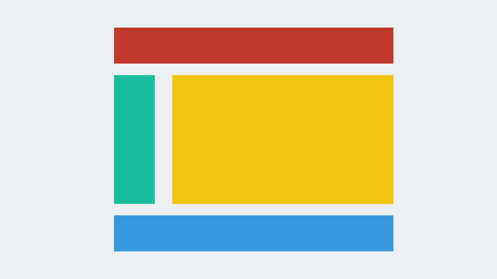
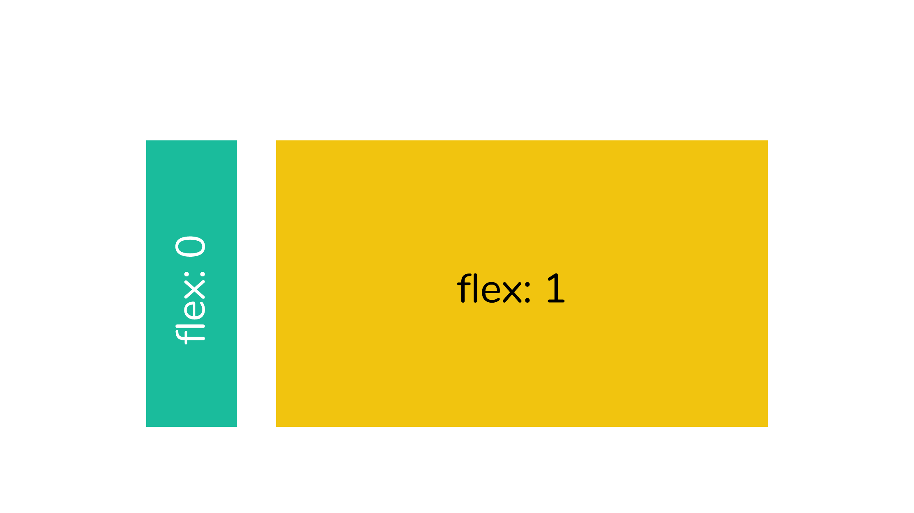

เมื่อก่อนยอมรับเลยว่า เป็นคนที่เขียน CSS ไม่ค่อยได้เลย จนกระทั่งไปฝึกงานมา ทำให้ได้เขียน CSS แบบรัว ๆ โดยที่ไม่ได้ใช้ Bootstrap อีกเลย และทำให้ได้รู้จักของเทพอย่าง CSS Flexbox

## CSS Flexbox คืออะไร ?

CSS Flexbox มันเป็น Layout Mode ที่มาใน CSS3 ถ้าเราเคยเขียน CSS มาก่อน เราน่าจะคุ้นเคยกับคำว่า **display** เป็นอย่างดี แต่เวลาผ่านไปเว็บมันก็เปลี่ยนไปตามยุคสมัย เว็บสมัยนี้ซับซ้อน เลยทำให้ Flexbox เกิดขึ้นมาเพื่อให้การจัด Layout ทำได้ง่ายขึ้น ถ้าเราคุ้นเคยกับการใช้ CSS Framework ยอดนิยมอย่าง Bootstrap เราก็น่าจะคุ้นเคย Concept ที่ฮิตกันมากอย่าง Grid ที่มันจะจัดการความกว้างของสิ่งของในหน้าจอตามขนาดโดยอัตโนมัติ

CSS Flexbox นี่ก็ให้อารมณ์เหมือนกันเลย โดยในนั้นมันจะประกอบด้วย 2 ส่วนใหญ่ ๆ คือ **flex container** และ **flex items** **Flex container** ก็ตามชื่อเลย มันเป็น container สำหรับใส่ **Flex items** อาจจะงง แต่อ่านไปเรื่อย ๆ ก่อน ปมมันจะค่อย ๆ คลายออกมาเองนะ เอาให้ งง เข้าไปอีก Parent ของ Flex Items ก็จะเป็น Flex Container นั่นเอง

ทีนี้ใน Flex Container เราสามารถที่จะเซ็ตค่าหลาย ๆ อย่างให้มันได้ เช่น **flex-direction** ไว้สำหรับบอกว่าเราจะให้ Item มันเรียงยังไง เป็นแถว หรือ เป็นหลัก (เป็น Column อะ ไม่รู้ภาษาไทยมันเรียกอะไร) หรือจะจัด Content ซ้าย ขวา กลาง ล่าง อะไรก็แล้วแต่ จากนั้นใน Container เราก็จะมี Item วางกองรวมกันอยู่ เราก็สามารถที่จะใช้ **align-self** ในการทำให้ item นั่น ๆ อยู่ในที่ที่เราต้องการได้ หรือ จะเป็นขนาดโดยการใช้ **flex-grow** เช่นเราใส่ 2 ลงไปใน Item นึงแล้วแต่เหลือใส่ 1 ขนาดของอันที่ใส่ 2 ก็จะใหญ่กว่าเป็น 2 เท่าของอันอื่น ๆ นั่นเอง Concept ของ Flexbox มันจะมีประมาณนี้แหละ เชื่อว่าอาจจะ งง ๆ กันว่าจะเอาไปใช้ได้ยังไง เดี๋ยวไปดูตัวอย่างกันดีกว่า

## Example with Holy Grail Layout

ในการยกตัวอย่าง **Holy Grail Layout** น่าจะเป็นตัวอย่างที่ชัดเจนและ Classic ดี โดยในหน้าเว็บเราจะมี Header, Menu, Content และ Footer ตามภาพด้านบน เอาละทีนี้ ถามว่าเราจะเริ่มจากตรงไหนดี ถ้าเราสังเกต Requirement ของเราจะเห็นว่า หน้าของเรา มันจะเรียงจากบนลงล่าง และถ้าจำได้ใน Container เราจะสามารถเซ็ตได้ว่าใน Item ที่อยู่ใน Container นั่น ๆ เรียงตั้งหรือนอนได้ ฉะนั้นเราจะเริ่มด้วยการ ตั้ง Container แรกก่อนที่เป็น Container รวมที่เก็บทุกส่วนของหน้าเว็บก็จะเป็นแบบด้านล่างนี้ ` .container { display: flex; flex-direction: column; height:100%; } ` อธิบายสักเล็กน้อย ก็เริ่มจากการบอกว่า เราจะขอใช้ Flexbox โดยที่เราจะให้ Item มันเรียงเป็น Column ลงไปเรื่อย ๆ และให้ความสูงของหน้าเป็นสุดหน้าเลย คือสุดหน้าเลย

ทีนี้ถ้าเราโยน Item เราลงไปก็จะเป็นเหมือนภาพด้านบน พอจะจินตนาการออกรึยังครับ Item แรกก็น่าจะเป็น Header ถัดลงมา ก็น่าจะเป็น Menu กับ Content ในแถวเดียวกัน และแถวสุดท้ายคือ Footer เราจะเห็นว่า Header และ Footer มันตรงกับที่เราต้องการละ เหลือแค่ Menu กับ Content ละ ที่เรายังไม่ได้แยก เราก็จะมาแยกมันกัน โดยการให้ Item ที่ 2 ของ Container ทำหน้าที่เป็น Container ลูกไป แต่ครั้งนี้เราจะให้มันเรียงลูกของมันเป็น แถว เพราะเราต้องการให้ Content อยู่ข้าง ๆ Menu ไม่ใช่อยู่ข้างล่าง ` .child-container { display: flex; flex-direction: row; } ` Code ด้านบนค่อนข้างจะตรงไปตรงมา นั่นคือเราบอกว่า เราจะใช้ Flexbox และให้เรียง Item ในนั้นเป็นแนวนอนไปเรื่อย ๆ ปัญหาถัดไป ใน Item ของ Menu และ Content เราอยากให้พื้นที่ในการแสดง Content มันใหญ่กว่า Menu เราจึงต้องมากำหนดขนาดของ Item ทั้ง 2 นี่กัน `.menu { flex-grow: 0; }` `.content` ` {` `   flex-grow: 1;` ` }` อันนี้อาจจะ งง ๆ หน่อย ๆ ว่า 0 ต่างจาก 1 ยังไง อธิบายง่าย ๆ ว่า flex-grow มันคือการบอกว่า เราจะให้ Item มันมีขนาดเท่าไหร่ เช่นในที่นี้เราบอกไปใน Container ที่มี Menu และ Content อยู่ว่าให้มันเรียง Item ในแนวนอน ฉะนั้น การกำหนด flex-grow ใน Item ก็จะเป็นการกำหนดความกว้างของ Item นั้น ๆ

ค่าเริ่มต้นของ flex-grow ถ้าเราไม่ใส่อะไรเลยมันจะเป็น 0 โดยอัตโนมัติคือ ขนาดจะวิ่งตามความยาว หรือความกว้างของสิ่งที่เราใส่ลงไป แต่ถ้าเป็นตัวเลขคือ ให้มันแบ่งพื้นที่ออกเป็นส่วน ๆ ตามผลรวมของเลข flex-grow ทั้งหมดใน Container นั้นเหมือนกับ Grid ใน Bootstrap ที่มี 12 ช่อง แต่อันนี้เราสามารถแบ่งเป็นกี่ช่องก็ได้ตามใจเราเลย ถามว่า ถ้าเราใช้ 0 กับ 1 พร้อมกันหมายความว่ายังไง ? มันจะเป็นว่า เราไม่สนใจว่า Menu จะยาวเท่าไหร่ก็ช่าง แต่ที่เหลือของแถวนั้นจะให้ Content ทั้งหมดเลย เพราะมันคือ 1 ส่วนใน 1 ส่วน หรือคือ 100% นั่นเอง จากตัวอย่างนี้น่าจะช่วยให้เข้าใจการทำงานของ CSS Flexbox มากขึ้นแล้ว เวลาเอาไปใช้จริง ๆ หลักการก็จะเป็นแบบที่ได้อ่านไปครับ ค่อย ๆ ประเมินว่า เราจะต้องทำ Container ตรงไหนบ้าง ค่อย ๆ เขียนไปครับ แรก ๆ มันจะอึน ๆ หน่อย ๆ เดี๋ยวก็ชินครับ

## ความสนุกเริ่มมา

หลังจากที่เราเข้าใจ Flexbox กันไปแล้ว หลายคนคงอยากลองใช้ อยากลองกันละ อย่างที่บอกไปว่า Flexbox นั้นมาพร้อมกับ CSS3 ที่ตอนนี้ ยังไม่ได้ถูกปล่อยออกมาเป็นมาตรฐานเหมือน CSS ตัวก่อนหน้า (Version 2.1) เลยทำให้ยังต้องเขียน Prefix กันอยู่ในบาง Browser แต่ครับแต่นี่ปี 2017 บนโลกเรามีสิ่งที่เรียกว่า **Autoprefixer** อยู่ ฉะนั้นใช้เถอะครับ ไม่ต้องไปนั่งเขียน Prefix เอง เอาตรง ๆ คือมันรก ใช้พวก Webpack หรือ Gulp อะไรก็ได้ที่ชอบเอามาทำให้เถอะครับ ชีวิตจะดีขึ้นเยอะเลย

## CSS Flexbox เป็นของมหัศจรรย์

ก่อนหน้าที่จะรู้จักกับ Flexbox บอกตามตรงเลยว่า การจัดหน้าเป็นอะไรที่ไม่ลำบากเท่าไหร่เพราะเราใช้ Bootstrap ฮ่า ๆ แต่ ๆๆ หลังจากที่ได้ใช้ Flexbox ชีวิตก็ดีขึ้นมาก (ทำไมมันเหมือนขายตรงจังฟร๊ะ !!) ตอนนี้เว็บของผมส่วนใหญ่ก็เริ่มทยอยเปลี่ยนไปใช้ Flexbox ทีละนิดละ ค่อย ๆ ตัด Materialize ออกไปทีละนิดเพราะมันหนัก หนักกว่าที่เราเขียน Flexbox เองซะอีก ช่วยได้เยอะมาก ๆ เลย ถ้าอยากดูว่าเราสามารถเล่นอะไรกับ Flexbox ได้บ้างลองอ่านที่ลิงค์นี้ได้เลย [A Complete Guide to Flexbox - css-tricks.com](https://css-tricks.com/snippets/css/a-guide-to-flexbox/)
