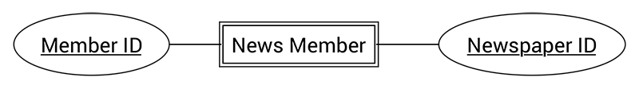

จาก EP. ที่แล้ว เราก็ได้รู้ว่า กว่าจะมาเป็น Database แบบที่เราใช้อยู่ทุกวันนี้ มันเริ่มมาจากอะไร และมีข้อดีข้อเสียอย่างไร
แต่วันนี้ เราจะไม่ย้อนเวลาแล้ว เราจะมองที่ปัจจุบัน มาดูกันว่า เวลาเราจะวาด ER Diagram ที่เขาวาด ๆ กันได้ยังไง แต่ก่อนหน้านั้น มันคืออะไร ?

## ER Diagram คืออะไร ?
ER Diagram เป็น แบบจำลองที่ใช้อธิบายโครงสร้างของฐานข้อมูลที่เราเขียนขึ้นมาในลักษณะของรูปภาพ เพื่ออธิบายความสัมพันธ์ของข้อมูล
การวาด ER Diagram เป็นขั้นตอนที่ค่อนข้างสำคัญมากในการออกแบบฐานข้อมูล นอกจากมันจะช่วย "กันหลง" ได้แล้ว มันยังทำให้ เราออกแบบฐานข้อมูลได้อย่างเป็นระบบ เพื่อป้องกันความผิดพลาดด้วย ถ้าเราทำงานกับฐานข้อมูลที่ใหญ่มาก ๆ ก็ควรที่จะเขียน ER Diagram มากเลย เพราะถ้าฐานข้อมูลใหญ่มาก ๆ ก็อาจทำให้เราเกิดความผิดพลาดในการทำงานได้ (ถ้ามันใหญ่จริง ๆ ใครมันจะไปจำโครงสร้างได้หมดล่ะ เนอะ ?)

## ส่วนประกอบของ ER Diagram
สำหรับแผนภาพ ER Diagram เราจะนำเสนอข้อมูลในรูปแบบของแผนภาพได้อย่างชัดเจน โดยจะมี

1. **Entity** - ถ้าเราเคยลองเล่นกับฐานข้อมูล เจ้านี่มันก็จะอยู่ในรูปแบบของ Table ใน Database หรือถ้าใครยังไม่เคยเล่น มันก็คือ ข้อมูลตัวหนึ่ง เช่น พนักงาน นักเรียน อะไรแบบนี้เป็นต้น
  1. **Strong Entity** - ข้อมูลชนิดนี้มันจะไม่ขึ้นกับ Entity อื่น ๆ เช่น สินค้า นักศึกษา พนักงาน เป็นต้น
  2. **Weak Entity** - คือข้อมูลที่เกิดจาก Entity อื่น ๆ เช่น เกรดของนักศึกษา เป็นต้น
2. **Attribute** - เราอาจเรียกว่า Field ในฐานข้อมูลก็ได้ มันก็คือ ข้อมูลที่ใช้อธิบายคุณสมบัติของ Entity ยกตัวอย่างง่าย ๆ ถ้าเรามี Entity สินค้า Attribute ของเราก็น่าจะมี รหัสสินค้า, ชื่อสินค้า และ ราคาสินค้าเป็นต้น
3. **Relation** หรือความสัมพันธ์ ก็ตามชื่อเลย มันคือ ความเกี่ยวข้องระหว่าง Entity หนึ่งกับ Entity หนึ่ง
เราลองมาดู ตัวอย่างกัน เราจะลองสร้าง ฐานข้อมูลเพื่อเก็บ การส่งหนังสือพิมพ์ให้ลูกค้า ก่อนอื่นมาดูที่ Entity แรกนั่นคือ Member ใน Entity นี้เราจะเก็บรายละเอียดของสมาชิกของเรา เพราะฉะนั้น Attribute ก็น่าจะมี เลขที่สมาชิก ชื่อ สกุล และที่อยู่ ถ้าเราเอา Entity นี้มาเขียนเป็น ER Diagram ก็จะได้ตามด้านล่าง

ถัดมา เราก็ต้องมี Entity อีกตัวเพื่อเก็บข้อมูลของหนังสือพิมพ์ เช่น รหัสหนังสือพิมพ์ ชื่อหนังสือพิมพ์ และ ราคา สามารถเอามาเขียน ER Diagram ได้ตามแบบข้างล่างได้เลย

หลังจากที่เราได้ ทั้ง 2 Entities ไปแล้ว เราก็จะมาดูที่อีก Entity นึง แต่ Entity นี้ออกจะพิเศษไปสักหน่อย เพราะว่า ข้อมูลของมันเกิดจาก ความสัมพันธ์ของ 2 Entities นั่นคือ  News Member ซึ่ง Entity นี้จะเก็บข้อมูลว่าสมาชิกของเรานั่น สมัครสมาชิก หนังสือพิมพ์อะไรไปบ้าง ดังนั้น Attribute เราก็ควรจะมี รหัสสมาชิก ที่มาจาก Entity Member และ รหัสของหนังสือพิมพ์ที่สมาชิก ได้สมัครไว้

และเราก็จับทั้งหมดมารวมกัน เราก็จะได้แบบด้านล่างเลย

แต่เราสังเกตจากตัวอย่างเมื่อกี้ ว่าสมาชิก 1 คนสามารถสมัครได้มากกว่า 1 หนังสือพิมพ์ ดังนั้นเรื่องของ ระดับของความสัมพันธ์ หรือ **Relationship cardinality** จึงถูกพูดขึ้นมา มันเป็นการอธิบายว่า ความสัมพันธ์อันนั้น ๆ มันมีความสัมพันธ์กันอย่างไร โดยเราจะมีอยู่ 3 รูปแบบด้วยกัน นั่นคือ

* **1-1 Relationship** หมายถึงข้อมูลเพียง 1 ข้อมูลใน Entity สัมพันธ์กับแค่ 1 ข้อมูล ของอีก Entity เท่าน้ัน เช่น คนขับรถ กับ รถ ที่รถ 1 คันก็จะต้องมี คนขับเพียง 1 คนเป็นต้น
* **1-many Relationship** หมายถึงข้อมูลเพียง 1 ข้อมูลใน Entity สัมพันธ์กับหลาย ๆ ข้อมูลของอีก Entity นึง เช่นตัวอย่าง สมาชิกหนังสือพิมพ์ที่ได้ยกตัวอย่างไป เราจะเห็นได้ว่า สมาชิก 1 คนสามารถสมัครสมาชิกของหนังสือพิมพ์หลาย ๆ ฉบับได้
* **many-many Relationship** ก็จะหมายถึงข้อมูลหลาย ๆ ข้อมูลใน Entity สัมพันธ์กับหลาย ๆ ข้อมูลของอีก Entity นึง เช่น นักเรียน หลาย ๆ คน สามารถลง วิชาเรียนเดียวกันได้ แต่ในทางกลับกัน วิชา 1 วิชาก็สามารถถูกนักเรียนลงหลาย ๆ คนได้เช่นกัน
และก็จบแล้วกับเรื่องแรกของเรากับการเขียน ER Diagram ถ้าคิดให้ง่าย ๆ ใน ER Diagram ก็จะประกอบไปด้วย Entity, Attribute และ Relation ที่ถูกแทนด้วย สี่เหลี่ยม, วงรี และเส้นมาประกอบกันเพื่ออธิบายความสัมพันธ์ของข้อมูลที่เราต้องการนั่นเอง
