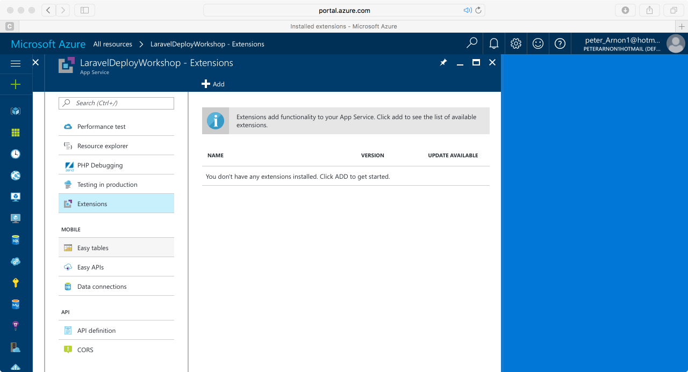
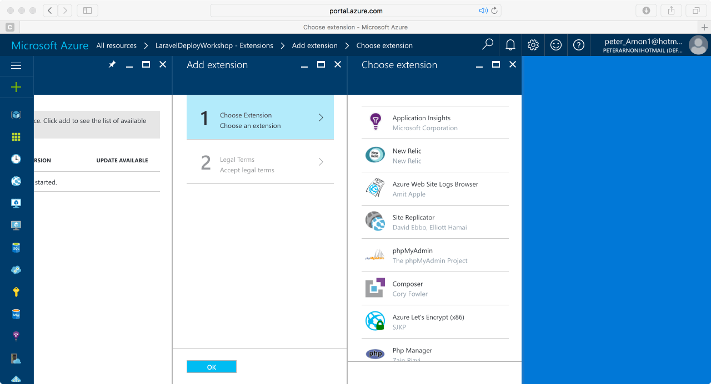
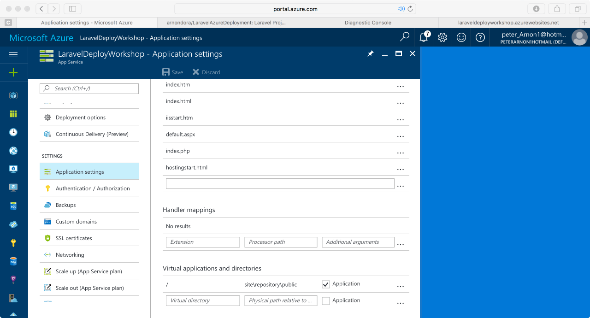
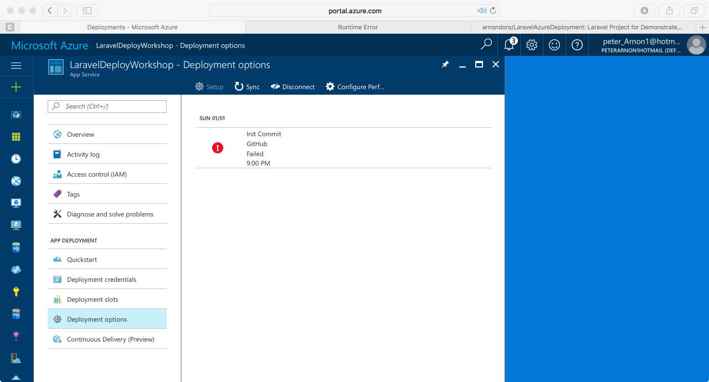
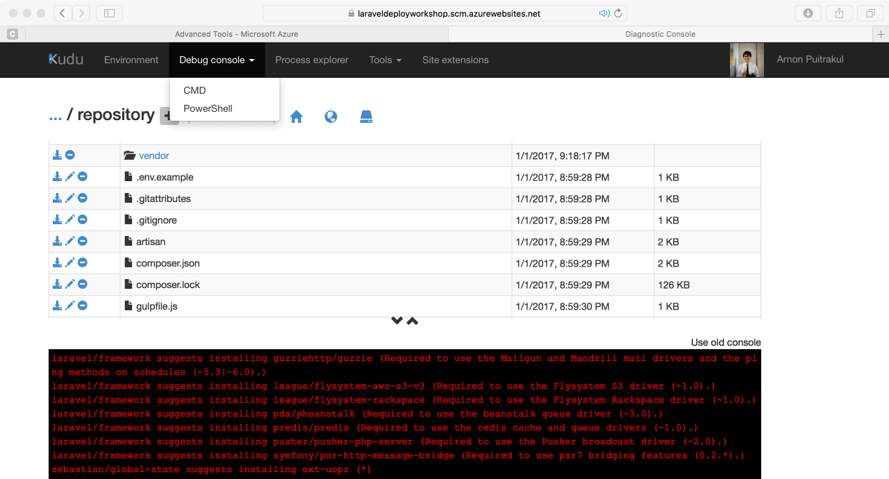
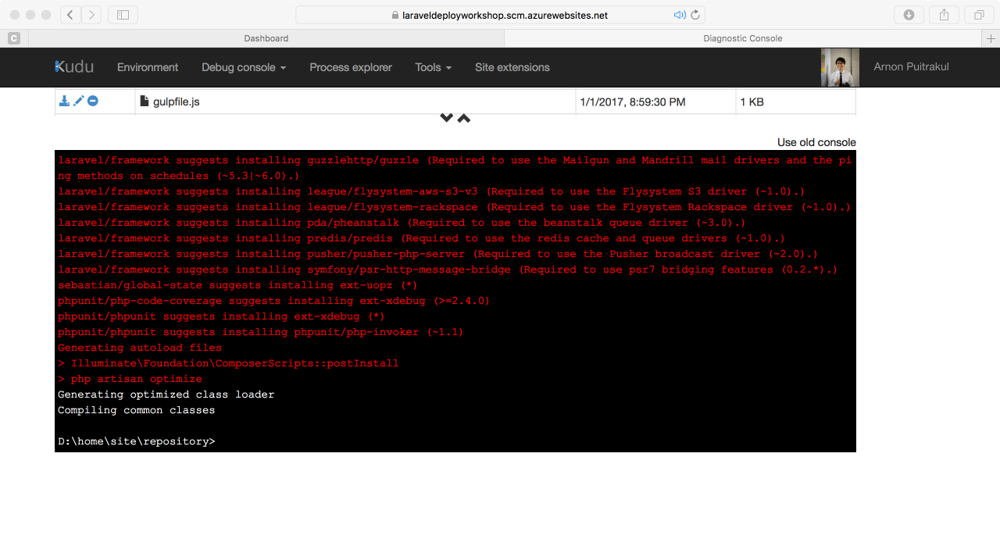
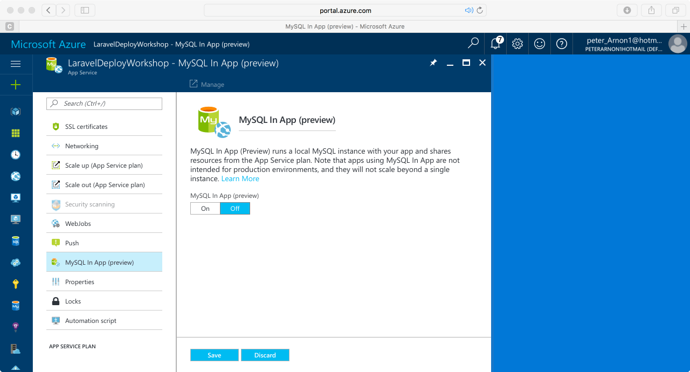
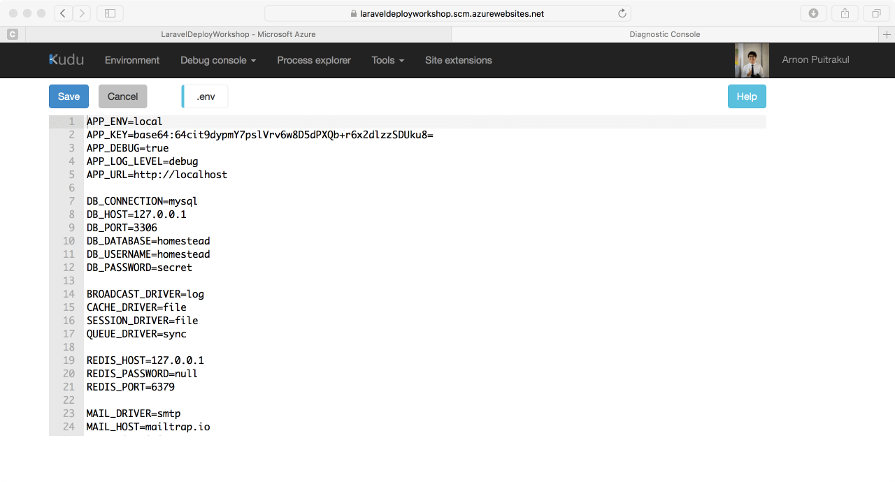

ปัญหาของการ **Deploy** เป็นปัญหาหนึ่งตอนที่ผมพึ่งเรียน Laravel ใหม่ ๆ ตอนเขียนก็ยังได้อยู่ แต่พอจะเอาขึ้น **Production Server** เท่านั้นแหละ **"เอาไงดีฟร๊ะ !" **ฉะนั้นวันนี้เราจะมาดู**วิธีการ Deploy Laravel Project ของเราขึ้น Cloud อย่างง่ายกัน** ตอนนี้หลาย ๆ คน (ที่เป็นมือใหม่) ยังไม่น่าจะนึกออกว่าจะทำยังไงดี จะ Upload ผ่าน FTP มั้ยหรือยังไง แน่นอน เราค่อย ๆ ไปกันดีละขั้นตอนกัน

#### เตรียม Web App Service
ในขั้นตอนของการสร้าง Web Application บน Microsoft Azure จะไม่ขอพูดถึงละกันครับ เพราะมี Document อยู่กันเกื่อนแล้ว ซึ่งตัว Web App นี้มันก็รองรับ PHP ให้เราเรียบร้อยแล้ว แต่สิ่งที่ยังไม่มีอีกอย่างคือ **Composer**

สำหรับผู้ที่ใช้ Laravel หรือ PHP น่าจะรู้กันดีว่า Composer คือ **Package Manager** บน PHP เราจะใช้ Composer ในการติดตั้ง Dependencies ของ Laravel ทั้งหมด

วิธีการติดตั้ง Composer ให้เราเข้าไปเมนู **Extension** จากใน Site ของเรา และกด Add ที่อยู่ด้านบน

จากนั้นให้เราเลือก **Composer** กด OK และติดตั้ง สำหรับใครที่ต้องการ **Phpmyadmin** ไปด้วยก็ได้เหมือนกัน สำหรับใครที่ต้องการ ถ้ายังไม่ได้ใช้ก็เอาไว้ก่อน

จากตั้งอย่างตอนนี้ผมได้ทำการติดตั้งทั้ง **Composer** และ **Phpmyadmin** ไปเรียบร้อยแล้ว เท่านี้ก็เป็นอันเสร็จพิธีการเตรียม Web App และติดตั้ง Composer ที่ง่ายมาก ๆ

## Config Public Directory Path
ถ้าเราได้ลองเข้าไปดู Root Folder ใน Azure เราจะเห็นว่าหน้า Index ของเรานั้นจะถูกเก็บอยู่ใน Folder ชื่อ **wwwroot** แต่ Laravel ของเรามันใช้เป็น **public** ฉะนั้น เพื่อความง่าย เราจึงต้องมาเซ็คให้ทางฝั่ง **Microsoft Azure** เหมือนกับของเรา

ให้เราเข้าไปที่ **Application Settings** ที่อยู่ในเมนูของ Site ของเราเช่นกัน แล้วเลื่อนลงมาข้างล่างจะเห็นช่อง **Virtual applications and directories** และลองสังเกตุดูในบรรทัดแรก เราจะเห็นมัน Map / ไปเป็น **site/wwwroot** นั่นคือ Home ในปัจจุบัน

**เราต้องแก้จาก site/wwwroot เป็น public** เพราะ public folder ของเรามันชื่อ public ไม่ใช่ wwwroot **แก้เสร็จแล้วอย่าลืมกด Save ด้านบนด้วย** (นี่ลืมไง ! งงอยู่ตั้งนาน) แก้แล้วจะเหมือนภาพด้านบนเลยครับ

## Deployment Configuration
จนถึงตอนนี้เราก็ได้สร้างและแก้ **Pubic Path** ของเราให้ถูกต้องตาม Project ของเรากันไปแล้ว ตอนนี้ถ้าเรา Deploy ขึ้นไป ไฟล์ทั้งหมดของเรามันจะไปอยู่ใน Folder wwwroot ที่เราไม่ต้องการ ฉะนั้น เราจะมาแก้ Deployment Path กัน

โดยเราต้องการให้มัน Deploy ไปที่ Path ที่เหนือกว่า Public ขึ้นไป เหมือนกับที่ Project เราเป็น

วิธีการคือ ให้เราเข้าไปที่ **Application Settings** เหมือนเมื่อกี้เลย แต่ทีนี้เลื่อนหา Section ที่ชื่อว่า **App Settings**

และให้เราเพิ่มค่าลงไป 2 ค่าคือ

    SCM_REPOSITORY_PATH -> ..\repository

    SCM_TARGET_PATH -> ..

หลังจากขั้นตอนนี้ ถ้าเราลองเข้าเว็บแล้ว มันเปิดไม่ได้ ก็ไม่ใช่เรื่องแปลกอะไร เพราะเรายังไม่ได้ Deploy อะไรลงไปในเว็บเราเลย ซึ่งเดี๋ยวเราจะมา Deploy กัน

## Repository Setup และ Deploy Laravel ขึ้น Cloud
ใน **Microsoft Azure** จะมี **Feature** ที่ช่วยเรา **Deploy Application** ของเราจาก **Repository** ต่าง ๆ อย่าง **Github** ขึ้นมาให้เราได้ ซึ่งวิธีคือ

ให้เราเข้าไปที่ **Deployment Options** และทำการ Login และ Setup ตามที่หน้าจอบอกให้เรียบร้อย และทำการ Push ขึ้นมา ตัว Azure มันจะเข้าไปดูดไฟล์ และ Upload ลงใน Web Server ของเราโดยอัตโนมัติ ในขั้นตอนนี้อาจจะใช้เวลาสักพักนึงนะครับ

## Install Composer Dependencies
ถัดไปเราต้องทำการ **Install Dependencies** ที่ต้องติดตั้งผ่าน Composer ทั้งหมด เพราะ Git ไม่ได้อัพโหลด Folder vendor ที่เก็บ Dependencies ให้เราฉะนั้น เราก็ต้องมาติดตั้งเอง

ให้เราเข้าไปที่เมนู **Advanced Tools** ใน Site ของเรา และกด **Go** เข้าไปเลย

พออยู่ในหน้าของ **Kudu** แล้ว ให้เราเข้่าไปที่ **Debug console** และเลือกเอาที่เราชอบเลยระหว่าง **CMD** ปกติ หรือ **Powershell** แนะนำให้ใช้ Powershell

จากนั้นเมื่อเข้ามาแล้ว ให้เราไปที่ **Directory** ที่เรา **Deploy** เว็บของเราลงไปนั่นคือ **/repository** และรันคำสั่ง **composer install** เพื่อติดตั้ง **Dependencies ของ Laravel** และตัว Laravel เอง

## Web.config
ถ้าใครทำการติดตั้ง **Dependencies** ของ Laravel ผ่าน **Composer** เสร็จแล้ว เข้าเว็บแล้วติด **Error in Application หรือ Error ต่าง ๆ ของ IIS** ให้เราเอา Code ด้านล่างนี้ทับไฟล์ **web.config** ใน **public** ได้เลย

**และอย่าลืม Commit และ Push ขึ้น Git แล้วรอสักพักนึงแล้วจึงลองใหม่**

## .env เจ้าปัญหา
ถึงตอนนี้ เราควรที่จะเข้าหน้าอะไรสักอย่างได้แล้ว แต่หลาย ๆ คนน่าจะติด **"Whoops, looks like something went wrong"** อะไรสักอย่างแน่นอน

เหตุผลเป็นเพราะว่า **Laravel** มันหาไฟล์ **.env** ที่เก็บ **Configuration** ไม่เจอ (เพราะตอนเรา Deploy จาก git ไฟล์ .env มันไม่ได้มาด้วย) มันเลยร้องเรียกตะโกนหาอยู่ ซึ่งวิธีตีหัวให้มันเงียบก็ไม่ยากเลย ก็แค่สร้างไฟล์ .env ให้มัน

วิธีที่ง่ายที่สุดน่าจะเป็นการก๊อปไฟล์ **.env.example** ที่เป็นไฟล์ตัวอย่างมา ซึ่งเราสามารถทำได้โดยรัน

    copy-item -path .env.example -destination .env
    php artisan key:generate

คำสั่งด้านบนเป็นการ **Duplicate** ไฟล์ .env.example แล้วให้เปลี่ยนชื่อเป็น .env และทำการ **Generate Public Key** ให้ **Laravel** ถึงขั้นตอนนี้เราน่าจะสามารถเข้าเว็บได้เรียบร้อยแล้ว เย้ ~!

## Deploy MySQL Database on Microsoft Azure (Optional)
ถึงตอนนี้เราก็สามารถเข้าใช้งานหน้าเว็บไซต์ได้ตามปกติแล้ว แต่สำหรับเว็บไหนที่ต้องทำการต่อ Database ซึ่งอาจจะเป็น MySQL หรือ SQL Server Database อะไรก็แล้วแต่ ก็ต้องมาทำกันต่อ

ในตัวอย่างนี้จะขอยกตัวอย่างเป็น **MySQL Database** นะครับ เพราะมันน่าจะง่ายที่สุดแล้ว ซึ่งผมจะเลือกใช้ Feature นึงของ **Microsoft Azure** ที่ชื่อว่า **MySQL In App**

หลักการของมันคือ การติดตั้งตัว MySQL Service ลงไปในเครื่อ Web Server ของเราไปเลย ฉะนั้นตัวเว็บของเราจะสามารเข้าถึงตัว Database ได้ผ่าน localhost โดยตรงได้เลย ซึ่งดีกว่าแบบเก่าคือ เรื่องของการลด Latency ในการเชื่อมต่อ

ถ้าเป็นแบบเก่า เราก็จะต้องยิง Request ออกไปข้างนอกซึ่ง Latency ก็จะสูงกว่าการยิงอยู่ใน localhost แน่นอน

และเราก็ไม่สามารถเข้าถึง Database จากข้างนอกได้เช่นกัน แต่เราสามารถใช้ Phpmyadmin เข้าผ่านหน้าเว็บได้ ซึ่งก็ง่ายดีเหมือนกัน

**คำเตือน ตอนนี้ MySQL In App ยังอยู่ในช่วง Preview ยังไม่ใช่ตัวเต็มอาจจะมีบัค และมีข้อจำกัดในเรื่องของการ Scale-Out อยู่ ฉะนั้นขอให้ใช้วิจารณาณในการใช้งานกับ Production จริงนะครับ**

วิธีเปิดใช้ ให้เราเข้าไปที่เมนู MySQL In App ไปติ๊กจาก Off เป็น On และกด Save ได้เลย

## คุ้ย Database Authentication จาก MySQL In App
ตัว MySQL In App มันจะไม่ให้ตัว Username และ Password ที่ใช้ Access ตัว Database มาโดยตรง แต่มันจะเก็บอยู่ใน **Environment Variable**

ผมได้เตรียม Code สำหรับดึงข้อมูลการเชื่อมต่อทั้งหมดมาให้แล้ว แค่สร้างไฟล์แล้วก๊อป Code ด้านล่างแล้ว Push ผ่าน Git ขึ้น Server เราก็จะได้มา

    <?php
    $connectstr_dbhost = '';
    $connectstr_dbname = '';
    $connectstr_dbusername = '';
    $connectstr_dbpassword = '';

    foreach ($_SERVER as $key => $value) {
     if (strpos($key, "MYSQLCONNSTR_localdb") !== 0) {
     continue;
     }

     $connectstr_dbhost = preg_replace("/^.*Data Source=(.+?);.*$/", "\\1", $value);
     $connectstr_dbname = preg_replace("/^.*Database=(.+?);.*$/", "\\1", $value);
     $connectstr_dbusername = preg_replace("/^.*User Id=(.+?);.*$/", "\\1", $value);
     $connectstr_dbpassword = preg_replace("/^.*Password=(.+?)$/", "\\1", $value);
    }

    $link = mysqli_connect($connectstr_dbhost, $connectstr_dbusername, $connectstr_dbpassword,$connectstr_dbname);

    if (!$link) {
     echo "Error: Unable to connect to MySQL." . PHP_EOL;
     echo "Debugging errno: " . mysqli_connect_errno() . PHP_EOL;
     echo "Debugging error: " . mysqli_connect_error() . PHP_EOL;
     exit;
    }

    echo "Success: A proper connection to MySQL was made! The my_db database is great." . PHP_EOL;
    echo " Host Name : " . $connectstr_dbhost;
    echo " DB Name :\ " . $connectstr_dbname;
    echo " Username : " . $connectstr_dbusername;
    echo " Password : " . $connectstr_dbpassword;

    echo "Host information: " . mysqli_get_host_info($link) . PHP_EOL;

    mysqli_close($link);
    ?>

**ที่สำคัญ ใช้เสร็จแล้วอย่าลืมลบออกด้วยนะครับ ไม่งั้นเดี๋ยวใครก็ไม่รู้เข้ามาพัง Database ไม่รู้ด้วยน้าา**

จากนั้นเราก็เอา **Credential** ที่เราได้จากไฟล์เมื่อครู่มาใส่ใน **.env** (ให้ใส่ DB Host เป็น **localhost** พอดีในไฟล์มันไม่ได้บอก) และรัน **php artisan migrate** เพื่อ Migrate Database ที่เราสร้างไว้ลงมา ก็เป็นอันเรียบร้อยโรงเรียน **Laravel**

## เสริม
ก่อนที่เราจะ **Deploy** ขึ้น **Production** จริง ๆ **อย่าลืม Compile Assets ให้อยู่ในโหมด Production ด้วย** เพราะมันจะ Minified JS และ CSS ให้เราโดยอัตโนมัติ เวลาโหลดจะได้เร็วขึ้นนิดหน่อย และกันโดนก๊อปได้ด้วย

และสำหรับใครที่ไม่ได้ใช้ **Git** ก็แนะนำให้ใช้ซะ แต่ถ้าไม่ใช้จริง ๆ ก็สามารถอัพโหลดไฟล์ทั้งหมดตรงลงไปที่ **Server** ผ่าน **SFTP** ก็ได้เช่นกัน แต่ก็ไม่แนะนำเท่าไหร่ เพราะมันไม่ค่อยจีรังยั่งยืนในแง่ของ **Workflow** ในการพัฒนาสักเท่าไหร่

## สรุป
และนี่ก็เป็นขั้นตอนทั้งหมดของการ **Deploy Laravel Project** ขึ้นไปบน **Cloud** อย่าง **Microsoft Azure** เริ่มตั้งแต่ **สร้าง Web App** บน Micrsoft Azure จนไปถึง **Migrate Database** ที่จะเห็นได้ว่ามันง่ายมาก ๆ ถึงขั้นตอนจะดูเยอะก็เถอะ ถ้าทำเป็นจริง ๆ ก็ใช้เวลาไม่นานเลย **Deploy** ครั้งนึงผมใช้เวลา**ไม่เกิน 8-10 นาที**ก็เสร็จ

จริง ๆ ก็สามารถนำวิธีข้างต้นนี้ไป **Deploy** กับที่อื่น ๆ ได้เช่นกัน อาจจะต้องมีเปลี่ยนอะไรนิดหน่อย แต่วิธีนี้ก็พอที่จะเป็นแนวทางได้ ถ้าใครมีวิธีที่ดีกว่า หรือยังไงก็ลอง Comment หรือมาแชร์ให้ผมด้วยนะครับ อยากรู้เหมือนกัน สำหรับวันนี้สวัสดีปีใหม่ และสวัสดีครับ
