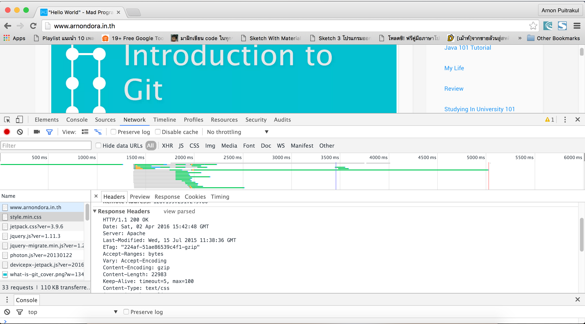
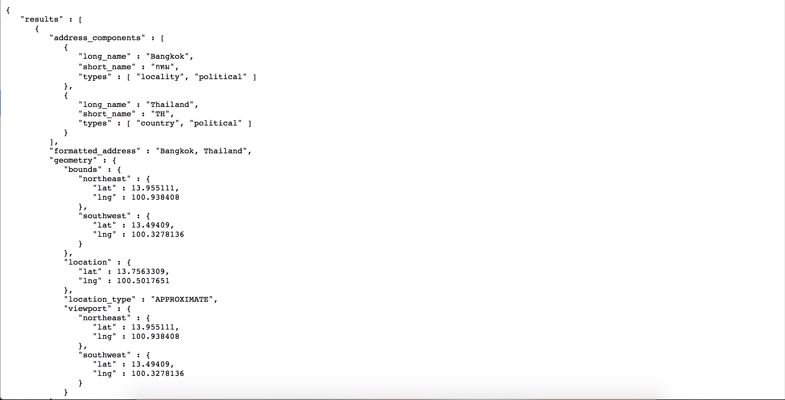

ในสมัยนี้ใครที่เขียนโปรแกรมที่ไม่รู้จักคำว่า API ก็คงจะน้อยแล้ว และในตอนนี้อีกเหมือนกันคำว่า REST API ก็มาแรงเช่นกัน (เหรอ ??) แต่พอผมลองไปหาใน Google เพื่อจะหาวิธีใช้ก็เจออยู่ แต่วิธีมันค่อนข้างที่จะยากสำหรับมือใหม่อยู่บ้าง วันนี้เลยจะมานำเสนอวิธีง่าย ๆ ในการเรียก REST API สำหรับมือใหม่ ที่พึ่งเคยใช้จริง ๆ กันดีกว่า

## REST API คืออะไร ?
REST หรือ Representational State Transfer มันเป็นวิธีในการสร้าง Web Service รูปแบบนึงที่อาศัย HTTP Method (GET, POST, PUT, DELETE) ในการทำงาน และส่งผลกลับมาในรูปแบบของ JSON หรือ XML ส่งผลให้สามารถรับส่งข้อมูลไปมาข้าม Platform ได้อย่างสะดวกมาก เพราะเป็นการเรียกผ่าน HTTP Protocol ที่ใช้ในการเรียกเว็บไซต์อยู่แล้ว และอีกอย่างหนึ่งที่ทำให้ REST เป็นที่นิยมคือ เรื่องของการใช้ Traffic เนื่องจากว่า เวลา REST มันส่งค่ากลับมา มันจะส่งกลับมาในรูปแบบของ JSON หรือ XML ซึ่งมีขนาดเล็ก และ Extract ออกมาใช้ได้อย่างง่ายดาย
REST ถูกพูดถึงครั้งแรกน่าจะสักประมาณปี 2000 ซึ่งตอนนั้นผมก็ยังไม่รู้จักเหมือนกัน มารู้จักก็ตอนปี 2008 ไปแล้ว เมื่อก่อนนั้นก็ยังไม่มีใครเลย แต่ในปัจจุบันบริษัทไอทีใหญ่ ๆ ที่ให้บริการ API หลาย ๆ เจ้าก็ปรับตัวมาใช้ REST กันแทบจะหมดแล้ว ทำให้คนส่วนใหญ่หันมาใช้กันหมด และมีคำสั่งและ Library หลาย ๆ ตัวที่ออกมา Support REST ทำให้เขียนได้ง่ายขึ้นกว่าเดิมเยอะมาก ๆ

## HTTP Structure
ตัว REST นั้นใช้ HTTP Protocol ในการรับส่งข้อมูลไปมาระหว่าง Web Service และ Client ซึ่งการรับส่งข้อมูลบน HTTP Protocol ก็จะมีโครงสร้างการเรียกข้อมูลของมันอยู่ โดยมันจะหน้าตาแบบข้างล่างนี่เลย

    initial line
    header1: value 1
    header2: value 2
    ...
    headerN: value N
    blankLine
    message body

ถ้ายังนึกไม่ออกลองเปิด Inspector ใน Google Chrome ดูในแถบ Network ถ้าเรากดเข้าไปมันจะบอกว่าหน้าเว็บที่เราเปิดอยู่มันโหลดอะไรไปบ้าง เวลาเท่าไหร่ แต่สิ่งที่ให้ดูคือ รูปแบบของ Header จะเห็นได้ว่า เหมือนกันเลยเนอะะะ

Header คือ Description ของข้อมูลที่ส่งไป หรือได้รับมาว่า มันคืออะไร มันก็คือการบอก Properties ของ Request นั่น ๆ นั่นเอง ซึ่งอันนี้ในการเรียกใช้ REST API ก็ต้องใช้นะ
กับอีกส่วนนึงที่อยากให้วนใจนั่นคือ Method ของมัน (ไม่มีในรูปภาพ แต่ลองเลื่อน ๆ อ่าน Request ใน Google Chrome ดูมัน่าจะมีคำว่า GET หรือ POST อะไรทำนองนี้อยู่ เราเรียกพวกนี้ว่า HTTP Method เอาไว้บอกว่า สิ่งที่รับหรือส่งมา มันเอามาทำอะไรกัน โดยมันจะมีคร่าว ๆ อยู่ 4 Methods ด้วยกัน

* GET - อันนี้เอาไว้ เรียก ข้อมูล เหมือนกับ SELECT ในภาษา SQL
* POST - เอาไว้ส่งข้อมูล เหมือนกับ CREATE
* PUT - เอาไว้ส่งข้อมูลเหมือนกัน แต่จะส่งค่าไปได้ด้วย อารมณ์เดียวกับ UPDATE ที่ต้องบอก ID หรือ Condition ต่าง ๆ ของ Record ที่ต้องการ Update ข้อมูล
* DELETE -  อันนี้ไม่น่าจะต้องพูดอะไรมาก มันคือการลบข้อมูลนั่นเอง

## เรียก REST API ด้วย Httpful

หลังจากที่เรารู้คร่าว ๆ ถึงการทำงานของ REST กันไปแล้ว เราลองมาเรียกมันกันเลยดีกว่า ซึ่งในภาษา PHP มันก็มีคำสั่งที่ใช้เรียกอยู่หลายตัวด้วยกัน แต่เท่าที่เคยคุยกับมือใหม่ดูแล้ว ก็ไม่ค่อยโอเท่าไหร่ วันนี้เลยจะมาแนะนำให้รู้จักกับ Httpful ซึ่งเป็น Library ที่ช่วยทำให้เราสามารถเรียก REST API ได้โดยที่ไม่ต้องรู้อะไรเลยจริง ๆ โคตรจะง่ายเลยจริง ๆ นะ

## ติดตั้ง Httpful
การติดตั้งก็ไม่ได้ยากอะไรเลย เพียงแค่ไปโหลดไฟล์ .phar จากเว็บไซต์ของ [Httpful][2] มาและทำการก๊อปปี้ไปไว้ใน Directory ของเว็บเรา จากนั้นก็เพียงแค่ใช้คำสั่ง Include มันเข้ามาก็เป็นอันเรียบร้อยแล้ว
นอกจากที่จะติดตั้งผ่านไฟล์ .phar แล้วยังสามารถทำผ่าน Composer ได้เช่นกันโดยการเข้าไปแก้ไฟล์ composer.json ตามด้านล่างให้เรียบร้อย

    {
        "require": {
            "nategood/httpful": "*"
        }
    }

## ลองเรียกกันเลยดีกว่า
ใน Step แรกเราลองมาเรียก Geocoding API ง่าย ๆ ของ Google กันก่อน โดยผมมี url ของ API อยู่แล้วนั่นคือ

    https://maps.googleapis.com/maps/api/geocode/json?address=Bangkok

ถ้าเราลองเข้าดูมันจะมีข้อมูลตัวหนังสือออกมาในรูปแบบของ JSON ถ้าใช้ Google Chrome มันจะมี Plugin ไว้อ่านของพวกนี้โดยเฉพาะเลยนะ แต่ถ้าเป็นฝั่ง OSX จะมีโปรแกรมตัวหนึ่งชื่อ Paw (เป็นโปรแกรมเสียเงินนะ ค่อนข้างแพงอยู่ แต่ถ้าต้องทำงานพวกนี้บ่อย ๆ ก็คุ้มอยู่นะ)

ทีนี้เราจะมาเขียนโปรแกรมเพื่อเรียก JSON นี้ออกมากัน โดยโค๊ตที่ใช้จะประมาณด้านล่างเลย

    include "httpful.phar";
    $uri = "https://maps.googleapis.com/maps/api/geocode/json?address=Bangkok";
    $response = \Httpful\Request::get($uri)->send();
    echo $response;

เท่านี้เราก็จะได้ String ที่มี Content เหมือน JSON ที่ให้ดูเมื่อสักครู่แล้วจากนั้น เราจะเอามันมาทำอะไรต่อก็เรื่องของเราแล้ว อาจจะเอามันมาใส่ Function json\_decode() เพื่อแปลงจาก JSON ให้กลายเป็น Array เพื่อความสะดวกในการเข้าถึงข้อมูล
สำหรับบาง API จำเป็นที่จะต้องมีการเติม Custom Header เข้าไปต่าง ๆ เช่นเพื่อการ Authenticate อะไรเป็นต้น เราสามารถเรียกคำสั่ง AddHeader เพื่อเติม Header ได้ ตัวอย่างเช่นโค๊ตด้านล่าง เอามาจากเว็บของ Httpful

    $response = \Httpful\Request::get($uri)
        ->addHeaders(array(
           'Header1' => 'Value 1',
           'Header2' => 'Value 2'));
        ->send();

ถ้าใครเคยศึกษาการเรียก REST API บน PHP มาก่อนจะเห็นได้ว่า การใช้ Httpful ทำให้การเรียก REST API นั่นง่ายขึ้นมาก ๆ เลย โดยส่วนตัวแล้วก็ชอบนะ ทำให้งานไวขึ้นเยอะเลย
นอกจากที่เล่นให้ดูคร่าว ๆ แล้วมันยังมีเรื่องอื่นๆ  อยู่อีกนะลองเข้าไปอ่าน [Document][4] %B

[2]: http://phphttpclient.com
[4]: http://phphttpclient.com/docs/
