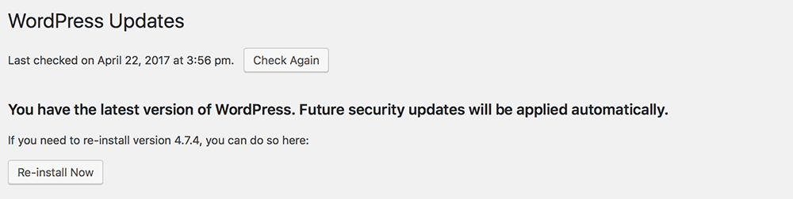
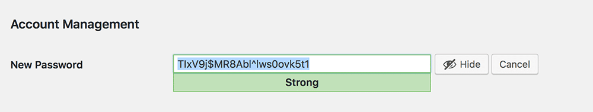
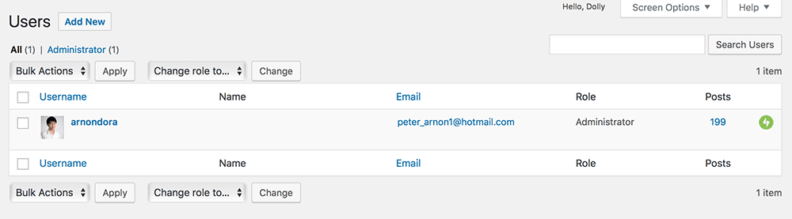
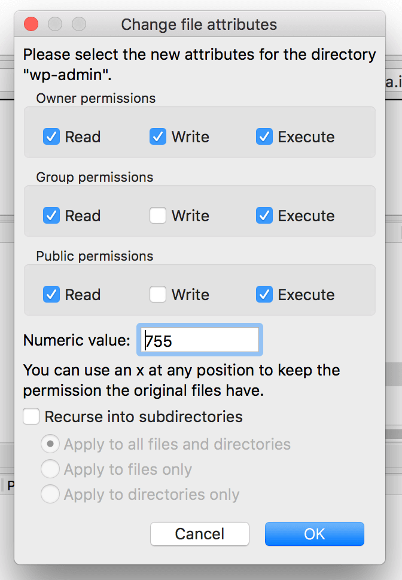
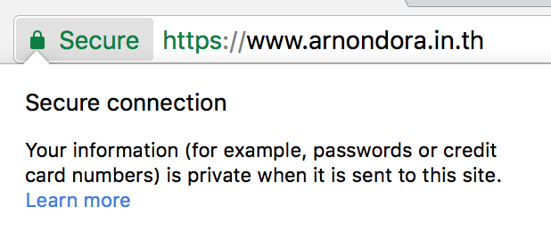

เรื่องของ **Wordpress Security** นั่นถือเป็นเรื่องที่สำคัญมาก นั่นเป็นเพราะเราก็อยากที่จะใช้เว็บไซต์ของเราไปเรื่อย ๆ แบบไม่มีปัญหาอะไร เหมือนกับเราอยู่บ้าน แล้ววันนึงโจรเข้าบ้าน เราก็คงรู้สึกไม่ดีเท่าไหร่ ฉะนั้นทางที่ดีที่สุดคือการป้องกันไม่ให้โจรเข้าบ้านเรา

## เว็บไซต์กว่า 27% ของทั้งโลกเลือกใช้ Wordpress

อยากที่พวกเราทราบกันว่า Wordpress ก็เป็น CMS ตัวหนึ่งที่ได้รับความนิยมสูงมาก ในหลาย ๆ ประเทศทั่วโลก ข้อมูลจากเว็บของ Wordpress บอกว่าเว็บไซต์กว่า 27% เลือกใช้ Wordpress ในการพัฒนาเว็บไซต์ของตนเอง

## Wordpress Security เป็นเรื่องสำคัญมาก ! (เครื่องหมายตกใจล้านอัน)
แต่ด้วยความนิยมที่สูงได้ขนาดนี้ ก็คงไม่แปลกที่จะถูกหมายตาโดยเหล่าผู้ไม่หวังดีต่าง ๆ มากมาย เพราะเจาะได้ที ก็ได้ 27% ทั่วโลกแล้ว แต่ตัว Wordpress เองก็มีความปลอดภัยที่สูงมากอยู่พอควรแล้ว แต่ปลอดภัยไว้ก่อนก็ดี วันนี้เราจะมาดูกันว่า เราจะสามารถเพิ่มความปลอดภัยให้กับ Wordpress ของเราได้อย่างไรบ้าง ด้วย 5 วิธีง่าย ๆ กันเลย

## อัพเดท Wordpress ให้เป็นเวอร์ชั่นล่าสุดอยู่เสมอ

Wordpress เป็น Open Source ที่มีการอัพเดท ทั้งในเรื่องของฟีเจอร์ และความปลอดภัยเอง แต่โดยปกติแล้วตัว Wordpress จะทำการอัพเดท Minor Version ด้วยตัวเองอยู่แล้ว แต่ถ้าเป็น Major Version อันนี้อาจจะต้องทำการอัพเกรดเอง

ไม่ใช่แค่การอัพเดทตัว Wordpress อย่างเดียว พวก Plugin และ Theme ต่าง ๆ ก็ยังเป็นช่องโหว่ให้กับเหล่าผู้ไม่ประสงค์ดีได้เช่นกัน ฉะนั้น Plugin และ Theme ก็จำเป็นอัพเดทให้เป็นเวอร์ชั่นล่าสุดด้วยเช่นกัน เพื่อความปลอดภัย

## ใช้ Password ที่มีความปลอดภัยสูง

ถ้าเราเรียนเรื่องของ Security มาเราก็น่าจะรู้จักในเรื่องของ Password Brute Force ที่จะทำการเดา Password ของเรา และลอง Login ไปเรื่อย ๆ จนรหัสถูก และเข้าถึงหน้า Admin ของเราในที่สุด

ฉะนั้น วิธีที่ง่ายที่สุดในการป้องกันคือ การใช้ Password ที่แข็งแรง ที่มีทั้งตัวอัขระ ตัวเล็กและตัวใหญ่ ตัวเลขและตัวอัขระพิเศษต่าง ๆ เพื่อให้ผู้ไม่ประสงค์ดีเดาและหารหัสผ่านของเราได้ยากขึ้น นอกจากนี้ยังสามารถใช้ Plugin ต่าง ๆ เพื่อป้องกันการ Brute Force ได้

และแน่นอนว่าตัว Wordpress เองก็มีการป้องกันในเรื่องพวกนี้อยู่แล้ว ถ้าเราลองใส่รหัสผ่านผิด ๆ หลาย ๆ ครั้งมันจะมีช่องเพิ่มให้เรายืนยันว่าเราคือมนุษย์อยู่ข้างล่าง

## เปลี่ยน Default Username 'admin' ออกไป

ถ้าใครที่ได้ติดตั้งหรือ Config ตัว Wordpress ครั้งแรกด้วยตัวเอง น่าจะรู้กันดีว่า Username ที่มันมาให้ตอนแรกคือ **admin** นอกจากที่เราจะรู้แล้ว ผู้ไม่ประสงค์ดีก็รู้เช่นกัน จากที่เขาจะแค่ Brute Force ทั้ง Username และ Password มันจะกลายเป็นว่า เราดันไปลดงานให้เขาครึ่งนึงโดยการบอก Username โดยที่เราไม่รู้ตัวกันเลยทีเดียว

ฉะนั้นวิธีที่ง่ายที่สุดคือการเปลี่ยน Username ของเราให้เป็นอย่างอื่น อาจจะเชื่อมกับ Wordpress Account ไปเลยก็ย่อมได้เช่นกัน

## จำกัดจำนวนครั้งที่ Login

จากปัญหาเมื่อครู่คือการถูก **Brute Force** รหัสผ่านเข้ามา ซึ่งอย่างที่ได้กล่าวไปเมื่อครู่คือ Wordpress นั่นมีการป้องกันโดยการยืนยันว่าเราเป็นมนุษย์อยู่แล้ว แต่นั่นก็เป็นวิธีแก้ปัญหาที่ปลายเหตุไปหน่อย ถ้าเราสามารถจำกัดเลย ไม่ให้ Login ได้มั้ย ? คำตอบคือได้ โดยมันจะมี Plugin ชื่อ [Login Lockdown][5] มันก็ทำงานตามชื่อเลยคือ Lockdown ไม่ให้ Login เมื่อ Login ไม่ผ่านตามจำนวนครั้งที่ได้กำหนดเอาไว้ วิธีนี้ก็จะช่วยป้องกันพวกที่เข้ามา Brute Force รหัสผ่านของเราได้ดีขึ้นไปอีก

## File Permission Settings

ตรงนี้จะเกิดกับผู้ที่ติดตั้ง Wordpress ด้วยตัวเองเท่านั้นคือเรื่องของ **File Permission** ซึ่งถือว่าเป็นเรื่องที่สำคัญมาก ๆ เพราะผู้ไม่ประสงค์ดีสามารถเข้ามาแก้ไขไฟล์ต่าง ๆ ของเราได้โดยที่เราไม่รู้ตัวได้ วิธีง่าย ๆ คือการเข้าไปแก้ Permission ซะ แนะนำให้ใช้เป็น 755 (775 มันคือให้เจ้าของไฟล์ทำได้ทุกอย่าง แต่คนอื่นที่ไม่ใช่เจ้าของไฟล์จะทำได้แค่อ่านอย่างเดียว มันคือ chmod code ที่ใช้บอก Permission ของไฟล์ในระบบ Linux และ Unix ถ้าสนใจให้ลองหาอ่านเพิ่มเอานะ ถ้าเขียนตรงนี้จะยาว) ซะก็จะช่วยให้เราปลอดภัยจากการคุมคามเข้ามาในไฟล์ของเราได้มากขึ้นแล้ว

## ใช้ HTTPS กันเถอะ !

ปัญหานี้ถ้าใครที่เรียนพวก Security มามันจะมีอยู่เรื่องนึงที่เรียกว่า **Man-in-the-middle attack** ที่ผู้ไม่ประสงค์ดี สามารถดักจับข้อมูลของเราผ่านอินเตอร์เน็ต อย่างที่เรารู้กันดีว่า อินเตอร์เน็ต ที่เราใช้อยู่ในทุก ๆ วันนั้น ใคร ๆ ก็เข้าถึงได้ แน่นอนว่ามันอาจจะมีผู้ไม่ประสงค์ดีเข้ามาดักจับข้อมูลเราระหว่าง เครื่องคอมพิวเตอร์ของเรา กับ **Web Server** ของเราได้ เช่น Username และ Password ในการเข้า Wordpress ของเรา

ซึ่งในปัจจุบันนี้เรามีสิ่งที่เรียกว่า **HTTPS** (ถ้ามีโอกาสจะมาเขียนเบื้องหลัง และหลักการทำงานของมันกัน) เข้ามาช่วยเราในเรื่องนี้ หลักการคือมันจะเข้ารหัส และยังสามารถยืนยันว่าเว็บเราเป็นเว็บของเราจริง ๆ ไม่ใช่ที่คนอื่นสร้างขึ้นมาหลอกเราเหมือนที่ธนาคารหลาย ๆ แห่งโดนสิ่งที่เรียกว่า **Phishing Site** หรือบางคนอาจจะเรียกว่า **Spoof Site** ซึ่งเราสามารถขอ Certificate ได้ผ่าน Provider หลายเจ้าเช่น **Verisign** หรือ **Let's Encrypt** ที่เป็น Free SSL ก็ได้เช่นกัน ผมเคยเขียนวิธีขอไปแล้ว เข้ามาอ่านได้ที่[ลิงค์นี้][8]

## สรุป
เรื่องของ **Wordpress Security** บางเว็บไซต์อาจจะไม่ได้เห็นความสำคัญมาก แต่ในปัจจุบันถือว่าเป็นเรื่องที่สำคัญมาก ถึงแม้ว่า Wordpress เองจะถูกแพคมากับระบบที่มั่นคงแล้วก็ตาม อะไรก็เกิดขึ้นได้เสมอ วันดีคืนดีเราอาจจะถูกโจมตีสักอย่างก็ได้ ฉะนั้นถ้าเราระวัง เว็บของเราก็จะปลอดภัยบนโลกไซเบอร์มากขึ้นด้วยเช่นกัน ก็หวังว่า 5 วิธีง่าย ๆ ที่ได้แนะนำไปก็จะช่วยให้เว็บของทุกคนปลอดภัยมากขึ้นนะครับ !

[8]: https://www.arnondora.in.th/lets-encrypt-certificate-install/
