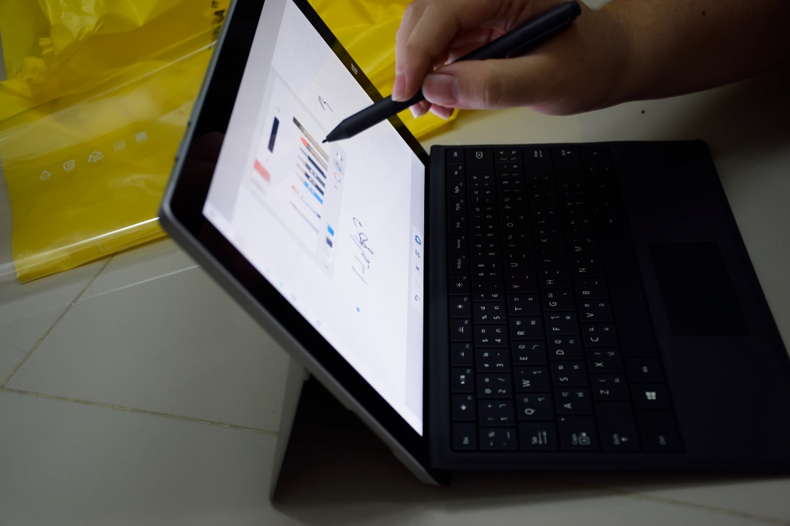

จากตอนที่เราได้แกะกล่อง Surface 3 Tablet จาก Microsoft กันไป วันนี้ลองมาอ่านรีวิวในเรื่องของ User Experience กันบ้างดีกว่า หลังจากที่เราเขียนฝั่งแกะกล่องกันไปแล้ว

## Specification
มาดูกันที่สเปกของเจ้าเครื่องนี่กันก่อนดีกว่า

Surface 3 เครื่องนี้มีขนาดหน้าจออยู่ที่ 10 นิ้วนิด ๆ กับความละเอียดที่ 1080p Full HD หน้าจอสีกำลังดี พร้อมกับรองรับ Touch Screen ถึง 10 จุด (ถ้าเอาเต็ม ๆ ก็ 10.8 นั่นแหละ แต่จะเอาจุดทำไม กะยากไป) หนักประมาณ 600 กรัมหน่อย ๆ พร้อมพลังประมวลผลจาก Intel Atom x7 Quad Core 64 bits เลยนะ (ถ้าว่า Core M อืดแล้ว ตัวนี้ยิ่งกว่าอีกนะ เพื่อจะเอาไปเทียบกับ Core M) มาพร้อมกับแรม 2 GB ในรุ่น 64 GB และ 4 GB ในรุ่น 128 GB ตัวเครื่องทุกรุ่นจะมาพร้อมกับ Windows 10 Home (ไม่ใช่ Pro นะ) และแถม Office 365 Personal ในใช้อีก 1 ปีด้วย

## หน้าจอ
อย่าวที่ได้กล่าวไปในหัวข้อแรกหน้าจอของ Surface 3 มีขนาดอยู่ที่ 10 นิ้วหน่อย ๆ กับความละเอียดที่ Full HD 1080p ทำให้การดูหนัง หรือการเข้าเว็บต่าง ๆ เป็นได้โดยราบรื่นมาก ๆ (ถ้าไม่เข้าเว็บที่มี Content ที่แน่นมาก) สีของตัวจอก็ทำออกมาได้น่าพอใจมาก ๆ สามารถทำงานพื้นฐานได้ดีอย่างไม่น่าเชื่อเลย แต่ใครที่รักความสะอาด ก็อาจจะต้องเหนื่อยหน่อ เพราะว่า หน้าจอนี่เป็นรอยนิ้วมือได้ง่ายมาก ๆ อาจจะต้องหมั่นเช็ดหน่อยนะ แต่เรื่องของรอยขนแมว หรือรอยที่น่ากลัวต่าง ๆ ก็ไม่เจอเลยนะ แต่ถ้ากลัวก็ติด Film กันรอยไว้ก่อนก็ได้

## Connectivity
ถัดมาที่เรื่องของการเชื่อมต่อกันบ้าง หลัก ๆ ก็มีการเชื่อมต่อผ่าน Wifi ได้ในมาตรฐาน ac เลยทีเดียว และ Bluetooth ก็เป็น 4.0 ตัวล่าสุดเลย แต่ที่ชอบมากคือการที่มันมี USB 3.0 และ Display Port มาอย่างล่ะ 1 พอร์ท อีกทั้งยังมีช่องเสียบ Micro SD Card ทำให้เราขยายพื้นที่ในการเก็บข้อมูลได้เพิ่มขึ้นอีกด้วย และอีกพอร์ทที่ลืมไม่ได้คือ Micro USB สำหรับชาร์จไฟเข้า แต่จากการใช้มาพบว่า มันช้ามาก ๆ กว่าจะเต็มไม่รู้เลยเหมือนกันว่าต้องใช้เวลาจริง ๆ เท่าไหร่ เอาเป็นว่าไม่เคยรอจนเต็มไหว ต้องเสียบไว้ทั้งคืน ที่ชอบของการชาร์จแบบนี้คือ เราสามารถใช้ Power Bank เป็นแหล่งพลังงานสำรองได้นั่นเอง (แต่ต้องใช้ Power Bank ที่ดีนิดนึงเพราะว่า Surface มันกินไฟค่อนข้างที่จะมาก ถ้า Power Bank คุณภาพไม่ดีมากอาจจะทำให้เกิดอุบัติเหตุได้)

## Software
ตัวเครื่อง Surface 3 มาพร้อมกับ Windows 10 Home ทำให้เราสามารถที่จะรันไฟล์ที่เป็น .exe หรือโปรแกรมที่เราใช้กันในเครื่อง Desktop ได้ สร้างความสะดวกได้ดีมาก ๆ เพราะตอนนี้ไม่ได้พก Laptop อีกแล้ว เว้นแต่วันที่ต้องทำงานที่ต้องใช้ Processor ที่มีพลังหน่อย แต่สิ่งที่ไม่โอเคเลยคือ ด้วยความที่มันเป็น Windows ที่ไม่ได้ถูกออกแบบมาเพื่อการใช้ Touch Screen มาตั้งแต่แรก เหมือนกับ iOS หรือ Android ทำให้การใช้งานในบางครั้งอาจจะลำบากไปบ้าง การใช้ปากกาช่วยได้เยอะเลยในจุดนี้ และถ้าใครนิ้วใหญ่ก็รับกรรม และซื้อปากกามาถวายมันซะ

## Battery

อีกเรื่องที่สำคัญมาก ๆ กับอุปกรณ์พกพานั่นคือเรื่องของ Battery จริง ๆ เรื่องนี้ผมก็ไม่ได้ทดสอบอย่างจริงจังเท่าไหร่ แต่จากการใช้งานแล้ว สามารถรอดใน 1 วันได้สบาย ๆ ในการใช้งานของผม ใช้เรียน 3 ชมรวด เขียนทั้งคาบ ไม่ได้ปิดจอ และยังมีเล่นเน็ต ใช้ Microsoft Office เกือบทั้งวัน และต่อ Wifi กับ Bluetooth ไว้ตลอด ผลที่ได้คือแบตเหลือประมาณ 20% ได้ เพราะฉะนั้น รอดใน 1 วันแน่นอน แต่ข้อสังเกตคือ เรื่องของการชาร์จ เนื่องจากมันเวลาในการชาร์จมันช้ามาก ๆ ช้าอย่างไม่น่าเชื่อเลย คืออยากให้เต็มนี่ข้ามคืนแน่นอน

## Type Cover
มาที่ทางฝั่ง Keyboard กันบ้าง เริ่มจากสัมผัสกันก่อนเลย บอกเลยว่า จากวัสดุแล้วค่อนข้างจะชอบเลยล่ะ แต่วิธีการวางแป้นนี่ไม่ไหวจริง ๆ มันติด ๆ กันไปหมด ทำให้เราพิมพ์ผิดค่อนข้างเยอะมาก ๆ ในช่วงแรก แต่พอใช้ไปสักพักก็จะโอเคเอง
อีกเรื่องคือ วัสดุที่ใช้ทำมันเหมือนว่า จะเก็บฝุ่นได้เยอะมาก ๆ เวลาเราเปิดจอจะใช้นี่ ฝุ่นมาเป็นเส้นอยู่บนจอเราเลย ก็อาจจะต้องหมั่นดูแลรักษาสักหน่อย เพื่อให้มันดูดีตลอดเวลา และจะได้ไม่มีฝุ่นมากวนใจสำหรับผู้ที่รักความสะอาด

## Surface Pen

ด้านของปากกาอันนี้ค่อนข้างประทับใจมาก เขียนได้เนียบมาก ๆ เลย เมื่อตอนที่ Galaxy Note ออกมาใหม่ ๆ ก็ซื้อมาเพื่อจดโน๊ตเลย แต่ผลที่ได้ค่อยข้างไม่น่าประทับใจเลย ด้วยเรื่องของขนาดของตัวแท่งปากกาและขนาดจอที่เล็กไปหน่อย แต่พอมาได้ลองใช้ Galaxy Note 10.1 ถึงจอมันจะใหญ่แล้ว แต่ก็ยังติดปัญหาในเรื่องของปากกาไป แต่พอมาได้ใช้ Surface บอกเลยว่า ประทับใจจริงจังมาก ตอนนี้ลืมการจดบนกระดาษจริง ๆ ไปแล้ว เส้นที่ได้ค่อนข้างที่จะละเอียดและคมมาก ๆ (ขึ้นกับ App ที่ใช้ด้วยนะ) นอกจากเรื่องของการเขียนแล้ว มันยังมาแทนเมาส์ได้เกือบจะ 100% เลย ยกเว้นแค่ตอนเราจะเล่นเกม แค่นั้นเลยจริง ๆ สามารถใช้ในชีวิตประจำวันได้ดีอย่างไม่น่าเชื่อเลย ทำให้อะไร ๆ สะดวกขึ้นอย่างไม่น่าเชื่อ

## Surface 3 เหมาะกับใคร
ผมว่า Surface 3 เป็นอุปกรณ์ที่เหมาะแทบทุกคน ตั้งแต่นักเรียน นักศึกษาไปจนถึงคนทำงานเลย แต่คนที่เหมาะที่สุด ผมจะยกตัวอย่างแค่ 3 กลุ่มที่ผมเห็นบ่อย ๆ ประเภทแรก ผมว่าน่าจะเป็นนักเรียน นักศึกษานะครับ โดยตอนนี้ผมก็เรียนอยู่ เวลาเรียนผมก็จะโหลด Slide ที่ใช้เรียน แล้วเอามาเขียน Lecture Note ใส่ลงไปได้เลย ไม่ต้องมานั่งพกกระดาษเป็นกอง ๆ ทำให้สบายตัวมาก ๆ หรือบางทีต้องเขียน Code (เพราะผมเรียน Com Sci นี่เนอะ) ก็สามารถเปิด Text Editor เขียนและ Compile ได้เลยเพราะว่า OS ที่ใช้ก็เป็น Windows 10 แบบปกติ
คนอีกกลุ่มที่น่าจะเหมาะนั่นคือ Blogger อันนี้ก็ด้วยเหตุผลในเรื่องของความเบาของเครื่อง และสเปกที่ไม่ช้าเกินไปสำหรับการเขียน Blog เลย ผมก็เขียน Blog เหมือนกัน หลังจากที่ใช้แล้วพบว่า มันทำให้เราสามารถย้ายที่เขียนเพื่อหา Idea ใหม่ ๆ ได้คล่องตัวมาก ๆ
และกลุ่มสุดท้ายคือคนที่ทำงานด้านเอกสารเป็นส่วนใหญ่ อาจจะเป็นหนุ่มสาวออฟฟิต ที่ใช้แค่ Word Excel ในการทำงานเป็นหลัก ด้วยสเปกที่สามารถใช้โปรแกรมเอกสารได้อย่างราบรื่นแล้ว ด้วยน้ำหนักไม่ถึงกิโล ทำให้คล่องตัวในการเดินทางมาก ๆ

## สรุป

Surface 3 ไม่ใช่ Tablet ที่ดีที่สุด และไม่ใช่ Laptop ที่ดีที่สุดเช่นกัน แต่ด้วย Intel Atom ที่เป็น CPU ตัวจิ๋ว แต่แจ๋ว สามารถรีดประสิทธิภาพออกมาได้ดี (แถมยังรัน Desktop Application ได้ด้วย) ทำให้สามารถ Task ในชีวิตประจำวันได้อย่างราบลื่น และน้ำหนักเพียงแค่ 600 กว่าๆ กรัมเท่านั้น ทำให้เราสามารถพกไปไหนมาไหนได้อย่างสะดวกมาก ๆ อีกทั้งยังมี Surface Pen ที่ทำให้เราสามารถเขียนข้อความต่าง ๆ ลงไปได้ทำให้ลืมการจดในกระดาษเปล่าไปเลย จาก 3 อย่างนี้ผมว่า Surface ก็เป็น Tablet ที่ค่อนข้างจะเหมาะสมกับ Lifestyle ของผมมาก ๆ แต่ข้อสังเกตก็คือ เรื่องของ ราคา ในรุ่นต่ำสุดได้ Ram มาเพียง 2 GB เท่านั้นทำให้ไม่สามารถรีดประสิทธิภาพของ CPU ได้ดีเท่าที่ควร แนะนำให้ไปซื้อในรุ่น 128GB ที่มาพร้อมกับ Ram 4 GB จะดีกว่า และอีกอย่างคือ เรื่องของ Keyboard และปากกา ไม่ได้ Bundle มาในกล่องนะครับ ต้องซื้อเพิ่มเอง (Keyboard แพงชิบ) และนี่ก็คือสรุปการใช้งาน Surface 3 ใน 1 อาทิตย์คร่าว ๆ ของผม ก็ขอจบเพียงเท่านี้ สวัสดีครับ
