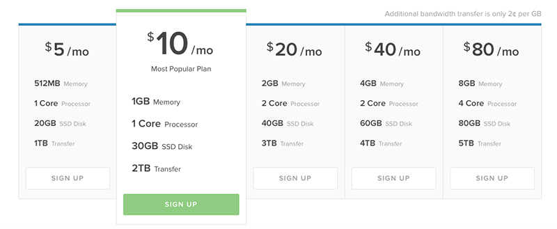
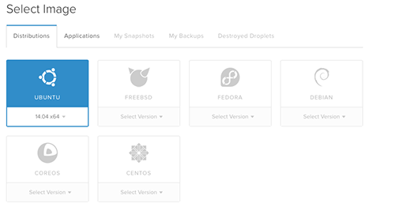

เรื่องมันเกิดขึ้นเมื่อคืนครับ! กำลังนอนดูหนังอยู่ดีๆ (ตี 1 กว่าๆ) **ก็ได้อีเมล์จาก System ของตัว Hosting ว่า Bandwidth มันเต็มแล้ว!**

งานงอกล่ะสิครับ **ทำไงดี** ถ้าขอผ่อนผัน จาก Views ตอนนี้ขอยังไงก็ไม่พอแน่ๆ ย้ายไปที่อื่นล่ะกัน ประกอบกับ Account DigitalOcean ผมมีเงินอยู่ 100 usd จาก Github Student Developer Pack หวานเลยสิอย่างงี้! **(ถ้าเป็นนักศึกษาที่มีอีเมล์ @ มหาลัยตัวเองสามารถเข้าไป Register ได้เลยที่ [https://education.github.com/pack][1])**

**DigitalOcean ถ้าใครไม่รู้จักนะครับ มันคือ Cloud Platform** ที่ราคามันล่อล่วงใจได้ดีจริงๆ (ต่ำสุด 5 USD/Month เท่านั้นเอง **โคตรจะถูก**) ถ้าที่อื่นคงแพงกว่านี้หลายเท่าอยู่ แต่ก็นะครับ **เจ้า Platform นี้มันเกิดมาเพื่อ Developer เพราะฉะนั้น ก็ต้องใช้ความรู้ทางด้าน Linux หน่อย** (ซึ่งผม ไม่มีเยอะขนาดนั้นแฮะๆๆ)

**จากที่เห็นด้านบน ถูกสุดแค่ 5 USD/Month เท่านั้นเอง** Host ตัวเก่าของผมเป็น Host ฟรีที่ Disk ให้แค่ 100 MB และ Traffic ไม่เกิน 1 GB ซึ่งจากเมื่อวานและเมื่อวานซื่นแค่ 2 วันก็เต็มแล้ว ตอนนี้ผมอัดเลย 1 TB ในราคาถูกแสนถูกแค่ 5 USD/Month เท่านั้นเอง!

## **ราคาถูกมันมากับการ Setup ที่หฤโหด!**
อย่างที่บอกไปครับว่า เจ้า Platform นี้มันเกิดมาเพื่อ Developer ล้วนๆเลย เพราะฉะนั้นเครื่องมือในนั้นก็**ใช่ครับ! แม่ม For Dev 100% เลยครับ เปิดมาเป็นหน้า Command Line โง่ๆเลยครับ**
เว็บนี้ค่อนข้างจะเล็กเพราะพึ่งเปิดมาไม่นาน รูปยังไม่ถึง 100 MB เลย (ถ้าเกินแล้วมันจะไปยัดเข้าของเก่าได้ไงว้าา!!!) กับ DB อันน้อยนิดไม่ถึง 10 MB **ผมจึงเลือก Plan แรกเลย 5 USD ต่อเดือน เป็น 1GB Memory 1 CPU Core 30GB SSD Disk และ 1TB Traffic** (Traffic เยอะกว่าของเก่าคนล่ะขุมเลย)

**เราสามารถเลือกที่ตั้งของ Server ของเราได้ด้วย** ที่ใกล้สุดก็ Singapore เลย (จากที่ลองใช้ หรือที่คุณกำลังเข้า ผมว่ามันลื่นกว่า Host ตัวเก่าเยอะ ขนาดมันอยู่ Singapore นะ)

**หลังจากที่เราเลือก Spec อะไรเรียบร้อยแล้ว ทีนี้เราจะมาเลือก OS ของเครื่อง** ี้กัน ซึ่งทั้งหมดเป็น Linux หมด 555 แต่ในที่นี้ผมขอเลือกเป็น Ubuntu เพราะว่า ผมคุ้นเคยกับมันมากที่สุด

**และสุดท้าย ท้ายสุด เราก็ต้องมาเลือกว่า จะให้มันลงอะไรมา**ให้เรา ซึ่งมันฟังก์ชั่นที่ดีเลยนะครับ ถ้ามาเปล่านี่ต้องลง LAMP + Wordpress + proftpd + phpmyadmin เองเลยนะเฮ้ย! ลำบากสุดอะ และเลือก**เสร็จก็กด Create Droplet ก็เป็นอันรอ** (แต่ไม่ต้องลุกไปไหนนะ เพราะไม่ถึงครึ่งนาทีเสร็จแล้ว lol)
เมื่อเรากดสร้างทาง Digital Ocean จะส่งเมล์มาให้เราเป็น รหัสเข้า SSH และ IP Address ของเครื่องเรา
**ทีนี้ล่ะครับ งานช้างแล้ว!! นี่ขนาดเว็บผมยังเล็กอยู่นะ!**
ก่อนอื่น ผมก็ต้องดูดข้อมูล ออกมาผ่าน FTP ก่อน แล้วคืออะไร!
**ในการย้ายทั้งหลาย อันประการทั้งปวงนั้น ต้องใช้คำสั่งพวก Linux หมด (คือเคยใช้แค่ Basic ง่ายๆเท่านั้นไม่เคยต้องมา Setup อะไรขนาดนี้)**
พอดูดออกจาก Site เก่าเสร็จ งานใหม่งอกครับ คือตัว Server ตัวนี้ถ้าเราจะใช้ FTP **เราจะต้อง Install proftpd เอง ชิบ! แล้วไง** ลงไม่เป็นอีก สุดท้ายก็พึ่งอากู๋เหมือนเดิม!
แต่เดียว ลืมไปอะไรมั้ย! DB ไงครับ ปกติ Hosting ก็จะมี Phpmyadmin เข้ามาช่วยเราจัดการ แต่นี่คือ "ไม่มี" งานงอกแล้วไง!!
จะทำยังไงล่ะ **ก็ต้องลงสิครับ **
**ก็เอาเลย หาในอากู๋  สรุปลงไม่สำเร็จ เปิดไม่ได้!! ก็ต้องมานั่งหาวิธี Uninstall อีก ยุ่งสุดๆ** (สุดท้ายตอนนี้ลองผิดลองถูกจนได้และ ดีใจมาก)
พอเปิดไม่ได้ ทำยังไงล่ะทีนี้ ดันไปเห็น**เครื่องมือนึงในตัว Wordpress ที่ใช้ Export ข้อมูลออกมาได้ ก็จัดไปเลยสิครับ จะรออะไร!**
และเสร็จก็เข้ามา Import ก็ไม่มีปัญหาอะไร แต่ **Stat ที่ผมเก็บผ่าน Plugin Jetpack ก็หายไป ฟิ้ว~** จึงยอมแพ้รับกรรมไป ฮื่อๆๆ TT
ตอนนี้เราก็ได้อัพไฟล์ กับเอาตัวโพสใส่ครบ ลงธีม แก้ให้เหมือนเดิมเรียบร้อย
**มาถึงขึ้นตอนสุดท้าย** อันนี้โหดสุด ทำ Site Down ไปหลายชม. มาก นั่นคื**อการเซ็ต DNS ให้มันชี้เข้ามาที่ ตัว Digital Ocean** ก็หาอากู๋เช่นเดิม ทำตาม ฮื่อๆไม่ได้หว่า พอเปลี่ยนปุ๊บของเก่าก็ใช้ไม่ได้เลย แย่และ! ทำไงดี
ทำอะไรไม่ได้ก็ต้องปล่อยให้มันดาวน์ไป! เศร้าแท้! TT วันนี้ดันไปเที่ยวกับครอบครัวอีก สงกรานต์นิเนอะ!
แต่การไปเที่ยวก็ไม่ได้ทำให้ผมเลิก ทำมันผ่านโทรศัพท์เลย ต่อ SSH เข้าไปจัดการผ่านโทรศัพท์แม่ม! สุดท้าย เมื่อสักบ่ายโมงก็เรียบร้อยด้วยดี
สรุปนะครับ สิ่งที่ผมทำคือ

* **Restore โพสลงไปใน Host ใหม่**
* **Install proftpd เพื่อให้อัพไฟล์ผ่าน FTP ได้**
* **Restore wp-content เข้าไปผ่าน FTP**
* **ลง Phpmyadmin**
* **แก้ DNS เพื่อให้ชี้มาที่ Digital Ocean**
**ถึงข้อ 3 ผมใช้เวลาตั้งแต่ตี 1 ถึง ตี 4 ร่วม 3 ชม. เลยทีเดียว** (โคตรจะนานอะ) เอาจริงๆผมว่า**ถ้าคนทำเป็น สักครึ่งชม ก็น่าจะเสร็จ**แล้วนะครับ ถ้ามีข้อมูลเตรียมไว้แล้ว

## **แล้วเรื่องของ Performance ล่ะ? **
**ดีสุดๆเลยครับ** เมื่อเทียบกับ Host ตัวเก่าแล้ว**มันโอกว่าเยอะเลย ถึงแม้ว่า Server มันจะตั้งอยู่ Singapore ก็เถอะ** **อาจเพราะว่าตัว Server มันรันด้วย SSD ที่เร็วหลุดโลกด้วย** (SSD ถือเป็นจุดขายของ Digital Ocean เลยล่ะ เพราะมันทำให้ Server มันเร็วขึ้นเยอะมากๆเลย)
จากการ รัน มั่ว ลบ สร้าง ทั้งหมดน้ันผมหมดเงินไปแค่ **0.07 USD หรือ 2.28 บาท เท่านั้นเอง**

ขอจบความบรรลัยเพียงเท่านี้ครับ ถ้าใครคิดจะใช้แล้วไม่เป็น ถามมาได้นะครับ ตอนนี้ผม สร้าง ลบ สร้าง ลบ จนเป็นและ ไม่ไหวและ ไปดีกว่า เจอกันโพสหน้า ขอบคุณที่อ่านครับ สวัสดีครับ

[1]: https://education.github.com/pack
