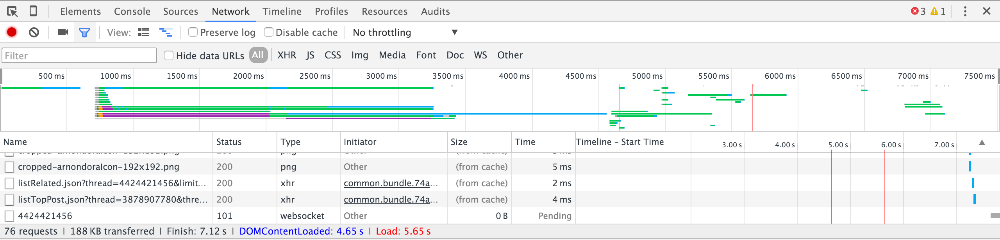

ในบทความนี้เราจะมาทำความรู้จักโปรเจ็คใหม่ล่าสุดแกะกล่องจาก Google กันนั่นคือ Accelerated Mobile Pages หรือที่เราเรียกย่อ ๆ ว่า AMP นั่นเอง

## Accelerated Mobile Pages คืออะไร ?
AMP หรือ Accelerated Mobile Pages มันเป็นซับเซ็ตตัวนึงของ HTML เหตุมันเกิดมาจาก Google มองว่า การพัฒนาเว็บในปัจจุบันนั้นสามารถทำได้หลากหลายทางมาก ๆ จนในบางวิธีนั้นได้ผลงานตามที่คนสร้างต้องการจริงแต่ในแง่ของ Performance ถือว่าแย่มาก ๆ Google เลยสร้าง AMP HTML ขึ้นมาเพื่อมาช่วยคุมเรื่องของ Performance นั่นเอง (เอาเป็นว่า มันเหมือนกฏที่สร้างมาให้เราทำตาม แล้วจะมั่นใจได้ว่า Performance ของเว็บเราดีแน่นอนก็ได้)

## ส่วนประกอบของ AMP

* **AMP HTML** - มันคือ HTML ที่เราเขียนกันในทุกวันนี้ปกติ แต่จะมีการเพิ่มมาของกฏและ Tag ใหม่บางประการซึ่ง Tag ทั้งหมดที่เพิ่มเข้ามาจะมีชื่อ amp แล้วตามด้วยชื่อ Tag ปกติที่เราใช้กัน  โดยเราจะเรียก Tag พวกนี้ว่า AMP HTML Components
* **AMP JS** - เป็น Javascript Library ที่ใช้อ่าน AMP HTML Components ที่มีเพิ่มขึ้นมาจาก HTML ปกติ ในเว็บบอกว่า มันสามารถทำให้เรามั่นใจได้ว่าเว็บของเราจะมี Performance ที่เร็วขึ้น เพราะนอกจากที่มันจะช่วยอ่าน AMP HTML Components แล้วมันยังช่วยจัดการการโหลดหน้าเว็บทำให้เร็วขึ้นอีกด้วย (อันนี้อ้างอิงจากเว็บของ AMP นะ)
* **AMP CDN** - ทำหน้าที่เป็น ตัวเช็ค ว่าโค๊ตที่เราเขียน มันถูกต้องตามกฏที่กำหนดไว้หรือไม่ โดยเราสามารถตรวจสอบข้อผิดพลาดได้จากหน้า Console ของ Web Browser ได้ทันทีเลย สะดวกมาก ๆ
ในที่นี้ผมจะไม่ขอพูดถึงการใช้งาน หรือกฏต่างที่ต่าง AMP ได้กำหนดไว้ สามารถดูเพิ่มเติมได้ที่เว็บ Offical ของ [AMP Project][0] ได้เลย

## สำหรับผู้ใช้ Wordpress
ตอนนี้ทาง Wordpress ก็มี Plugin ที่ทำให้เว็บ Blog ของเราสามารถรองรับ AMP HTML ดังกล่าวได้ โดยเราสามารถเข้าไปโหลด Plugin ดังกล่าวได้ที่ เว็บของ [Wordpress][1] แล้วมาติดตั้งได้เลย
หลังจากที่เราติดตั้งและ Activate แล้วเราสามารถเรียกหน้าที่เป็น AMP ได้โดยการพิมพ์ **?amp=1** ตามหลัง Permalinks ของเราได้เลย แต่หน้าที่ทาง Plugin ให้มานั่นจะเป็นหน้าโง่ ๆ ธรรมดาที่มีบทความ เราสามารถที่จะเข้าไปแก้ไขหน้าที่แสดงได้โดยการเข้าไปแก้ไฟล์ที่ชื่อว่า template.php โดยตรงแล้วอัพโหลดกลับเข้าไปที่เว็บของเราได้เลย
จากนั้นเราสามารถบังคับให้มัน Redirect ไปที่หน้าที่เป็น AMP ได้โดยการตั้ง Permalinks ใหม่ได้ โดยให้เราเลือกเป็น Custom แล้วพิมพ์ ?amp=1 ต่อท้ายไป เท่านี้หน้าเว็บของเราก็เป็น Accelerated Mobile Pages เรียบร้อยแล้ว
**Plugin ตัวนี้ยังอยู่ในเวอร์ชั่นแรก ๆ เท่านั้น อาจจะมีการเปลี่ยนแปลงได้ตลอดเวลา และอาจจะมีความเสี่ยงในการใช้งาน ฉะนั้นศึกษาให้ดีก่อนที่จะเอามาใช้ในเว็บจริงนะครับ**

## ใช้แล้วเป็นยังไง ไหนบอกหมอสิ !
แน่นอนว่าการที่ผมออกมาเขียนแบบนี้ เพราะว่าผมได้ลองใช้มันเป็นที่เรียบร้อยแล้ว โดยการใช้กับหน้าที่พวกนายกำลังอ่านอยู่เนี่ยแหละ ผลที่ได้ก็เป็นที่น่าพอใจอยู่พอสมควรเลย

[]

ภาพด้านบนเป็นหน้าที่ไม่ได้ใช้ AMP หรือก็คือหน้าปกตินี่แหละ จะเห็นได้ว่าใช้เวลาโหลด DOM Content อยู่ที่ 4.65 วินาที และ 188 KB

แต่หลังจากที่ใช้ AMP แล้ว ผลที่ได้ออกมาค่อนข้างที่จะน่าพอใจอยู่ ใช้เวลาโหลด DOM Content อยู่ที่ 1.43 วินาทีและโหลด Content ไปแค่ 154 KB เท่านั้น ถือว่าดีขึ้นค่อนข้างมาก น่าประทับใจจริง ๆ
**Note : หน้าที่ใช้โหลดทั้ง 2 มีหน้าตา และ Content เหมือนกัน โค๊ตเกือบเหมือน ต่างกันตรงที่มี Tag amp เข้ามา และตัวเลขที่เอามาแสดงเกิดจากการ Refresh หลาย ๆ ครั้งและเอาอันที่ใกล้เคียงกับค่าเฉลี่ยที่สุดมาให้ดูนะครับ**

## สรุป
Accelerated Mobile Pages ดูเป็นเทคโนโลยีที่น่าจะมีอนาคตที่สดใจอยู่พอสมควร ดูจากในตอนนี้มีบริษัทไอทีหลายเจ้าเริ่มหันมาเขียนเว็บโดยการใช้ AMP เข้ามาช่วย ไม่ว่าจะเป็น Twitter และ Line เป็นต้น ล่าสุดใน Blog ของ AMP บอกถึงความคืบหน้าของ Project และจะเริ่มแสดงผลการค้นหาของหน้าที่ใช้ AMP ในช่วงเดือนกุมภาพันธ์ที่จะถึงนี้ ก็ลองมาดูกันว่า AMP จะเป็นยังไงต่อไป แต่สำหรับในตอนนี้ก็เป็นอะไรที่น่าลองมาจับเล่นอยู่ เพราะดูจาก Performance ที่เพิ่มขึ้นก็ถือว่าคุ้มค่ามาก จะเป็นยังไงก็ขอให้โชคดีครับ

[0]: https://www.ampproject.org
[1]: https://wordpress.org/plugins/amp/
