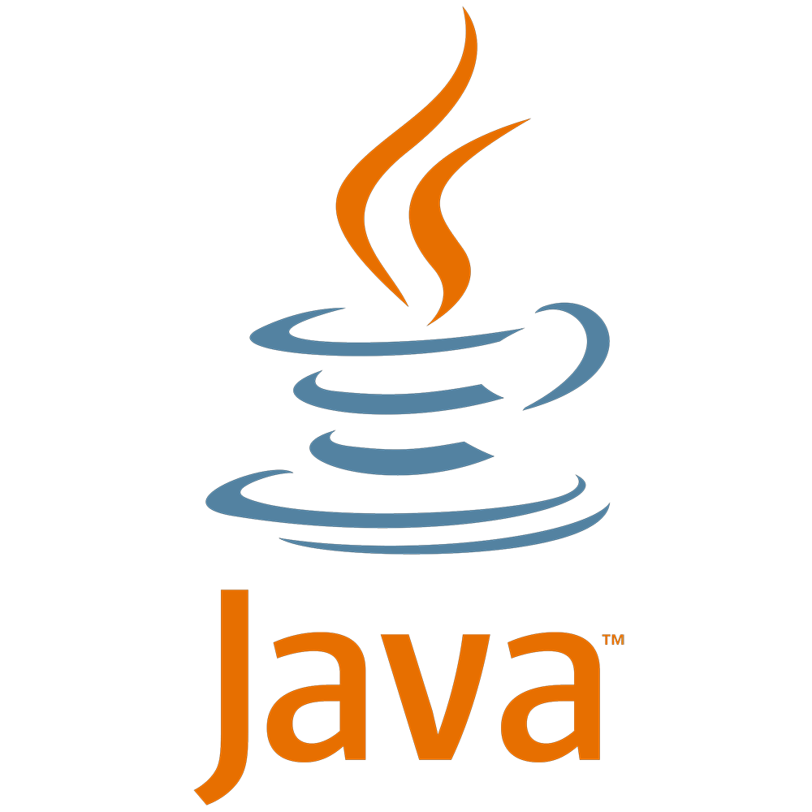

ในปัจจุบัน ก็คงปฏิเสธไม่ได้ว่า ไม่มีใครที่ไม่รู้จักภาษายอดนิยมอย่าง Java เพราะตอนนี้เป็นภาษาที่ฮิตอยู่อันดับที่ 2 รองจาก Python กันเลยทีเดียว และหลาย ๆ คนก็อาจจะเคยเรียนมาบ้าง หรือกำลังใช้งานมันอย่างชำชองอย่างรุนแรง แต่พอไปถามคนบางคนก็ไม่รู้จริง ๆ ว่า การทำงานของมัน หรือ Concept เป็นอย่างไร วันนี้เราจะมาดูกันว่า Java แท้จริงแล้วมันคืออะไรกันแน่

## Java คืออะไร ?

ถ้าใครกำลังคิดว่ามันคือ กาแฟ ก็เออใช่ !!! จะบ้าเหรอ พูดถึง Java ในฝั่งของคอมพิวเตอร์ต่างหากเล่า ถ้ามีคนมาถามว่า Java คืออะไร เราจะตอบมันว่ายังไงดี ? จริง ๆ แล้วคำตอบก็ขึ้นอยู่กับว่า จะตอบว่ามันเป็นอะไรดี เพราะว่าตัว Java จริง ๆ แล้วมันไม่ใช่แค่ Programming Language เท่านั้นนะ เพราะว่ามันก็ยังเป็น Platform เหมือนกับ OS ต่าง ๆ นั่นแหละ

## Java Programming Language
มาดูกันที่สิ่งแรกที่เราจะตอบไปก่อนว่า Java คืออะไร ? อ่อ มันก็คือ Programming Language ไง แล้วก็เป็นภาษาที่รองรับการเขียนโปรแกรมเชิงวัตถุอย่างเต็มรูปแบบด้วยนะ (Object Oriented Programming) และเมื่อเทียบกับ C++ ที่เป็นภาษาที่รองรับการเขียนโปรแกรมเชิงวัตถุเหมือนกันแล้ว Code โปรแกรมเดียวกัน เมื่อเขียนด้วย Java จะพบว่า มันสั้นกว่า กระชับกว่า และอ่านง่ายกว่า C++ เยอะเลย ทั้งนี้จากประสบการณ์คิดว่า เป็นเพราะการใช้ภาษาที่ค่อนข้าง Friendly กับมนุษย์คนเขียนอย่างเรา ๆ มากกว่า
ตัว Java อย่างที่บอกนอกจากที่มันจะเป็น Programming Language แล้ว มันก็ยังเป็น Platform ด้วย เพราะฉะนั้น เราสามารถเขียนโปรแกรมด้วยภาษา Java เพียงครั้งเดียว แต่สามารถเอาไป Execute ที่ไหนก็ได้ที่ Install ตัว Java Platform อยู่ (Platform Independent) อย่างที่สโลแกนบอกคือ **Write Once Run Anywhere** ส่วนจะทำงานยังไงนั้น เดี๋ยวไปดูต่อเรื่องของ Platform ในหัวข้อถัดไป
ข้อดีที่ทำให้นักพัฒนาส่วนใหญ่เลือกใช้ Java ในการพัฒนาโปรแกรมมีอยู่หลายข้อเหมือนกัน เช่น ฟรี อันนี้สำคัญมากเลยนะ เมื่อเราไปเทียบกับ .NET ที่จำกัดวงที่ใช้ได้เฉพาะใน Windows Platform เท่านั้น ทำให้มีค่าใช้จ่ายในเรื่องของ License ของ Windows และ Tool ในการพัฒนาและบำรุงรักษาอีก ฉะนั้นการใช้ Platform ที่ไม่มีค่าใช้จ่ายทำให้องค์กรสามารถลดต้นทุนไปได้เยอะพอสมควรเลย
ส่วนอีกเหตุผลนึงเลยคือ มี Library ให้เราเลือกใช้เยอะมาก นอกจากจะเป็น Library ที่ตัวภาษา Java จัดมาให้แล้วก็ยังสามารถไปหาโหลด Library จากนักพัฒนาคนอื่นได้อีกมากมายจนเป็น Community กันเลยทีเดียว

**มีมือใหม่หลาย ๆ คนไม่รู้ว่า ไปได้ยินมาจากไหนเหมือนกันว่า Java = OOP ขอให้ทำความเข้าใจกันใหม่นะว่า Java != OOP นะ Java Programming Language คือภาษาที่ใช้ Concept ของ OOP เข้ามาช่วยให้เราพัฒนาโปรแกรมได้ง่ายขึ้นเฉย ๆ นะ คนล่ะเรื่องเลย**

## Java Platform

ทีนี้เรามาถึงเรื่องของ Platform ของตัว Java กันบ้าง มันคือเหมือนสภาพแวดล้อมที่ทำให้เราสามารถ Execute โปรแกรมที่เขียนจากภาษา Java ได้นั่นเอง ประกอบด้วย 2 ส่วนคือ Java Visual Mechine (JVM) และ Runtime Library โดยทาง Sun ที่เป็นเจ้าของ Java ได้ทำการกำหนด Platform ไว้ 3 Edition ด้วยกัน

* **Java ME หรือ Java Platfrom Micro Edition** เป็นน้องเล็กสุดในตระกูล Java ทั้งหมด เพราะ Footprint ของมันค่อนข้างที่จะมีขนาดเล็ก เหมาะสำหรับการนำไปใช้ในการพัฒนา Application บน Mobile Devices , PDA ในสมัยก่อน หรืออุปกรณ์ขนาดเล็ก (ตอนนี้ไม่ค่อยเห็นคนใช้จริง ๆ เลยนะ)
* **Java SE หรือ Java Platform Standard Edition** เป็นลูกคนกลาง ใน Edition ทั้งหลาย ใน Edition นี้จะมี API อะไรหลาย ๆ อย่างที่เราจำเป็นต้องใช้กันในการเขียนโปรแกรมแบบ High Level เช่นพวก การเชื่อมต่อกับ Database, GUI, Network และ Security เข้ามาทำให้เราสามารถเขียนโปรแกรมทั่ว ๆ ไปได้อย่างง่ายดาย
* **Java EE หรือ Java Platform Enterprise Edition** เป็นพี่โตสุดในบรรดาทั้งหมดที่ว่ามา โดยจะมีทุกอย่างที่ Java SE มี แต่จะเพิ่มในเรื่องของการพัฒนาโปรแกรมในลักษณะที่อยู่ในองค์กรที่ต้องการประสิทธิภาพและความทนทานสูง
ถ้าไปอ่านเจอในเว็บไหน หรือใครพูดที่ไหนว่า J2ME, J2SE หรือ J2EE มันคืออันเดียวกันกับที่ได้อ่านไปเมื่อสักครู่ นะแจ๊ะ

## How Java Programme Compile and Execute ?

ในการที่เราจะได้โปรแกรมที่เขียนจากภาษา Java สักตัวนึง เราจะต้องจับ Programming Language มาทำงานร่วมกับ Java Platform ก่อนอื่น เราก็ทำการเขียนโปรแกรมด้วยภาษา Java ตามปกติ จากนั้นเราก็สั่ง Compile ตัว Javac (Java Compiler) จะทำการแปลงไฟล์ .java ที่เป็น Source Code เป็น .class ที่เป็น Byte Code และสุดท้าย เราก็เอา Byte Code ที่เป็น .class ไป Execute บนเครื่องไหนก็ได้ ที่ทำการลง Java Platform ไว้ได้ โดยเราจะป้อนมันลงไปใน Java Visual Mechine (JVM) เพื่อ Execute นั่นเอง
แตกต่างกับหลาย ๆ ภาษาที่เมื่อเรา Compile มันจะแปลงจาก Source Code ให้กลายเป็น Mechine Language หรือ ภาษาเครื่อง ที่เครื่องสามารถ Execute ได้ทันที ทำให้เวลาเราไป Clone Git โปรแกรมอะไรมาใช้ หรือเอาโปรแกรมของคนอื่นมาใช้ เราก็ต้องสั่ง Compile มันก่อนถึงจะ Execute ได้ แต่เมื่อเทียบกับโปรแกรมที่เขียนด้วย Java เราสามารถ Execute ได้เลย ไม่ต้องมานั่ง Compile ก่อน
แต่การที่เราต้อง Execute โปรแกรมของเราผ่าน JVM เสมอ ทำให้มันมีข้อด้อยจากการพัฒนาโปรแกรมภาษาอื่นนั่นคือ Performance แต่ถามว่ามันน่างุดหงิดขนาดนั้นมั้ย ? ตอบเลยว่า ไม่เลย ถ้าเราไม่ได้พัฒนาโปรแกรมใหญ่ขนาดนั้นมันก็ไม่ค่อยเห็นผลเท่าไหร่
ผมก็หวังว่าผู้ที่อ่านกำลังอ่านมาถึงข้างล่างตรงนี้คงจะได้รู้จัก Programming Language ยอดนิยมอย่าง Java มากขึ้น และตอบคำถามบ้างคำถามที่หลาย ๆ คนถามมาได้ด้วย
