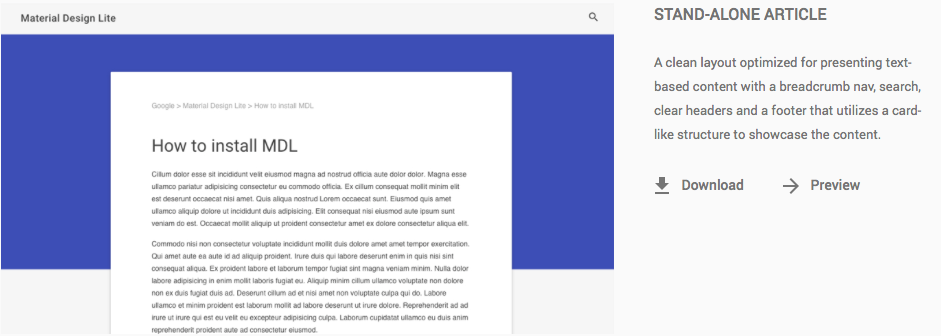
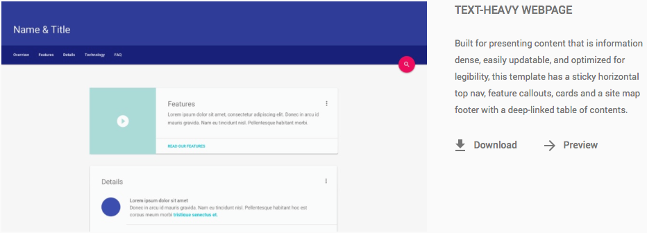
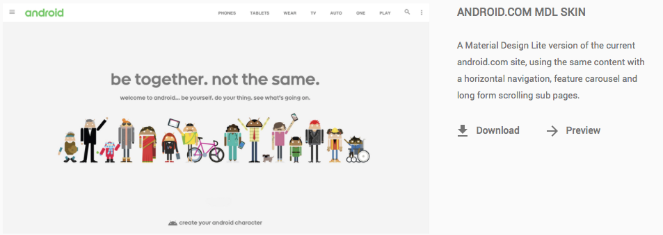

ย้อนกลับไปที่งาน Google I/O 2014 Google ได้เปิดตัว Guidelines สำหรับการ Design App และ Web ต่างๆ นอกจากนั้นยังเปิดตัวโครงการอย่าง Polymer ที่เปลี่ยนแปลงวิธีการเขียนเว็บของเรา ไปเยอะอยู่เหมือนกัน (เอาจริงๆ Polymer ผมก็ชอบนะ)  แต่ตอนนี้ มาแล้ว Web Component บน Paper Element ใน Web Polymer ถูกเอามาลงใน Version CSS, HTML และ Javascript ซึ่งทาง Google เรียกมันว่า Material Design Lite หรือ MDL นั่นเอง
ถ้ายังนึกไม่ออกว่ามันคืออะไร ให้นึงถึง Front-end Framework อย่าง Bootstrap ที่เราชอบใช้กัน แต่ต่างกันตรงที่ Element ทั้งหมดจะถูกถอด Design มาจาก Paper Element ใน Web Polymer นั่นเอง
แต่ที่น่าสะพรึ่งคือ ขนาดของมัน เมื่อโหลดผ่าน CDN เพียงแค่ 27 kb เท่านั้นเอง **และยังสามารถใช้กับ Web Browser ใหม่ๆ ได้หมดทุกตัว ยกเว้น IE9** นอกจากที่ขนาดจะเล็ก และรองรับ Web Browser ใหม่ๆได้แล้ว ยัง Install และใช้งานได้ง่ายมากๆ ยิ่งถ้าใครเคยใช้พวก Foudation หรือไม่ก็ Bootstrap มาแล้ว ก็คงจะไม่ใช้ปัญหาสักเท่าไหร่
นอกจากนี้ยังมี Template มาตราฐานหลายๆ อย่างให้เราได้ดูเป็นตัวอย่างอีกด้วย สามารถเข้าไปดูได้ที่ หน้า [template][0] ได้เลย

    

หลังจากที่ได้บรรยายสรรพคุณ ไปเยอะแล้ว เราลองเล่นกันเลยดีกว่า ในตอนนี้ เราจะลองมาสร้าง หน้า Home เล่นๆกันดีกว่า
ก่อนอื่น เราก็ต้องไป Import File ของตัว MDL เข้ามาก่อน ในที่นี้ขอใช้ผ่าน CDN ล่ะกัน (แต่ใน Github จะโหลดมาเป็น Local)

    <link rel="stylesheet" href="https://storage.googleapis.com/code.getmdl.io/1.0.0/material.indigo-pink.min.css">
    
    <link rel="stylesheet" href="https://fonts.googleapis.com/icon?family=Material+Icons">

หลังจากที่เรา Import File ที่จำเป็นเข้ามาแล้ว ถัดไปเราจะทำการสร้าง Navbar ด้านบนกัน ถ้าเราเข้าไปดูใน Document จะเห็นกว่ามี Navbar หลายแบบมาก แต่ในที่นี้เราจะเลือกแบบ Fixed-header แต่ก่อนจะวาง Navbar เราจะต้องวาง Container เหมือนกับตัวหุ้มหน้าเว็บเราก่อน

    

    

ทีนี้ล่ะ เราก็จะได้มาสร้าง Navbar กันจริงๆ ล่ะ เราจะต้องใช้ Header Tag เข้ามาช่วยในการสร้างด้วย มาเติมกันเลย

    

       <header class="mdl-layout__header">

       </header>
    

ถ้าลองเปิดหน้าที่เราเขียนตอนนี้ก็จะมีแต่จะมาเพิ่ม Link กับ Title ใน Navbar กัน

    

       <header class="mdl-layout__header">
         

            <!-- Title -->
               Title
            <!-- Spacer -->
               

            <!-- Nav <- Hide in smaller screen -->
               <nav class="mdl-navigation mdl-layout--large-screen-only">
                  <a href="" class="mdl-navigation__link">Home</a>
                  <a href="" class="mdl-navigation__link">Tutorial</a>
                  <a href="" class="mdl-navigation__link">about:me</a>
               </nav>
          

       </header>
    

เมื่อกี้ เราก็ได้เพิ่ม Link และ Title ถัดไปเราจะทำ Drawer กัน

     <!-- Drawer Layout -->
     

        Arnon Puitrakul
        <nav class="mdl-navigation">
           <a href="" class="mdl-navigation__link">Home</a>
           <a href="" class="mdl-navigation__link">Tutorial</a>
           <a href="" class="mdl-navigation__link">about:me</a>
        </nav>
     

ในการสร้าง Drawer เราก็ต้องสร้าวให้มันอยู่ใน Div Tag เข้าไป และถัดไป เราจะวางที่อยู่ให้กับ Content ในหน้าของเรา โดยเรียก Class mdl-layout\_\_content

     <!-- Main Content -->
     <main class="mdl-layout__content">
        

           <!-- Page Content Goes Here -->
           <h3>Hello World</h3>
         

     </main>

โดยเราจะเรียกผ่าน Tag Main และกำหนด Class เป็น mdl-layout\_\_content และสุดท้าย เราจะมาสร้าง Footer กัน

     <!-- Footer -->
     <footer class="mdl-mini-footer">
        
 
Copyright 2014-20ๅ5 Arnon Puitrakul all right reserved.

        
 
Getting Started with MDL by @arnondora

     </footer>

เท่านี้ เราก็จะได้ หน้าเว็บเริ่มต้นง่ายๆ กับ MDL กันแล้ว ส่วน Code ที่เขียนในนี้สามารถเข้าไปดูได้ใน [Github][6] ได้เลย
จะเห็นได้ว่า MDL ทำให้เราสามารถสร้างหน้าเว็บที่สวยงาม ตาม Material Design ได้ง่ายขึ้นเยอะมากๆ MDL จะเหมาะสำหรับเว็บที่ ไม่ต้องการรัน Web Polymer เต็มๆ หรือแค่ต้องการ Design จาก Paper Element ใน Web Polymer ก็ได้ สามารถดูข้อมูลเพิ่มเติมได้ที่ หน้าเว็บของ MDL ได้เลย
เดี๋ยวก็จะเขียน Theme อีก รอบนี้จะเอา MDL มาใช้นี่แหละ รอดูกันได้เลย เผื่อจะเอามาแจกกัน

[0]: http://www.getmdl.io/templates/index.html
[6]: https://github.com/arnondora/mdl.gettingstarted
