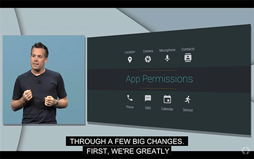
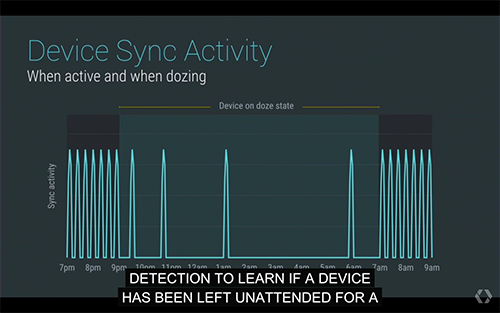
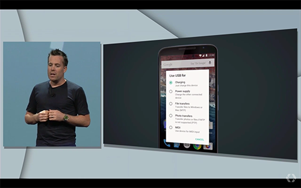
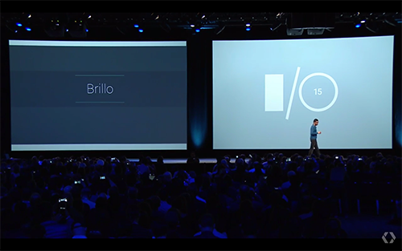
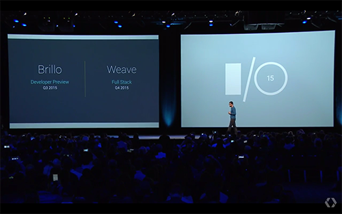
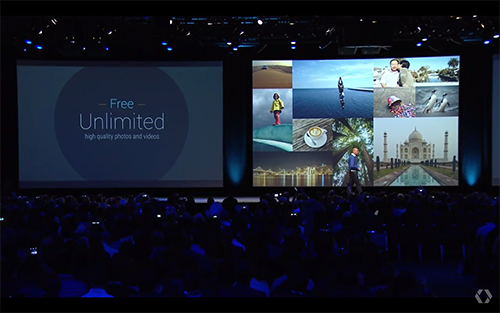

เมื่อคืนก็ผ่านกันไปแล้วครับกับ Keynote ของ Google I/O 2015 ซึ่งปีนี้งาน Google I/O ก็จัดขึ้นเป็นครั้งที่ 8 แล้ว ซึ่งแน่นอนว่า ผมก็ติดตามมาหลายปีอยู่ล่ะ ทุกๆปีก็จะมีารอัพเดทจากทางฝั่ง Google มาให้นักพัฒนาดูกันว่าปีนี้ Google จะเดินทางไปในทิศทางไหน งานนี้ทำให้ผมตื่นเต้นได้ทุกปีจริงๆตั้งแต่ก่อนงานเริ่มเลยทีเดียว เมื่อปีก่อนก็เป็น กลไกอะไรสักอย่าง นับถอยหลัง ก่อนเริ่มงาน พอมาปีนี้กลายเป็นจอรอบห้องมีวาฬว่ายน้ำไปมา และก็มีเกม Pong ที่ให้มาเล่นแล้วก็ Stream ขึ้นจอรอบห้องอีก เด็ดเวอร์ ! มาดูกันว่าปีนี้ Google เปิดตัวอะไรในงานบ้าง

### **Android M Preview**

เปิดมาก็เอาเลยครับกับ สิ่งที่หลายๆคน ทั้งนักพัฒนาและผู้ใช้รอคอยนั้นคือการอัพเดทของระบบปฏิบัติการที่คนใช้เยอะที่สุดในโลก นั่นคือ Android M ก็อีกแล้วกับการตั้งชื่อแบบนี้ออกมาก่อน เพื่อให้เรามานั่งเดากันเล่นๆว่า มันจะชื่ออะไรดี ? แต่เร่องนั้นก็ช่างมันก่อนเถอะครับ เขาบอกว่า Android ในเวอร์ชั่นนี้เราจะไม่ได้ไปเน้นที่การออกฟีเจอร์อะไรใหม่ ๆ แต่จะไปเน้นด้านการทำระบบให้ดีขึ้น ซึ่งหลัก ๆ ก็มี 6 อย่างด้วยกันในเวอร์ชั่นนี้

[

มาถึงกับอย่างแรก ที่สร้างเสียงดีใจอันสุดยอดกับ ฟีเจอร์แรกคือ App Permission เขาบอกว่าเราสามารถ ที่จะจัดการกับสิทธิ์ในการเข้าถึงของ App ของเราได้ ซึ่งในปัจจุบัน ถ้าเราเป็น User เวลาเราลง App มันก็ขึ้นมาแค่ว่าตัว App มันจะต้องการใช้อะไรในเครื่องเราบ้าง เช่น กล้อง ไมค์ รายชื่อ เป็นต้น ถ้าเราเจออะไรแปลกๆตอนนี้เราก็จะไม่ลง แต่ตอนนี้เราสามารถที่จะเลือกได้ว่า จะให้ตัว App เข้าถึงอะไร และห้ามเข้าถึงอะไร ซึ่งผมก็รอฟีเจอร์นี้อยู่นานเหมือนกัน แต่ที่สำคัญสำหรับ Developer แล้ว เราก็ต้องทำ app มาด้วยว่า ถ้า User ไม่ให้เข้าถึงตัว Permission แล้วเราจะต้องทำยังไงต่อ !

ถัดมาอีกฟีเจอร์เลยนั่นคือ Chrome Custom Tabs จากในปัจจุบัน ถ้า App เราจะเรียกหน้าเว็บขึ้นมา ตัว Android ก็ต้องไปสั่งให้ตัวระบบเปิดตัว Chrome มาทั้งตัวเลย ซึ่งมันเสียเวลามากๆ เขียนโค๊ตเยอะแยะไปหมด แต่ด้วย Chrome Custom Tabs มันจะรันอยู่ข้างหลัง App ที่เราเขียนไว้ เวลาเราจะส่ง User ไปหาหน้าเว็บเพื่อทำอะไรก็ตาม App ของเรามันจะไปเรียก Custom Tabs ที่อยู่ข้างหลัง App เรามา ทำให้ User สะดวกขึ้นเยอะ ส่วน Custom Tabs ที่โหลดขึ้นมาก็เป็น Engine ของ Chrome เลยแต่จะดึงมาแค่ ตัว Engine, Sign in, Saved Password, Autofill, Multi-process security ทำให้มันเร็วขึ้นมากเลย ดูจาก Demo ให้งานแล้วจะเห็นเลยว่า มันทำให้เราสะดวกขึ้นมาก ๆ เลยล่ะ

มากันที่อย่างที่ 3 เลยคือ App Link เจ้านี้มันจะช่วยให้เวลาเราต้องการที่จะส่งข้อมูลข้าม App กันได้ง่ายดายมากๆ ตอนนี้ สมมุติว่าเราได้ลิงค์ที่เป็นหน้า YouTube มา ตอนนี้เวลาเรากดลิงค์นี้ในโทรศัพท์เรา มันจะเด้งเข้าไปหน้า Chrome ก่อนแล้วค่อยถามว่า จะเข้าผ่านอะไรใช่มั้ยครับ แต่อันนี้มันจะมาตัด Process ตรงนี้ทิ้งไปเลย มันเข้าไปหา Signature เพื่อหาว่า App ที่เข้าได้น่าจะเป็น App อะไร แล้วมันจะแสดงขึ้นมาว่า จะเข้า App นั่นหรือจะผ่าน Chrome เลยก็ได้ ทำให้ User ไม่จำเป็นต้องรอ Chrome เปิดมาอีก กว่าจะโหลดกว่าจะขึ้นมาอีก เสียเวลามากๆเลย มาที่อย่างถัดไปกัน อันนี้ติ่ง Apple หลายๆคนจะบอกว่า ตามกันนี่หว่า ! แต่ก็นะ นั่นคือ Android Pay ก็ไม่มีอะไรเหมือน Apple Pay เลยใช้ NFC เหมือนกันอีก งั้นก็ผ่านไปเถอะ

งานถัดไปก็มาอีก กับการรองรับ Sensor ลายนิ้วมือเป็น Native เลย เย้ ๆๆ หลังจากที่ Apple ทำไปแล้ว เมื่อก่อนตอนที่ Galaxy S5, S6 ทำออกมาตัว Samsung จะต้องจัดการกับโปรแกรมตัวของลายนิ้วมือเอง แต่ตอนนี้ Google จะมี API ให้

มาถึงสุดท้ายกับ Android กันแล้ว นั่นคือ เรื่องของ Power & Battery นั่นเอง เมื่องาน Google I/O เมื่อปีที่แล้ว Google ก็เปิดตัว Project Volta ที่ช่วย Handle Battery เราให้อยู่นานขึ้น แต่ปีนี้มาอีกแล้วครับกับ Doze เขาเริ่มจากปัญหาที่ว่า เราวางเครื่องของเราทิ้งไว้ไม่ได้ใช้งาน อาจจะเป็น Tablet ของเรา เราอาจจะใช้มันอ่านข่าวตอนเช้า และใช้ดูหนังในตอนกลางคืน
แล้วระหว่างนั้นล่ะ ?
มันก็ไม่ได้ใช้ใช่มั้ยครับ เจ้า Doze จะเข้ามาช่วยตรงนี้เลย มันจะอ่านค่าจะเซ็นเซอร์ในเครื่องเราว่า เครื่องเราวางไว้เฉยๆมั้ย ถ้าเครื่องมันรู้ว่า เราไม่ได้มาใช้เครื่อง แค่วางไว้เฉยๆ มันก็จะเข้าโหมด Deep Sleep เพื่อประหยัดแบตโดนทันที จากผมการทดลองจาก Google กับ Nexus 9 Google เคลมว่าแบตอยู่นานกว่าเดิมเยอะมาก เราก็ต้องมาดูกันตอนมันออกว่า เป็นงั้นมั้ย ?

และสุดท้ายของ Android แล้วนั่นคือ เรื่องของการ Charging ตั้งแต่ Apple เปิดตัว USB type-C มาเป็นมาตราฐานใหม่ (จริง ๆ มันเป็นมาตราฐานปกติ ที่ใคร ๆ ก็ใช้ได้นะครับ) ซึ่งตัว Android M นี้ก็จะรองรับ USB Type-C แบบ Native เลย และยังมี ถ้าเราเสียบฝั่งนี้ มันจะเป็น Charging เสียบอีกด้านอาจจะเป็นการเอาไฟออกให้ Device อื่นอะไรแบบนี้ ซึ่งเราสามารถตั้งได้

## Android Wear

]มาที่ฝั่งของ Android Wear กันบ้าง ปีนี้ก็มีอัพเดท ตามใน Keynote อยู่ 3 อย่างนั่นคือ Always On เมื่อก่อนเราอาจจะบอกว่าพวก Smart Watch มันก็เปิดหน้าจอตลอดเวลาไม่ได้ เพราะแบตจะหมด แต่ตอนนี้ตัว Android Wear จะทำให้หน้าจอตัวเองเป็นขาวดำเพื่อที่จะประหยัดพลังงานขึ้นอีก นอกจากนั้นก็จะมี Wrist Gesture และยังสามารถวาด Emoji แล้วมันจะไปเช็คว่ามันน่าจะเป็นรูปอะไร แล้วมันก็จะ Suggest เราขึ้นมาว่าจะส่งอันไหนดี

ต่อไป ก็ะพูดถึงเรื่องของ Smart Home แต่ปัญหาของมันตอนนี้ มันไม่มี Standard อะไรเลย ทำให้ผู้ใช้ และผู้ผลิตเกิดความลำบากในการทำมันออกมา Google เลยเปิดตัว Brillo เป็น OS สำหรับ IoT ขึ้นมา เพื่อสร้าง Standard ให้อุปกรณ์ที่เป็น IoT โดยจะใช้ Base จาก Android แต่เพื่อให้มันเป็น Lightweight Footprint เขาเลยดึงมาแค่บางส่วนของ Android เท่านั้น เพื่อให้มันเบาที่สุด

เมื่อกี้ก็เป็น OS สำหรับ IoT ไปแล้ว แต่มันก็ยังเชื่อมต่ออะไรไม่ค่อยสะดวกนัก เลยเปิด Weave อีกตัวซะเลย มันเป็น Standard ในการติดต่อของเหล่า IoT ทั้งหลายทำให้นักพัฒนาทำงานได้ง่ายขึ้น เพราะทำงานอยู่ในมาตราฐานเดียวกันทั้งหมด

ซึ่ง Brillo จะเปิด Developer Preview ในช่วง Q3 2015 และ Weave ปล่อย Full Stack ตามมาคือ Q4 2015

## Google Photos

เจ้านี่ก็เรียกเสียงปรบมือ ได้ไม่เบาเลยครับกับ Google Photos App ใหม่ (เหรอ) จาก Google ตัว App มีการเล่นในเรื่องของ Mechine Learning มากขึ้นเพื่อค้นหาภาพที่เราต้องการได้ง่ายขึ้นเยอะมากเลย แต่ที่เรียกเสียงเฮจากผู้ชมได้เยอะสุดเลยคือ **Google ให้ Storage เก็บรูปความละเอียดที่ 16 MP และวีดีโอที่ 1080p ฟรี ไม่จำกัดเลยนะฮ่า~~ สามารถ โหลด App Google Photos ได้ตั้งแต่วันนี้เลย !**

และสุดท้ายกับ Now On Tap ก็เป็นการเอา Mechine Learning เข้ามาใช้อีกแล้ว อันนี้จะเอา Google Now หรือผู้ช่วยส่วนตัวของ Google เข้ามาช่วย อย่างใน Demo ด้านบน ถ้าเรามีเพื่อนส่งเมล์มาชวนไปดูหนังกัน เราก็แตะที่ปุ่มโฮมค้างไว้ แล้วตัว Google Now มันจะเข้าไปอ่านเมล์เราที่กำลังเปิดอยู่ แล้วหาว่า มันสามารถช่วยอะไรได้บ้าง อย่างใน Demo ข้างบน มันเจอชื่อหนัง มันก็จะขึ้นชื่อหนังพร้อมกับลิงค์ไปหา IMDB อะไรแบบนี้ ผมชอบนะดูครั้งแรกแล้วก็เงิบเหมือนกัน
และนี่ก็หมดแล้วครับกับ Keynote จากงาน Google I/O 2015 (จริงๆมันมีอีกนะเรื่อง Google Developer Console แต่ขอไม่พูดถึงล่ะกัน  เดี๋ยวจะยาวกว่านี้เยอะเลย) ก็เดี๋ยวบทความหน้าจะมาพูดถึง Session ที่ผมไปดูมา ติดตามอ่านกันนะครับ
มีดูย้อนหลังด้วยนะครับที่ [Google I/O 2015 - Keynote - YouTube][14] เข้าไปตามลิงค์ได้เลย

[14]: https://www.google.co.th/url?sa=t&rct=j&q=&esrc=s&source=video&cd=3&cad=rja&uact=8&ved=0CDAQtwIwAg&url=https%3A%2F%2Fwww.youtube.com%2Fwatch%3Fv%3D7V-fIGMDsmE&ei=PyFoVauEGpTnuQSBpYPoCw&usg=AFQjCNEoP5pqapKi3qaMy-B2Vc0FcPgNMA&sig2=JHDLnLEF5ARoyAPhHRn-Eg&bvm=bv.94455598,d.c2E
