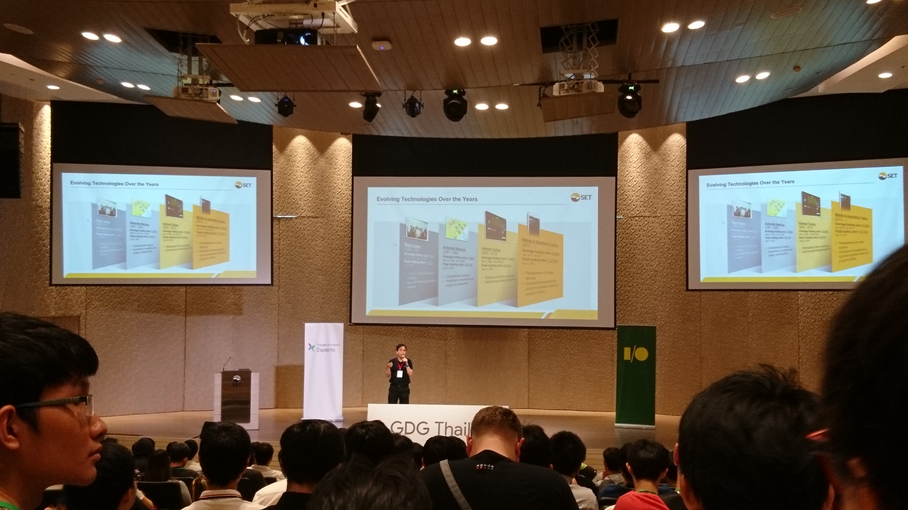
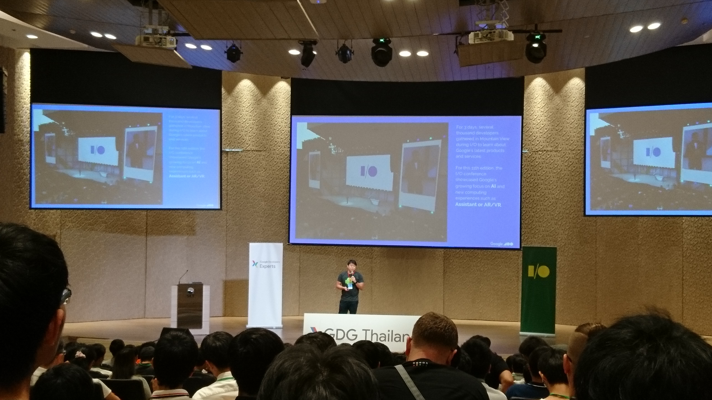
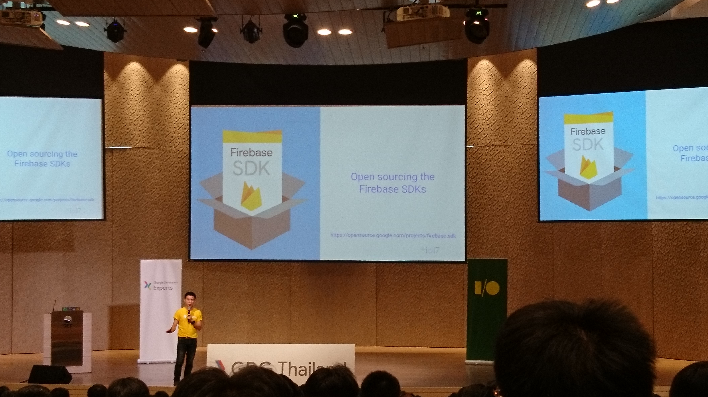
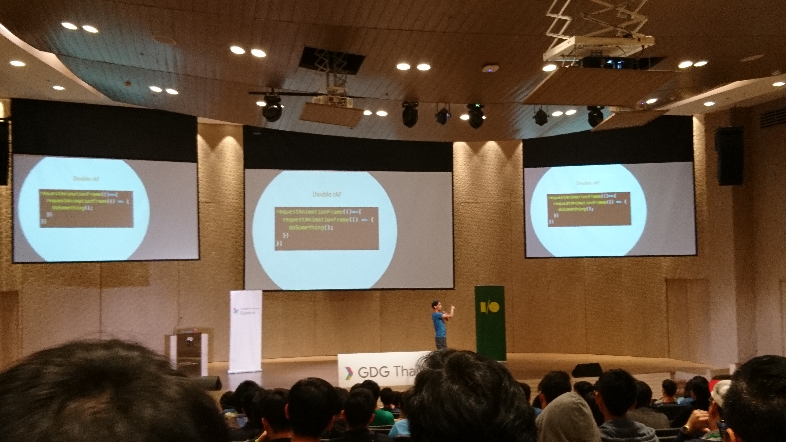
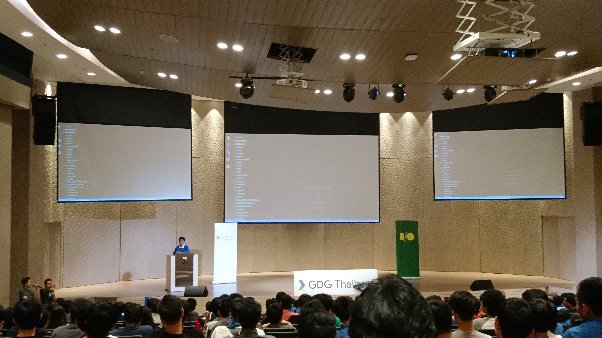
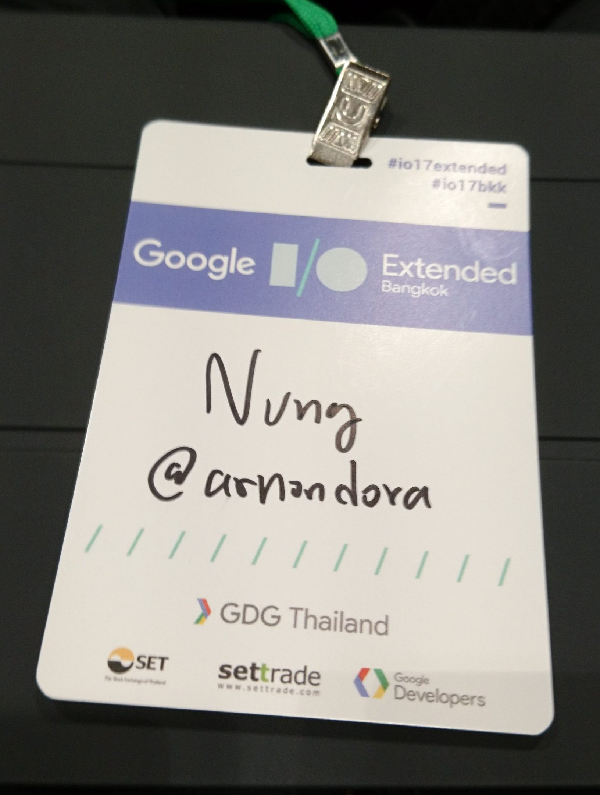

หนึ่งปีก็เวียนมาบรรจบอีกแล้ว กับงาน Google I/O Extended Bangkok 2016 ปีที่แล้วจัดที่ Paragon จัดว่า Grand มาก ปีนี้มา Google I/O Extended Bangkok 2017 ชื่อเดิมที่เพิ่มคือ ปี ก็กลับมาอีกครั้ง ก็ได้สถานที่มาจัดที่ตลาดหลักทรัพย์กันบ้าง ก็ Grand อยู่หน่อย ๆ แต่ต้องยอมรับว่า ไม่ Grand เท่ากับปีก่อน แต่ได้อยู่ !!

## Welcome Speech

เริ่มจาก Keynote จาก ตลาดหลักทรัพย์แห่งประเทศไทย โดยจะพูดถึงเรื่องของเทคโนโลยีที่ใช้ในตลาดหลักทรัพย์ว่า ใช้อะไรบ้าง แล้วที่มามันเป็นยังไง บอกว่า ตอนนี้เริ่มมีการศึกษาและเตรียมที่จะปล่อย Product ที่เป็น Blockchain ออกมา กับอีกเรื่องคือ Big Data Analysis เพราะตลาดหลักทรัพย์เองก็มีข้อมูลเข้ามาในหลายช่องทางมาก และผู้ใช้ก็มีความหลากหลายสูง จึงจำเป็นต้องเข้าใจผู้ใช้ให้มากขึ้น จึงต้องนำข้อมูลมาวิเคราห์เพื่อให้ได้ Insight มาเพื่อใช้งานต่อได้

## Welcome Keynote

ได้ฤกษ์กันแล้วกับ Keynote แรกจาก Thye Yeow Bok จาก Google APAC ที่มา Recap งาน Google I/O ที่ปีที่แล้วก็มา ปีนี้ก็มา ~~ ก็มีการพูดถึง Stat ของ Android ในปีนี้ที่ **Active User ของ Android อยู่ที่ 2B** ไปแล้ว และน่าตกใจมากที่ประเทศไทยเราใช้เวลากับ YouTube สูงเป็น**อันดับ 1 ของโลก**

Google I/O ในปีนี้ก็มีการแบ่งเรื่องออกมาอยู่หลายเรื่องด้วยกัน **AR/VR** ในปีนี้ก็มีการเปิดตัว **Daydream 2.0** ออกมาที่ปรับปรุงประสบการณ์การใช้งานให้ดีขึ้น และสามารถใช้งานอะไร ๆ ได้มากขึ้น นอกจาก VR ก็มาที่ฝเก่ง AR ที่มีเรื่องของ Expeditions AR ออกมาเพื่อใช้ในห้องเรียน

นอกจากนั้นยังมี **WebVR** ที่ทำให้เราสามารถทำ VR ได้บนเว็บเลย และรองรับแบบบน Google Chrome เรียบร้อย ทำให้เราสามารถสร้างสรรค์ Content ที่เป็น VR ได้อย่างง่ายดาย และในอนาคตจะมี AR เข้ามาด้วยเช่นกัน เด็ดกว่านั้นใน Youtube ก็จะเอาเรื่องของ AR/VR มาจับด้วย ที่จะออกในอนาคตอันใกล้นี้

**Google Assistant** ก็มาแรกในปีนี้เช่นกัน ที่ Google ได้เปิดตัว Google Assistant ออกมา โดยตอนแรกปล่อยให้ Google Pixel ได้เล่นก่อนในปีที่แล้ว มาในปีนี้ก็เตรียมที่จะเปิดให้เครื่องอื่น ๆ ได้ใช้กันแล้ว ที่เจ๋งจริง ๆ ของปีนี้คือมี **Assistant SDK** ออกมาให้นักพัฒนาสามารถสร้างสรรค์ Feature ได้โดยใช้ Engine เดียวกับ Google Assistant ได้เลย ซึ่งในงานก็จะมี Session นึงพูดถึงเรื่องนี้เหมือนกัน นอกจากนั้นยังมี **Transaction on Assistant** ที่สามารถทำให้จ่ายเงินได้ใน Google Assistant ได้เลย

ในช่วงปีที่ผ่านมา Chatbot ก็เป็นอีกเรื่องที่ใคร ๆ ก็สนใจกันในปีนี้ Google ก็มีการเปิดตัว **Chatbase** ออกมาที่เป็น Analytic สำหรับ Chatbot

พระเอกของงานอีกตัวที่ลืมไม่ได้เลยคือ Android มาในงานปีนี้มีการประกาศว่า **Kotlin** รองรับแบบ Native แล้วในการพัฒนา Android ที่เป็นข่าวฮือฮ่ามากในโลกของนักพัฒนา Android เลย

**Cloud & AI** ก็เป็นอีกเรื่องที่ Google ให้ความสนใจมาก เพราะ Google เชื่อว่า Machine Learning จะปลดล๊อคความสามารถที่เราไม่เคยทำได้มาก่อน เลยมีการเปิดตัว [google.ai][2] ที่เป็นการรวมผลงานเกี่ยวกับ AI ในเว็บไซต์ นอกจากนั้นมีความสนใจในเรื่องของ Automatic Machine Learning ที่เป็นการใช้ Machine Learning ในการทำ Machine Learning (งง กันแน่ ๆ) Idea ของมันคือ การทำให้คอมพิวเตอร์สอนกันเองได้ จากตอนนี้ที่ทำได้แค่เรียนแล้วจบที่ตัวเอง

AI บน Google Cloud Platform ก็มาแรงเหมือนกัน เพราะมีการเปิดตัว **Cloud TPU** ที่เป็น Chip ที่ออกแบบมาเพื่อการทำ Machine Learning โดยเฉพาะเลย จัดว่าแรงโคตร ๆ ที่จะเปิดให้เราใช้ใน GCP ในช่วงปีหน้า และยังมีการเปิดตัว **Tensorflow Lite** ที่เป็น Machine Learning Library บน Smart Phone (รอมานานแล้วววว)

## What's new in Firebase and Cloud Platform

เริ่มที่ Session แรกเป็นเรื่องของ **What's new Firebase** จากพี่ตี๋ ปีที่แล้วใน Google I/O Extended Bangkok ก็มีการพูดถึงเรื่องของ Firebase ไปมาในปีนี้ เริ่มด้วย Stat ตั้งแต่ปีก่อนที่เปิดตัวไปจนถึงปีนี้ มี Project มากกว่า 1 ล้านโปรเจ็คแล้ว

ปีนี้เอง Firebase ก็มีการเปิดตัว Product ใหม่เป็น **Performance Monitoring** และ **Cloud Storage for Firebase** ที่เราสามารถเลือก Region ในการเก็บไฟล์ได้แล้วเพื่อลด Latency ในการเข้าถึงไฟล์ใน Bucket ได้เยอะมาก ๆ และยังทิ้งท้ายในส่วนนี้ว่า ถ้าเซ็ตเก่งพอควร ก็จะสามารถลดค่าใช้จ่ายในการเก็บไฟล์ลงได้อีกด้วย

และอีก Feature นึงที่เปิดตัวคือ **Cloud Function** ที่สามารถเขียน Function ลงไปใน Firebase ได้เลย แล้วเราก็แค่เรียก Trigger ลงไปในแล้วก็รันได้เลย ผลทำให้เราสามารถลด CPU ของฝั่ง Client ได้เลย ซึ่งเว็บ arnondora.in.th เองก็กำลัง Implement Image Optimiser โดยใช้ Cloud Function ใน Firebase อยู่เหมือนกัน กำลังจะเอามาใช้จริง เร็ว ๆ นี้

ฟีเจอร์ตัวนึงที่โดนเรียกร้องรัว ๆ กันอย่างยาวนานคือ **Phone Authentication** ที่สามารถทำ OTP ได้อย่างง่ายดาย อีกฟีเจอร์นึงคือ Reporting และยังมี **Performance Reporting** ที่เข้ามาช่วยเรา Monitor App ของเราว่า ตรงไหนช้า ตรงไหนเร็ว Request ไหนเป็นยังไง บอกได้หมด ทำให้เราสามารถแก้ไข App ของเราได้ทันที

## Image Classification with Deep Learning

สำหรับ Session ถัดไปจะอยู่อีกห้อง เป็นเรื่องของ **Image Classification ด้วย Deep Learning** จากพี่ต้า ที่เป็น GDE ด้าน Machine Learning ที่มาเล่าว่า เราจะสามารถทำ Image Classification ได้อย่างไร โดยหลัก ๆ แล้วเราสามารถทำได้ 2 วิธีคือการใช้ **Pre-Trained Model** กับ **Custom Model**

การใช้ Pre-Trained Model จาก Google ก็ทำได้ง่ายมาก ๆ แค่เราส่งรูปเข้าไป มันก็จะโยนผลกลับมาให้เราได้ทันที เช่นพวก **Vision API** อะไรพวกนี้ก็ได้ แต่ปัญหาคือ ตัว Pre-Trained Model ไม่ได้ให้ข้อมูลตามที่เราต้องการสักเท่าไหร่เช่นพวกการทำ Machine Learning สำหรับงานเฉพาะด้านเลย ก็จะต้องมาใช้พวก **TensorFlow** ก็ในงานก็มีการ Demo ข้อมูลภาพจาก Wongnai ให้เราดูกันว่า เราจะทำ Image Classification เพื่อแบ่งระหว่างรูปอาหาร และรูปบรรยากาศร้าน

## Introduction to Kotlin
Session ต่อไปเป็น Kodlin ที่หลาย ๆ คนน่าจะได้ยินข่าวกันมาแล้วว่า Android Studio รองรับ **Kodlin** เรียบร้อยแล้ว ที่สำคัญกว่านั้น ที่ไหนเรียน Java ได้ก็เขียน Kodlin ได้เลย เขียนลงไปในไฟล์เดียวกับ Java ได้เลย และยังทำงานพร้อมกับ Code ที่เป็น Java เก่าได้ 100% เพราะฉะนั้นเราไม่จำเป็นต้องเขียนใหม่ทั้งหมดเพื่อจะย้ายมา Kodlin เลยโคตรสะดวก

## Building app for the Google Assistant

มาถึง Session ในช่วงบ่ายก็เป็นเรื่องของ**Google Assistant** โดย พี่ตั้ง **\#คนเถื่อน2017 (อย่าบอกพี่ตั้งนะว่า เล่าแบบนี้ ฮ่า ๆ)** ที่มาพูดถึงเรื่องจะของการสร้างคำสั่งสำหรับ Google Assistant ว่าเราสามรถทำได้โดยวิธีไหนบ้าง พร้อมกับทำโชว์กันบนเวทีสด ๆ เลยว่าแต่ละวิธีทำยังไง พอได้ดูปุ๊บมันง่ายกว่าที่คิดไว้มาก ตอนแรกวาดฝันไว้ว่ามันต้องเขียนอะไรมากมายซับซ้อนมาก พี่ตั้งมาทำให้ดูบนเวที อ้าว เฮ้ย แค่นี้เองเหรอ !!!

## Recommender system with TensorFlow

Session ต่อไปเป็นเรื่องของ **Recommendation System** โดยพี่เจมส์ GDE Machine Learning อีกคน ที่มาเล่าถึงการทำ **Recommendation System** ว่าสามารถทำได้ยังไงบ้าง แล้วข้อดีข้อเสียแต่ละแบบเป็นยังไงบ้าง และสอนการทำโดยใช้ TensorFlow อีก อันนี้ขอไม่ลงรายละเอียดละกัน เพราะมันค่อนข้าง Technical มาก ๆ จริง ๆ วางแผนว่าจะเขียน Blog เล่าหลักการของระบบพวกนี้อยู่เหมือนกัน ก็รอติดตามกันนะครับ (ขายของตัวเองในนี้ก็ยังได้วุ้ย)

## Modern web The next era of web experience

มาใน Session ต่ออีกอีกกลับมาหาพี่ตั้งคนเถื่อนอีกในเรื่องของ **Web Experience** ที่มาเล่าเรื่องของ Performance ของการโหลดหาเว็บว่าทำยังไงให้โหลดได้ไว และอื่น ๆ ที่เกี่ยวกับ Experience แต่ก็เข้ามาช่วงหลัง ๆ เลยค่อยได้อะไรเท่าไหร่ จับได้ประมาณนี้ ชู่ว ๆๆ อย่าไปบอกพี่ตั้งเชียวว่าเข้ามาช้า ฟังไม่ทัน

## Progressive on Framework and Tooling

ถัดไปก็เป็น Session ของพี่ปันเจ และแก๊งค์ตลกสามช่ารายการ **<hardcode\> **(พี่ 2 คนนี่ตลกจริง !! รายการพี่ตลกจนผมขำลั่น MRT จนคนหันมามองไปแล้ว โคตรอาย) ในหัวข้อ **Progressive on Framework and Tooling** ก็จะมา Code สดโชว์ว่า ถ้าเราจะ Implement PWA เราจะทำมันได้ยังไงบ้าง ซึ่งถ้าเราใช้ Framework เช่น React หรือ Angular อะไรพวกนี้ก็จะสามารถสร้าง Project ที่ออกมาเป็น PWA ได้เลย ส่วนถ้าเราต้องการจะเอามาเขียนเอง Google ก็มี **Workbox** เอามาใช้ได้ โดยมันจะรองรับการทำงานหลาย ๆ อย่างตั้งแต่ Basic จนถึง Advance เลย ก็เห็นเลยว่าการทำ PWA นั้นไม่ได้ยากเลยจริง ๆ เป็นอะไรที่น่าทำมาก

## Building Beautiful Apps Faster With Material Components on Android
และ Session สุดท้ายเป็นเรื่องของ **Notification Channel & Badges Kotlin** ที่มาพูดในเรื่องของ Badge ที่เป็น Feature ตัวใหม่ใน Android O จริง ๆ มันมีมาสักพักแล้วละ แต่มันติดปัญหาการรองรับ เพราะ Android Devices แต่ละเจ้าใช้ Launcher ต่างกัน ทำให้ยากที่จะเขียนให้รองรับทุกเจ้าพร้อมกันได้ Google เลยเขียนออกมาเป็น Official API ออกมาให้ใช้กันใน Android O ตัวใหม่ออกมา

ซึ่งใน Session นี้จะมาพูดว่า เราจะสามารถ Implement Badge และ Notification ได้อย่างไร รวม ๆ คือมันง่ายมาก ๆ เลย ต้องยอมรับว่าเทคโนโลยีมันผ่านไปเร็วมาก ๆ เมื่อก่อนกว่าจะ Implement ได้ละ Feature ใช้เวลาและแรงเยอะมากมาในตอนนี้นี่ ชิว กว่าเดิมเยอะเลย

## Google I/O Extended Bangkok 2017 จัดว่าเด็ด

และก็จบไปแล้วกับงาน Google I/O Extended Bangkok 2017 มากี่ปีก็ยังอยากที่จะมาในปีต่อไปเรื่อย ๆ นอกจาก Speaker ที่เก่ง (พูดเก่ง และเล่นตลกสามช่าเก่ง) นอกจากนั้นยังได้พบปะเพื่อน ๆ ทั้งหน้าเก่า และเพื่อนใหม่ ๆ เต็มไปหมดเลย เดินไปคือ ทักทั้งงาน ฮ่า ๆ

[2]: https://www.google.ai
