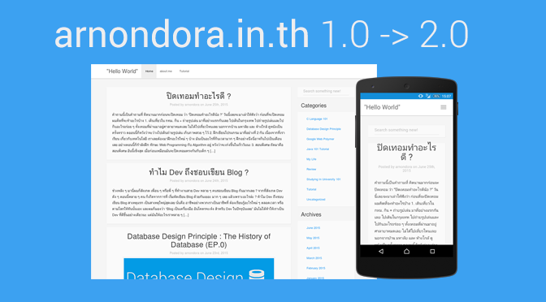
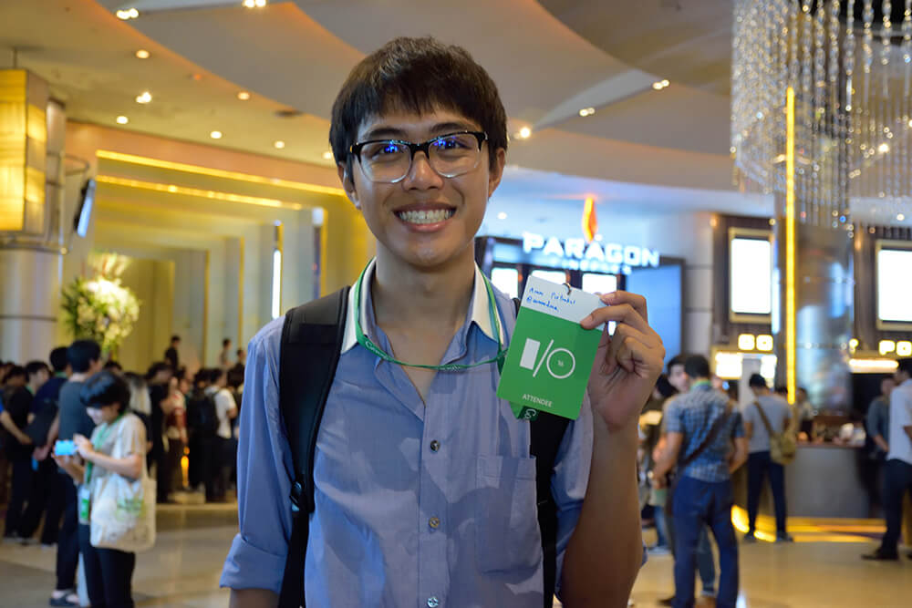

เมื่อวันก่อน ระหว่างที่นั่งเขียน PaperTheme อยู่ ก็คิดอยู่ว่า **"นี่เราเขียน Blog นี้มากี่ปีแล้วหว่า แล้วมันมาถึงจุดนี้ได้ยังไง ? "** เลยย้อนกลับไปดูวันที่ของบทความแรก มันคือปี 2014 จนตอนนี้ปี 2017 ก็ผ่านมาร่วม ๆ 3 ปีเข้าไปแล้ว วันนี้เลยอยากจะมาย้อนเวลาพากลับไปดูว่า กว่าเว็บ arnondora.in.th จะมาเป็นเว็บที่ทุกคนกำลังอ่านอยู่นี้มันผ่านอะไรมาบ้าง

<iframe src="//giphy.com/embed/lELRD773cY7Sg" width="480" height="258" frameborder="0"></iframe>

ตอนแรกที่เขียนตอนนั้นจำได้เลยว่า เราคงทำมันได้ไม่นานเกินปีหรอก ตอนนี้เวลาผ่านไปก็พิสูจน์ให้เห็นแล้วว่า เออมันก็ทำได้นี่หว่า ถ้าลองย้อนกลับไปอ่านบทความแรก ๆ ของผมจะเห็นเลยว่า อ่านไม่ค่อยรู้เรื่องมาก ๆ (ตอนนี้ก็ยังอ่านไม่รู้เรื่องอยู่ดีใช่มั้ยละ ใช่มั้ย !!!) เว็บในช่วงแรก ๆ ด้วยความที่เป็นมือใหม่ ไม่เคยใช้ Wordpress มาก่อน ก็ไม่รู้อะไรเลย ลองผิดลองถูกไป ด้วยความที่เป็นโคตร Geek ก็เอาเลยครับ อ่าน Manual มันซะเลย ก็ช่วยได้อยู่นะ จนได้ออกมาเป็นเว็บแรกในที่สุด ออกมาหน้าตาก็งั้น ๆ Responsive บ้าง เละsponsive บ้างก็เถอะ จนตอนหลัง ก็พอฝีมือเริ่มแกร่งกล้าขึ้นเรื่อย ๆ จน Site สำเร็จรูปของ Wordpress เริ่มเอาไม่อยู่แล้วก็เลยตัดสินใจย้าย Host มาทำ Self-Host เองซะเลย ตอนนั้นด้วยความที่ไม่ได้หวังอะไรกับเว็บนี้มาก ก็ไปใช้ Host ฟรีสำหรับนักศึกษาของ P&T Hosting (เข้าไม่ได้จ่ายนะ แต่เราอะจ่ายเขา) บวกกับจดทะเบียน Domain arnondora.in.th ทุกอย่างก็ถูกเซ็ตและใช้ง่ายไป ไม่มีอะไร จนกระทั่งวันนึงผมปล่อยบทความ [ทำไมต้องมีแฟนเป็นคนทำงานไอที?](https://www.arnondora.in.th/%e0%b8%97%e0%b8%b3%e0%b9%84%e0%b8%a1%e0%b8%95%e0%b9%89%e0%b8%ad%e0%b8%87%e0%b8%a1%e0%b8%b5%e0%b9%81%e0%b8%9f%e0%b8%99%e0%b9%80%e0%b8%9b%e0%b9%87%e0%b8%99%e0%b8%84%e0%b8%99%e0%b8%97%e0%b8%b3%e0%b8%87/) ออกไป แล้วถูกแชร์ออกไปเป็นจำนวนมาก

Free Host ที่ได้มาก็เอาไม่อยู่สิครับ เพราะวันเดียวกดไป 60,000 View กว่า ๆ จนกระทั่งเวลาประมาณเที่ยงคืน เกือบ ๆ ตี 1 เว็บก็ล่มไป เพราะ B/W เต็ม เอาละครับ ชิบหายแล้วไง ณ ตอนนั้นก็ขืนใจตัวเอง เอา Credit ของ Digital Ocean ที่ได้มาจาก Github Student Developer Pack 100 USD มาเปิดเว็บ ความชิบหายอีกทอดคือ ตอนนั้นไม่เคยต้อง Set-Up LAMP Stack ตั้งแต่ต้นมาก่อน ตอนนั้นก็ลองผิดลองถูกอยู่นานจนตี 3 ก็ออกมาเป็นเว็บรันต่อได้ และก็เขียนบทความ [How To Move Your Web To DigitalOcean! ฉบับเว็บไม่ Down](https://www.arnondora.in.th/how-to-move-your-web-to-digitalocean-%e0%b8%89%e0%b8%9a%e0%b8%b1%e0%b8%9a%e0%b9%80%e0%b8%a7%e0%b9%87%e0%b8%9a%e0%b9%84%e0%b8%a1%e0%b9%88-down-thai/) ออกมา และในตอนนั้นเองละครับ ที่ทำให้เว็บผมเริ่มกลายเป็นที่รู้จักขึ้นมา จาก 60,000 กว่า View ในวันนั้น แบบ งง ๆ

ช่วงปิดเทอมในตอนนั้นก็น่าจะราว ๆ ปี 1 ขึ้นปี 2 ก็เกิดไอเดียอยากที่จะเขียน Theme ใช้เองขึ้นมา ก็ไปนั่งดู Youtube + อ่าน Document แล้วมานั่งเขียนสด ๆ ใช้เวลาราว ๆ 2 วันเศษ ก็ได้ Theme แรกในชีวิตออกมา [arnondora.in.th 2.0 Design ใหม่รองรับ Mobile แล้วนะ](https://www.arnondora.in.th/arnondorainth-design-ver2/) หลังจากนั้นก็ตั้งปณิธานกับตัวเองเลยว่า

> เราจะอัพเดทหน้าเว็บเราทุกปี และต้องใช้สิ่งที่เราเรียนมาในปีนั้น ๆ เอามาทำออกมา

หลังจากนั้น เว็บก็รันอยู่ใน Digital Ocean ไปเป็นปี จนกระทั่ง Let's Encrypt ก็เปิดให้เราขอ Cetificate ได้ ด้วยความ Geek ระดับสุดยอด จะเหลือเหรอครับ มาสิครับ เล่นเลย จนได้ออกมา และก็เขียนออกมาเป็นอีกบทความนึง [ขอ Certificate ง่าย ๆ จาก Let's Encrypt](https://www.arnondora.in.th/lets-encrypt-certificate-install/) เว็บก็เลยรันเป็น HTTPS จนถึงปัจจุบัน นอกจากนั้น ช่วงนั้นก็เริ่มเล่นของโดยการเขียนบทความให้มันตรงกับกฏของ SEO ให้มากที่สุด ผลมันไม่ได้เกิดในช่วงเวลาอันสั้นเลย ไปรู้ตัวอีกทีก็เมื่อสักปีที่แล้ว (คือปี 2016) ที่มีรุ่นน้องมาบอกว่า เว็บผมขึ้นอยู่บนอันดับต้น ๆ ใน Google เลยในบาง Keyword ก็ว่าละทำไมช่วงหลัง ๆ ถึงมี Traffic จาก Organic Search เข้ามาเยอะมาก ๆ

แต่ 100 USD ในวันนั้นก็ย่อมมีวันหมด ผมเปิด Droplet ตัวเล็กสุดเดือนละ 5 USD ก็จะใช้ได้ราว ๆ 20 เดือนหรือเกือบ 2 ปี มันก็กำลังจะหมดลง แต่ถ้าจะใช้ Cloud อีกก็จะแพงไป เลยไปหา Hosting ในไทยแทน ก็เลยย้ายมาใช้ Hosting Lotus แทน ปีนึงก็ 500 บาท (เขาไม่ได้จ่าย แต่ผมจ่ายเขาเอง) ตอนแรกที่ย้ายไปใช้ Shared Hosting มันก็มีข้อจำกัดหลาย ๆ อย่างที่เพิ่มขึ้นมา ก็ต้องปรับตัวกันไป เช่น EWWW Image Optimiser ที่ใช้ไม่ได้แล้วเพราะมันจะไปกวนเว็บอื่นที่อยู่บนเครื่องเดียวกันได้ ก็ต้องกลับไปใช้ TinyPNG เหมือนเดิมไป

เวลาผ่านไปเรื่อย ๆ ปณิธาน ที่ตั้งไว้ก็ถูกจัด ทุกปี จนกระทั่งปีนี้ (ปี 2017) เว็บผมก็เปลี่ยนหน้าตาแบบ Major Change เลย และ [PaperTheme](https://github.com/arnondora/wordpress-paper-theme) ตัวเดิม ก็ถูกเปลี่ยนชื่อเป็น [PaperTheme Redux](https://github.com/arnondora/wordpress-paper-theme-redux) และจากที่ตอนปี 3 ก็ได้เรียน HCI และ จิตวิทยา (ใน Coursera) ก็เลยจับสิ่งที่ได้เรียนมา เอามาใช้ในการ Design หน้าเว็บอันใหม่ขึ้นมา แต่มาในเวอร์ชั่นของ Redux นี้ ก็คิดว่าจะปล่อยอัพเดทเรื่อย ๆ จนตอนนี้เว็บที่เราเห็น (เดือนปี ณ วันที่เขียน August 2017) ก็พึ่งปล่อย PaperTheme Redux 1.3 ไปเมื่อวานที่เป็น Minor Design Update ไป (มัน Minor ตรงไหนฟร๊ะ !!) เปิดมา อ้าวนึกว่าคนละเว็บ ฮ่า ๆ

ช่วง 1-2 ปีที่ผ่านมา ผมก็มีโอกาสไปงาน Meet Up หลาย ๆ ที่มากขึ้น ก็เริ่มถูกทักโดยคนที่ไม่รู้จัก บอกว่า **"ผม ตามอ่านเว็บพี่ตลอดเลยครับ ! "** มันก็ทำให้เรารู้สึกดีนะ ถือว่าเป็นกำลังใจจากผู้อ่าน ประกอบกับเริ่มมีอีเมล์มาคุยเป็นจำนวนมากขึ้นเรื่อย ๆ (ตอนนี้เฉลี่ยอยู่อาทิตย์ละ 20-35 ฉบับ ก็ถ้าตอบไม่ทันก็ขอโทษด้วยนะครับ จะพยายามตอบให้ไวกว่านี้) เมื่อวันก่อนก็นั่งทำงานอยู่ใน Common Room (มันคือห้องอ่านหนังสือของที่หอ แบบใครที่อยู่หอก็เข้ามาใช้ได้ เด็กหอน่าจะรู้จักดี) ที่หอ ก็มีคนมาดง ๆ มอง ๆ ที่กระจกเว้ย !! ตอนนั้นเราก็คิดว่า ใครฟร๊ะ !! เขาจะเข้ามาเหรอ ? ลืมเอาบัตรลงมา ? หรือต้องการความช่วยเหลืออะไร <iframe src="//giphy.com/embed/xT1XGDKwOxacd92rYI" width="480" height="270" frameborder="0"></iframe> มองอยู่แปบนึง ก็เลยเดินออกไปเปิดประตูชะโงกหัวออกไป พร้อมกับถามว่า **"มีอะไรรึเปล่าครับ ?"** ก็ถามกลับมาว่า **"พี่ใช่คนที่เขียน arnondora.in.th รึเปล่าครับ**" ก็ตอบว่า ใช่ (แหงแหละ ก็ตรูเป็นคนเขียน) น้องเขาก็บอกทำนองว่า ผมอ่านเว็บพี่มาอะไรแบบนี้ ก็เลยถามกลับไปว่า นี่คณะอะไรอะครับ อ้าวเฮ้ย น้อง ๆ คณะ เรานี่หว่า อยู่หอเดียวกันอีก ฮ่า ๆ  ก็เป็นเรื่องตลกดี

## What's next?

ก็นะ มันก็มาขนาดนี้แล้ว ก็ยังยืนยันคำเดิมว่าจะเขียนต่อไป จะเน้นการแชร์สิ่งที่เรียนรู้มาให้คนอื่นอ่านต่อ (จะไม่ค่อยได้เขียน Tutorial เป็น Series เหมือนก่อนแล้ว เพราะไม่มีเวลา เหมือนเมื่อก่อน) เพราะเหตุผลที่เริ่มเขียน Blog เป็นเพราะว่า เราอยากจะแชร์สิ่งที่เรารู้ให้คนอื่นต่อไป เราเข้าใจคนที่อยากจะเริ่มเขียนโปรแกรม แต่ไม่รู้จะเริ่มยังไง เพราะผมก็เคยอยู่ในจุดนั้นมาก่อน ประกอบกับกำลังใจจากทุกคนก็ทำให้เว็บนี้รันต่อไปได้

> เว็บนี้ไม่ได้รันด้วย "เงิน" แต่รันด้วยกำลังใจจากทุกคนครับ 💕

และอยากจะบอก อีกว่า ถ้าเจอผม แล้วอยากจะเข้ามาทัก ก็เข้ามาได้เลยนะครับ ผมไม่กัด ฉีดยาแล้ว ฮ่า ๆ ไม่ต้องกลัว ผมไม่ได้เข้าหายากขนาดนั้น บางทีเคยเจอเหมือนกับ อยากจะเข้ามาทัก แต่เห็นผมคุยอยู่เลยไม่กล้าอะไรแบบนี้ เข้ามาเถอะครับ อยากคุย ฮ่า ๆ
