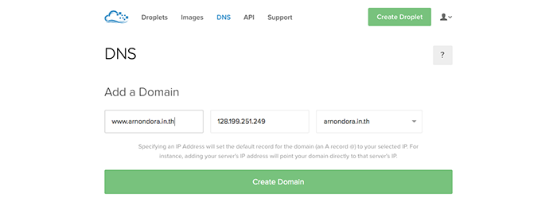

หลังจากที่ผมได้ผ่านสรภูมิการย้ายเว็บลง Digital Ocean เมื่อไม่กี่วันก่อน ตอนที่หาวิธี ผมหาอันที่เป็นภาษาไทยไม่ได้เลย เศร้ามาก!! วันนี้ผมเลยจะมาบอกเล่า เป็นภาษาไทยกันล่ะกัน

## To Do List

* Backup Database และข้อมูลผ่านตัว Manager ของ Host เก่าก่อนนะครับ
* สร้าง Droplet
* ติดตั้ง vsftpd และ phpmyadmin
* ย้ายตัว Content ของเว็บลงใน Digital Ocean ผ่าน FTP
* Restore Database ลง DB ด้วย Phpmyadmin
* Set DNS ใหม่

## 1 Backup Database และตัว Content ของเว็บ
อันนี้ก็ไม่มีอะไร ยังง่ายๆอยู่ แค่ Backup Database ออกมาไว้ก่อน อาจจะผ่าน Phpmyadmin ก็ได้ ง่ายดี และ Backup ไฟล์ของเว็บเราออกมาด้วย

## 2 สร้าง Droplet ใน Digital Ocean
หลังจากที่เรา Backup ตัวเว็บเข้ามาในเครื่องของเราแล้ว เราจะต้องมาสร้าง Droplet ใน Digital Ocean
ในการสร้าง มันจะมี Settings ให้เราเลือก เยอะแยะ ตอนนี้ผมแนะนำให้ลงเป็น OS Ubuntu x64 Version ล่าสุดไปและ เลือก Image เป็น LAMP เพื่อที่เราจะไม่ต้องมานั่ง Install mysql,apache อะไรให้วุ่นวาย ส่วนช่ือของ Droplet ให้ตั้งเป็นชื่อเว็บ เช่น arnondora.in.th (ไม่ต้องใส่ www. นะ)
ยังๆ ยังไม่จบ ถัดมาหลังจากที่สร้าง Droplet เรียบร้อยแล้ว Digital Ocean จะส่ง ตัว IP Address และรหัสเข้า root ของเครื่องที่สร้างมาให้ ให้เราจดไว้ ไม่ก็เปิดหน้าเมล์ทิ้งไว้ก่อน จากนั้นเราก็จะเข้าไป Setting เครื่องของเรากัน
ให้เปิด Terminal ขึ้นมา (For Mac or Linux) ถ้าเป็น Windows แนะนำให้ใช้  Putty ก็ได้ ให้พิมพ์

    ssh root@**yourIPAddress**

จากนั้นมันจะถามรหัสต่อให้พิมพ์รหัสที่ เราได้จากเมล์เลย
ถ้าเราเข้าครั้งแรก มันจะถามเราว่า เราจะ Trust คอมเครื่องนี้มั้ย ให้ตอบ yes และ enter
ก็เป็นอันเสร็จสเต็ปนี้และ (เริ่มเหนื่อยและ)

## 3 ติดตั้ง vsftpd และ Phpmyadmin
ปัญหาที่ผมเจอตอนที่ย้ายคือ เอิ่ม.. มันใช้ FTP เหมือนเดิมไม่ได้ เซงมาก! เลยต้องมาติดตั้ง vftpd เพื่อให้เราใช้ FTP ได้เหมือน Host ตัวเก่า วิธีคือ

    apt-get install vsftpd

หลังจากที่มันโหลดและติดตั้งอะไรเรียบร้อย เราจะมาติดตั้งตัว Phpmyadmin กัน แต่เดี่ยวก่อน ก่อนหน้านั้นเราจะต้องเอารหัสผ่านเข้า DB ของ mysql กันก่อน โดย Digital Ocean จะ Generate ไว้ให้เราแล้วเป็นไฟล์ มันจะอยู่ที่ /root/.my.cnf ถ้าใครจะ Linux เป็นก็ใช้ TextEditor วิ่งเข้าไปเลย ถ้าใครใช้ไม่เป็น ในที่นี้ผมจะใช้ vim

    vim /root/.my.cnf

จากนั้น บนจอเราจะมีรหัสชุดนึง ให้จดไว้ก่อน แล้วออกโดยพิมพ์ :q และ Enter จากนั้นเราจะติดตั้ง phpmyadmin โดย

    apt-get install phpmyadmin

จากนั้นตัว Command Line มันจะโหลดไฟล์ของ phpmyadmin เข้ามาให้เรา และมันจะถามว่า
จะใช้ dbconfig-common เพื่อ Install มั้ย ให้ตอบ yes จากนั้นมันจะถาม Password ของ MySQL ก็ให้กรอกที่เราจดมาตอน vim น่ะ ถัดมาอีก (ยังไม่จบอีกเนอะ lol) มันจะให้เราเลือกรหัสของ root ที่จะเข้า phpmyadmin ให้เรากรอกตามใจชอบเลย เอาที่สบายใจเลย กรอกแล้วกด Enter และกรอกอีกครั้งเพื่อยืนยัน เป็นอันเรียบร้อย!!
แต่เดียวก่อน ยังไม่จบ เราจะต้องเปิดการใช้งานของ Plugin ตัวนึงก่อนนั่นคือ php5-mcrypt โดยการพิมพ์

    sudo php5enmod mcrypt

สุดท้ายของสเต็ปนี้และ คือ Restart Apache

    sudo service apache2 restart

## 4+5 ย้าย Web Content และ DB ลง Digital Ocean
เอา Web Content ก่อนให้เราเข้าผ่าน FTP โดย Host จะเป็น IP Address ของเครื่องเรา Username เป็น root และ Password เป็น Password ที่ใช้เข้า SSH ตอนต้นเลย จากนั้นก็ไปแปะ (อัพน่ะ) ไว้ที่ /var/www ไปเลย
ส่วน DB ให้เราเข้าไปที่ **http://yourIPAddress/phpmyadmin** Username ก็เป็น root และ Password ก็เป็น Password ที่เราตั้งตอนติดตั้ง Phpmyadmin แล้วก็ Restore DB ลงไปเหมือนปกติเลย

## 6\. Set ค่า DNS เพื่อให้ชี้มาที่เว็บใหม่
ตรงนี้แหละครับ ยากสุด พลาดทีนี้เว็บ Down เป็นชม. เลยนะ 5555 ก่อนอื่นเปิดหน้า Admin ของ Digital Ocean แล้วกดที่ DNS ด้านบนกันก่อน เราจะได้หน้าประมาณด้านล่างนี้ขึ้นมา แล้วตรง Add Domain ด้านขวาสุดมันจะให้เลือก  Droplet ให้เราเลือก Droplet ที่เราสร้างไว้เลย มันจะมี IP Address ช่องที่ 2 โผล่มาเอง ไม่ต้องไปยุ่งอะไรกับมัน และชื่อแรก ใน Doc ของ Digital Ocean บอกว่าให้ใส่ชื่อเว็บเรา โดยไม่ต้องใส่ www. แต่ผมลองแล้วมันไม่ได้อะ ผมเลยทำแบบนี้ 2 ครั้งแต่ อันนึงใส่ www. กับอีกอันไม่ได้ใส่

หลังจากสร้างแล้ว กด View ที่สัก Domain นึง อันไหนก็ได้ เราจะเข้ามาที่หน้าที่มันแสดง Name Server อยู่ มี 3 อันให้เอามันไปใส่ใน DNS Settings ของ Domain เราได้เลย
หลังจากนั้น รอไปไม่เกิน 24 ชม รอ Update ตอนนั้นผมรอไป 3 ชมกว่าๆ แต่เว็บจะไม่ Down เพราะว่า ถ้าเราทำถูกต้อง ระหว่างรอปรับ DNS Domain Name เรามันจะถูก Route ไปที่ Host เดิม และหลังจากที่ Update แล้ว มันก็จะ Route ไปหน้าใหม่ User ไม่รู้แน่นอน
วิธีเช็คว่าเราย้ายไปรึยังให้ใช้ Whois ในการเช็ค (ผมจะเช็คผ่าน SSH ของ Droplet เลยนะ) วิธีคือ Install Whois ก่อน

    apt-get install whois

จากนั้นเราจะเช็คโดยพิมพ์

    whois yourDomainName

เช่นของผมเป็น arnondora.in.th ก็พิมพ์เป็น

    whois arnondora.in.th

มันก็จะบอกรายระเอียดของ Domain เรา ให้เราไปดูที่ Name Server ว่าถ้ามันชี้ไปที่ Digital Ocean แล้วก็ OK และ
เป็นอันเสร็จครับ เย้ๆๆ ตอนนั้นผมทำแบบนั่งอ่าน Doc จาก Digital Ocean ก็ทำเอามึนเหมือนกัน ถ้าอ่านของผมแล้วยัง งง แนะนำให้ไปหาใน Google เอา แต่ระวังเวลา Search นะครับ หา Version ของ OS ให้ตรงนะครับ เช่นผม Install เป็น Ubuntu 14.xx แต่ผมดันไปอ่านของ 12.xx บางอย่างมันจะไม่เหมือนกันและมันจะพินาศนะครับ ระวังหน่อย!
