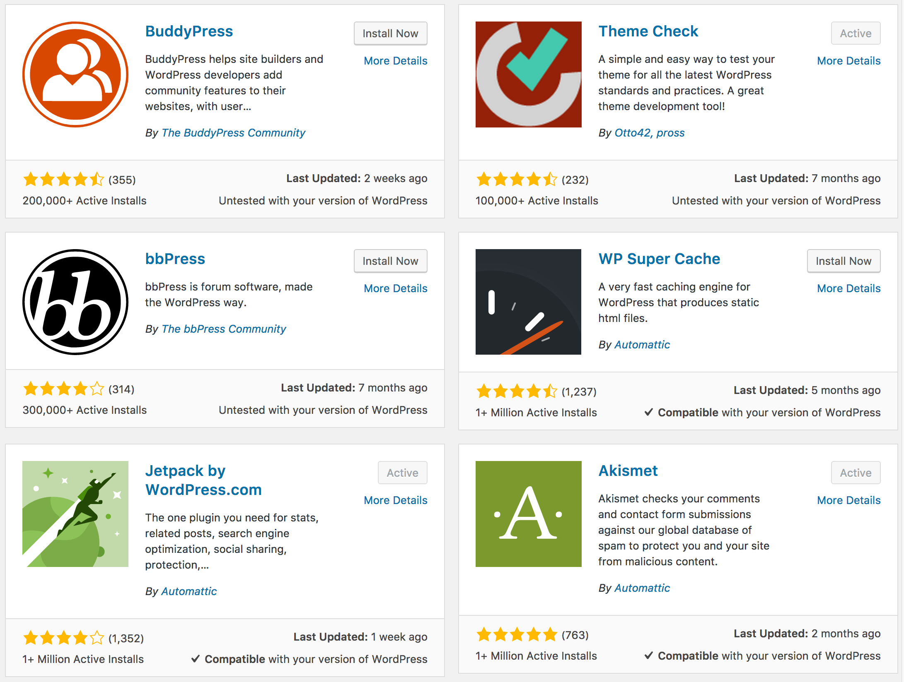
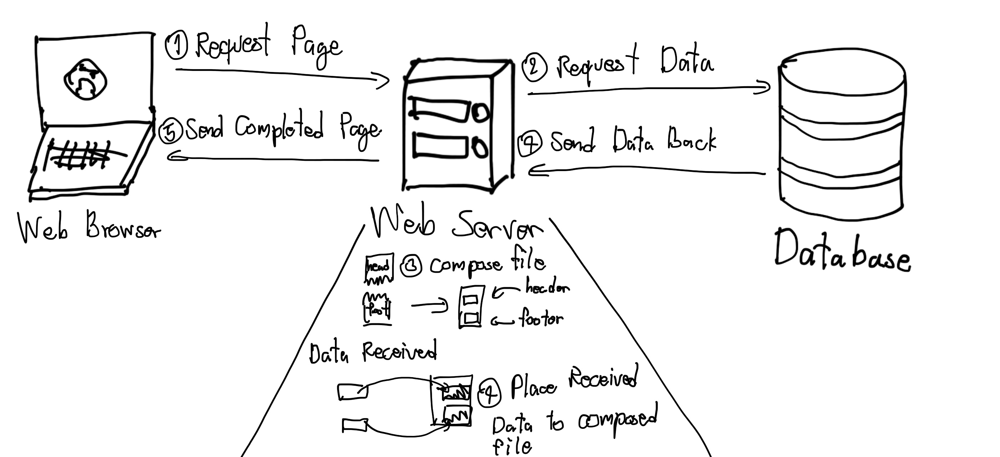
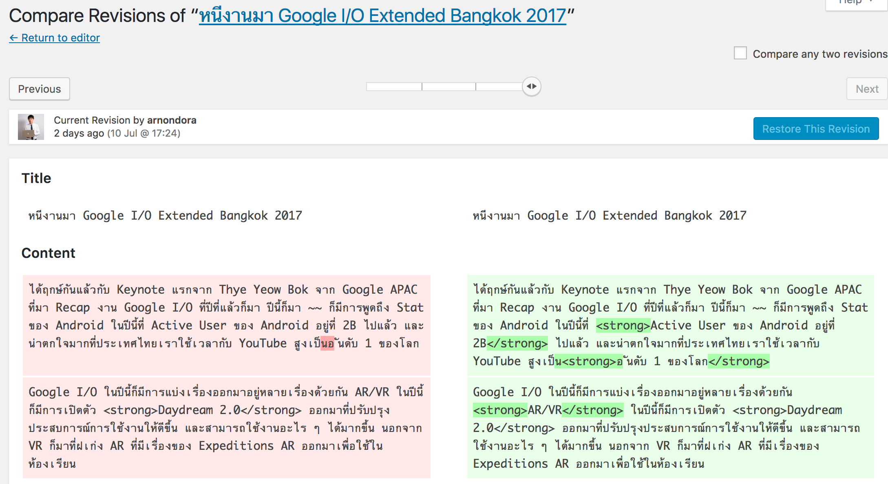

มีหลายคนถามผมมาว่า **ทำไมยังใช้ Wordpress อยู่ทั้งที่ Traffic สูงขนาดนี้ แล้วรับโหลดไหวเหรอ** จริง ๆ แล้ว Wordpress เป็นระบบที่ถูก Code มาดีอยู่ในระดับหนึ่งแล้วละ แต่ด้วยการลง Plugin และอื่น ๆ เป็นจำนวนมากก็ส่งผลทำให้ Wordpress ของเราช้ากว่าที่ควรจะเป็น และถึงแม้ว่า เราจะไม่ได้ลง Plugin อะไรมากกมายจนทำให้มันช้า หรือผล SEO ของเราอยู่ล่าง ๆ
แต่ด้วยความที่เป็น Wordpress เราก็ยังสามารถ Optimise ให้มันสามารถทำงานได้เร็วขึ้นได้เช่นกัน วันนี้เลยอยากจะมาแชร์วิธีการที่เราใช้ Optimise Wordpress Site กันตั้งแต่ง่าย ๆ จนไปถึงยาก ๆ กันไปเลย

## เลือกใช้ Theme หรือ Components ต่าง ๆ ที่มีคุณภาพ

เหนือสิ่งอื่นใด ถ้าเว็บของเรารันเว็บของเราด้วย Theme หรือ Component อื่น ๆ ที่ไม่ได้ถูก Optimise หรือไม่ได้ถูกเขียนอย่างถูกวิธี เว็บของเราก็จะช้าอยู่ดี
ทางที่ดี เราควรเลือกใช้ Theme และ Component ที่มีคุณภาพ ถูกต้องตามหลักที่ Wordpress กำหนดไว้ เพื่อให้เรามั่นใจได้ว่าสิ่งที่เราหยิบมาใช้มันจะไม่ส่งผลกระทบทางลบกับเว็บอันมีค่าของเรา
เมื่อตอนแรก ๆ ที่ผมเปิดเว็บนี้ ผมก็ไม่ค่อยมีความรู้กับ Wordpress เท่าไหร่ ก็เคยเจอประสบการณ์กับการเลือกใช้ของใน Wordpress อยู่พอสมควร ทำให้เว็บที่ใช้ Host ที่เล็กอยู่แล้ว รับ User ได้น้อยกว่าที่ควรจะเป็นจนล่มไปแล้วครั้งหนึ่ง เลยทำให้จำฝังใจเลยว่า ควรเลือกให้ดี
ถามว่า **"แล้วอันไหนละที่คิดว่าดี เราก็ดูไม่เป็นเหมือนกันนะ"** ก็จริง ๆ ดูไม่ยากเลย เวลาเราจะเข้าไปโหลด Theme หรือ Plugin แนะนำให้เราเข้าไปโหลดจากเว็บของ Wordpress โดยตรง อันนี้ก็จะช่วยได้ส่วนหนึ่ง กับอีกส่วนคือเราอาศัยคนอื่นสักหน่อย (ถ้าเราดูเองไม่เป็นอะนะ) ก็ให้เราดูจาก **Comment หรือ Review ดาวต่าง ๆ** ก็จะเป็นตัวช่วยให้เราสามารถเลือกใช้ Component ที่เหมาะสมและดีกับเว็บของเราได้ดีมากยิ่งขึ้น

## จัดการ Media Files ให้ดีขึ้น

รูปภาพ และวีดีโอ เป็นสิ่งหนึ่งในหน้าเว็บไซต์ของเราที่ใช้เวลาโหลดค่อนข้างมาก (อย่างน้อยก็มากกว่า ข้อความธรรมดาอะนะ) ฉะนั้น ถ้าเราอยากให้เว็บของเราเร็วขึ้น เรื่อง Media File ก็เป็นอีกเรื่องที่เราต้องให้ความสนใจกับมัน
ใน Wordpress เองก็มี Plugin หลาย ๆ อย่างที่เกี่ยวข้องกับการ **Optimise Media File** ออกมามากมายเลยทีเดียว หลัก ๆ จะเป็นการ **Resize, Downsampling** (ลดคุณภาพไฟล์) และ **Rename** โดยเป้าหมายหลัก เพื่อเป็นการลดขนาดไฟล์ที่ User ต้องโหลดเพื่อทำให้หน้าเว็บเราสามารถโหลดได้เร็วขึ้น
Plugin ที่เว็บนี้ใช้หลัก ๆ ก็จะเป็น [WP Smush.it][2] ที่ไว้ใช้ลดทั้งขนาดไฟล์ และขนาดของภาพ นอกจากนั้นยังมีเรื่องของการจัดการ การแสดงผลในหน้าจอต่าง ๆ ด้วย โดยใช้ [WP Retina 2x][3] เพิ่มเข้าไป

อีกตัวที่แนะนำเลยคือ [EWWW Image Optimizer][5] ตัวนี้จะเหมือนกับ WP Smush.it หรือตัวอื่น ๆ ธรรมดาเลยแหละ แต่สิ่งที่มันเจ๋งคือ มันเป็น Plugin ที่ทำงานอยู่ใน Site ของเราเลย โดยปกติ Plugin พวกนี้ตัวอื่น ๆ จะส่งรูปไป Resize และ Optimise ที่ Server ของเขา สิ่งที่ตามมาคือ มีการเสียเงินเกิดขึ้นแน่นอน (โอเค อาจจะมีฟรีในบางจุดก็ว่าไป) แต่ก็ยังมีการเสียเงินแน่นอน
แต่ EWWW Image Optimizer จะใช้ **optipng** ที่เราต้องติดตั้งลงไปในเครื่องของเรา และ Pluigin นี้จะเข้าไปเรียก optipng ภายในเครื่องของเรา ส่งผลให้การทำงานพวกนี้ เราไม่ต้องไปง้อใคร เพราะเราทำได้ในเครื่องของเราแล้ว ฉะนั้นฟรี 100% แต่สิ่งที่ยากคือ ถ้าใครใช้ Shared Hosting แล้วละก็ บางที่ก็จะไม่อนุญาตให้เรารัน Process ต่าง ๆ เพราะมันจะไปกวนเว็บของคนอื่นที่ใช้อยู่เครื่องเดียวกับเรา
ฉะนั้นการใช้งาน Plugin ตัวนี้ข้อจำกัดของมันก็คือ เว็บของเราจะต้องรันอยู่ในที่ที่สามารถใช้ optipng ได้ ซึ่งเมื่อก่อนเว็บนี้ก็รันอยู่ใน Digital Ocean ก็ใช้ได้ด้วยดีมาตลอด จนเมื่อไม่นานมานี้ ผมย้ายเว็บไปลง Shared Hosting แทนเพื่อประหยัดเงิน ผลก็คือ ผมไม่สามารถใช้ **EWWW Image Optimizer** ได้ใน Hosting นี้ แงงง เลยต้องมาใช้ **WP Smush.it** แทนที่มีข้อจำกัดอยู่นิดหน่อย

## เลือกใช้ Plugin สำหรับทำ Caching

วาดไม่ค่อยสวยเลย TT\[/caption\]การทำ Caching ก็เป็นอีกหนึ่งวิธีที่ช่วยทำให้ Wordpress Site ของเราเร็วขึ้น ก่อนอื่นต้องเกริ่นก่อนว่า ปกติเวลาเราเรียกหน้าเว็บจาก Wordpress ตัว Wordpress จะต้องเรียกข้อมูลจาก Database แล้วเอาไฟล์หน้าใน Theme ของเรามาประกอบ หลังจากนั้นก็เอาข้อมูลจาก Database มาแปะลงในไฟล์หน้าที่พึ่งประกอบเมื่อครู่ และค่อยส่งกลับไปให้ User ต่อไป
ถามว่าแล้ว Caching จะช่วยอะไรได้ คำตอบคือ มันช่วยลดเวลาของการทำงานในส่วนเหล่านี้ลง Caching Plugin บางตัวก็ช่วย Cache Query จาก Database ได้ หรือบางตัวอาจจะ Cache หน้า HTML ที่รันเสร็จแล้วทิ้งไว้ ทำให้เว็บของเราใช้ทรัพยากรในการเรียกหน้าเราน้อยลง ส่งผลให้ เรารับ User ได้มากขึ้น และ User เองก็เปิดหน้าได้เร็วขึ้นเช่นกัน

ทีนี้การทำ Caching ใน Wordpress ตอนนี้ไม่ใช่เรื่องยากเลย ในเบื้องต้นเราไม่จำเป็นที่จะต้องเขียน Code หรือมีความรู้อะไรเลย เพราะมี Plugin มากมายให้เราเลือกใช้และลองได้หลายตัวไปหมด ตัวที่ผมแนะนำและใช้อยู่คือ [W3 Total Cache][8] ซึ่งสามารถเซ็ตได้ตั้งแต่ง่าย ๆ จนถึงยาก ๆ เลย (สำหรับคนที่เชี่ยวชาญแล้วเท่านั้น) แนะนำว่า ถ้าเซ็ตไม่เป็นให้หาข้อมูลดี ๆ เพราะถ้าเซ็ตผิดนี่มี Down กันได้เลย โดนมาแล้ว

## ลบ Revision ที่ไม่ใช้แล้ว

ถ้าหากเราสังเกต เวลาเราเขียนบทความมันจะมีการเซฟบทความที่เรากำลังเขียนอัตโนมัติ เพื่อป้องกันเวลาเราเน็ตหลุด หรือเกิดเหตุการณ์ไม่คาดฝันบางอย่าง มันเรียกว่า **Revision** ซึ่งมันก็มีประโยชน์เวลาเราเขียนใช่ม้าาา แต่ปัญหามันเริ่มเกิดเมื่อเรา Publish บทความนั้นไปถาม Revision เก่า ๆ ที่ถูกเซฟอัตโนมัติก็จะหมดประโยชน์ไปเลย เพราะเราสนใจเฉพาะ Revision ล่าสุดที่เรา Publish ไปแล้วเท่านั้น แถมยังทำให้เว็บเราช้าลงอีกด้วย

ในเมื่อหมดประโยชน์แล้ว แถมยังทำให้ช้าอีกก็ลบทิ้งไปซะ แน่นอนว่า นี่คือ Wordpress มี Plugin ให้เราเลือกใช้หลากหลาย ครอบจักรวาล ก็มี Plugin สำหรับลบพวก Revision ที่เราไม่ได้ใช้ออก หนึ่งในตัวที่นิยมกันมากคือ [WP-Optimize][11] เมื่อเราลงและเปิดใช้งานแล้ว เราก็สามารถสั่งให้มันไปไล่ลบ Revision ที่ไม่ได้ใช้แล้ว แถมยังลบของอื่น ๆ ที่ไม่ได้ใช้แล้วได้อีกด้วย

## ดูแล Plugin

อยากที่บอกไปเมื่อครู่ และตลอดของบทความว่า Wordpress นั่นมี Plugin ให้เราเลือกใช้มากกมาย แรก ๆ เราอาจจะมีอารมณ์เหมือนกับ เห่อ หรืออะไรก็ไม่รู้ พึ่ง Plugin ไปซะทุกอย่าง บางทีบาง Plugin ที่อยู่ใน Wordpress.org ก็ไม่ได้ส่งผลดีต่อเว็บของเราทั้งหมด ฉะนั้นก่อนลงก็ควรจะศึกษาให้ดีก่อนว่า มันทำอะไรกับเว็บของเรา และมันเข้ากับ Wordpress เวอร์ชั่นที่เราใช้อยู่ได้มั้ย

Plugin ที่เยอะ ก็ส่งผลทำให้เว็บของเราช้าได้เช่นกัน เพราะบางที บาง Plugin ก็ Inject Script หรือไฟล์ต่าง ๆ ลงไปในหน้าของเราเพื่อให้ทำงานได้ แต่ถ้ามีมาก ๆ ก็ทำให้เว็บของเราช้าเช่นกัน เพราะฉะนั้น เราควรจะดูแลอย่างสม่ำเสมอ ถ้ามีเวอร์ชั่นใหม่มา ก็ควรอัพเดทให้เรียบร้อย หรืออันไหนไม่ได้ใช้แล้วก็ลบทิ้งไป ก็จะช่วยให้เว็บของเราเร็วขึ้นได้

## สรุป
และนี่ก็คือ **5 Tips** ง่าย ๆ จากผมในการ **Optimise Wordpress Site** ของเราให้เร็วขึ้น เพราะนอกจากที่จะทำให้ User ของเราได้ Impression ที่ดีในการเข้าเว็บแล้ว หน้าเว็บที่ดีก็ยังทำให้ผล SEO ของเราดีขึ้นเช่นกัน ก็แนะนำให้ลองเอาไปปรับใช้กันดูได้นะฮะ สำหรับวันนี้สวัสดีครับ
ปล. เราสามารถเช็ค Performance ของเว็บเราผ่าน [Google PageSpeed Insight][14] ได้ด้วยนะ มันจะบอกค่าออกมาเป็นคะแนน พร้อมกับจุดที่เราต้องแก้ เพื่อให้เราไปแก้ต่อไป บางจุดอาจจะต้อง Coding แต่บางจุดก็ไม่ ก็ลองเอาไปเป็นแนวทางในการปรับแก้ได้นะครับ

[2]: https://wordpress.org/plugins/wp-smushit/
[3]: https://wordpress.org/plugins/wp-retina-2x/
[5]: https://wordpress.org/plugins/ewww-image-optimizer/
[7]: https://www.arnondora.in.th/wp-content/uploads/2017/06/Cache_Failed_4.png
[8]: https://wordpress.org/plugins/w3-total-cache/
[11]: https://wordpress.org/plugins/wp-optimize/
[14]: http://developers.google.com/speed/pagespeed/insights/
