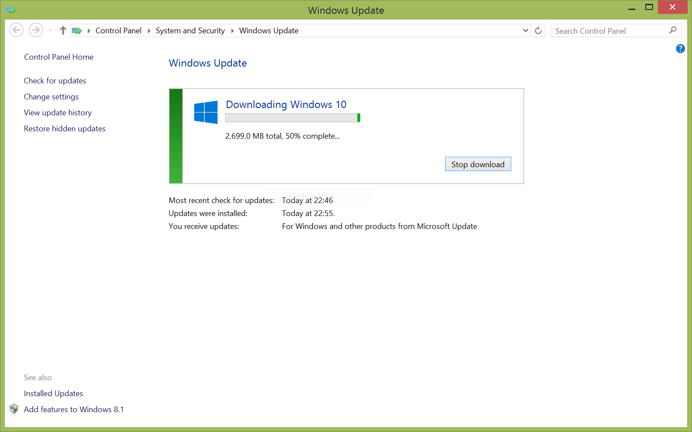

เมื่อวันก่อนก็เขียน [Review Windows 10][0] กันไปแล้ว ก็มีคมนมาบอกต่อว่าไหนๆ ก็ Review แล้วก็โปรดเขียนวิธีการ Upgrade มาด้วยเลยจะดีมาก เพราะฉะนั้นวันนี้จะมาบอกกันว่า เราสามารถที่จะ Upgrade Windows ของตัวเราให้เป็น Windows 10 กัน เอาที่ผมรู้นะ มันมี 2 วิธีด้วยกันในการ Upgrade

## วิธีแรก ผ่าน Windows Update

วิธีนี้น่าจะเป็นวิธีที่ง่ายที่สุดแล้วในการ Upgrade Windows 10 ของเรา แค่เพียงเราไปกด Reserve ที่ Taskbar ด้านล่างของเรา (ที่มันขึ้นมาเป็นชาติเศษๆ ได้แล้ว) และพอถึงเวลา มันก็จะมีหน้าต่างขึ้นมาถามเราว่า จะ Upgrade เลยมั้ย ถ้าเรากดตกลงไป มันก็จะเริ่ม Upgrade โดยอัตโนมัติ เราไม่ได้ต้องไปยุ่งอะไรกับมันเลย ซึ่งแน่นอนว่าวิธีนี้มันง่าย แต่เราก็ต้องรอ เลยทำให้มีอีกวิธีนึงออกมา

## วิธีสุดท้าย ผ่าน Media Creator Tool จาก Microsoft
วิธีนี้เป็นวิธีที่ค่อนข้างจะยุ่งยากสักหน่อย แต่ก็ไม่ต้องไปรอว่าจะได้เมื่อไหร่ ก่อนอื่นให้เราไปโหลดตัว Media Creator Tool จาก [เว็บของ Microsoft ][2] (ลิงค์ของ Tool [สำหรับ 32 bits][3] และ [สำหรับ 64 bits][4])และเข้าไปโหลดตัว Upgrade เข้ามา และเมื่อโหลดเสร็จ ให้เรารันตัว Tool ของเราขึ้นมา และติ๊กที่ Upgrade Now จากนั้นมันจะทำการโหลดตัว Windows 10 เข้ามาในเครื่องเรา (อาจจะต้องใช้เวลามากน้อย ขึ้นอยู่กับความเร็วอินเตอร์เน็ต ไฟล์มันสัก เกือบๆ 3 GB เลยมั้ง)
เมื่อมันโหลดเสร็จแล้ว มันจะถามต่อว่า เราจะเก็บอะไรไว้บ้างหลังการ Upgrade ซึ่งในขั้นตอนนี้แนะนำให้เลือกเป็น **keep personal files and apps **เราจะได้ไม่ต้องลงอะไรใหม่ **(คำเตือน! บางเครื่อง เช่นเครื่องผม ตัวเลือกน้ีจะเลือกไม่ได้ ซึ่งผมก็ยังไม่รู้ว่าทำไมเหมือนกัน) **จากนั้นก็กดต่อไป มันก็จะ Restart เครื่องเราและเข้าหน้าติดตั้ง ที่เหลือก็รอไปจนเสร็จ ช้าเร็วขึ้นกับคอมพิวเตอร์ของท่านเอง เท่านี้ก็เป็นอันเสร็จ

[0]: http://www.arnondora.in.th/windows10-review/
[1]: http://www.arnondora.in.th/wp-content/uploads/2015/07/Windows10Review_10.png
[2]: https://www.microsoft.com/en-us/software-download/windows10
[3]: http://go.microsoft.com/fwlink/?LinkId=616935
[4]: http://go.microsoft.com/fwlink/?LinkId=616936
