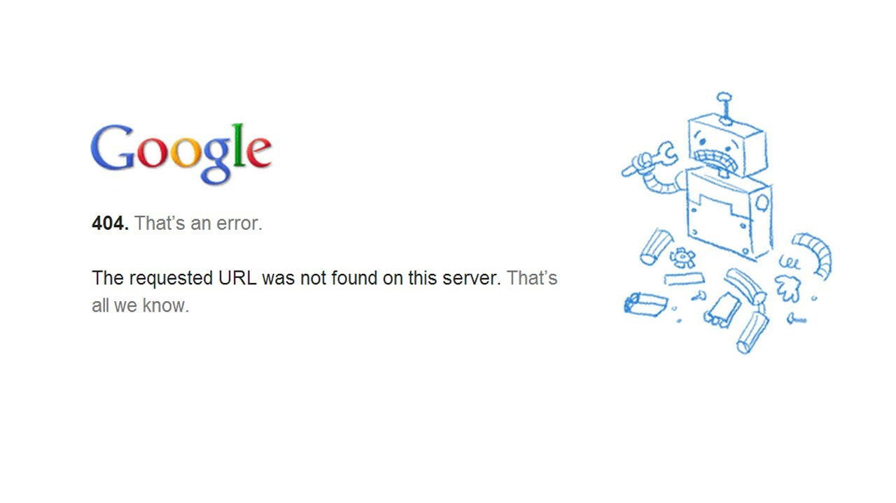

เชื่อว่าหลาย ๆ คนที่เข้าเว็บในปัจจุบันน่าจะเคยเห็น Error ในหน้าเว็บต่าง ๆ ไม่ว่าจะเป็น 4xx หรือ 5xx เราจะเรียกมันว่า HTTP Error Code ซึ่งแต่ล่ะตัวก็มีความหมายที่แตกต่างกันออกไป วันนี้เราจะมาดูกันว่า แต่ล่ะ Code ที่เรามักจะพบเจอบ่อยในชีวิตประจำวันของเรามีอันไหนบ้าง

## ทำไมต้องมี HTTP Error Code?
มันทำให้เรารู้ถึงปัญหาในการโหลดหน้าเว็บต่าง ๆ และสามารถวินิฉัยปัญหาได้ เมื่อมันเกิดขึ้น โดยมีรูปแบบที่เป็นมาตราฐานเหมือนกันทั่วโลกเลยล่ะ

## 4xx Error

มาเริ่มกันที่ Error ยอดฮิตอย่าง 4xx Error (xx คือเลขตามหลัง) กันเลย เราจะเรียก Error แบบนี้ว่า Client Error ซึ่งน่าจะเกิดจากการเรียกหน้าเว็บผิด หรือใช้ไวยากรณ์ในการเรียกผิด หรือเหตุผลอื่น ๆ โดยน่าจะเกิดจากทางฝั่ง Client หรือฝั่งเราเอง

* **Error 401 (Unauthorised)** - เกิดจากเราไปเรียกหน้าที่ไม่สามารถโหลดได้จนกว่าเราจะใช้ Username และ Password ซะก่อน หรือถ้าเรากรอกไปแล้ว มันอาจจะเกิดปัญหาว่า เรากรอกผิด หรือ Username/Password ที่เราใช้นั้น ไม่สามารถเข้าถึงหน้าเว็บนี้ได้นั่นเอง
* **Error 403 (Forbidden)** - คล้าย ๆ กับ Error 401 แต่ 403 จะเกิดจาก Permission ใน Web Server ที่ทำให้เราไม่สามารถโหลดหน้านั้นขึ้นมาได้นั่นเอง
* **Error 404 (Not Found) - **Error ตัวนี้ก็น่าจะเป็น Error ยอดฮิตเลย มันเกิดจาก Server มันหาหน้าที่เราเรียกไปไม่เจอมันเลยส่ง Error กลับมาเป็น 404 Error

## 5xx Error

มาที่ Error ถัดมาที่ฮิตไม่แพ้กันนั่นคือ 5xx Error หรือ Server Error ปัญหา 5xx Error จะเกิดตรงข้ามกับ 4xx Error ที่เกิดปัญหาจากทางฝั่ง Client เพราะว่า 5xx เกิดจากทางฝั่ง Server เอง

* **Error 500 (Internal Server Error)** - เกิดจากมีข้อผิดพลาดบางอย่างใน Server แต่ตัวระบบไม่สามารถรู้ได้ว่าเกิดจากอะไร หรือก็คือ General Case เลย ดังนั้น เราสามารถพบเจอ Error 500 นี้ได้บ่อย ๆ
* **Error 502 (Bad Gateway)** - เกิดจากการที่ Server ได้รับ Error จากจากอีก Server หนึ่งเลยทำให้เกิด Error 502 ขึ้นมา กล่าวคือมีปัญหาในการรับส่งข้อมูลกันระหว่าง Server นั่นเอง
* **Error 503 (Server Unavailable)** - อันนี้ก็เป็นอีก Error นึงที่ใครหลาย ๆ คนน่าจะได้พบเจอบ่อยอยู่เหมือนกัน เพราะว่า มันอาจจะเกิดจาก Server ที่ทำงานหนักเกินไป เลยทำให้เราไม่สามารถเข้าได้ชั่วคราว หรืออาจจะเกิดจาก Server ที่เราเรียก อาจจะอยู่ในระหว่างการซ่อมบำรุงอยู่เลยทำให้เกิด Error นี้ขึ้นมา
เท่าที่ผมยกมาเขียนในบทความนี้เป็นเพียง Error Code ที่เราสามารถพบเจอได้บ่อยในชีวิตประจำวันของเรา จริง ๆ แล้วนอกจาก Error 3xx และ 4xx ที่ได้ยกตัวอย่างไปแล้วก็ยังมี Error 2xx และ 3xx อีกแต่เป็นเพราะเราไม่ค่อยหน้าจะได้เห็น Error แบบนั้นตรง ๆ บ่อยมากเลยไม่ได้หยิบยกมาเขียนในวันนี้ ถ้าอยากศึกษาเพิ่มเติมสามารถเข้าไปที่เว็บของ [W3Schools][2] ได้เลย ในนั้นจะมีรายละเอียดของแต่ล่ะ Error อย่างละเอียด

[2]: http://www.w3schools.com/tags/ref_httpmessages.asp
