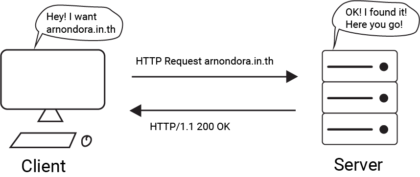
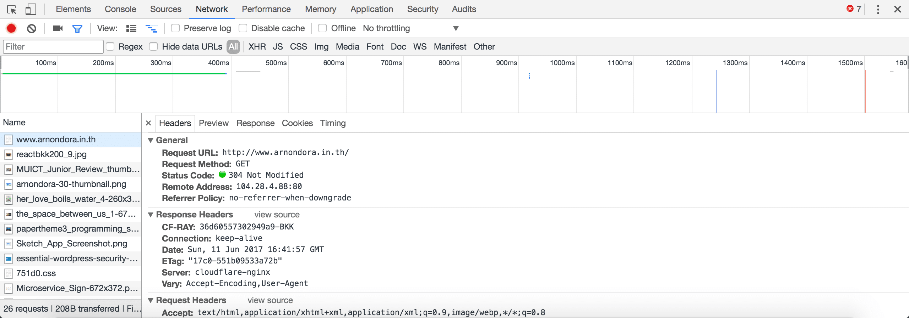
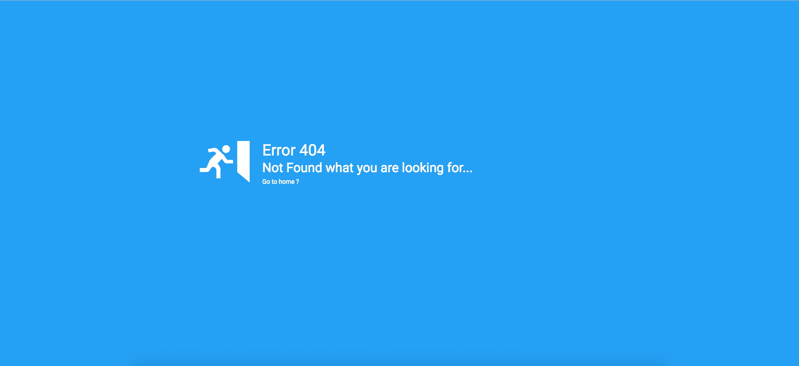
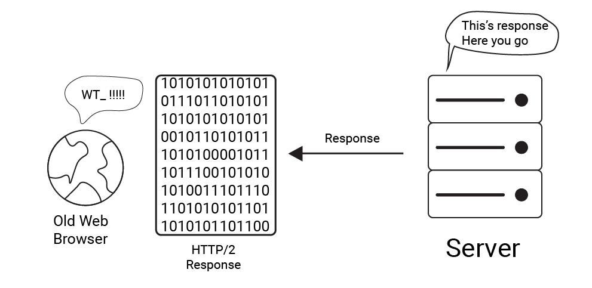
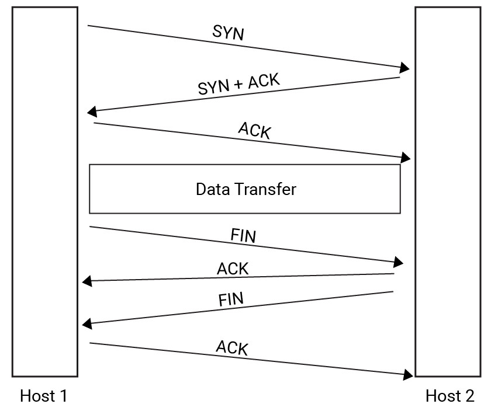
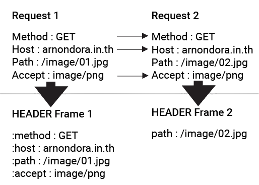

ก่อนจะเล่าว่า HTTP/2 คืออะไร ผมขอพาทุกคนย้อนกลับไปเมื่อปี 1989 ที่ HTTP Protocol ถูกสร้างขึ้นมาเป็นครั้งแรก ในตอนนั้น Protocol นั้นถูกออกแบบมาเพื่อใช้บนเครื่องที่ทันสมัยที่สุดในสมัยนั้นนั่นคือ CPU Clock Speed อยู่ราว ๆ 25 MHz และ Ram มีอยู่แค่ไม่กี่ MB เท่านั้น

แต่เมื่อเวลาผ่านไป คอมพิวเตอร์สมัยนั้น กับในปัจจุบันมันช่างต่างกันราวฟ้ากับดิน ตอนนี้ Clock Speed เราอยู่ในระดับ GHz และ Ram เล่นกันในระดับ GB กันไปแล้ว นอกจากนั้นความเร็วในการเชื่อมต่ออินเตอร์เน็ตที่สูงปรี๊ดกันระดับ Gbps แต่เราก็ยังใช้ Protocol ในสมัย 25 Mhz ในการเชื่อมต่อ

และแน่นอนว่า มันจะต้องมีการเปลี่ยนแปลง (แหงแหละ ! ไม่งั้นก็ Obsolete ไปเถอะ) ที่เกิดขึ้นในปี 2015 โดย **The Internet Engineering Task Force (IETF)**

## TL;DR
- HTTP คือ Protocol ที่ใช้ในการเชื่อมต่อระหว่างเรา (Client) และ Server

- HTTP/2 เป็นมาตรฐานใหม่ของ HTTP Protocol ที่จะเข้ามาทดแทน Version เดิมที่เก่ากว่า 10 ปีมาแล้ว

- HTTP มาตรฐานใหม่นี้ไม่มีความสามารถ **Backward compatibility** กับ HTTP เวอร์ชั่นก่อนหน้านี้ได้ ฉะนั้น Web Browser เวอร์ชั่นเก่า ๆ จึงไม่สามารถใช้งานได้

- HTTP มาตรฐานใหม่จะทำให้ เราสามารถเข้าถึงเว็บไซต์ได้รวดเร็วขึ้น

- Web Browser ตัวใหม่ ๆ ก็มีการรองรับ และ เว็บไซต์หลายเว็บตอนนี้ก็เริ่มมีการเปลี่ยนมาใช้มาตรฐานนี้มากขึ้นเรื่อย ๆ แล้ว รวมถึงเว็บผมด้วยเช่นกันที่มีการเปลี่ยนแปลงบ้างแล้วในบางส่วน

## แล้ว HTTP คืออะไร ?
**HTTP** หรือ **Hypertext Transfer Protocol** มันถือว่าเป็นเบื้องหลังของเว็บเลยก็ว่าได้ เพราะมันทำหน้าที่ในการเชื่อมต่อ ระหว่างเราที่เป็นคนเรียก และ Server หรือก็คือ Web Server

ตัวอย่างเช่น เราอยากจะเข้าหน้าเว็บของ **arnondora.in.th** เราก็เริ่มจากพิมพ์ URL เข้าไปใน Web Browser และมันก็จะยิง Request ไปที่เว็บ Server โดยใช้ **HTTP Protocol** และ Server ก็จะตอบ (Response) ที่เป็นหน้าเว็บไซต์กลับมาให้เครื่องเราเพื่อเอาไปแสดงผลให้เราดูต่อไป (ส่วนวิธีที่มันเชื่อมต่อกันนั้นจะอยู่ในเรื่องของ TCP/IP ที่ไม่ได้อธิบายในบทความนี้)

เอาให้ลึกกว่านั้น HTTP Protocol เป็น Stateless Protocol หมายความว่า จะ**ไม่มี**ความสัมพันธ์ระหว่าง Transaction อีกนัยก็คือ **แต่ละ Request นั้นไม่เกี่ยวข้องกัน** นึกภาพง่าย ๆ เหมือนกับคนที่มันถามคำตอบคำอะ คำถามก่อนหน้านี้ จะไม่เกี่ยวข้องกับคำถามข้อถัดไปเลย

แต่มันก็ทำให้มีเครื่องมือช่วยสร้างสัมพันธ์ได้ ผ่านของ 3 อย่างนี้คือ Cookie, Session และ URL Rewriting

เอาให้ลึกกว่านั้นอีก เวลาเราจะส่ง Request หรือ Server จะ Response กลับมันก็ต้องมีข้อมูลที่จะบอกให้กับอีกฝั่ง เราเรียกมันว่า HTTP Message ที่ประกอบด้วย 3 ส่วนคือ

- **Start-Line** ที่จะบอก HTTP Method, URI และ Version ของ Protocol ที่ใช้ (HTTP/1.0, HTTP/1.1, HTTP/2.0)
- **Headers** ที่จะบอกข้อมูล และกฏต่าง ๆ ในการเชื่อมต่อเช่น ต้องการข้อมูลเป็นอะไร (Accept: text/html), ไปที่ Host ไหน (HOST: google.com) อะไรพวกนี้
- **Body** คือข้อมูลที่เราต้องการจะส่งให้ปลายทาง​เช่น​ Server​ ส่ง​ตัว​หน้าเว็บ​กลับ​ไป​ ตัวหน้า​เว็บ​ก็​จะ​อยู่​ใน​ Body นี่​แหละ​ หรือ​เรา​ต้อง​การ​จะ​ Request ข้อมูล​สัก​อย่าง​จาก​ Server​ เรา​ก็​สามารถ​เอา​ Parameter ต่าง​ๆ​ แปะ​ลง​ไป​ใน​ Body ได้​เช่นกัน​

จากเมื่อสักครู่อ่านแล้วน่าจะเจอคำว่า HTTP Method ที่อยู่บน Start-Line มันเป็น Method ที่ใช้ระบุว่า ให้ส่งข้อมูลยังไง โดยหลัก ๆ มันจะมีอยู่ 2 ตัวคือ **GET** กับ **POST** ที่สำหรับใครที่เขียนเว็บน่าจะเคยได้ยินอยู่ ที่ GET จะส่งค่าไปพร้อมกับ URL แต่ POST จะซ่อนค่าไว้แล้วส่งไป นั่นแหละคือนี่เลย

กับอีกส่วนที่เราน่าจะเคยเห็นเวลาเราเข้าเว็บแล้วเจอ Error 404 หรือ 500 Internal Server Error อะไรพวกนั้น นั่นคือ Code ที่ Server จะตอบเรากลับมาพร้อมกับ **Response HTTP Message** เพื่อเป็นการบอกสถานะของการตอบ โดยจะแบ่งเป็น

* **1xx (Information Response)** ตัว Code 1xx นี้ผู้ใช้ทั่วไปไม่น่าจะได้เจอได้ทั่วไป เพราะมันเป็น Code สำหรับแจ้งข้อมูลเช่น Code 101 เป็นการบอกว่า เราจะเปลี่ยน Protocol ในการเชื่อมต่อแล้วนะ อะไรแบบนี้
* **2xx (Success)** อันนี้ก็น่าจะเป็นอีกตัวที่ไม่ค่อยได้เห็นกันเท่าไหร่ แต่เราก็ได้มันอยู่ทุกวัน และเป็น Code ส่วนใหญ่ที่เราได้ด้วย เพราะมันเป็นการบอกว่าการส่งมันสำเร็จแล้วนะอะไรแบบนี้ (200 Success) หรือจะเป็นบอกว่า Transaction สำเร็จ (201 Created)
* **3xx (Redirection)** จะเป็นเรื่องของการ ย้ายหน้าอะไรทำนองนี้ เช่นถ้าเราได้ 301 Moved Permanently หมายความว่า Address ถูกย้ายแล้วนะ ถ้าเข้ามาใหม่ให้เข้าไปที่อีก Address นึงนะทำนองนั้น
* **4xx (Client Error)** จะเป็นข้อผิดพลาดที่เกิดจากทางฝั่งของผู้ใช้เองเช่นที่เราเจอบ่อย ๆ จะเป็น 404 Not Found ที่จะเกิดขึ้นตอนที่เรากรอกพวก URI ผิด
* **5xx (Server Error)** เป็นข้อผิดพลาดที่เกิดขึ้นจาก Server ที่อาจจะมาจากการตั้งค่า หรือเขียน Code ผิดพลาดบางอย่างเลยทำให้เกิด Error นี้ขึ้น

และแน่นอนว่าเราสามารถดูตัว HTTP Message ที่ถูกตอบกลับมาจาก Server ได้ โดยผ่านโปรแกรมหลาย ๆ ตัว ถ้าเอาแบบง่าย ๆ เลย เราสามารถใช้ Web Browser อย่าง **Google Chrome** ดูได้

โดยการคลิกขวาที่หน้าแล้วกด Inspect แล้วเลือกไปที่ Tab Network แล้วลอง Refresh หน้าอีกรอบ เราจะเห็นไฟล์อยู่หลายอันมาก ลองกดสักอัน มันจะมีข้อมูลขึ้นมา นั่นแหละคือ **Response HTTP Message**

## HTTP/2
หลังจากที่เราเข้าใจหลักการทำงานของ HTTP กันไปอย่างยืดยาวแล้ว เรามาดูฟีเจอร์ หรือความเปลี่ยนแปลงของ HTTP/2 กัน

แต่ก่อน เวลาเราส่งข้อมูลผ่าน HTTP ข้อมูลจะถูกส่งในรูปแบบของ **Textual Data** หมายความว่า มันถูกส่งในรูปแบบของข้อความเพียว ๆ เลย (ที่มนุษย์สามารถเปิดอ่านได้)

ทำให้โอกาสที่จะเกิดความผิดพลาดนั้นสูงมาก เพราะมันอาจเกิดความผิดพลาดในการส่ง บนจุดที่เรามองเห็นได้ยากเช่น Space หายไปอันนึงอะไรแบบนี้ หรือบางทีก็ข้อมูลบางส่วนของหน้าหายไปเลยก็มีโอกาสเกิดขึ้นได้

นึกถึงโทรทัศน์ตอนที่ยังเป็น Analog อยู่เราจะเห็นว่าบางทีถ้าสัญญาณไม่ดี มันก็จะดูได้แบบ**ซ่า** ๆ หน่อย ๆ แต่ถ้าเป็นโทรทัศน์แบบ Digital เราจะไม่เห็นซ่า ๆ นั่นเลย **ถ้าดูได้ก็ได้เลย แต่ถ้าไม่ได้ก็ไม่ได้เลย**

**Binary Data ก็เหมือนกับ Digital TV นั่นแหละ ได้ก็ได้ ไม่ได้ก็ไม่ได้ ไม่ค่อยมีซ่าให้เห็น**

พอมาในเวอร์ชั่น 2 ได้มีการแก้ไขให้มีการส่งเป็น Binary Data เพื่อป้องกันปัญหานี้ พร้อมทั้งยังแบ่งแยกออกมาเป็นอีก **2 Sub-Frame** ย่อยนั่นคือ **Header Frame** และ **Data Frame**

ซึ่งก็จริงที่มันช่วยในเรื่องของความผิดพลาด และความยาวหรืออะไรต่าง ๆ แต่มันก็สร้างความบรรลัยไว้เช่นกันนั่นคือ ถ้าเราทำให้เป็น Binary แปลว่า ถ้า Server ส่งมาเป็น Binary แล้วฝั่ง Client ยังใช้ HTTP/1.x หรือ HTTP/1 อยู่ ก็จะ**อ่านไม่รู้เรื่อง**ไปเลย

แต่ก็นะ Web Browser ส่วนใหญ่ ๆ ในปัจจุบัน แทบจะทั้งหมดแล้ว **รองรับ HTTP/2** เป็นที่เรียบร้อยแล้วสบายใจได้

## Request/Response Multiplexing

เมื่อก่อนตอน HTTP/1 หน้าเว็บก็ยังไม่มีอะไรมาก เผลอ ๆ มีแค่หน้า HTML หน้าโง่ ๆ ไฟล์เดียว ก็แค่เรียกมันผ่าน **TCP/IP** ก็ทำ **Three-Way Handshake** กันปกติ รับส่งกันทีละไฟล์ เหมือนภาพด้านบน (18+ เล็กน้อย) รับส่งกันทีก็ต้องเปิด TCP รูนึง ค่อย ๆ ทำทีละรูไปเรื่อย ๆ

แต่พอเวลาผ่านไป หน้าเว็บก็เริ่มมี สื่อต่าง ๆ ที่ต้องมาแสดงผลด้วย ถ้าจะค่อย ๆ รับ/ส่งกันที่ละไฟล์ก็ไม่ต้องดูหน้าเว็บกันแล้ววันนี้ HTTP/1.1 เลยแก้ปัญหาด้วยการ เปิด **TCP Connection** พร้อมกันหลาย ๆ รู ทำให้สามารถรับ/ส่ง ข้อมูลพร้อมกันได้

ซึ่งการเปิดช่อง TCP มันก็มีราคาของมันเหมือนกัน ก่อนที่ช่อง TCP สักช่องมันจะเปิดได้ มันจะประกอบด้วย 3 ช่วงใหญ่ ๆ คือ **Connection Set-up, Data Tranfer และ Tear-Down** เหมือนกับเราบอกว่า เราจะเริ่มคุยกันแล้วนะ และเราก็คุยกัน และสุดท้ายเราก็บอกลากัน

อ้าวแล้วมันเกี่ยวอะไร ? สิ่งที่เกี่ยวคือ เวลาเราจะเริ่ม (Connection Set-Up) และสิ้นสุดการคุย (Tear-Down) เราจะต้องทำสิ่งที่เรียกว่า **Three-way handshake** ที่ 1 ครั้งมันจะกินอยู่ที่ 3 RTT (Round-Trip Time) ซึ่งรวมกันต้นจะจบที่ทำ **Modified Three-way handshake** อีก 3 RTT

ทั้งหมดจะอยู่ที่ 6 RTT ถ้วน ถ้าสมมุติว่าหน้าที่เราเรียก มีสัก 10 ไฟล์ที่ต้องโหลด เราก็ต้องเสียเวลาทั้งหมด **6 \* 10 = 60 RTT** เพียงเพื่อเชื่อมต่อ และจบการเชื่อมต่อ

มาใน HTTP/2 จึงนำเรื่องของ **Multiplexing** มาใช้ โดยปกติที่เราจะต้องเปิดรู TCP หลาย ๆ รู และเสีย RTT เพื่อรับข้อมูล เราบอกว่า เราเปิดรูเดียว **(ต่อ 1 Origin)** และทำ Three-way handshake แค่ต้นและจบเพียงครั้งเดียว แต่เรารับและส่งข้อมูลได้หลายไฟล์พร้อม ๆ กัน โดยการแบ่งข้อมูลเหล่านั้นออกมาเป็น Frame แล้วส่งไป และมีเรื่องของ Priority เข้ามาเกี่ยวด้วย ทำให้มันสามารถจัดการคิวในการส่งข้อมูลได้ง่ายขึ้น

นั่นเป็นเหตุผลที่ว่าทำไมคนบอกกันว่า HTTP/2 มันทำให้การโหลดหน้าเว็บเร็วขึ้น เพราะว่า **เราทำ Three-Way Handshake ต่อ Orgin เพียงครั้งเดียว และข้อมูลก็ยังสามารถแบ่งส่วนมาได้อีก ทำให้เรารู้สึกว่าหน้ามันโหลดเร็วขึ้นนั่นเอง**

## Server Push

ฟีเจอร์นี้ก็เป็นอีกตัวที่เจ๋ง และผมชอบมาก สั้น ๆ เลย ปกติเวลา Web Browser ส่ง Request ไปที่ Server

Server ก็จะตอบกลับได้แค่ Response เดียว แต่พอมาในเวอร์ชั่น 2 นี้ Server สามารถ**ตอบกลับได้หลาย Response ภายใน 1 Request** อาจจะมองไม่เห็นภาพว่า มันดียังไง ลองมาดูตัวอย่างนี้กัน

สมมุติว่าผมทำ App สำหรับแชท แปลว่า ผมจะต้องสามารถส่ง และรอรับข้อความจากอีกฝ่ายเสมอ วิธีเก่าคือ ผมก็ต้อง Request เรื่อย ๆ เพื่อรับแต่ละข้อความ แต่พอมาในตอนนี้เราก็ส่ง Request ไปอันเดียว แล้วพอมีข้อความใหม่ Server ก็จะยิง Response ไปที่ปลายทางให้เองได้ นี่แหละคือสิ่งที่มันเจ๋งมาก

เมื่อ​สักครู่​เป็น​แค่​ตัวอย่าง​ที่​ทำ​ให้​เห็น​ภาพ​ง่าย​ๆ​ ตัวอย่าง​จริงๆ​ คือ​สมมุติ​ว่า​เรา​ (Client) ขอ​ index.html ไป​และ​ Server รู้​ว่า​ index.html​ จะ​ต้อง​เรียก​ style.css​ ตัว​ Server​ จะทำ​การ​ PUSH style.css​ ไป​ให้​ Client ก่อน​ที่​ Client จะขอ​

ทำให้​การ​โหลด​หน้า​เป็น​ไป​ได้​เร็ว​ขึ้น​ เพราะ​ไม่​ต้อง​รอ​ Client ส่ง​ Request ไป​ขอ​นั่น​เอง

## Header Compression
ลองนึกสภาพว่า หน้าเว็บนึงมีประมาณ 10 ไฟล์ที่ต้องโหลด และสมมุติอีกว่าแต่ละไฟล์มี Header ขนาดสัก 140 kB แล้วทุกไฟล์ต้องมี Header คิดดูสิครับว่า **มันจะสนุกขนาดไหนกันเชียว** อย่างเว็บหลาย ๆ เจ้าก็บอกว่า การที่เราแยกไฟล์หน้าเว็บของเราเยอะ มันจะทำให้เว็บมันโหลดช้ามากขึ้น เพราะ Overload มันเยอะมาก ๆ เหตุส่วนหนึ่งมาจาก Header นี่แหละ

มาในเวอร์ชั่นนี้ ได้มีการแก้ไขเรื่องของ Header นี้ด้วย 2 วิธีใหญ่ ๆ

อย่างแรกคือ การใช้ Encoding Algorithm ที่มีชื่อว่า HPACK [(RFC7541)][13] เพื่อลดขนาด Header ของแต่ละอัน

นอกจากนั้นอีกสเต็ปนึงคือ การเก็บ Index ของแต่ละ Field ที่ส่งไป ฉะนั้นถ้า Field ไหนที่เคยส่งไปแล้วมีค่าเดียวกัน มันจะแค่ส่ง Index ไปก็ทำให้ลด Overhead ที่เกิดจาก Header ได้เป็นจำนวนมาก มาก มาก เลย

## Security
เชื่อว่าหลาย ๆ คนน่าจะมีคำถามเรื่องของความปลอดภัย แต่จริง ๆ แล้ว HTTP Protocol **นั้นไม่ได้พูดถึงเรื่องความปลอดภัย หรือการเข้ารหัสอะไรเลย** แต่ HTTP จะต้องใช้ร่วมกับ SSL/TLS เพื่อเข้ารหัสระหว่าง Server และ Client ถ้าสนใจสามารถหาเรื่องของ **HTTPS** กับพวก **SSL/TLS** อ่านเพิ่มได้ จริง ๆ Concept ไม่ได้เข้าใจยากอะไรขนาดนั้น

## แล้วทำไมไม่เป็น HTTP/1.2 แต่กลายเป็น HTTP/2 ซะงั้นละ
เรื่องนี้ ถ้าเป็นโปรแกรมเมอร์ หรือคนที่ทำงานกับเรื่องของมาตรฐานที่เกี่ยวกับคอมพิวเตอร์น่าจะเข้าใจเรื่องนี้ดี มาดูเรื่องของเลขเวอร์ชั่นกัน

เราน่าจะเคยเห็นจากโปรแกรม หรือระบบหลาย ๆ อย่างก็จะมีเลขเวอร์ชั่นที่หน้าตาทำนองนี้เหมือนกันเกือบหมด 3 หลัก 4 หลักก็ว่ากันไป ระบบนี้เราเรียกว่า **Semantic Versioning** มันเป็นวิธีในการตั้งเลขเวอร์ชั่น

โดยที่เราบอกว่า ตัวเลขตัวแรกเป็น **Major Version** บอกว่า จะเป็นอะไรที่เปลี่ยนไปแล้ว เวอร์ชั่นก่อน ๆ จะใช้ไม่ได้ หรือเรียกว่า **non Backward compatibility**

ตัวเลขตัวถัดไปคือ **Minor Version** บอกว่าเป็นการเพิ่มเติมฟีเจอร์ หรือสิ่งต่าง ๆ เข้ามา (ที่ไม่ใช่การแก้บัค หรือ Hotfix ต่าง ๆ) แต่ก็ยังสามารถทำงานร่วมกับเวอร์ชั่นก่อนหน้าได้ หรือเรียกว่า **Backward compatibility**

ในกรณีของ HTTP/2 บอกว่ามีการเพิ่มเรื่องของ Binary Faming Layer เข้ามา จึงทำให้**ไม่สามารถ**ทำงานร่วมกับ HTTP/1.0 และ HTTP/1.1 ได้เลยต้องปล่อยมาตรฐานออกมาโดยการอัพเกรด Major Verion ไปนั่นเอง ~~~

## แต่ก็มีอีกคำถามว่า สรุปแล้วเราต้องเขียนว่า HTTP/2.0 หรือ HTTP/2 กันแน่ ?
**คำตอบคือเป็น HTTP/2** นะ อ้างอิงจากเอกสารของ IETF บอกว่าใช้ 2 ไม่มีจุดเพื่อป้องกันความสับสนระหว่าง 2 และ 1.x นะจ๊ะ !

## สรุป
เป็นบทความที่ยาวมาก สรุปคือ HTTP/2 จะเข้ามาแทนที่ HTTP เวอร์ชั่นก่อน ๆ ในไม่ช้า ขณะนี้เว็บไซต์ต่าง ๆ ก็ได้มีการเปลี่ยนไปใช้กันบ้างแล้ว รวมถึงเว็บของผมในบางส่วนด้วย จากที่เราอ่านกันมา HTTP มาตฐานใหม่นี้ ที่เหมือนกับแม่น้ำสายหลักที่หล่อเลี้ยงของอินเตอร์เน็ตของเรา จะเข้ามาช่วยทำให้การทำงานของเว็บเป็นไปได้ราบลื่นมากขึ้น นักพัฒนาสามารถสร้างสรรค์สิ่งใหม่ ๆ ได้มากขึ้น และทำให้ User Experience ดียิ่งขึ้น ทั้งหมดนี้ก็จะทำให้อนาคตของ Web Platfrom ไปได้ไกลยิ่งขึ้น กว่าที่เป็นอยู่

[13]: http://httpwg.org/specs/rfc7541.html
