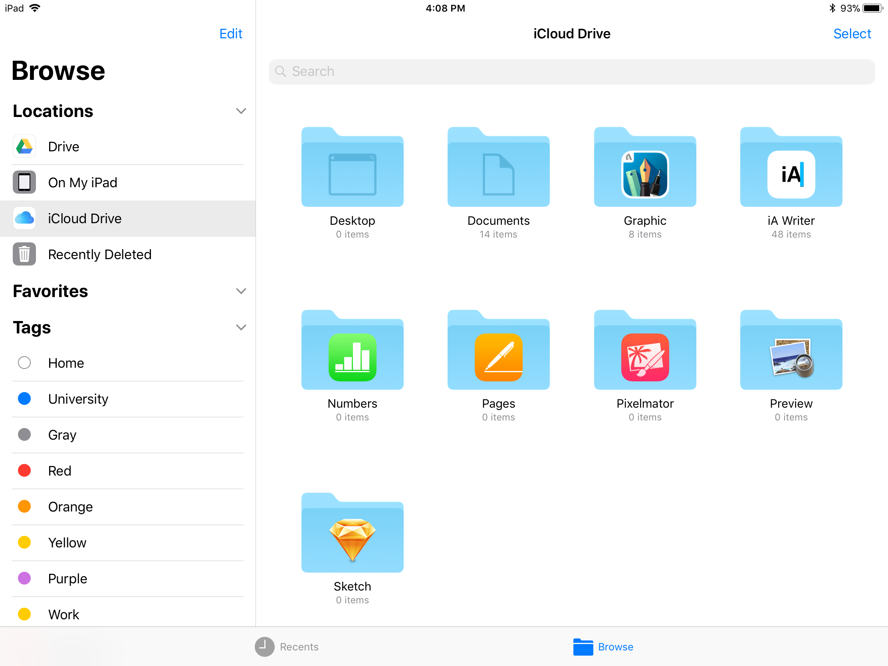
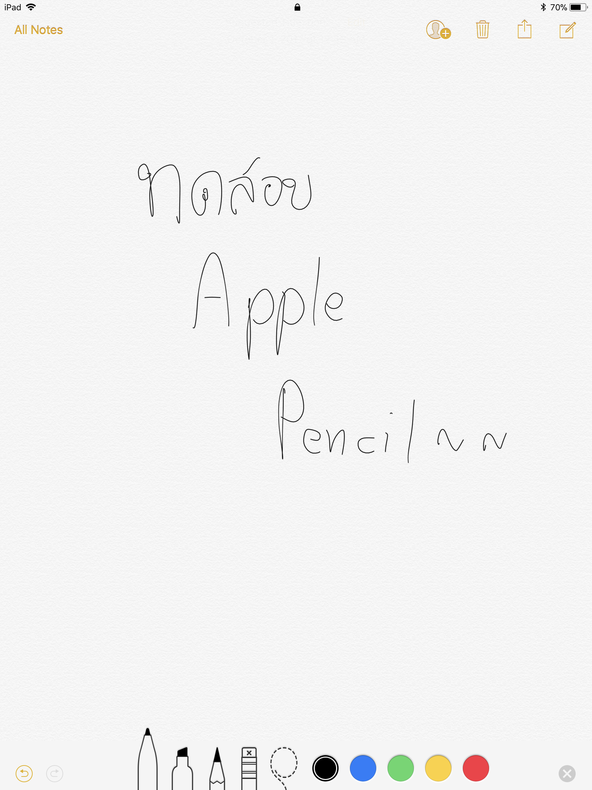
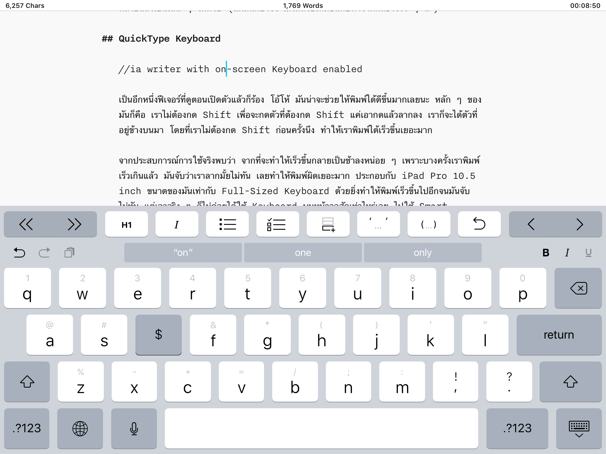

เมื่อไม่กี่วันที่ผ่านมา Apple ก็ได้ปล่อย iOS เวอร์ชั่นใหม่ออกมา นั่นคือ iOS 11 ถือว่าเป็นเวอร์ชั่นที่มีการเปลี่ยนแปลงเยอะมาก เมื่อเทียบกับเวอร์ชั่นอื่น ๆ โดยเฉพาะใน iPad ตอนนี้หลังจากที่ผมได้ใช้มาตั้งแต่ GM เลยจะมารีวิวว่า มีอะไรใหม่แล้วมันทำให้เราใช้งานได้สะดวกมากขึ้นยังไง (ผมก็จะเล่าเฉพาะที่เห็นได้บน iPad เท่านั้นนะ เพราะไม่ได้ใช้ iPhone)

## New Dock & Multitasking

สำหรับใครที่ใช้ macOS อยู่แล้วก็น่าจะรู้จักกับ Dock ดีใน iOS11 Dock นั้นได้ลงมาจุติให้เราได้ใช้กันแล้ว (ได้เฉพาะใน iPad เท่านั้นนะ) โดยที่เราสามารถลาก App จาก Homescreen ลงมาที่ Dock ได้  นอกจากนั้น Dock ยังสามารถเรียกได้จากทุกที่ เพียงแค่เราปาดนิ้วจากด้านล่างขึ้นเราก็สามารถเรียก Dock ขึ้นมาได้ทันที ถ้าเราสังเกตเราจะเห็นว่า มันจะแบ่งออกเป็น 2 ส่วนคือส่วนที่เราเอา App ลงไปใส่กับอีกส่วนมันจะเปลี่ยนไปเรื่อย ๆ ตาม App ที่เราเปิดและ Handoff จาก iOS Device อื่น  นอกจากนั้นเรายังสามารถที่จะลาก App จาก Dock ขึ้นมาเพื่อเปิดเป็น 2 App พร้อมกันได้ด้วย หรือทำเป็นหน้าต่างลอยไปมาได้ด้วยเช่นกัน (บาง App มันจะไม่รองรับ เวลาลากมันจะไม่ยอมแบ่งครึ่งให้) ถ้าเราดูด้านข้างจะมีเมนูให้เรา ซึ่งจริง ๆ เมนูพวกนี้มันมีมานานแล้วละ แต่สิ่งที่น่าสนใจคือ ปุ่มรูปกลม ๆ ซึ่งเป็นปุ่มไว้อัดหน้าจอได้ จากในเวอร์ชั่นก่อน ๆ คนที่ต้องการจัดอัดหน้าจอ อาจจะต้องทำการ Jailbreak และลง App เพื่อทำ ตอนนี้ไม่ต้อง Jailbreak แล้วนะ โอเคนะ !

## Drag & Drop

เป็นอีกหนึ่งฟีเจอร์ที่ชาว iOS เรียกร้องกันมานานแล้วกับ Drag & Drop ที่ทำให้เราสามารถลากของจาก App หนึ่งไปอีก App หนึ่งได้ เช่นเราจะลากรูปจาก Photo ไปลง Mail ก็เพียงแค่เราเปิด Mail กับ Photo คู่กันแล้วลากรูปจาก Photo ลง Mail ได้เลย ถือว่าสะดวกมาก

อีกหนึ่งจุดที่ชอบมากกับ Drag & Drop บน iOS11 คือ เวลาเรียนแล้วผมจะใช้ Notebility ในการจด Note และบางครั้งเราต้องการ Figure จาก Source ต่าง ๆ เช่นหาจาก Google วิธีเดิมคือ เราก็เข้า Safari แล้วโหลดลง Photo แล้วค่อย Import ลง Note เรา แต่มาใน iOS11 เราสามารถที่จะลากรูปจาก Safari ลง Notebility ได้เลย ก็ช่วยทำให้การจด Note สะดวกมากขึ้นอีก

## Files App

นอกจาก Drag & Drop แล้ว File ก็ยังเป็นอีกฟีเจอร์ที่ดูรอกันมานานมาก Files App จะทำให้เราจัดการไฟล์บน Cloud Storage ได้ง่ายขึ้นไปอีก ถ้าใครใช้ macOS อยู่แล้ว น่าจะคุ้นกับ Finder กันเป็นอย่างดี มาใน Files จะเหมือนกันเลย เราสามารถค้นหา จัดการ ไฟล์ได้หมดเลย

Files ยังสามารถที่จะเชื่อมต่อไปยัง Cloud Storage เจ้าอื่น ๆ ได้เช่นกันเช่น Google Drive หรือ Dropbox ได้หมดเลย

## Note

Note App ของเครื่องเป็น App ที่ผมไม่ค่อยได้ใช้เท่าไหร่นัก แต่มาใน iOS11 น่าจะได้ใช้มากขึ้นแล้วละ ถ้าหลาย ๆ คนเคยเห็นพวก Galaxy Note ที่เราสามารถดึงปากกาแล้วทำ Quick Note ได้เลย ตอนนี้ฟีเจอร์นี้ได้ลงมาจุติบน iPad Pro แล้ว เพียงแค่เราอยู่ในหน้า Lockscreen แล้วเอา Apple Pencil จิ้มเข้าไป เราก็จะเข้าหน้า Quick Note ได้อย่างง่ายดาย อีกหนึ่งปัญหาเวลาเราจด Note โดยใช้การเขียนคือเราไม่สามารถค้นหาสิ่งที่เราเขียนลงไปได้ มาในนี้เราสามารถที่จะค้นหา Note ที่เราเขียนได้ เพราะ iOS11 สามารถอ่านสิ่งที่เราเขียนมาเป็นข้อความและใช้ค้นหาได้

เมื่อก่อนถ้าเราจะสแกนเอกสารด้วยกล้องเราก็ต้องหา App มาเพื่อทำ แต่ตอนนี้ iOS11 มาพร้อมกับ **Document Scanner** ภายใน Note App เลย แต่ไม่สามารถที่จะทำจาก Camera App โดยตรงได้ วิธีคือก็ทำบน Note แล้วกด Export รูปออกมาลง Photo แล้วเอาไปทำอย่างอื่นได้ต่อ

## Live Photo

Live Photo มีมาสักพักแล้วที่มันจะอัดมาเป็นวีดีโอ ก่อนหน้าที่เราจะกดถ่ายออกมาเป็นดุกดิ๊กอะไรทำนองนั้น มาในเวอร์ชั่นใหม่นี้มีการเพิ่มลูกเล่นเข้าไปอีก นอกจากที่ทำให้รูปเคลื่อนไหววนไปอย่างเดียว แต่เรายังสามารถเลือกลูกเล่นได้เช่น Loop, Bounce และที่น่าสนใจมากคือ Long Exposure ที่ถ่ายแสงเป็นเส้น ๆ ได้ด้วย (แต่มันก็อาจจะไม่ได้สวยเหมือนกับทำจากกล้องจริง ๆ นะ)

## QuickType Keyboard

เป็นอีกหนึ่งฟีเจอร์ที่ดูตอนเปิดตัวแล้วก็ร้อง โอ้โห้ มันน่าจะช่วยให้พิมพ์ได้ดีขึ้นมากเลยนะ หลัก ๆ ของมันก็คือ เราไม่ต้องกด Shift เพื่อจะกดตัวที่ต้องกด Shift แค่เอากดแล้วลากลง เราก็จะได้ตัวที่อยู่ข้างบนมา โดยที่เราไม่ต้องกด Shift ก่อนครั้งนึง ทำให้เราพิมพ์ได้เร็วขึ้นเยอะมาก จากประสบการณ์การใช้จริงพบว่า จากที่จะทำให้เร็วขึ้นกลายเป็นช้าลงหน่อย ๆ เพราะบางครั้งเราพิมพ์เร็วเกินแล้ว มันจับว่าเราลากมั้ยไม่ทัน เลยทำให้พิมพ์ผิดเยอะมาก ประกอบกับ iPad Pro 10.5 inch ขนาดของมันเท่ากับ Full-Sized Keyboard ด้วยยิ่งทำให้พิมพ์เร็วขึ้นไปอีกจนมันจับไม่ทัน แต่เอาจริง ๆ ก็ไม่ค่อยได้ใช้ Keyboard บนหน้าจอสักเท่าไหร่เลย ไปใช้ Smart Keyboard ซะเป็นส่วนใหญ่ แต่ผู้ใช้ iPhone น่าจะชอบเจ้า QuickType Keyboard นี่น่าดู

## New Screenshot & Markup

มาที่อีกหรึ่งฟีเจอร์ที่ผู้ใช้ iPad Pro น่าจะรักกันบ้างนั่นคือเรื่องของการ Markup ด้วยความที่เรามี Apple Pencil มาในเวอร์ชั่นนี้เราสามารถทำอะไรกับปากกาได้เยอะมากขึ้นไปอีก เริ่มที่การ Markup Screenshot

จากเดิมเวลาเรา Capture Screen โดยการกดปุ่ม Home Power รูปหน้าจอของเราก็จะเก็บลง Photo ไปเลย แต่มาในเวอร์ชั่นนี้มีการเปลี่ยนแปลงนิดหน่อย คือมันจะมีรูปขึ้นอยู่ที่ด้านซ้ายล่างของหน้าจอ เมื่อเรากดเข้าไป เราก็จะพบกับหน้าที่เราสามารถที่จะเขียน วาด ลงไปใน Screenshot และแชร์ต่อได้เลย สะดวกมาก ๆ

## ความรู้สึกแรกที่ใช้

ก็อย่างที่เล่ามาว่า ผมได้ทดลองใช้มาตั้งแต่ GM (Golden Master หรือเวอร์ชั่นสมบูรณ์ก่อนพัฒนา) ก็พบบัคมากมาย ตั้งแต่ Smart Keyboard ที่บางครั้งก็พิมพ์ไม่ได้ หรือการ Predict คำแปลก ๆ ก็ได้ทำการ Report ไปประมาณ 20-30 จุดได้ เอาเป็นว่าเยอะมาก ๆ พอถึงวันจริง อ้าวเฮ้ย ไม่มีการ Update เกิดขึ้นกับคนที่ลง GM ไปก่อนหน้านั้น เพราะมันเป็นตัวเดียวกันเลย คือเวลา Apple จะออก Software ออกมา มันจะมี Beta หรือตัวทดสอบสำหรับนักพัฒนาออกมาเรื่อย ๆ ตั้งแต่ Beta 1, 2, 3 ไปเรื่อย ๆ จนสุดท้ายจะออกมาเป็น GM หรือเวอร์ชันสุดท้ายก่อนจะปล่อยตัวจริงออกมา ซึ่งบางครั้งมันก็เป็นตัวที่จะปล่อยให้กับคนทั่วไปเลยนั่นแหละ ซึ่งในเคสของ iOS11 มันเป็นตัวเดียวกัน ในขณะที่ผมแค่ทดลองใช้ในชีวิตประจำวันเท่านั้นกลับพบบัคเป็นจำนวนมาก เลยจะเซ็งหน่อย ๆ

เล่าถึงประสบการณ์ใช้บ้าง แรก ๆ มันก็จะไม่ชินหน่อย ๆ อย่างจุดที่เปลี่ยนไปชัด ๆ อย่าง Control Centre ที่ก็ทำให้หงุดหงิดหน่อย ๆ ในช่วงแรก ๆ แต่หลัง ๆ ใช้ไปก็ดีขึ้นนะ เมื่อก่อนเวลาเราจะปิด App ก็ต้องกดปุ่ม Home 2 ครั้งแล้วค่อยปิด หรือจะออกจาก App เราก็ต้องหุบมือ (คนที่ใช้น่าจะเข้าใจดี) คือบางทีมันไม่ติดมาในเวอร์ชั่นนี้เราก็จะสามารถลากผ่าน Dock ขึ้นมาได้เลย

แต่การเลื่อนขึ้นก็ยังไม่ใช่ไม่มีปัญหาอีก เพราะบางครั้ง App ที่ผมใช้ส่วนที่มันใช้ควบคุมมันจะอยู่ข้างล่างเช่น Noteability เวลาเราลาก Dock ทีมันก็จะไม่ขึ้น เพราะมันนึกว่าเราจะกดยางลบด้านล่างซะงั้น ก็ต้องเลื่อนอยู่หลายทีเหมือนกัน

อีกเรื่องที่ต้องปรับนิดหน่อยคือ Dock คือปกติเวลาเราจะหา App เราก็จะหาจาก Homescreen ได้เลยใช่ม่ะ ตอนนี้คือบางทีเราเอา App ไว้ที่ Dock ตัว App Icon ก็จะย้ายมาอยู่ที่ Dock เลยจะไม่อยู่ที่ Homescreen เลย และด้วยความเคยชินเราก็จะหามันไม่เจอ ทั้งที่มันอยู่ด้านล่างของจอนี่เอง

ตอน iOS10 เวลาเราจะทำ Multitasking เราสามารถเลื่อนแล้วเลือก App จากหน้าจอด้านขวาได้เลย แต่มาตอนนี้เราสามารถลากมาจาก Dock ได้เลย คำถามคือ แล้วถ้า App ที่เราต้องการมันไม่ได้อยู่บน Dock ละจะทำยังไง ? ซึ่งตอนนี้ผมแก้ปัญหาง่าย ๆ คือเราก็ต้องออกไปเปิด App ที่เราต้องการ แล้วกลับไปที่ App ตอนแรกใหม่ พอมาตอนนี้ App ที่เราต้องการจะเปิดคู่มันก็จะอยู่ที่ Dock แล้วเราก็สามารถลากขึ้นมาได้เลย จะเห็นว่าเป็นขั้นตอนที่ไม่สะดวกเลย อันนี้อาจจะต้องรอการปรับปรุงในเวอร์ชั่นต่อ ๆ ไปในอนาคต

## สรุป

iOS11 เป็น OS ตัวล่าสุดจาก Apple ที่พร้อมให้พวกเราติดตั้งและรับประสบการณ์ใหม่ ๆ กันได้เลย โดยเฉพาะคนที่ใช้ iPad ก็น่าจะเห็นความเปลี่ยนแปลงเป็นอย่างมาก ผมเองที่ใช้ iPad Pro 10.5 inch ตอนใช้ iOS11 ก็รู้สึกนะว่าใช้เครื่องได้คุ้มมากขึ้น อาจจะเพราะด้วยความที่มันค่อย ๆ เก่งเท่ากับ Desktop แล้วก็ได้ ทำให้ตอนนี้ผมใช้ iPad ทำงานหลาย ๆ อย่างมากขึ้นตั้งแต่เช็คอีเมล์ งานเอกสาร ยันงาน Graphic เลย เหลืออยู่งานนึงที่ไม่ได้ทำบน iPad คือ Coding ถ้าทำได้ก็ทำแล้วเอาจริง ก็แนะนำเลยให้อัพเกรดกันได้ตั้งแต่วันนี้เลยนะครับ
