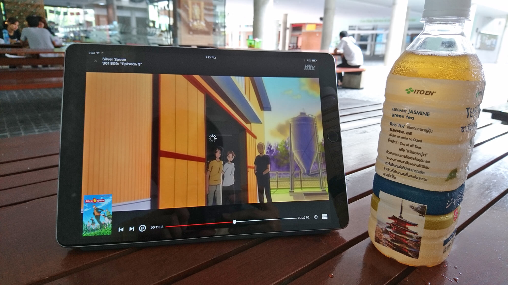
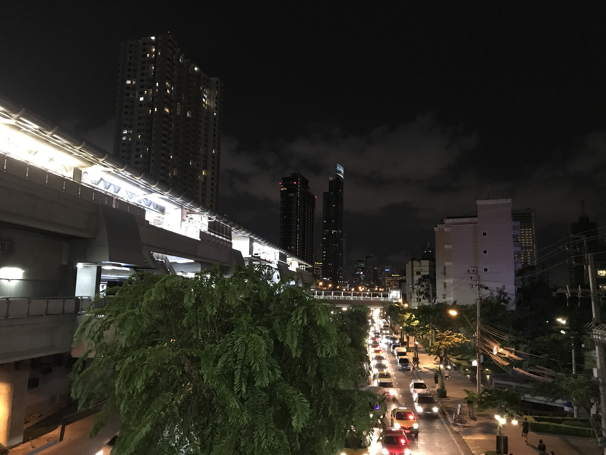
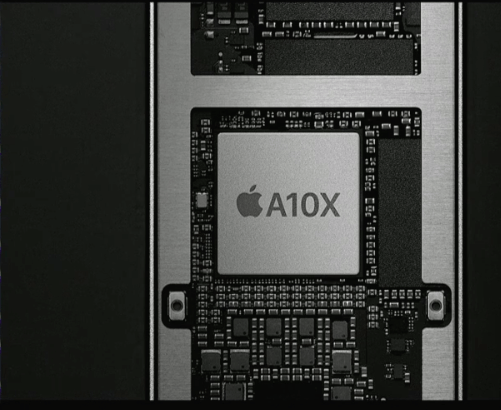
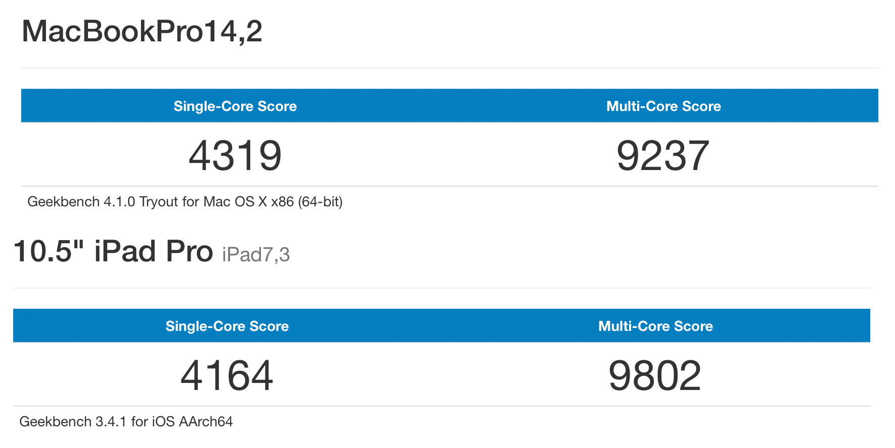

หลังจากที่คราวที่แล้วได้ บุกไปงาน **Mobile Expo** ไปซื้อ (ที่ไปงาน ตัวเครื่องเหลืออยู่ 2 ตัว กับ อุปกรณ์ เหลือชุดสุดท้าย) และกลับแกะกล่อง **iPad Pro 10.5 inch** พร้อมกับรีวิวคร่าว ๆ กันไปแล้ว (อ่านได้ที่ [ลิงค์นี้][0]) วันนี้ผมได้ใช้งานเจ้าเครื่องนี้มาได้เกือบเดือนแล้ว เลยจะมาเล่าว่า ประสบการณ์การใช้งานมันดีสมราคาค่าตัวมันรึเปล่า !!

## Display

เริ่มที่หน้าจอของ **iPad Pro 10.5 inch** กันก่อนเลย เพราะเหมือนกับจุดเด่นของ iPad ในปีนี้เลยก็ว่าได้ มันมากับหน้าจอที่ Apple เรียกว่า **ProMotion** ที่ Refresh Rate ของมันอยู่ที่ **120 Hz** ทำให้เวลาเราใช้จะรู้สึกว่ามันลื่นขึ้นมาก ๆ

ถ้าเราดูวีดีโอรีวิวของต่างประเทศหลาย ๆ เจ้าก็พูดถึงหน้าจอ **ProMotion** นี้เยอะมาก ๆ แต่ก็ไม่สามารถโชว์ให้ดูได้ เพราะวีดีโอมันวิ่งอยู่ที่ 30 Hz ไม่เห็นความแตกต่างเท่าไหร่ แต่ถ้าได้ไปลองลูบคลำ ขอสัมผัสได้มั้ยจ๊ะ มาละก็น่าจะรู้สึกเลยว่ามันลื่นกว่า

นอกจากที่หน้าจอ **ProMotion** จะทำให้เรารู้สึกว่ามันลื่นขึ้นแล้ว ถ้าเราใช้กับ Apple Pencil แล้ว จะทำให้ **Latency** ของการเขียน**ลดลง**เหลือแค่ 20 ms เท่านั้น ถ้านึกภาพไม่ออก คือเขียนแล้วให้ความรู้สึกเหมือนเราเขียนอยู่ในกระดาษจริง ๆ เลย

การให้สี และแสงเองก็ทำได้ดีเช่นกัน เพราะหน้าจอรองรับ **P3 Grammit** ที่ให้ช่วงสีในการแสดงผลค่อนข้างกว้างมาก และหน้าจอที่สว่างถึง **600 nits** ทำให้หน้าจอของ iPad Pro ตัวนี้ให้สีที่สมจริง และสว่างมาก ๆ แจ่มแมวเลยล่ะ !!!

## Speaker
ส่วนตัวผมไม่ค่อยชอบลำโพงที่มากับเครื่องต่าง ๆ สักเท่าไหร่ เพราะมีประสบการณ์ที่ไม่ดีกับพวกนี้มาเท่าไหร่ แต่ **iPad Pro 10.5 inch** นี้ทำให้ความคิดนั้นหายไป !! ตอนที่ลองเปิด JOOX ในเครื่องครั้งแรกนึกว่ามันไปต่อลำโพงหลังห้องอยู่ **เสียงใส ชัด และดังมาก ๆ** เพราะตัวเครื่องเองก็มากับลำโพงถึง 4 ตัวเลยทีเดียว มันเลยให้เสียงแบบนี้ได้

## Design

เราคงคุ้นเคยกับรูปทรง และหน้าตาของ iPad กันมานานแล้วละ ไม่มีอะไรเปลี่ยนแปลงเลย ก็หน้าตา และการวางอะไรต่าง ๆ ก็ได้รีวิวไปในตอนแกะกล่องแล้ว แต่สิ่งที่อยากให้โฟกัสคือ **ขนาด** มากกว่าจริง ๆ ที่ซื้อมาก็เพราะว่ามันมากับหน้าจอขนาด 10.5 นิ้วนี่แหละ

ถามว่า 10.5 นิ้วมันมีอะไรดี คำตอบมันอยู่ที่ Keyboard ด้วย มันทำให้เราได้ Full-Sized Keyboard ทั้งในหน้าจอเอง และตัว Smart Keyboard ด้วยทำให้เราพิมพ์อะไรได้สะดวกมากขึ้น

แต่หน้าจอที่ใหญ่ขึ้นจาก 9.7 นิ้วจะทำให้ตัวเครื่องนั้นใหญ่ขึ้นมากเลย **ขนาดของรุ่น 10.5 นิ้วแทบไม่ต่างจาก 9.7 นิ้วเลย** เพียงแต่ขอบจอมันเล็กลง กับขนาดเครื่องที่ใหญ่ขึ้นนิดเดียวเท่านั้นเอง

## Camera
การที่เราใช้ iPad Pro เป็น Tablet เราอาจจะไม่ได้แคร์เรื่องของกล้องมากก็ได้ แต่ Apple ก็จัดเต็มใช้ **Module กล้องตัวเดียวกับ iPhone 7** ที่ว่าแจ่มกันเลยทีเดียว ทำให้ภาพที่ได้ออกมาทีคุณภาพสูงมาก จริง ๆ สูงกว่า Tablet ทั่ว ๆ ไปเยอะมาก ๆ เลยเท่าที่สังเกตอะนะ (แหงแหละ มันเอากล้องของ โทรศัพท์มาใส่นี่หว่าาา !!!)

การถ่ายภาพในเวลากลางวันก็ให้ภาพที่สีสดใส และคมมาก ๆ ภาพด้านบนคือตัวอย่างภาพจาก iPad Pro 10.5 inch เวลากลางวัน ผมลองถ่ายในหลาย ๆ มุม และเวลาก็ทำให้ได้ภาพที่สวยอยู่นะ สวยแบบไม่ต้องทำอะไรก็สวยได้

ภาพกลางคืนก็ทำได้ดีเช่นกัน เพราะมันให้ภาพที่ไม่เวอร์ เหมือนกับกล้องอื่น ๆ ที่บางครั้งมันพยายามจะทำให้เห็นรายละเอียดจนภาพเละไปหมด แต่กล้องตัวนี้ก็บ้างในที่ที่แสงน้อยจริง ๆ เคสส่วนใหญ่ก็ทำได้ดีมาก ๆ

ในเรื่องของการถ่ายวีดีโอ แน่นอนว่า iPhone 7 **ถ่ายวีดีโอขนาด 4K** ได้แล้วทำไม iPad เครื่องนี้ใช้กล้องตัวเดียวกันจะทำไม่ได้ และมันทำได้ดีด้วย ไม่ค่อยสั่นเท่าไหร่ เพราะมันมากับ OIS หรือระบบกันสั่นด้วยละ ทำให้หายห่วงได้เลยว่า iPad สร้างสรรค์งานได้ออกมาเป็นอย่างดี

## Spec

Spec ของ iPad Pro 10.5 inch ตัวนี้ก็จัดว่าไม่ธรรมดาเลยจริง ๆ เพราะมันมากับ Chip **A10X Fusion** ที่แรงบ้านระเบิด ตูมตาม และ RAM ขนาด **4 GB DDR4** ที่ทำให้เราสามารถเปิด App ได้มากขึ้น เมื่อ 2 อย่างรวมกันนี่ทำให้เราสามารถใช้งานมันทำงานได้เยอะมาก ๆ

ที่ทึ่งมากคือมันสามารถตัดต่อวีดีโอ 4K ได้แบบหน้าตาเฉยมาก ๆ ลื่นปรื๊ด (Macbook Pro ที่ใช้ตอนนี้ตัด 1080p ก็ร้อนจนแทบจะดับหนีแล้วมั่ง) แต่ส่วนใหญ่ผมจะถ่ายรูปมากกว่า ก็เอา Raw File จากกล้องมาทำบน iPad Pro หรือเล่นเกมต่าง ๆ นี่ก็**ไม่มี**คำว่า **กระตุก หรือ เครื่องร้อน** ให้เห็นหรือสัมผัสกันเลย แค่อุ่น ๆ ลื่น ๆ ชิว ๆ

เห็นรีวิวที่ต่างประเทศทำ Benchmark ออกมาบอกว่า คะแนนนี่แทบจะเท่ากับ **MacBook Pro 2017** กันเลยทีเดียว ฉะนั้นเรามั่นใจได้เลยว่าพลังของ iPad Pro เครื่องนี้เหลือหลายพอท่ีจะทำงานหนัก ๆ ได้ในอนาคตเลยละ ลองอ่านต่อดูได้ที่[ลิงค์นี้][8]

จากที่เห็นในภาพด้านบนเป็นผลคะแนน Benchmark จาก Geekbench ด้านบนเป็นผลคะแนนจาก Macbook Pro 2017 (13-inch) และด้านล่างเป็นของ iPad Pro 10.5 inch เห็นได้ว่าเฉือนกันไปนิดเดียวเท่านั้น แล้วลองคิดดูว่าเราสามารถพกเครื่องที่สเปกแทบจะเท่า Laptop ไปไหนมาไหนได้แบบเบา ๆ จะดีแค่ไหนกันเชียว ~

## Battery

พูดถึงเรื่อง Spec กันไปแล้วที่บอกว่าแรงได้ขนาดนั้น แต่ Battery Apple บอกว่ามันอยู่ได้ถึง **10 ชั่วโมง**เลยทีเดียว ทำให้เราใช้ได้ระหว่างวันได้แบบสบาย ๆ เลย เมื่อก่อนใช้ Surface 3 ต้องพกที่ชาร์จ แต่ตอนนี้พก iPad Pro ไม่ต้องพกเลย เดินถือแค่ iPad เครื่องเดียวจบ

ก็เท่าที่ลอง แบบอยากรู้ว่าถ้าเราดู YouTube ทั้งคืนแบตมันจะเหลือเท่าไหร่ เลยแกล้งเปิด YouTube แบบเปิดเสียง 75% แล้วให้มันเล่นไปทั้งคืนเลย ปรากฏว่าตื่นเช้ามา มันก็ยังเล่นอยู่ โดยที่แบตเหลือประมาณ 20% กว่า ๆ (ตั้งแต่ 5 ทุ่มถึง 8 โมงเช้า) ก็ถือว่าเรื่องแบตเตอรี่ก็ทำออกมาได้ดีมาก ๆ เลย

https://www.youtube.com/watch?v=etv47D06l7Q&t=157s

ข้อเสียคือ Adapter ที่ให้มาในกล่องเป็น Adapter ธรรมดาที่**ชาร์จได้ช้ามาก ๆ** รีวิวต่างประเทศบอกว่าถ้า**ชาร์จตั้งแต่ 10% - 100% จะอยู่ที่เกือบ 4 ชั่วโมง**ด้วยกัน แต่ ๆ ช้าแต่ iPad Pro 10.5 inch นี้รองรับ **Fast Charge** เพียงแค่เรามี Adapter ของ MacBook (MacBook ธรรมดาไม่ Pro นะ) และสาย Lighting to USB-C ก็สามารถใช้ร่วมกัน และทำให้ชาร์จได้เร็วขึ้นได้

## Pencil

ตัว Apple Pencil เองก็ถือว่าเป็นอีกหนึ่งเหตุผลหลักเลยที่ผมเปลี่ยนมาใช้ iPad Pro แทนที่จะเป็น iPad ปกติ เพราะผมก็ใช้ Tablet ในการจด **Lecture Note** ในห้องเรียนอยู่แล้ว เลยต้องการเครื่องที่ใช้ปากกาได้

และตอนนี้ก็เริ่มหัดวาดรูปด้วยแหละ คือไหน ๆ ซื้อของดีมาใช้แล้วเลยอยากจะใช้ให้ได้เต็มที่มากกว่านี้ ด้านบนคือตัวอย่างรูปที่หัดวาด (อาจจะกากหน่อย กำลังหัดอยู่) น้ำหนักของตัวปากกามันกำลังดีเลย เหมาะกับการวาดรูปมาก ๆ อันนี้ชอบมากเลย

บทความถัด ๆ ไปก็จะมีรูปที่วาดเองมากขึ้น ก็ไม่ต้องสืบเลยว่าทำในไหน ฮ่า ๆ

แต่เรื่องของ**แบตเตอรี่**ก็เป็นเรื่องที่เซ็งส์ ๆ อยู่พอสมควรเลย เพราะมัน**หมดเร็วมาก ๆ** ยิ่งถ้าเราใช้บ่อย ๆ มันยิ่งหมดเร็วเลย ด้วยราคา 3900 ที่จ่ายเพื่อซื้อปากากา ก็เซ็งส์กับแบตเตอรี่พอสมควร แต่ก็เป็น Stylus ที่ดีที่สุดอันนึงเท่าที่เคยใช้มาเลย มันดีมาก ๆ

## Smart Cover

Apple Smart Cover ก็เป็นอีกอุปกรณ์เสริมราคาแพง ที่โคตรแพง แต่ที่ซื้อมาเพราะจะซื้อมาพิมพ์ Blog เลยซื้อมา คือกะว่าจะให้ตัวเองเป็น **MOJO (Mobile Journalism)**

ประมาณว่า Process ในการเขียนบทความเริ่มต้นที่ iPad และจบที่ iPad เลยเหมือนกับบทความนี้ ก็พิมพ์บน iPad ทั้งหมดเลย และรูปก็ถ่ายจากกล้องมา แต่งใน iPad และ Publish ผ่าน iPad เลยสะดวกมาก

ตัว Keyboard เป็นแบบ Full-Sized หรือก็คือขนาดเท่ากับ Keyboard บน Laptop ปกติของเราเลย ทำให้เราไม่ต้องปรับตัวอะไรมาก นี่ก็เป็นอีกข้อดีของขนาดหน้าจอ 10.5 นิ้ว ก็เพราะ **Full-Sized Keyboard** นั่นเองเลยทำให้ซื้อเลยจริง ๆ

ตอนแรกเห็นว่าปุ่มมันดูตื้น ๆ กลัวพิมพ์ไม่มันส์ ปรากฏว่าพอได้พิมพ์เท่านั้นแหละ หยุดไม่ได้เลย มันมันส์มากเสียง แจะ ๆ คือเจ๋งสุด ไม่คิดเลยว่า Keyboard ของ Tablet จะพิมพ์ได้สนุกขนาดนี้ และพิมพ์ไม่ยากเลย ไม่ต่างจากพิมพ์บน Laptop เลย

สิ่งที่แย่คือ เราไม่สามารถปรับความเอียงของจอได้ ทำได้แค่วางลงไปแล้วพิมพ์ ซึ่งบางทีเราก็ไม่ได้นั่งอยู่ในอิริยาบทที่เหมาะกับความเอียงระดับนี้ซะเท่าไหร่ ก็ทำให้มีเมื่อย และอีกอย่างคือไม่ค่อยเป็นมิตรกับผมในตอนแรก ๆ ซะเท่าไหร่ เพราะวิธีในการพับไปพับมาของมันต้องใช้เวลาเรียนรู้กับคนที่ไม่ค่อยถูกกับอะไรพวกนี้เช่นผมแบบนี้ ก็ต้องใช้เวลาสักพักเลยกว่าจะพับแบบที่ตั้งจอได้

## Pro App

ขึ้นชื่อว่า **iPad Pro** แต่ก็รันบน iOS เหมือนกับ iDevice ทั่ว ๆ ไป ไม่มีอะไรใหม่ แต่มันก็มี App ต่าง ๆ ที่ทำมาเพื่อ iPad Pro อยู่หลาย App อยู่หนึ่งในนั้นคือ [Procreate][14] ที่เป็น App สำหรับวาดรูปที่ดีมาก ๆ ตัวนึง และมี Pro App อีกหลายตัวอยู่บน App Store แต่สังเกตได้ว่า มันมีไม่มากนัก

ดังนั้นเรื่องของ Pro App และ Software ต่าง ๆ ก็ไม่ได้ต่างจาก iOS ทั่ว ๆ ไปตรงไหนเลย แค่รันของเดิมบนเครื่องสเปกสูงขึ้นเท่านั้นเอง และแน่นอนว่าตอนนี้แกะกล่องมายังเป็น iOS 10 อยู่ ก็จะรอดูอยู่ว่า iOS 11 ที่บอกว่าจะเปลี่ยนประสบการณ์การใช้งาน iPad ไปเลยจะเป็นยังไงบ้าง เดี๋ยวจะมาเขียนเป็นรีวิวแยกอีกรอบเมื่อได้ลองใช้

## iPad Pro 10.5 inch เป็น Tablet ที่เกือบสมบูรณ์แบบ

**iPad Pro 10.5 inch** เป็น Tablet ที่จะสมบูรณ์แบบก็ไม่ซะทีเดียว ด้วยสเปกที่แรงทะลุโลก ใช้ App อะไรก็ไม่มีคำว่า กระตุก ให้เห็นแม้แต่นิดเดียว จับคู่กับหน้าจอ **ProMotion** ที่ทำให้ประสบการณ์ในการใช้งานทั้งในด้าน **Media Consumption** และ **Productivity** ทำได้อย่างไม่สะดุด

และยังมีอุปกรณ์เสริมอย่าง **Apple Pencil** และ **Apple Smart Cover** ที่ทำให้เราสามารถทำงานกับเจ้าเครื่อง iPad Pro 10.5 inch นี้ได้หลากหลายมากขึ้น

แต่ทั้งหมดก็มีข้อเสียเหมือนกัน เช่นเรื่องอัตราส่วนของหน้าจอที่ไม่ค่อยเป็นมิตรกับคนที่ซื้อมาใช้พวก Media Consumption (จริง ๆ เครื่องออกแบบมาให้เราใช้พวก Productivity มากกว่า ก็ไม่ว่าอะไร) กับข้อเสียของอุปกรณ์เสริมอื่น ๆ ที่ได้กล่าวไป

มากกว่านั้น ค่าตัวของ iPad Pro 10.5 inch นั้นจัดว่าแพงมาก ๆ ในกล่องเองก็ไม่ได้มาพร้อมกับ Apple Pencil และ Apple Smart Cover ตามสไตล์ Apple ที่ต้องซื้อเพิ่มในราคามหาโหดของมัน ก็คงเหมาะกับคนที่ได้ใช้มันจริง ๆ เนอะ

## สรุป

และทั้งหมดนี้ก็เป็นรีวิว **iPad Pro 10.5 inch** ของผม จากการที่ได้ลองใช้มาเกือบ ๆ เดือนที่ผ่านมา จริง ๆ iPad เครื่องนี้เป็น iDevice เครื่องที่ 2 ของผมนะเครื่องก่อนหน้านี้เป็น iPhone 3GS ก็ยอมรับเลยว่า iOS มาไกลมาก ๆ จากไม่มีอะไรเลย ตอนนี้กลับกลายเป็นว่า มันแทบจะแทนเครื่องคอมได้อยู่แล้ว ตอนนี้งานส่วนใหญ่ของผมทั้งหมด (ไม่นับ Coding) ก็จะทำบน iPad ทั้งหมด ก็สะดวกไปอีกแบบ

สำหรับใครที่อ่านมาแล้ว รู้สึกเหมือนโดนบทความป้ายยาละก็ เข้าไปสั่งซื้อผ่าน [Apple Store][18] หรือ iStudio ทุกสาขาเลยนะ และเขาก็ไม่ได้จ่ายด้วยนะ

[0]: https://www.arnondora.in.th/review-ipad-pro-10-5-inch-unboxing/
[8]: https://9to5mac.com/2017/06/14/ipad-pro-versus-macbook-pro-speed-tests/
[14]: http://procreate.art
[18]: https://www.apple.com/th/shop/ipad/family/ipad-pro
