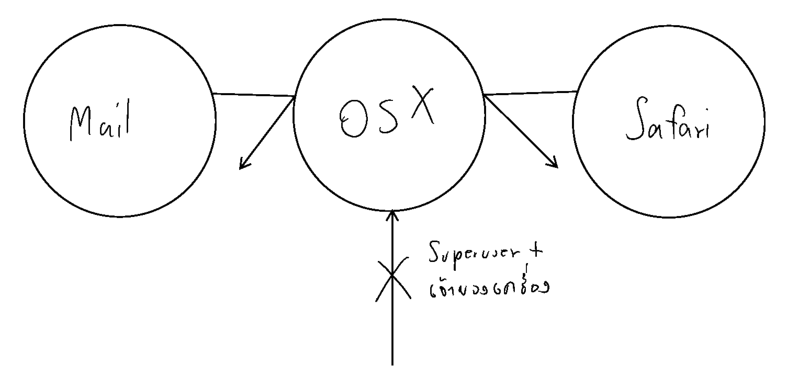
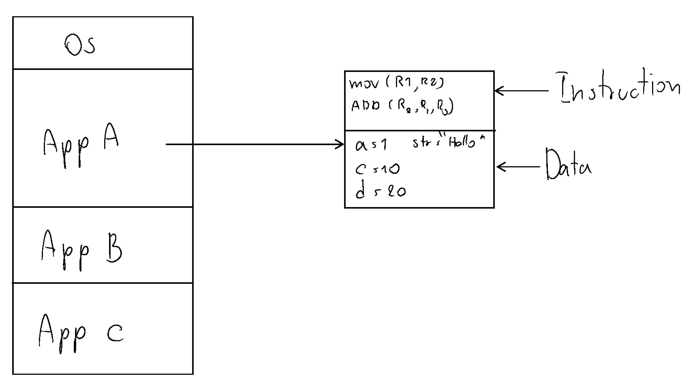

หลังจากห่างหายไม่ได้เขียนไปนาน อันด้วยการแข่ง Imagine Cup ขอกลับมาด้วยเรื่องเบา ๆ กับคำถามที่เกิดจาก ความนิยมของ Mac ที่สูงขึ้นเรื่อย ๆ  ว่า **"ตอนนี้ Mac ยังปลอดภัยอยู่รึเปล่า ?"  **ต้องเล่าก่อนว่า เมื่อก่อน (ไม่กี่ปีก่อน) Apple ชูจุดเด่นของ Mac ว่า "โ**อ้มันปลอดภัยมาก ๆ ไม่มีไวรัสเลยนะ" **(มีการเติมคำพูดเพิ่ม เพื่ออรรถรสในการอ่าน) แต่ในปัจจุบัน เดินไปไหน ก็เจอแต่คนใช้ Mac คนใช้เยอะขึ้น เป้าหมายในการโจมตีก็**มากขึ้นเรี่อย ๆ** ทำให้ภัยคุกคามต่าง ๆ ก็**เพิ่มขึ้น**เป็นเงาตามตัว อย่าง**หลีกเลี่ยงไม่ได้** ทำให้ตอนนี้ Apple ไม่ได้ชูโรงว่า Mac ไม่มีไวรัสอีกต่อไปแล้ว
ในบทความนี้เราจะมาดูกันว่าใน OSX ที่มากับ Mac ทุกเครื่องจะมีระบบอะไรบ้างที่ช่วยทำให้เครื่องและข้อมูลของเราปลอดภัย และ เดี๋ยวเราค่อยมาดูกันว่า Antivirus ยังจำเป็นสำหรับ OSX อยู่หรือไม่ นอกจากนี้ ตอนท้ายจะนำเสนอวิธี เรียกว่า Tip ล่ะกัน ในการใช้ Mac ที่พวกเรารักให้ปลอดภัยจากภัยคุกคามต่าง ๆ

## XD และ ASLR ที่ทำให้ OSX ปลอดภัยตั้งแต่รากฐาน

ถ้าใครที่เรียนมาทางด้านคอมพิวเตอร์น่าจะรู้ว่า OSX เองนั้นพื้นฐานของมันนั้นมาจากระบบ Unix ที่ถูกออกแบบให้มีความปลอดภัยที่สูงอยู่แล้วเช่นการมี App Sandbox ที่คอยแยก ตัวระบบหลัก กับ App แต่ล่ะตัวแยกจากกัน ทำให้ ถ้าเกิดมีอะไรเข้ามาในเครื่องของเรา เราจะมั่นใจได้เลยว่า มันไม่สามารถลามเข้าไปในระบบของเราได้เลย ยิ่งใน OSX 10.11 El Capitan มีสิ่งที่เรียกว่า rootless ทำให้ ไม่ว่าใครหน้าไหนก็ตาม (แม้แต่เจ้าของเครื่อง หรือ Superuser) ไม่สามารถทำอะไรกับแกนหลักของระบบได้เลย (เว้นแต่มีวิธีพิเรนแปลก ๆ นะ อันนี้ไม่นับ)

**For Geek Only (Geek+) **นอกจากที่จะมี App Sandbox แล้ว ในการจัดการ Memory ตัว OSX มีสิ่งที่เรียกว่า XD (Execute Disable) ขอเรียกว่า XD ล่ะกันเนอะ ที่คอยทำหน้าที่เป็นกำแพงระหว่าง ส่วนของ Data และ Instruction ใน Memory เขียนมาแบบนี้ อาจจะ งง อธิบายคร่าว ๆ ก่อนว่าปกติ OS ทั่ว ๆ ไป เวลาโปรแกรมทำงาน OS จะ Allocate (นึกภาษาไทยไม่ออก แม่มเอ้ย !!) หน่วยความจำของเราโดยแบ่งเป็น 2 ส่วนคือ ส่วนที่เป็นข้อมูล ตัวอย่างเช่น เราประกาศตัวแปร และให้ค่ามัน ของพวกนี้แหละมันจะอยู่ในส่วนของ Data และอีกส่วนหนึ่ง เราจะเรียกว่า Instruction มันจะเก็บคำสั่งที่ต้องทำงาน เช่น ให้เขียนไฟล์ ตัวนี้ ที่ตรงนี้ หรือจะเป็น การสั่งให้ CPU รัน โดยเอาข้อมูลจากตรงนั้น ตรงนี้เข้าไปก็แล้วแต่ ว่ากันไป (ถ้านึกภาพไม่ออก ดูภาพด้านบนได้)

ทีนี้สิ่งที่ XD เข้ามาจัดการคือ มันจะเป็นเหมือนคนยามเฝ้า ไม่ให้เข้าไปผิดที่ผิดทาง เช่น ปากบอกว่า เดี๋ยวเราจะเข้าไปเอา Data แต่ดันทะลึ่งเข้าไปเปลี่ยน Instruction อะไรแบบนี้ หรือสลับกันก็ว่าไป
เพิ่มความกวนประสาทกันเข้าไปอีกด้วย ASLR (Address Space Layout Randomisation) โดยปกติ ถ้าเคยเรียนวิชา OS กันว่า เวลาเราวาดรูปหน่วยความจำ OS จะอยู่บนสุด และข้างล่างก็เต็มไปด้วย หน่วยความจำของ App ที่รันเต็มไปหมด แต่ ASLR จะทำให้แต่ล่ะส่วนของข้อมูลที่อยู่ในหน่วยความจำแยกออกจากกันเป็นเสี่ยง ๆ เพื่อทำให้ผู้ไม่ประสงค์ดีเข้ามาเปลี่ยนข้อมูลในหน่วยความจำเป็นไปได้ยากขึ้น

## Gatekeeper ยามเฝ้าประตูที่แข็งแกร่งที่สุดในโลกา

ตัว Gatekeeper มีมาตั้งแต่ OSX 10.8 (Mountain Lion) แล้ว (นานแล้วนะ) ที่คอยกรอง App ที่น่ากลัว หรือ ไม่น่าเชื่อถือ และคอยแจ้งเตือนเรา เพื่อให้เราจัดสินใจ ว่าจะเปิดหรือไม่ ระบบนี้ผมว่า เป็นระบบที่ออกแบบมาดีมากเลย สำหรับคนที่ไม่ได้มีความรู้ทางด้านคอมพิวเตอร์มากนัก (ขอเรียกว่า User ผู้น่ารัก ล่ะกัน) เวลา User ผู้น่ารัก ของเรา **บางคน** จะทำอะไร มักจะไม่ค่อยอ่านสิ่งที่มันเด้งเตือนบนหน้าจอเท่าไหร่ กด Next กด Accept กด Yes อย่างเดียว ทำให้อาจจะมีอะไรเล็ดรอดเข้ามาได้ แม้ผู้พัฒนา OS ทำระบบป้องกันออกมาแล้ว สิ่งที่ Gatekeeper ต่างออกไปคือ เวลา Gatekeeper แจ้งเตือน มันแค่บอกเป็น ข้อมูล เฉย ๆ ว่า App หรือไฟล์นี้ไม่อาจจะปลอดภัยนะ ไม่ให้เปิดหรอกแบร่ ~ และมีปุ่มเดียวคือ OK ฉะนั้นถึงแม้ User ผู้น่ารักของเราจะมีนิสัยชอบปุ่ม Yes, OK, Accecpt อะไรโดยที่ไม่ตรึกตรองมาก่อน ก็ไม่สามารถเปิดไฟล์ หรือ App นั้น ๆ โดยง่ายแน่นอน ถือว่าเป็นปราการด่านแรก แต่ถามว่า **"จะทำให้เปิดได้มั้ย ?"  **คำตอบคือ **ได้ แ**ต่ต้องเข้าไปที่ System Perferences อีก ซึ่ง User ธรรมดา ไม่น่าจะเข้าไปแน่นอน

## Authentication System ที่ป้องกันการทำอะไรที่พลีพลาม

ถ้าใครที่ใช้ OSX น่าจะเคยเห็นหน้าต่างอะไรแบบนี้ น่าจะกันหมดแล้วนะ เพราะมันจะขึ้นมาให้เราต้องใส่รหัสผ่านทุกครั้ง ที่เราต้องการจะทำอะไรกับส่วนที่ค่อนข้าง ลึก หรือเกือบ ๆ จะหวงห้าม ในระบบ ฉะนั้นสิ่งที่ต้องระวังคือ ให้สิทธิ์กับ App ที่เราเชื่อถือเท่านั้น พวกโฆษณาขายของเล่นสีเดียว (ที่ผิดกฏหมายน่ะ) หรือ เว็บหรือโปรแกรมที่ผิดกฏหมายต่าง ๆ พวกนี้ไม่จำเป็นก็อย่าให้ เพราะสมัยนี้ภัยคุกคามมักเล่นกับความไม่รู้ของ User กันเยอะมาก ๆ ยักกะเป็น Trend

## Build-in Firewall

หลาย ๆ คนน่าจะรู้จักคำว่า Firewall ที่เอาไว้ป้องกันการ รับส่งข้อมูลที่ไม่พึงประสงค์ ใน OSX เองก็มี Firewall มาให้ในระบบเหมือนกัน แต่ Default ของระบบจะปิดเอาไว้ แต่เราสามารถเข้าไปเปิดเพื่อใช้ได้เช่นกัน

## FileVault เพื่อความปลอดภัยของข้อมูล

ความปลอดภัยของข้อมูลก็เป็นสิ่งสำคัญ ในตัว OSX ก็มีระบบที่ชื่อว่า FileVault ที่จะเข้ารหัสข้อมูลใน HDD ของเราทั้งลูก โดยเราสามารถปลดล๊อคผ่านรหัสผ่านเข้าเครื่องของเรา หรือถ้าลืมเราสามารถหา Recovery Key มาจาก Apple ID ของเรา หรือถ้าชีวิตนี้จำอะไรไม่ได้สักอย่างก็ต้อง Format สถานเดียว จะส่งไปถอดรหัสข้อมูลก็ยากอยู่ เพราะมาตราฐานที่ใช้ในการเข้ารหัสมันค่อนข้างเถื่อนถอดยากโคตร ทั้งนี้เพื่อป้องกันเหตุการณ์ที่เครื่องของเราถูกขโมยไป และผู้ที่ขโมยต้องการเอาข้อมูลของเรา นั่นเอง

## สรุป Mac ปลอดภัยจริงรึเปล่า ? ต้องการ Anitivirus หรือไม่ ?
โดยรวม ๆ แล้ว ผมมองว่า OSX เป็น OS ที่มีระบบรักษาความปลอดภัยค่อนข้างดีอยู่ ส่วนเรื่องของ Anitivirus ผมมองว่า มันไม่จำเป็นเลย เท่าที่ใช้มา ไม่เคยเจอ Virus หรืออะไรที่น่ากลัวแปลก ๆ เลย แม้แต่ครั้งเดียว ตั้งแต่เครื่องเก่ายันเครื่องใหม่ แต่เคยมีประสบการณ์การใช้ Antivirus บน OSX พบว่า มันช้า และมันไม่ช่วยอะไรเราเลยจริง ๆ (อารมณ์เหมือนเสียตังฟรีเลย แต่ไม่ใช่เพราะโปรแกรมมันกากนะ แต่เพราะว่าตัวระบบมันโออยู่แล้ว) แต่สำหรับใครที่ค่อนข้างจะ ต้องการความปลอดภัยที่มากขึ้นก็สามารถเลือกซื้อ Antivirus มาใช้ได้เช่นกัน

## Tip เล็ก ๆ น้อยสำหรับความปลอดภัยของ Mac เครื่องน้อย ๆ ของคุณ
หลีกเลี่ยงการเข้าใช้เว็บไซต์ และโปรแกรมที่ผิดกฏหมาย โดยเฉพาะโปรแกรมเถื่อน สุดท้ายก็หนีคำว่า **"บนโลกนี้ไม่มีอะไรฟรี"** ได้หรอกครับ เราไม่มีทางรู้ได้เลย ว่าโปรแกรม หรือเว็บพวกนี้จะใส่อะไรที่ไม่พึ่งประสงค์มาให้เราบ้าง เพราะฉะนั้นทางที่ดี หลีกเลี่ยงได้ให้**พยายามหลีกเลี่ยง**ซะหน่อย ก็จะดีมาก แต่สำหรับใครที่ไม่สามารถหลีกเลี่ยงได้ ก็แนะนำให้**เปิด Firewall** ซะเพื่อป้องกันสิ่งอันไม่พึงประสงค์เข้าเครื่องเราโดยที่ไม่รู้ตัว
และสุดท้ายคือ หมั่น Update ระบบเสมอ เพราะการ Update ระบบจะคอยแก้ไขข้อพกพร่องต่าง ๆ ในตัวระบบหรือมีบางอย่างเพิ่ม ถ้าเราไม่หมั่น Update ผู้ไม่ประสงค์ดีอาจจะใช้ช่องโหว่นี้ เพื่อมาโจมตี หรือล้วงข้อมูลของเราไปได้

## สรุป
เท่านี้เราก็ตอบคำถามที่ว่า **"Mac ปลอดภัยจริงรึเปล่า ?"** ที่เป็นคำถามที่คนถามมากันเยอะมาก ๆ กันไปแล้ว แต่ถึง Mac จะปลอดภัยแค่ไหน สุดท้ายแล้วคนที่ใช้ก็คือ เรา มันก็อยู่ที่เราใช้แล้วว่า เราเอาไปใช้ทำอะไร ที่สำคัญคือ พยายามหลีกเลี่ยง สิ่ง การเข้าถึงเว็บแปลก ๆ ผิดกฏหมาย และการติดตั้งโปรแกรมผิดกฏหมายต่าง ๆ ก็ช่วยลดความเสี่ยงไปได้เกินครึ่งแล้ว (ถ้าไม่ใช่คนที่มีชื่อเสียง ที่น่าถูกเจาะอะไรนะ) สุดท้ายก็ขอให้มีความสุขในการใช้เครื่อง Mac ของทุกคนนะครับ สวัสดีครับ !
