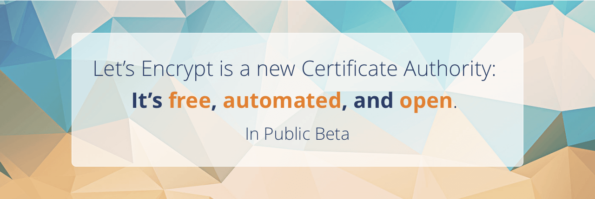
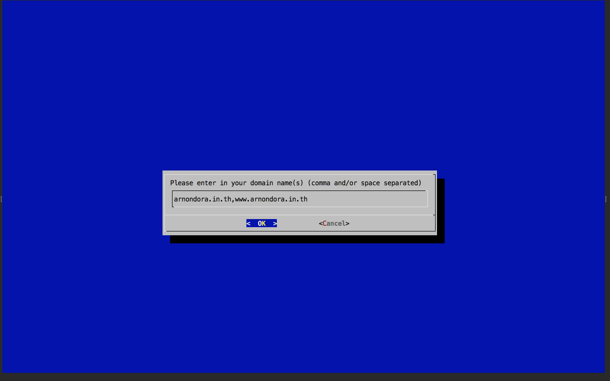
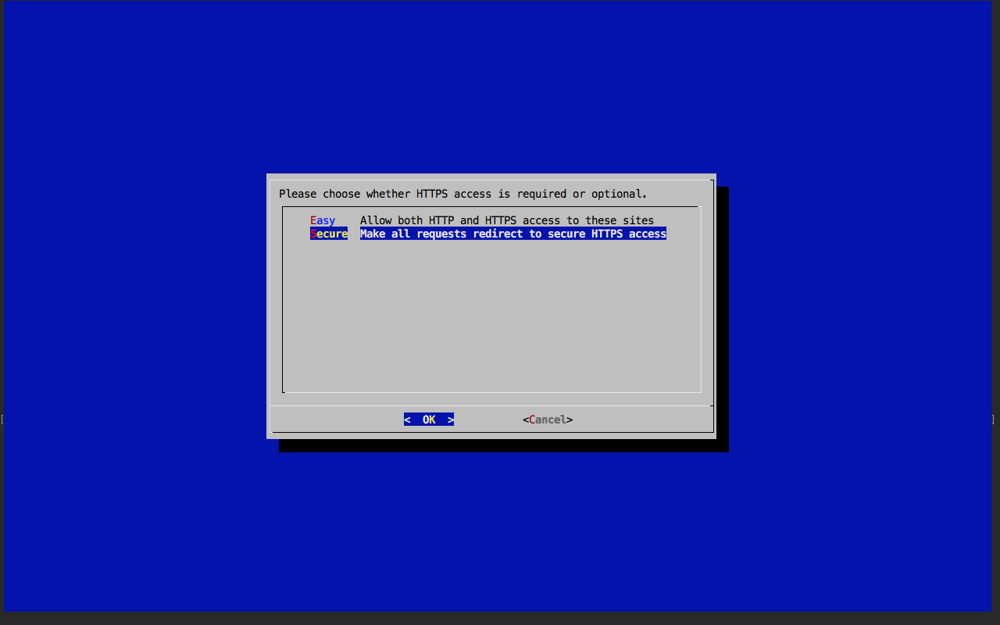

หลังจากที่ Let's Encrypt ที่เป็นโครงการที่ทำให้เราสามารถออก Certification Authority (CA) ได้ฟรีโดยไม่มีค่าใช้จ่าย ตอนนี้ได้เดินทางเข้ามาสู่ช่วง Public Beta กันแล้ว นั่นคือเราสามารถขอ Certificate โดยไม่ต้องมี Invite เหมือนตอน Close Beta อีกต่อไป (ใคร ๆ ก็สามารถขอได้นั่นแหละ) ส่วนวิธีการขอนั่นก็ง่ายมาก ๆ เพราะว่าทาง Let's Encrypt ได้เตรียมเครื่องมือที่ช่วยติดตั้งสำหรับ Web Server ยอดนิยมอย่าง Apache และ Nginx ไว้ให้แล้ว (ส่วน Web Server แบบอื่น ๆ อาจจะต้องติดตั้งเอง) มาดูวิธีติดตั้งและใช้งานกัน

## Step 1 : Clone Let's Encrypt Client
สำหรับเครื่อง Server ของใครที่ยังไม่ได้ติดตั้ง Git ก็ให้ติดตั้งกันก่อน โดยใช้คำสั่ง

    sudo apt-get install git

จากนั้นให้เรา Clone Client ของ Let's Encrypt เข้ามาในเครื่องของเรา โดยใช้คำสั่ง

    git clone https://github.com/letsencrypt/letsencrypt

จากนั้นเราก็จะได้ Folder ชื่อ letsencrypt ขึ้นมา ให้เราเข้าไปในนั้นได้เลย

    cd letsencrypt

## Step 2 : ขอใบ Certificate จาก Let's Encrypt
หลังจากที่เราได้ Client แล้ว เราจะมาเริ่มขั้นตอนของการขอ Certificate กันเลย โดยการรันคำสั่ง

    ./letsencrypt-auto

หลังกจากนั้นตัว letsencrypt-auto จะให้เราพิมพ์ชื่อเว็บของเรา ที่เราต้องการขอ Certificate โดยให้เราพิมพ์ชื่อเว็บของเราเข้าไป ในที่นี้ของผมจะเป็น www.arnondora.in.th ตรงนี้แหละ ที่ผมพลาดในครั้งที่แล้ว ที่ใส่ไปแค่ arnondora.in.th ทำให้ Certificate มันไม่สามารถยืนยันตัวเองได้ เพราะว่า URL ไม่ตรง หลังจากที่ผมไปถามคนใน Twitter เลยได้คำตอบเลย ให้ใส่ตั้ง www. และไม่มี www. ทั้ง 2 ตัวเลย ง่ายดี

หลังจากที่เราพิมพ์ชื่อเว็บของเราลงไปแล้ว มันจะถามเราว่า เราจะติดตั้งยังไง แบบ Easy คือจะยอมให้ User สามารถเข้าเว็บเราได้จาก http และ https ทั้งคู่เลย
ส่วนแบบ Secure จะไม่ยอมให้ User สามารถเข้าเว็บผ่าน http ได้ ถ้าเข้ามาผ่าน http มันจะถูก redirect ไปที่ https โดยอัตโนมัติ ในที่นี้ผมจะเลือกเป็น Secure ไปเลยล่ะกัน

เย้ !! และสุดท้ายเราก็ได้ Certificate มาใช้กันสักที แต่ว่ามันก็มีอายุเหมือนกัน โดยมันจะมีอายุอยู่ 90 วันด้วยกัน

เราสามารถขอต่อ Certificate โดยผ่านคำสั่งด้านล่าง ได้โดยตรงเลย

    ./letsencrypt-auto --renew-by-default

โดยหลังจากที่เรา ต่ออายุแล้ว เราก็จะได้อายุมาอีก 90 วันทันทีเลย ง่ายมาก ๆ เลยล่ะ และสุดท้าย เราลองมาทำสอบกันเลย ลองเข้าเว็บดู ถ้าเกิดตัว https มันไม่ขึ้นสีเขียว ก็อาจจะเกิดจากเราพิมพ์ชื่อเว็บเราผิดก็ได้นะ เพราะว่าโดนมาแล้วครั้งนึง ผมเขียนไว้แล้วรอบนึง เข้าไปอ่านได้ [ที่นี่][4] แต่ถ้าเป็นสีเขียวเหมือนในภาพด้านล่างนี้ ก็เย้ ! ยินดีด้วย มันสำเร็จแล้ว

## ปัญหาที่ผมพบ
นอกจากขั้นตอนที่ผมได้เขียนไปข้างบนแล้ว พอทำไปแล้วสำหรับใครที่เจอปัญหาเข้าเว็บผ่านทาง https แล้วไม่มีหน้าหรือเกิด Error 403 ให้ลองทำดังนี้
ก่อนอื่นให้เราเข้าไปที่ Folder etc/apache2/sites-available แล้วเข้าไปแก้ไข config ของเว็บเรา ตรงส่วนของ DocumentRoot ให้แก้เป็น Folder ที่เว็บหน้าเว็บของเรา อย่างเช่นของผมก็จะอยู่ใน /var/www ก็เลยตั้งตามด้านล่างเลย

    DocumentRoot /var/www

และสุดท้าย Restart ตัว Apache โดยรันคำสั่ง

    sudo service apache2 restart

สุดท้าย ก็ลอง Refresh เว็บเราอีกสักที เพื่อทดสอบ และเย้ ๆ สำเร็จแล้ว (ถ้ามันได้นะ)

## สรุป
จากขั้นตอนที่ได้เขียนไปนี้ จะทำให้เราสามารถขอ Certificate เพื่อเข้ารหัสการเชื่อมต่อให้เว็บเราได้แบบฟรี ๆ เลย จากทาง Let's Encrypt และเราสามารถเข้าไปอ่านรายละเอียดเพิ่มเติมได้ที่เว็บ Offical ของ [Let's Encrypt][6] ได้เลย โดยขณะนี้ทาง Let's Encrypt ได้ออก Certificate ไปแล้วประมาณ 36,000 กว่า ๆ ใบแล้ว ซึ่งถือว่าเร็วมาก น่าจะเพราะว่า เป็น Certificate ที่ของ่ายและรวดเร็วที่สุดแล้ว เลยทำให้มันโตได้ขนาดนี้ นอกจากนั้นยังมีบริษัทยักษ์ใหญ่แห่งโลก IT หนุนหลังด้วย เช่น Facebook ที่เรารู้จักกันเป็นต้น ผมหวังว่า บทความนี้จะช่วยให้ใครหลาย ๆ คนสามารถขอ Certificate กันได้ง่าย ๆ นะครับ สวัสดีครับ

[6]: https://letsencrypt.org
