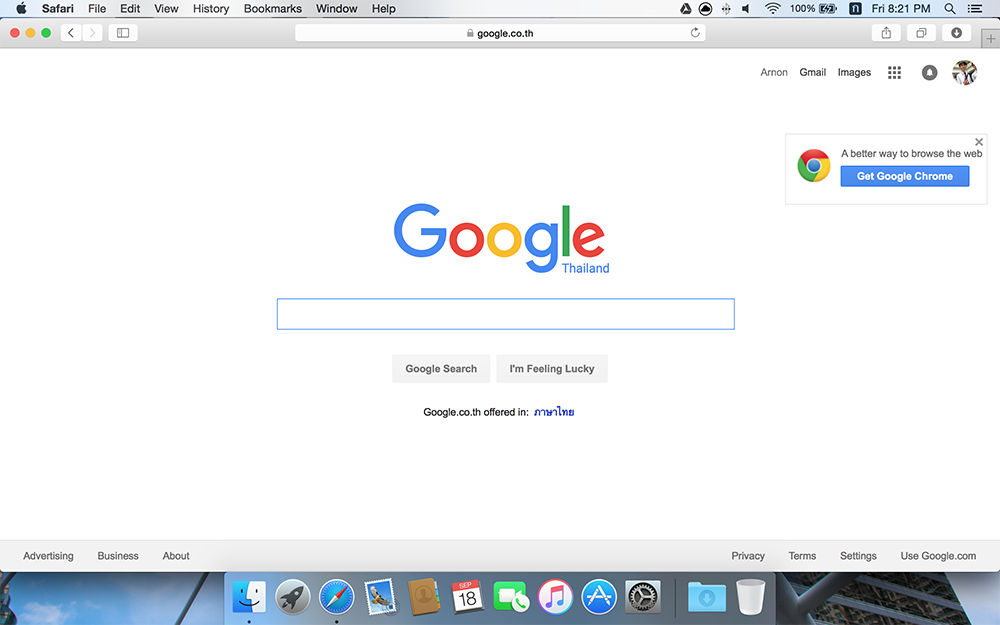
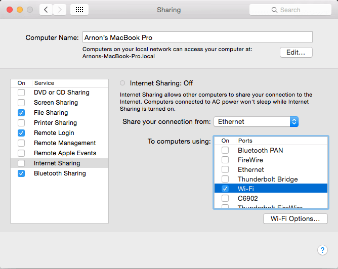
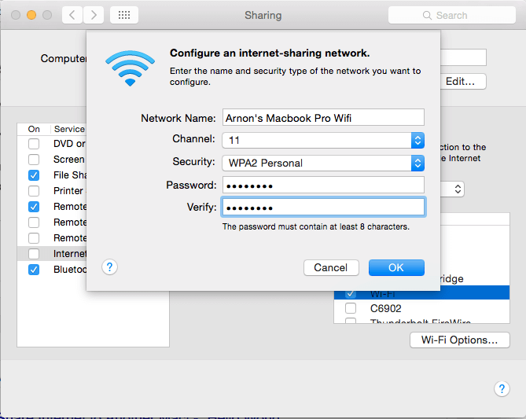

ตอนนี้ครับที่หอแจกรหัส Internet แล้ว หลังจากที่เมื่อก่อนที่หอเขาก็ปล่อยเน็ตให้ใช้แบบไม่มีรหัส แต่ตอนนี้เมื่อมันมี Account ห้องนึงมันก็ใช้ได้ 2 เครื่องซึ่งแน่นอนว่า มันไม่พอแน่นอน ผมเลยไปหาวิธีสนุกๆ และง่ายๆ ที่ทำให้เราสามารถต่อเน็ตพร้อมกันได้หลายๆ เครื่อง!! นั่นคือการแชร์เน็ตนั่นเอง
ผมว่าหลายๆ คนน่าจะเคยทำกันมาบ้างแล้วล่ะ ไม่มากก็น้อย แต่วิธีที่ผมจะบอกกันในวันนี้ เราไม่ต้องลงโปรแกรมอะไรทั้งนั้นเลย เพราะว่า มันเป็น Feature ที่มีอยู่ใน OSX อยู่แล้ว ไม่ต้องเซ็ตอะไรมากมายด้วย
ก่อนอื่นเลย สิ่งที่ต้องเตรียม นั่นคือคอมพิวเตอร์ที่ Install OSX 2 ea, รหัสเน็ต 1 ea, สายแลน ยาวแค่ไหนก็ได้ 1 ea
วิธีคือ ให้คอมพิวเตอร์เครื่องแรก ต่อเน็ตก่อนเลย เอาให้เข้าเน็ตได้เลยนะ

ถัดมาให้เราเอาสายแลนที่เรามีเชื่อม 2 เครื่องเข้าด้วยกัน แล้วทีนี้กลับไปที่เครื่องแรก ที่เราต่อเน็ตไว้ เข้าไปที่ System Preferences \> Sharing

เข้ามา ให้เราเลือกทางด้านซ้าย กดเลย Internet Sharing และให้เราเลือกได้เลยว่า เราจะแชร์เน็ตจากไหน ในที่นี้ผมเลือก Share Connection From Wifi เพราะว่าเน็ตหอผมมันเป็น Wifi และให้มันส่งออกไปเป็น Ethernet ซะ และสุดท้าย กดติ๊กถูกหน้า Internet Sharing ซะก็เป็นอันจบ แค่นี้ เราก็สามารถใช้เน็ตพร้อมกัน 2 เครื่องได้แล้ว!!!

## แค่นี้มันยังไม่พอหรอกน่า
เมื่อมีคอม 2 เครื่องมันก็ยังไม่ครบอยู่ดี แล้วโทรศัพท์กับ Tablet เราอีกนาๆ ล่ะจะทำยังไงดีน้อ.... ปิ้ง!! แชร์มันต่อกันเลย
เมื่อกี้ เราแชร์มันจาก Wifi เป็นสายแลน รอบนี้ เราจะแชร์จากสาย Lan กลับเป็น Wifi กัน

ให้เราไปที่เครื่องที่เราต่อสายแลน Share เน็ตเมื่อกี้ แล้วเข้าไปที่  System Preferences \> Sharing เหมือนเดิม แต่ที่นี้เราก็แค่เปลี่ยนจาก Share Connection From Wifi เป็น Ethernet แทน แล้วก็ Target ก็เลือกไปที่ Wifi ได้เลย
แต่ทีนี้ มันมีปัญหาหน่อยนึง! แล้วถ้าเราจะเปลี่ยน SSID กับ Password ของ Wifi เราล่ะ?

แค่เรากด Wi-fi Options แล้วเราก็สามารถที่จะเลือกชื่อ Wifi และ Password ของเราได้ เสร็จก็กด Ok และติ๊กที่ Internet Sharing ก็เป็นอันเสร็จ
เป็นยังไงกันมั่งครับ กับวิธีการแชร์เน็ตอันแสนจะง่ายดายมากๆ ไม่ต้องลงโปรแกรมอะไรเลย เพียงแค่มีคอมสักเครื่องก็เรียบร้อยแล้ว!
