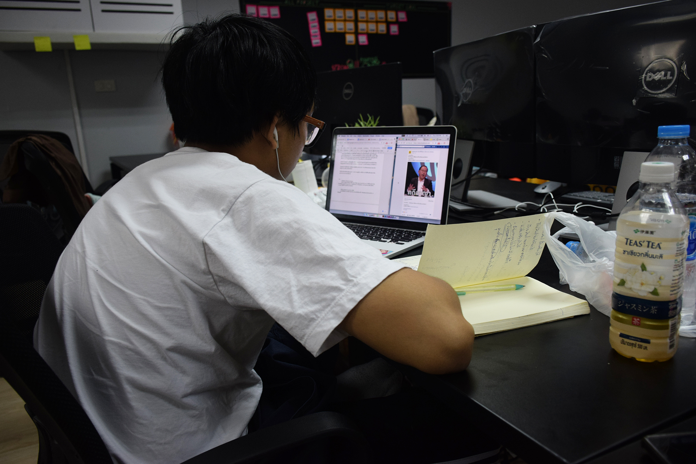
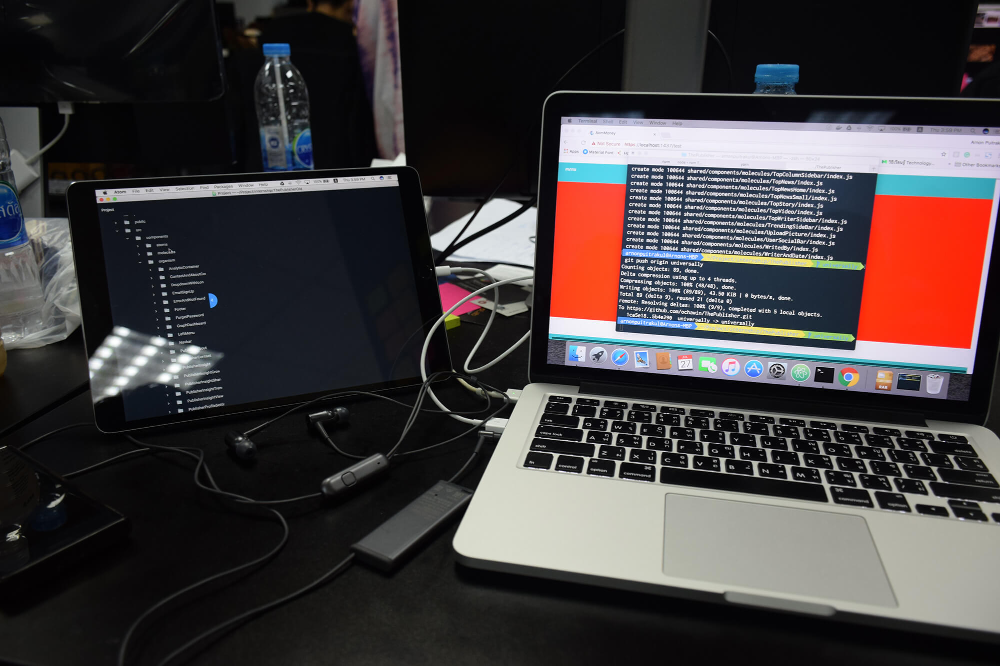
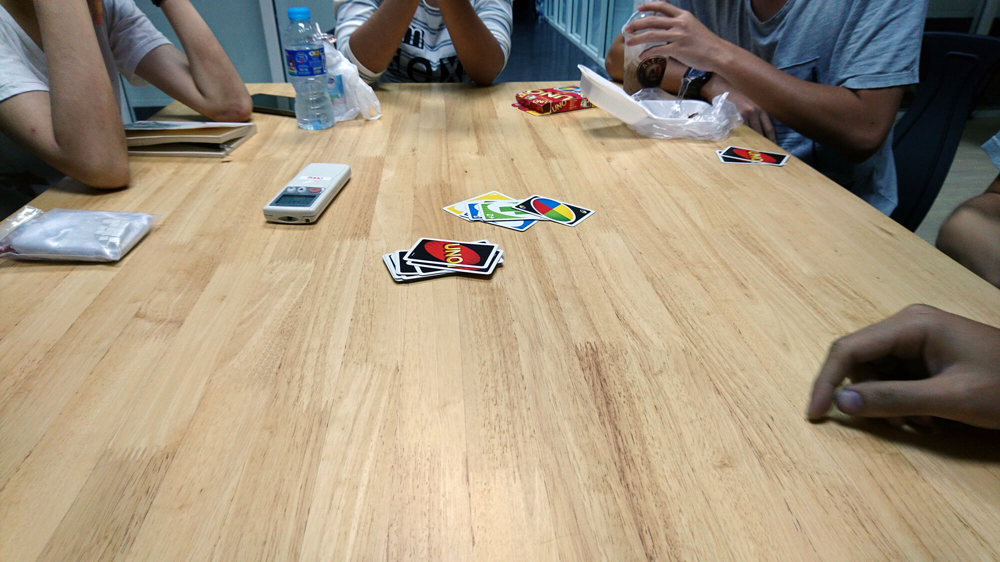
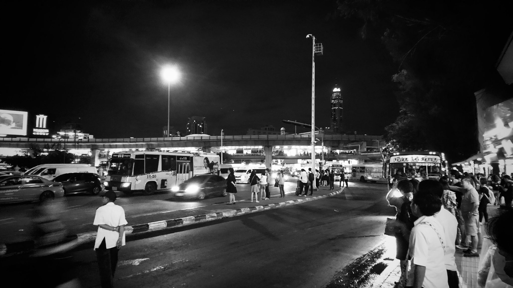
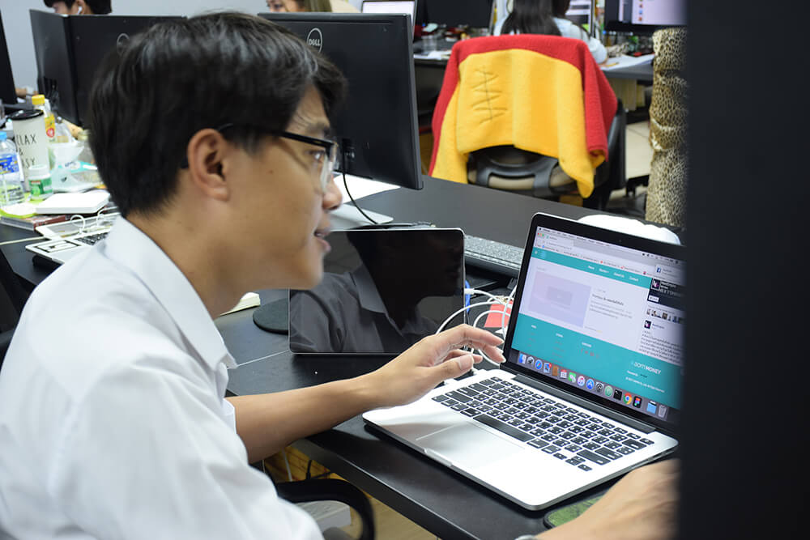
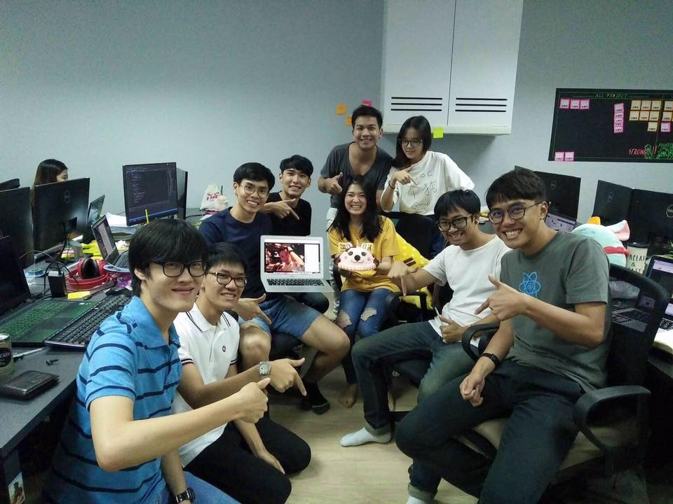

ถ้าใครเป็น Friend กับผมใน Facebook ก็น่าจะรู้ว่าช่วง 2 เดือนที่ผ่านมาก็ได้มีโอกาสไปฝึกงานที่ Like Me เนอะ หลายคนที่ฟังชื่อบริษัทก็คง งง ๆ กว่าบริษัทอะไรหว่า แต่ถ้าบอกว่า [Infographic Thailand][0] ทุกคนจะร้อง **"อ๋ออออ!!!"** ขึ้นมาทันที

จริง ๆ ใน **Like Me** จะมีอยู่หลายทีมนะ **Infographic Thailand** ก็เป็นหนึ่งในนั้น อีกอันที่น่าจะรู้จักกันคือ [Aommoney][1] ที่เป็นเว็บไซต์ที่ให้ข้อมูลด้านการเงินที่ดัง ๆ อะ View เดือนนึงก็หลักล้านอยู่ เยอะมาก ๆ

ทีมที่ผมทำจะเป็นทีม **1000x** เข้ามาฝึกในตำแหน่ง **Front-End Developer** ซึ่งแน่นอนว่า ไม่เคยทำมาก่อนเลย (โอเค เคยลอง ๆ เมื่อสัก 5-6 ปีที่แล้วได้ ตอนนั้นเทคโนโลยีมันไม่มีขนาดนี้) ถ้าใครที่เคยลองศึกษาด้านนี้มาก่อนจะรู้ว่าภาษาที่ใช้เป็นหลักก็จะเป็น **Javascript** ที่ผมเขียนไม่เป็นเลยจริง ๆ เขียนได้แค่ **alert('Hello World')** เลย

## เกริ่นกันก่อน
ก็จริง ๆ ตอนแรกว่าจะไม่ฝึกงานแล้วแหละ แต่ด้วยตอนนั้นที่ไปค่าย YWC พี่วิน ที่เป็น CEO ก็มาเป็นวิทยากรในค่ายด้วย และก็จบ ICT มหิดลเหมือนกัน อ. ก็พาไปแนะนำ เลยถามเรื่องฝึกงานก็เลยตอบตกลง แล้วส่ง Resume ไป เพราะน่าสนใจดี (จริง ๆ รู้จักบริษัทนี้มานานแล้วละ เพราะ CEO ก็รุ่นพี่คณะเอง มา Job Fair ทุกปี)

อีกเหตุผลที่อยากมาฝึกบริษัทนี้เพราะว่า อยากเข้ามาฝึกงานในบริษัทที่เล็ก และทีมพึ่งเปิด ไม่อยากเข้าไปในบริษัทใหญ่ ๆ เพราะเห็นการทำงานของบริษัทใหญ่ ๆ มาเยอะแล้ว อยากลองสัมผัสบรรยากาศทีมเล็ก ๆ บ้าง มันให้อีกฟิลนึงเลยนะ การทำงานแทบจะเป็น **Flat Organisation** กันเลย เป็นมิตรมาก ~

และแน่นอนว่า ก็ไม่อยากไปคนเดียวเลย ชวนเพื่อนในค่าย YWC ที่อยู่กลุ่มเดียวกัน ชื่อ**เต้ย นังงูพิษ** ไปด้วยกัน และเต้ยก็ไม่จบเท่านั้น มันก็ไปชวนเพื่อนอีกคนอีก สรุป Dev 3 คนที่มาฝึกงานด้วยกัน รู้จักกันหมดเลยแจ้ !!

ก่อนฝึกงานก็มีการมาสัมภาษณ์ วันนั้นจำได้เลยคือ **คอมเสีย** เอาไปซ่อม และโชคดีมากที่เครื่องได้วันนั้นพอดี ก็ต้องโฉบไปแถวปิ่นเกล้าเพื่อเอาคอมไปซ่อม และไปที่ออฟฟิศเพื่อสัมภาษณ์ (ปิ่นเกล้ากับกรุงธนบุรีมันไม่ได้ใกล้กันเลยจริง ๆ)

ตอนสัมภาษณ์ก็มีพี่วิน ที่เจอกันในค่าย และพี่เพชรที่เป็น Dev ก็เข้ามาสัมภาษณ์ ก็ถามคำถามทั่ว ๆ ไป ฟิลลิ่งเหมือนนั่งคุยกันอะ ก็เอางานให้ดู เล่าว่าเคยทำอะไรมาแล้วบ้างอะไรแบบนั้น และบอกเลยว่า ไม่ประสบการณ์กับการทำ Front-End มาก่อนเลย เคยแค่ดู Youtube และทำตามมาเท่านั้น

## Office
ออฟฟิศจะอยู่ที่ตึกไทยศรี ตรง BTS กรุงธนบุรี ลงมาก็เจอเลย ทั้งบริษัทก็มีอยู่ประมาณ 60-70 คนฉะนั้นออฟฟิศก็จะไม่ได้ใหญ่อลังเวอร์ขนาดนั้น ขนาดย่อม ๆ อบอุ่นดี ก็นั่งเป็นซอย ๆ ไปแต่ละทีม ซอยผมก็จะนั่งกับพี่ ๆ ทีม 1000x และ [NextEmpire][2] ด้วยกันเลย

ในออฟฟิศก็จะมีส่วนของห้องประชุมใหญ่ โถงแล้วก็ส่วนของออฟฟิศ ก็ Intern ส่วนใหญ่ก็จะทำงานกันในห้องประชุมใหญ่ ส่วนพวกเราที่เป็นผู้น้อย (Dev มีมาฝึกแค่ 3 คนรวมผมแล้ว) ก็จะนั่งอยู่ในออฟฟิศกับพี่ ๆ เลย

และอย่างที่บอกว่าในซอยก็มีทีม NextEmpire นั่งอยู่ด้วย แน่นอนว่า NextEmpire ก็มี Intern เช่นกัน มีคนเดียว ชื่อมอส ก็นั่งข้าง ๆ ผมนี่แหละ เลยได้มีโอกาสดูว่าเวลาเว็บเขาจะเขียน Content กัน เขาทำกันยังไงบ้างไปด้วยพราง ๆ ก็เอามาปรับใช้กับเว็บของตัวเองได้เป็นอย่างดี

โต๊ะทำงานก็ง่าย ๆ ครับ ตอนผมมาใหม่ ๆ พี่ ๆ ก็ย้ายไปย้ายมา ง่ายมาก ๆ แค่ย้ายของไปลงโต๊ะใหม่ จบ และการมาของ Intern ในทีมก็เป็นการไล่พี่วินออกไปอีกซอยนึง ฮ่า ๆ ภาพด้านบนเป็นโต๊ะที่ผมนั่งก็ไม่มีอะไร ก็ Laptop กับ Ipad ตัวเองเอามาทำเป็น Second Screen บางทีทำงานแล้วมันจอเดียวไม่พอจริง ๆ (Dev น่าจะรู้ดี)

## Lifestyle

เมื่อตอนที่เริ่มใหม่ ๆ ก็มาตอน 9 โมงเลย ปรากฏว่าเข้ามาออฟฟิศ มืดเฉย ไม่มีใครมาเลย ฮ่า ๆ ทำให้รู้ว่า ที่นี่เข้างานกันเที่ยง สบายตรูละ ~ แต่ส่วนใหญ่ผมก็จะมาช่วงเกือบ ๆ 10 โมงนี่ละ แรก ๆ ด้วยความที่นั่งอยู่ข้างในก็ไม่ค่อยรู้จัก Intern คนอื่น เลยนั่งอยู่กับทีมตัวเอง ช่วงหลัง ๆ ก็ออกไปทำความรู้จักคนอื่น ๆ ช่วงเช้าก็เลยออกไปนั่งเล่น Board Game กัน

ถามว่าทำไมไม่มาสายกว่านี้สักชั่วโมง จริง ๆ ก็อยากนะ จะได้ตื่นช้ากว่านี้อีกสักชั่วโมง แต่ Salaya Link ไม่เป็นใจ ปกติผมจะขึ้นรอบ 9 โมง ซึ่งปกติมันจะออกชั่วโมงละคัน แต่เป็นความพอดีอะไรไม่รู้ ว่า Salaya Link มันไม่มีรอบ 10 โมง TT เลยต้องออกรอบ 9 โมง

ลักษณะการทำงานก็จะทำงานเป็นทีม ๆ กัน ทีมที่ผมมาฝึกก็จะเป็น Developer เนอะ ก็วิธีการทำงานก็น่าจะได้สัมผัสมาบ้างแล้วละ ก็ทำงานกันเป็น Sprint กันไป และด้วยความนี่นั่งอยู่ด้วยกันกับพี่ ๆ เลยก็หันไปถามได้เลย ฮ่า ๆ

เวลาเข้างานก็จะเป็นช่วงเที่ยง ๆ ฉะนั้น ผมก็จะตื่นสัก 8 โมงเท่ากับเวลาตื่นไปเรียนเลย สบายมาก ~ และก็ขึ้น Salaya Link ไปต่อ BTS (Salaya Link คือ Shuttle Bus วิ่งจาก ม.มหิดล ไปลง BTS บางหว้า)

ส่วนเวลาออกงานก็จะเป็นช่วงประมาณ 6 โมง (เห็น Intern คนอื่นกลับกันประมาณนี้แหละ) แต่แรก ๆ นี่ก็จะออกงานประมาณทุ่มนึง แน่นอนว่า Salaya Link รอบสุดท้ายคือ 18.40 ก็เอาว่ะ ก็ขึ้น BTS ไปอนุสาวรีย์ แล้วขึ้น 515 ไปลงหน้าหอได้เลย อ้อมหน่อยแต่สบายสุดละ ก็ดีหลัง ๆ ก็แวะกินข้าวแถว แล้วโพสต์ว่ากินคนเดียว จนได้ \#เด็กฝึกงานขี้อ่อยมา

ที่พีคคือ เวลากินข้าว ปกติเราจะกินข้าวกลางวันกันตอนเที่ยงเลยใช่ม้าา แต่ที่นี่เข้างานก็เที่ยงแล้ว ฉะนั้นเวลากินข้าวก็เลื่อนไปนิดหน่อย ก็ทีมผมก็จะกินตอนบ่าย 2 ก็รู้สึกแปลก ๆ นิดหน่อยในตอนแรก แต่หลัง ๆ ก็ชิน มันจะมีวันนึงที่เว็บมันมีปัญหา ก็ต้องแก้ แก้ไปแก้มาเสร็จอีกทีบ่าย 4 โมงเย็น และก็ไปกินข้าวตอน 4 โมงนี่แหละ โคตรพีค

พีคกว่าการนั้น ถ้าใครเคยไปเดินแถวนั้นจะรู้ดีว่ามันแทบไม่มีอะไรกินเลยฮ่า ๆ มีอยู่ไม่กี่ร้านจริง ๆ ซึ่งเราก็กินซ้ำวนไปเรื่อย ๆ ชีวิตติดลูปลืม Break บางทีก็ออกกันไปกินไกลหน่อยก็มีเหมือนกัน

ทุกวันวันพฤหัสหน้าตึกมันจะมีน้ำเมล่อนปั่นมาขาย นี่ก็เหมือนกับรอคอยวันพฤหัสเพื่อจะรอกินมันฮ่า ๆ

## Responsibility

ก็เข้ามาฝึกในตำแหน่ง Front-End Developer ก็ต้องเขียน Code เนอะ คงจะเป็นอื่นไม่ได้ ฮ่า ๆ ก็งานที่ผมเข้ามาทำคือตัวหน้าเว็บของ NextEmpire และ Aommoney ถ้าใครที่เข้าไปอ่าน Aommoney ก็น่ารู้ว่าตอนนี้หน้าเว็บมันเปลี่ยนไป ก็นั่นแหละ ที่ผมเข้ามาทำ

ตัวงานทั้งหมดเลยมันจะเป็น MERN Stack ทั้งหมดเลย ซึ่งตัวผมเองก็เป็น Dev ยุคโบราณมากใช้ LAMP Stack อยู่ยังไม่ไปไหน มาฝึกงานรอบนี้แหละใช้ MERN Stack ครั้งแรก แต่ส่วนที่ผมยุ่งเยอะ ๆ จะเป็นส่วนของ Front-End เป็นหลัก ที่จะได้ทำงานกับ Framework อย่าง React ซะเป็นส่วนใหญ่

เข้ามาในสัปดาห์แรก พี่วินก็ Assign ให้ไปอ่าน Doc ก่อนเลย เพราะตัวผมเองไม่มีประสบการณ์กับ React ไม่ใช่แค่ React หรอกเอาจริง ๆ ไม่มีประสบการณ์กับ Javascript เลยฮ่า ๆ ก็ใช้เวลาประมาณ 2 วันในการนั่งอ่าน Document ที่พี่ ๆ ให้มาอ่านก็จะมี Document ของตัว React เองและส่วนประกอบอื่น ๆ ที่ใช้พวก Styled-Components กับ ARC อะไรพวกนี้

ทีมนี้ก็จะใช้เป็นเกือบ ๆ Scrum (มีดัดแปลงนิดหน่อย) ก็จะมี Stand-up Meeting ทุกวัน และประชุมประจำสัปดาห์เพื่อแจ้งความคืบหน้า และกำหนดงานใน Sprint ถัดไป

สัปดาห์ถัดไป พี่วินก็มาเอาตัวโปรเจ็คจริงให้ดูว่าตอนนี้จัดการไฟล์ กับเรื่องของ Version Control กันยังไง ตอนแรกที่เห็น Code ของ Front-End คือแทบช๊อค มันเยอะมาก ๆ อ่านยากมาก เพราะไม่มีประสบการณ์มาก่อนด้วยแหละ เลยอ่านไม่ค่อยออกเท่าไหร่ ซ้อนโน้นนี่นั่น บางอันก็เล่นท่ายากอะไรทำนองนั้น แถมเป็น Server-Side Rendering อีก ที่ถ้าใครเขียน React จะรู้ฤทธิ์ของมันดีว่า มันโคตรลำบาก (เดี๋ยว Blog หน้ามาเขียน What I have learnt)

หลังจากนั้นก็ได้ Assign งานมาให้แก้ Component แล้วค่อย ๆ ขยับไปเขียน Component ใหม่ และสุดท้ายพีคสุดคือ Optimisation จัดว่าความพีคค่อย ๆ ทวีคูณขึ้นเรื่อย ๆ ตั้งแต่วันแรกยันวันสุดท้ายของการฝึกงานเลยทีเดียว จากนี้ก็ฝากพี่ ๆ แก้บัคพวกผมต่อด้วยนะครับ ฮ่า ๆ

## สรุป

2 เดือนที่ผ่านไปเร็วยังกะโกหก ก็เป็นประสบการณ์ที่ดีครับที่ได้มาฝึกงาน Like Me จากทำงานด้านนี้ไม่ได้เลย ตอนนี้เริ่มเซียนละ เพราะได้เจอปัญหา เจอ Requirement เยอะมาก ๆ และเป็นของจริง 100% เลยทำให้เซียนได้เร็วขนาดนี้ นี่สินะที่เขาเรียกว่า **ประสบการณ์จะหล่อหลอมให้เราเก่งขึ้น**

สุดท้ายก็ขอบคุณพี่ ๆ ที่ช่วยสอนงาน ของกิน และหลาย ๆ เรื่องมาก ๆ และขอบคุณพี่วินที่ชวนตอนค่าย YWC นะครับ ตอนนี้ก็จบฝึกงาน กลับไปสู่โลกแห่งความเป็นจริงต่อที่สถานี ปี 4 และ Senior Project แงงงงง

[0]: http://infographic.in.th
[1]: https://www.aommoney.com
[2]: https://www.nextempire.co
