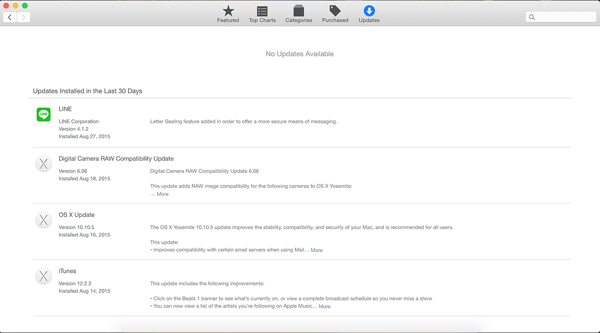

เคยสังเกตกันมั้ยครับ ว่าตอนแรกๆ ที่เราซื้อเครื่องมาใหม่ๆ โห !! มันโคตรเร็วเลย ! พอใช้ไปสักพักเท่านั้นแหละ อืดเป็นเต่าคลานเลย นั่นแหละเป็นสัญญาณแล้วว่าเครื่องของเราทั้งหลายนั้นสุขภาพเริ่มไม่ค่อยดีแล้ว
ถึงแม้ว่า OSX ที่ติดตั้งอยู่ในเครื่อง Mac ทั้งหลายจะโคตรฉลาดด้วยความสามารถที่จะ Maintenance ตัวเองได้ แต่ก็ไม่ใช่ทั้งหมดที่จะทำได้เอง

### อ้าวอย่างงี้เราก็ต้องยกเครื่องไปหา Iservice น่ะสิ !!
ไม่จำเป็นหรอกครับ เพราะเราสามารถดูแลสุขภาพของเครื่องเราด้วยตัวเองที่บ้านเราได้เลย ลองมาทำตามวิธีที่ว่ากันในต่อจากนี้กัน

## กวาดล้างไฟล์บน Desktop ก่อนมั้ย

การที่เรามีหน้า Desktop อันรกรุงรังมันทำให้ ตัวเครื่องเราต้องเอาทรัพยากรของเครื่องไปใช้ในการแสดงผลไอคอนบนหน้าของเรามากมายกายกอง การที่เราจัดการหน้า Desktop ของเราให้โล่งก็จะช่วยให้เครื่องของเราดีขึ้นนิดนึง

## ลอง Repair Disk Permission กันหน่อย

ถึงแม้ว่า OSX มันจะฉลาด ดูแลตัวเองได้ แต่ก็แน่นอนว่า มันคงไม่ดูแลตัวเองได้เองทั้งหมดหรอก ถ้าหาเครื่องขอใครที่ดูมึนๆ แนะนำให้ลอง Repair Disk Permission ดูเพื่อมันจะดีขึ้น

## Clear Temp Files, Cache และ Log File
เวลาเราใช้งานโปรแกรมต่างๆ หรือแม้กระทั่งใช้งาน OSX เฉยๆ เลยระบบก็จะมีการเก็บ Log หรือ Store ข้อมูลอะไรในเครื่องเราตอนโปรแกรมมันรันอยู่ เราสามารถจัดการกับมันได้ง่ายมากๆ เพราะเดี๋ยวนี้มีโปรแกรมเยอะมากที่จะคอยจัดการเรื่องนี้ให้กับเรา เช่น OnyX

## อัพเดท Software บ้าง

การอัพเดท Software ของเราให้เป็นเวอร์ชั่นใหม่สม่ำเสมอถือเป็นเรื่องที่ควรทำเลยล่ะ เพราะว่า การที่เราไม่ได้ทำการอัพเดท Software เราทำให้เครื่องเราอยู่ในความเสี่ยง เสี่ยงจริงๆ นะ เพราะว่า ตัวผู้พัฒนาระบบก็มักจะออก Update มาอุดรู (Bug) ของตัวระบบให้เราเสมอ เพื่อให้เรามั่นใจว่า ระบบของเราปลอดภัย

## HDD อีกนึดจะเต็มแล้ว
จริงๆ แล้ว OSX จะจองพื้นที่ใน HDD ของเราสัก 10-15% เผื่อเวลาแรมเรามันจะเต็ม เพื่อที่ว่าจะได้ย้ายข้อมูลในแรมที่ยังไม่ได้ใช้ ลงมาอยู่ใน HDD ชั่วคราวและเอาข้อมูลใหม่เข้าไปในแรมแทน ทางเทคนิคเราเรียกว่า Paging เพราะฉะนั้นเพื่อให้เครื่องเราสามารถทำ Paging ได้เราก็ควรทีาจะเหลือพื้นที่สัก 10-15% ก็จะดีมาก

## แรมไม่พอแต่อยากซ่า
ถ้าเป็นเครื่อง Mac ตอนนี้ก็คงจะ Upgrade อะไรไม่ได้แล้ว เพราะฉะนั้นเรื่องแรม เวลาเลือกซื้อเครื่องก็ต้องเลือกซื้อให้พอดีกับที่เราใช้ด้วย เพราะว่าถ้าเราเลือกเครื่องที่แรมน้อยๆ มาก็อาจจะไม่พอต่อการใช้งาน ทริปตอนเลือกซื้อคือ ถ้าเราจะใช้แค่เล่นเน็ตทำงาน Office ทั่วๆ ไป 4 GB ก็พอแล้ว แต่ถ้าเอามาทำพวกรูป หรือเล่นเกมเบาๆ ก็แนะนำให้เพิ่มเงินซื้อ 8 GB ไปเลยจะดีกว่า เพราะตอนนี้ 8 GB ก็น่าจะเป็นมาตราฐานแล้วล่ะ

## อย่าเปิดโปรแกรมทิ้งไว้เยอะ
วิธีที่ทำให้เครื่องเราแรมไม่เต็มง่ายสุดคือการไม่ใช้ 555 แต่ก็เรื่องจริงนะ ใช้โปรแกรมเสร็จแล้วก็ปิดเลยก็ดี แรมเราจะได้ไม่กินเยอะมาก ยิ่งเปิดเยอะ ก็ยิ่งกินแรม

## เอาโปรแกรมที่เปิดตอนเปิดเครื่องอัตโนมัติออกไปบ้าง

สาเหตุแต่ผมเจอแบบหนักสุดเลย คือไปตั้งเปิดโปรแกรมอะไรก็ไม่รู้เยอะแยะไปหมดตอนเปิดเครื่อง เวลาเปิดเครื่องทีก็ต้องเปิดโปรแกรมพวกนี้ไปอีก ช้าหนักเลย
ทั้งหมดที่ว่ามาทำให้ น่าจะช่วยให้เครื่องของหลายๆ คนนั้นกลับมามีชีวิตอันรุ่งโรจน์อีกครั้ง หลังจากที่หายไปอยู่ในยุคมืดเป็นเวลานาน จริงๆ มันมีเยอะกว่านี้แหละ แต่มันต้องอาศัยความเชียวชาญจริงๆ เลยเอามาให้ดูแค่นี้ก่อนดีกว่า ไม่งั้นเดี๋ยวยาวแน่ๆ สำหรับวันนี้สวัสดีครับ!
