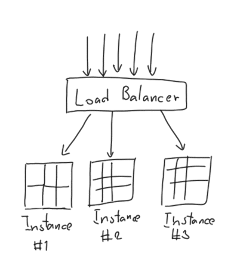
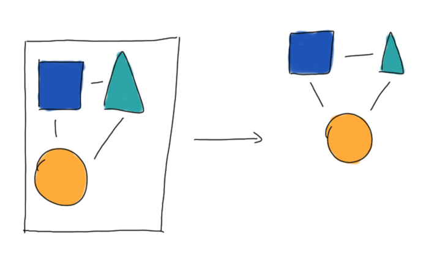
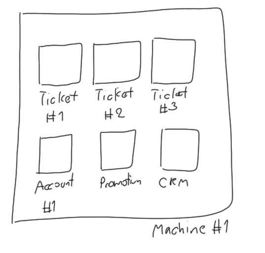

ในช่วงปีที่ผ่านมา หลาย ๆ เราน่าจะได้ยินคำว่า Microservice Architecture ผ่านหูกันมาไม่น้อยเลย ซึ่งตอนนี้สถาปัตยกรรมแบบนี้ก็ได้ถูกนำไป **Implement** จริงในบริษัท IT ใหญ่ ๆ หลาย ๆ เจ้ามาแล้ว ซึ่งตัวผมเองก็ได้ลง Production จริงกับสถาปัตยกรรมแบบนี้มาแล้วนิดนึง เลยอยากจะมาเล่าให้อ่านกันสักหน่อย

## เกริ่นกันก่อน
เมื่อก่อน เวลาเราจะพัฒนาระบบขึ้นมาสักตัว เราจะแบ่งระบบของเราออกมาอย่างง่าย ๆ เป็น 3 ส่วนคือ

* **Database or other Data service** หรือง่าย ๆ คือ ที่เก็บข้อมูล อาจจะใช้เป็น RDBMS หรือ No-SQL ก็ได้เช่นกัน
* **Backend** หรือคือ ระบบหลังบ้านที่คอยจัดการงานต่าง ๆ ให้เรา
* **Frontend** ที่จะเป็นหน้าตาคุยกับผู้ใช้ของเรานั่นเอง

ฉะนั้นขั้นตอนจะเป็นว่า **User ส่ง Request ผ่าน Frontend** ให้ไปทำงานสักอย่างหนึ่ง ทีนี้ **Frontend ก็จะส่งคำขอไปที่ Backend** เพื่อให้ Backend ไปทำงานมา ซึ่ง Backend ก็อาจจะต้องทำการเปลี่ยนแปลงข้อมูล จึงต้องไป**คุยกับ Database เพื่อทำการเปลี่ยนแปลง หรือเรียกข้อมูลขึ้นมา** แล้วส่งกลับไปที่ Backend และมันก็จะประมวลผล และส่งผลลัพธ์สุดท้ายกลับไปให้ Frontend เพื่อให้ User ดู

ทีนี้ ถ้าสมมุติว่า วันดีคืนดี App ของเรามีผู้ใช้เยอะขึ้นเรื่อย ๆ หรือเอาเคสที่ว่าถูกคนใน Pantip แชร์แล้วคน**กระหน่ำ**เข้าไปใช้ App ของเรา เราก็ต้อง Deploy App ของเราทั้ง App เพิ่มอีก Instance และใช้ **Load Balancer** เพื่อควบคุม Traffic

และอีกเคสคือ ถ้าเราเจอข้อผิดพลาดบางประการใน App ของเรา เราก็ต้องทำการแก้ไข และทำการ Publish (หรือเรียกในภาษาคอมพิวเตอร์ว่า Deploy) ขึ้นไปบน **Production Server ใหม่ทั้ง App** เลย ซึ่งอาจจะทำให้เกิด Downtime (ล่มไปแปบนึง) และความยุ่งยากระดับล้าน ได้เลย ถ้า Programmer วางแผนไม่ดีพอหรือมีประสบการณ์ไม่พอ

## Microservice Architecture คือพระเอกขี่ม้าขาวในงานนี้
Programmer ในปัจจุบันจึงเกิดคำถามว่า **"จะเป็นไปได้มั้ยที่เราจะ Scale และ Deploy ในส่วนที่ต้องใช้เยอะ หรือต้องการแก้ไขเท่านั้น ?"** คำว่า **Microservice Architecture** จึงเกิดขึ้นจากคำถามนี้

แนวคิดของ **Microservice** คือการที่เราแบ่ง **Functionality** ใน App ของเราออกมาเป็นส่วน ๆ **แยกออกไปเป็นแต่ละ Service** อาจจะมองภาพไม่ออก เราลองมาดูตัวอย่างกันดีกว่า

สมมุติว่า เราต้องออกแบบระบบของโรงหนังละกัน ทีนี้เราลองมาคิดกันว่า ในระบบของโรงหนังต้องมีอะไรบ้าง

* ระบบจองตั๋ว
* ระบบจัดการข้อมูลลูกค้า
* ระบบข้อมูลโปรโมชั่น
* ระบบบัญชี

จริง ๆ มันอาจจะมีอีก แต่เอาแค่นี้ก่อน วาดไม่ไหว หลังจากที่เราได้เห็น**ภาพรวมของ Reuqirement คร่าว ๆ** แล้ว เราลองมาออกแบบระบบนี้กันดีกว่า

ถ้าเป็นเมื่อก่อน เราคงจะคิดถึงว่า มันต้องมี **Database** ที่ใช้เก็บข้อมูลทั้งหมดไว้ น่าจะใช้ **RDBMS** ละกัน เพราะระบบการจองต้องอาศัย **ACID** (Atomicity, Consistency, Isolation, Durability) จาก **RDBMS** แล้ว Web Server เราจะทำยังไง ใช้ Apache หรือ Nginx ยังไงดี แล้วจะจัดการ Load ได้อย่างไรดีน้อออ

เราลองมาคิดให้มันเป็น **Microservice** กันดีกว่า ในตอนแรกผมอยากให้เราลองมอง **ความสัมพันธ์** ของแต่ละระบบที่เราจะสร้างก่อน ว่าใครต้องต่อกับใคร อาจจะเขียน **User Journey** ขึ้นมาคร่าว ๆ ว่า User เข้ามาแล้วต้องไปที่ไหนบ้าง เราจะได้รู้ความสัมพันธ์ว่า ใครต้องส่งข้อมูลอะไรให้ใคร จะได้เห็นข้อมูลที่วิ่งอยู่ในระบบ แล้วจึงค่อยคิดว่า ในแต่ละระบบจะใช้อะไรยังไง แล้วแต่ละระบบจะคุยกันได้ยังไง จะใช้ REST API คุยกันหรือยังไง อันนี้ก็ต้องอยู่ที่ดุลพินิจของคนออกแบบ

## ผลของการใช้ Microservice
จากการที่ได้ออกแบบระบบโดยใช้ **Microservice Architecture** เราจะเห็นได้ว่า แต่ละ Function หรือ Module ถูก**แยกออกจาก**กันอย่างชัดเจนมากขึ้น เวลาจะ Scale หรือ Deploy ก็ทำได้ง่ายขึ้นอีก เพราะเราไม่จำเป็นต้อง Deploy หรือ Scale **ทั้งระบบ** เราเพียงแค่ทำกับ Module ที่เราสนใจเท่านั้น

เช่นเราบอกว่า วันนี้ **Beauty and the Beast** เข้าฉาย (ขอพาดพิงหน่อยละกัน เขาไม่ได้จ่ายผมนะ ฮ่า ๆ) ลูกค้าจะเข้ามาจองตั๋วเราเยอะกว่าปกติ ฉะนั้นวิธีที่เราจะรับมือคือ เรา**เพิ่ม Instance ของแค่ส่วนที่เป็นระบบการรับจองตั๋วเท่านั้น** ไม่จำเป็นต้องเพิ่มให้ทั้งระบบ ทำให้เราประหยัดเงิน และตอบสนองต่อการเปลี่ยนแปลงได้รวดเร็วขึ้นอีกด้วย

ซึ่งในปัจจุบันมีระบบที่ช่วยเรา **Scale หรือ Deploy Instance** ได้อย่างง่ายดาย มากมายไปหมดเช่น **Docker Swarm** หรือจะเป็นพวก **DC/OS** ก็ได้เหมือนกัน นอกจากนั้นบน Cloud เองก็มี Service พวกนี้ให้เราใช้งานได้อีกด้วย (เดี๋ยวตอนหน้าจะพาไปดูการทำงานจริง ๆ กันเลยว่า ถ้าเราจะทำงานกับ Microservice บน Cloud ได้อย่างไร และมันทำให้การทำงานของเราง่ายขึ้นอย่างไรด้วย)

นอกจากนี้ ยังทำให้เราสามารถแบ่งงานกันไปพัฒนาได้ง่ายมากขึ้น โดยที่แต่ละ Module แทบไม่ต้องคิดเลยว่า จะใช้ภาษาอะไร จะใช้ Library อะไร ขอแค่ต่อกันให้ได้และมี **Backward Compatibility** และ **Connectivity** เท่านั้นเอง ฉะนั้น แต่ละทีมก็สามารถ Deploy หรือปู้ยี้ปู้ยำ หรือจะข่มขืน (ทำไมคำมันน่ากลัวจัง) กับ Module ของตัวเองได้เลย ไม่ต้องรอทีมอื่น ง่าย ๆ คือเป็นอิสระต่อกันมากขึ้นนั่นแหละ

**ย้ำ ! ตัวใหญ่ ๆ ว่า ถึงแม้จะเป็นอิสระต่อกันมากขึ้น แต่ก็ยังต้องตั้งมาตราฐานการคุยกันของแต่ละ Module และ Backward Compatibility นาจา**

## สรุป
**Microservice Architecture** เป็นแนวคิดการออกแบบโปรแกรมที่จะแบ่ง App ของเราออกมาเป็นส่วน ๆ แยกกันออกไปอย่างเด็ดขาด ที่จะทำให้การจัดการนั้นเป็นไปได้ง่ายขึ้น ต่างจากวิธีการออกแบบเดิม ๆ ที่จับยัดทุกอย่างเข้าด้วยกัน แต่ไม่ว่าจะใช้แบบไหนในการออกแบบ ทุกวิธีมันมีข้อดีและข้อเสียแตกต่างกันไป ก็หวังว่าผู้อ่านคงจะเป็นภาพมากขึ้น และนำไปปรับใช้ต่อไป สำหรับวันนี้ขอให้เขียนโค๊ตไร้บัค (ฮ่า ๆ) สวัสดีครับ

**ปล.** จริง ๆ ในเรื่องของการออกแบบ มันยังมีหลายวิธีในการออกแบบแต่ละ Module อีกด้วยนะ ถ้าใครสนใจสามารถศึกษาเพิ่มเติมได้เลยนะ หรือจะเอามาแชร์กันต่อเลยนะ เย้ !
