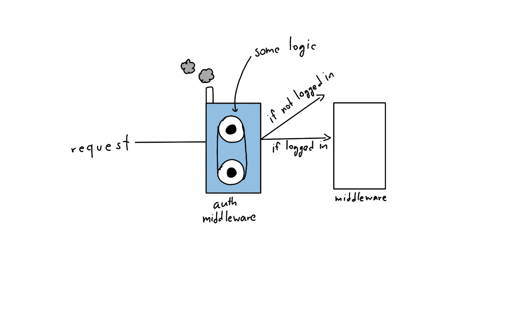

ผมเชื่อว่า ใครที่พึ่งเริ่มเรียน หรือหัดใช้ Laravel สิ่ง ๆ หนึ่งที่พวกเราหลาย ๆ คนไม่น่าอยากเข้าไปยุ่งในตอนนั้นคือ **Middleware** มันดูเป็นอะไรที่ ลึกลับ ซับซ้อน มาก ๆ สำหรับผมตอนแรก ๆ เลย แต่พอเราได้ลองมาดูจริง ๆ แล้ว มันแค่หลอกตาเราเท่านั้นแหละ ง่ายมาก ๆ เลย วันนี้เราจะลองมาดูกันว่า มันคืออะไร และ ทำอะไรได้บ้าง

## Middleware คืออะไร
ผมก็ไม่รู้จะนิยามมันว่ายังไงเหมือนกัน อธิบายให้มนุษย์เข้าใจ มันคือ **ตัวกรอง** ในเครื่องกรองน้ำเลย ในที่นี้มันทำหน้าที่ในการกรอง Request ต่าง ๆ ที่ User กดไป กดมา อยู่ใน App ของเรา

## หลักการทำงาน(คร่าว ๆ ?)
เราลองมาดูการทำงานแบบผิว ๆ กัน ก่อนที่เราจะเข้าไปดูว่าโค๊ตจริง ๆ นั้นเป็นอย่างไร
ให้เรานึกภาพว่า **Middleware** แต่ละชั้นคือ **ชั้นของหัวหอม**, ปลายทางคือ **ชั้นในสุด** ของหัวหอมละกัน และตัวเราเป็น **เข็ม** ที่เจาะเข้าไป

วิธีการทำงานของมันนั้นง่ายมาก ๆ ถ้าเราต้องการเข้าไปหา ชั้นในสุด เราก็ต้องเจาะจากข้างนอกเรื่อย ๆ หรือก็คือ การผ่าน Middleware ไปทีละชั้นนั่นเอง ซึ่งในตัวมันเองก็จะมี Logic เพื่อเช็คเงื่อนไขต่าง ๆ ก็ว่าไป ตามสิ่งที่มันต้องทำ

ตัวอย่างเช่น **Auth** ที่ Laravel เตรียมมาให้ หน้าที่ของมันนั้นเรียบง่ายมาก แค่เช็คว่า User Login หรือยัง ถ้า Login แล้วก็ให้ผ่านไปที่ Middleware ตัวต่อไป ถ้ายัง ก็ให้โยนไปหน้า Login เท่านั้นเลย

## ลองดูตัว Code กัน
**Middleware** จะอาศัยอยู่ใน **App/Http/Middleware** ถ้าเราเข้าไป เราจะเห็นไฟล์อยู่ 4 ไฟล์ พวกนั้นก็คือ Middleware ที่ Laravel นั้นเตรียมมาให้
หลัก ๆ แล้ว ส่วนการทำงานของ Middleware นั้นจะมีอยู่แค่ส่วนเดียวนั้นก็คือ Method ชื่อว่า **handle**
ถ้าเราลองเข้าไปดู Authenticate Middleware เราจะเห็นว่าใน Class นั้นมี **handle Method** อยู่แค่อันเดียวเท่านั้น
สิ่งที่มันรับเข้ามาคือ **Request** ค่าต่าง ๆ ที่ถูกส่งเข้ามา อันนี้น่าจะรู้อยู่แล้ว และ **Closure** ที่ทำหน้าที่เป็นเหมือน Stack ที่จะบอกว่า หอมชั้นต่อไปคือใครนั่นเอง
ฉะนั้นการเราในบรรทัดสุดท้าย ที่ใน Code เขียนว่า

    return $next($request);

มันคือการโยนค่าไปที่หัวหอม หรือ Middleware ชั้นต่อไปนั่นเอง ส่วนที่เหลือ ก็จะเป็น Logic ต่าง ๆ ก็ว่ากันไปว่าจะทำอะไร อยู่ที่ Middleware ตัวนั้น ๆ

## การ Register Middleware
อยู่ ๆ การที่เราสร้างไฟล์แล้วเขียนขึ้นมาดื้อ ๆ เลยก็ไม่ได้ มันจะไม่ทำงาน วิธีคือ เราจะต้องทำการ **Register** มันก่อน เหมือนเป็นการบอกว่า เราจะใช้ Middleware ตัวไหนบ้าง
ซึ่งการ Register นั้นง่ายมาก ๆ เพียงแค่เราเข้าไปเติมบอกมันในไฟล์ **Kernel.php** ที่อยู่ใน **App/Http** เมื่อเราเข้ามาในไฟล์แล้ว อยากให้สนใจที่ Array 3 ตัว มันจะต่างกัน ยังไง ลองไปทีละดูกัน
ตัวแรก เราเรียกมันว่า **Global Middleware** เป็นส่วนที่บอก Laravel ว่า ก่อนจะเรียก Request ทุกอย่าง จะต้องผ่าน Middleware พวกนี้เสมอ ซึ่งเราก็สามารถสร้าง แล้วเอามาเติมได้เช่นกัน

    protected $middleware = [
            \Illuminate\Foundation\Http\Middleware\CheckForMaintenanceMode::class,
        ];

ตัวถัดไป เราเรียกมันว่า **Middleware Group** เป็นการแยกกันเลยว่า ถ้า Request ที่เรียกมานั้นเป็น Web ให้มันรันอะไรบ้าง และถ้าเป็น API ให้รันอะไรบ้างก็เติมลงไปในนี้ได้เลย เช่น **StartSession** ที่เป็นการเปิด Session เวลาเราเรียก API เราไม่จำเป็นต้องใช้ ฉะนั้นบนฝั่งของ API ก็ไม่จำเป็นต้องเรียกเปิดนั่นเอง
พูดง่าย ๆ คือ มันจะแบ่งออกเป็น 2 ส่วนคือ ส่วนที่ Web จะต้องเรียกเสมอ และอีกส่วนคือส่วนที่ API จะต้องเรียกเสมอ **แยกกัน**

    protected $middlewareGroups = [
            'web' => [
                \App\Http\Middleware\EncryptCookies::class,
                \Illuminate\Cookie\Middleware\AddQueuedCookiesToResponse::class,
                \Illuminate\Session\Middleware\StartSession::class,
                \Illuminate\View\Middleware\ShareErrorsFromSession::class,
                \App\Http\Middleware\VerifyCsrfToken::class,
            ],

            'api' => [
                'throttle:60,1',
            ],
        ];

และสุดท้ายคือ **Route Middleware** ตัวนี้ไม่ใช่ว่า เรา Register มันในนี้แล้วจะใช้ได้ทันทีนะ ถ้าเราจะใช้ เราต้องเข้าไปกำหนดใน Route ด้วยว่า เราจะใช้นะ เราถึงต้องกำหนดชื่อให้มันนั่นเองเช่น **auth** ที่เป็นการเช็คในเรื่องของ Authenticate ต่าง ๆ เป็นต้น

    protected $routeMiddleware = [
            'auth' => \App\Http\Middleware\Authenticate::class,
            'auth.basic' => \Illuminate\Auth\Middleware\AuthenticateWithBasicAuth::class,
            'can' => \Illuminate\Foundation\Http\Middleware\Authorize::class,
            'guest' => \App\Http\Middleware\RedirectIfAuthenticated::class,
            'throttle' => \Illuminate\Routing\Middleware\ThrottleRequests::class,
        ];

ซึ่งวิธีการใช้นั้นง่ายมาก ๆ สมมุติว่า เรามี Route ที่หน้าแรกละกัน แล้วเราต้องการใช้ **auth** เราก็แค่สั่งไปว่า

    Route::get('/'['middleware' => 'auth', 'uses' => function(){

    });

แค่นี้เลย ก่อนที่มันจะเข้าไปเรียก Function ใน Route มันก็จะเข้าไปใน **auth** ก่อนนั่นเอง
หรืออีกวิธี เราสามารถควบคุมในระดับ Controller ได้ด้วย โดยการไปใส่ไว้ใน Constructor ของ Controller นั้น ๆ ได้ด้วย
ถ้าเรารู้จัก Constructor มันคือ Method แรกที่จะถูกเรียกทุกครั้งเวลาเราสร้าง Object จาก Class นั้น ๆ ฉะนั้นถ้าเราเอาไปใส่ไว้ในนั้นก็เป็นเหมือนกับการบังคับเรียกทุกครั้งที่เราเข้าถึง Controller ตัวนั้น ๆ นั่นเอง เช่น

        public function __construct()
        {
          $this->middleware('auth');
        }

เขียนมาอาจจะ งง ว่ามันเกี่ยวกันยังไง หรือว่า มันจะเรียกอันไหนบ้าง สรุปคือ Laravel มันจะเรียกทุกชนิดเลย ตามประเภทของ Request ที่เข้ามา

## การสร้าง Middleware ใช้เอง
นอกจากที่เราจะใช้จากที่ Laravel ให้เรามาแล้ว เราสามารถที่จะสร้างมันขึ้นมาใช้เองได้้ด้วยวิธีคือ เรียกคำสั่งด้านล่างนี้ใน Command Line ได้เลย

    php artisan make:middleware ชื่ออะไรก็แล้วแต่

เราก็จะได้ไฟล์ตัวนึงขึ้นมา เราก็เขียน Logic ที่เราต้องการลงใน handle method ได้เลย และสุดท้าย **ห้ามลืม** ต้องไป Register ลงใน Kernel ด้วย ไม่งั้นมันจะไม่รันนะ

## สรุป
ในบทความนี้อาจจะไม่ได้ลงลึกอะไรมากเท่าไหร่ แต่ก็เพียงพอที่จะทำให้เราได้ไปรู้จักกับสิ่งเล็ก ๆ ที่เรียกว่า Middleware คร่าว ๆ รวม ๆ แล้วมันเป็น ตัวกรอง Request ต่าง ๆ ที่เข้ามา ผ่านเข้าไปทีละชั้น ๆ เรื่อย ๆ เหมือนหัวหอม
โดยเราสามารถสร้างมันขึ้นมา และเขียน Logic ต่าง ๆ ลงไปตามที่เราต้องการได้เลยเหมาะสำหรับ สิ่งที่เราต้องการจะเรียกก่อนที่จะให้ Controller เริ่มทำงาน อาจจะเป็นการตรวจสอบ หรือ การทำงานต่าง ๆ ก็ว่ากันไปตามที่ใจต้องการ
โพสต์นี้ก็เขียนไม่ยาวมาก เพราะเราไม่ได้เจาะลึกอะไร แต่ถ้าอยากให้เขียนเจาะลึกก็ Comment เข้ามา เดี๋ยวจะเขียนให้อ่านกัน หรือ ถ้าใครมีคำถามอะไรสงสัยสามารถ Comment ด้านล่างได้เลย ไม่กัด ฉีดยาแล้ว เดี๋ยวจะเข้ามาตอบให้นะครับ!
