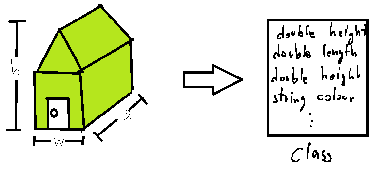
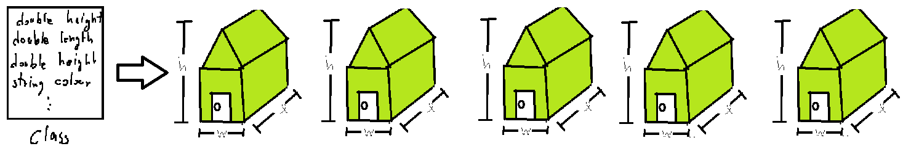

ช่วงนี้ก็หาย ๆ กันไป ไม่มีเวลาเขียนจริง ๆ ประกอบกับช่วงนี้น้อง ๆ ที่คณะกำลังเรียน OOP พอดีเลยอยากจะขอยกสรุปที่เคยเขียนเมื่อสักปีก่อนมาเรียบเรียง ปัดฝุ่นใหม่ ให้เข้าใจมากขึ้น (จริง ๆ ก็ไม่ค่อยเปลี่ยนอะไรหรอก แค่อยากเอามาเขียนเท่านั้นแหละ) และด้วยความที่มันละเอียดขึ้น เนื้อหาแน่นมาก ๆ จึงต้องขอแบ่งมันออกเป็นตอน ๆ ล่ะกัน เพื่อความสะดวกในการอ่าน (รูปภาพปลากรอบนี่ห้ามด่านะเฟ้ย วาดเอง จาก Paint อายแรง)
ในบทความนี้ผมจะมาสอนการสร้างบ้านกันก่อน โดยจะค่อย ๆ อธิบายไปทีล่ะคำ เพื่อให้เข้าใจ ความหมาย และการใช้งานจริง มากขึ้น เพราะในปัจจุบัน ผมสังเกต หลาย ๆ คนเข้าใจว่า อันนี้คืออะไร แต่ไม่รู้ว่า เอาไปทำอะไรได้บ้าง (Adapt ไม่ได้นั่นเอง) และถ้ารูปไม่สวยนี่ห้ามด่า เพราะฝีมือการวาดรูปผมมันห่วยสิ้นดี เรามาเริ่มกันเลยดีกว่า

#### Class & Object
ก่อนอื่น เราต้องมาดูกันก่อนว่า ปกติ ถ้าเราจะอธิบายสิ่งของสักอย่าง มันต้องมีอะไรบ้าง

* **คุณสมบัติ** - รูปร่าง สี ขนาด อะไรทำนองนั้น เช่นกรรไกร อันนี้มีสีส้ม ขนาดสัก 23 cm. ในการเขียนโปรแกรมก็เช่นกัน เอาไว้แสดงคุณสมบัติ และลักษณะเช่นเดียวกัน เราจะเรียกแต่ล่ะคุณสมบัติว่า **Attribute**
* **สิ่งที่มันทำได้ (นึกไม่ออกจริง ๆ ว่าภาษาไทยใช้คำว่าอะไรดี)** - เช่นถ้าเราซื้อกรรไกรมา เราก็สามารถนำกรรไกรมาตัดได้ และมีคู่มืออธิบายอีกด้วย หรือจะเป็นกาวที่สามารถติดสิ่งของที่พังเข้าด้วยกันได้ โดยเราสามารถติดกับของบางอย่างเท่านั้น เราจะอธิบายว่าของสิ่งนั้นมันทำอะไรได้ และต้องทำยังไง โดยการใช้ **Method** นั่นเอง
กลับมาที่บ้านของเรากัน เราลองมาอธิบายกันดีกว่า ว่าบ้านต้องมีคุณสมบัติ และทำอะไรบ้าง เริ่มต้นที่คุณสมบัติก่อนดีกว่า (เอาคร่าว ๆ ล่ะกัน เดี๋ยวจะเยอะ)

* ความกว้างของบ้าน
* ความยาว
* ความสูง
* สี
* จำนวนห้อง
และมาที่สิ่งที่บ้านทำได้กัน

* ทางสีบ้านใหม่ได้
* ล๊อค/ปลดล๊อก บ้านได้
และเราก็ได้คุณสมบัติ และสิ่งที่มันทำได้แล้ว แต่ลืมอะไรไปรึเปล่า เช่นเราบอกว่า บ้านมีสีเขียว จำนวน 2 ชั้น ขนาด 2x3 เมตร (บ้านเล็กเนอะ บ้านหรือรังมดเนี่ย) และมี 4 ห้อง สิ่งที่เราลืมคือ การบอกว่า สิ่งเหล่านี้มันคือบ้านนะ ซึ่งเราจะถือว่า บ้าน เป็น **Class** ก็ได้ เพราะว่า บ้านมีคุณสมบัติ และยังมีสิ่งที่ทำได้ เพราะฉะนั้น Class จะใช้แสดงถึงสิ่งของที่อาจจะอยู่ในรูปของนามธรรม หรือรูปธรรมก็ได้ โดยมันก็จะประกอบไปด้วย Attribute และ Method เหมือนกับ บ้าน ที่พึ่งยกตัวอย่างไปเมื่อครู่
แต่ทั้งหมดที่ว่ามามันก็เป็นแค่แบบแปลนอยู่ในกระดาษทั้งนั้น ถึงตอนนี้เราได้คร่าว ๆ แล้วว่าบ้านของเรามันจะเป็นแนวไหน ขนาดเท่าไหร่ สีอะไร เป็นต้น ซึ่งตอนนี้ผมจะเป็นเจ้าของหมู่บ้านล่ะกัน ที่ได้แบบแปลนบ้าน เพื่อที่จะสร้างบ้านมา เพราะฉะนั้นบ้านที่สร้างจากแบบแปลนเดียวกันจะมี ลักษณะหน้าตาที่เหมือนกันนั่นเอง

สมมุติว่า ผมนำแบบแปลนที่ได้มา เอามาสร้างบ้านสัก 5 หลัง ลองดูตามภาพด้านล่างได้ มันจะออกมาเหมือนกัน 100% เลย นั่นเพราะเราใช้แบบแปลนเดียวกันในการสร้างนั่นเอง โดยบ้านที่สร้างเราจะเรียกมันว่า **Object**

แต่ถามว่า วันใดวันนึงมีเจ้าของมาอยู่ที่บ้านหลังที่ 3 แล้วเจ้าของบ้านอยากจะเปลี่ยนสีบ้านของตัวเองเป็นสีฟ้า ถามว่า บ้านทุกหลังจำเป็นมั้ยที่ต้องเปลี่ยนเป็นสีเขียวตามบ้านหลังที่ 3 คำตอบคือ **ไม่** ลองคิดดูในโลกแห่งความเป็นจริงนะครับ ถ้าเราสร้างของชิ้นนั้น ๆ มาแล้ว แต่พอเราจะเปลี่ยนคุณสมบัติหรือเพิ่มอะไรไปในนั้น จำเป็นมั้ยที่ของแบบเดียวกันที่เหลือต้องเปลี่ยนตาม ในการเขียนโปรแกรมก็ะเช่นกัน ถ้า A เปลี่ยนค่า ค่าใน B ก็ยังจะเท่าเดิม ไม่มีการเปลี่ยนแปลง ใด ๆ
ก่อนจะไปที่อื่นกันต่อ สรุปก่อนว่า ก่อนนี่ได้เรียนรู้ไปแล้วว่า Class คือแบบแปลน หรือพิมพ์เขียวที่คอยอธิบายลักษณะ (Attribute) และการใช้งาน (Method) ของสิ่ง ๆ นั้น
เรามาลอง Implement มันลงในโปรแกรมจริงกันเลยดีกว่า โดยภาษาที่ใช้จะเป็น Java นะครับ เพราะคนเขียนชอบ โอเคนะ ! ห้ามเถียง !

    public class Home
    {
        //Attribute
        double width, length, height;
        String colour;
        int noOfRoom;

        //Method
        public void setColour (Colour newCol)
        {
           this.colour = newCol;
        }

        public void lock () {System.out.println("Locked");}
        public void unlock () {System.out.println("Unlocked");}
    }

**Syntax : ในภาษา Java เวลาเราเข้าถึงค่าของ Attribute จากภายใน (ส่วนภายนอกค่อยว่ากันมันมีรายละเอียดอยู่เยอะ) Object เราสามารถทำได้โดยการเรียกชื่อได้โดยตรงเลย หรือเราจะใช้คำว่า this. แล้วตามด้วยชื่อของ Attribute ก็ได้เช่นกัน แต่แนะนำให้ใช้ this. ต่อหน้าไปด้วยจะได้ชิน เพราะมันจะมีอีกคำให้ใช้ (ไว้ว่ากันทีหลังไกล ๆ เลย)**
แต่ความจริง ถ้าเราพูดว่าบ้าน เรานึกถึงอะไร (ก็บ้านน่ะสิ ถามได้ !) เราก็นึกถึงส่วนประกอบของบ้านใช่มั้ยครับ เช่น บ้านมีกำแพง, หลังคา, ประตู และหน้าต่าง เพื่อความสั้นกระชับ (เพราะเนื้อหาที่เตรียมมาเขียนนี่ยาวมาก ๆ) จะขอยกตัวอย่างแค่บ้านมีประตูก่อนล่ะกัน ประตู แน่นอนว่า ประตูก็ต้องมี ลักษณะ เช่น สี ขนาดและความสูง และสิ่งที่มันทำได้เช่น ล๊อก หรือ ปลดล๊อคได้ เราลองมา Implement Class Door กันดีกว่า

    public class Door
    {
        String colour;
        boolean isLocked; //เก็บสถานะของประตู Locked or Unlocked

        public void lock () {this.isLocked = true;}
        public void unlock () {this.isLocked = false;}
    }

หลังจากที่เราได้ Class Door กันไปแล้ว เราก็จะเอาประตูที่เราสร้างมาประกอบเข้ากับตัวบ้านกันดีกว่า ซึ่งการที่เราจะติดตั้งประตู เราก็คงทำเองไม่ได้แน่นอน เพราะเราไม่ใช่ช่าง เพราะฉะนั้น เราต้องไปเอาช่างมาช่วยดีกว่า ช่างคนนี้ชื่อว่า **Constructor** ช่างคนนี้จริง ๆ แล้ว ถ้าเราไม่ได้ประกาศลงไปในโค๊ต เขาก็มีตัวตนนะ (พวกแกนี่เย็นชาจริง ๆ) แต่เราก็ยืนเปื่อย ไม่ทำอะไรเลย เพราะเราไม่ได้สั่งไง แต่ตอนนี้ เราจะสั่งเขา ให้มาติดตั้งประตูให้ดีกว่า
และนอกจากนั้น การล๊อกบ้าน ก็ต้องเปลี่ยนไปเป็นหน้าที่ของประตู ฉะนั้นเราก็ต้องแก้ Method ที่ชื่อว่า Lock และ Unlock ด้วยเช่นกัน เพื่อให้มันไปล๊อกประตูหน้าบ้าน

    public class Home
    {
        //Attribute
        double width, length, height;
        String colour;
        int noOfRoom;
        Door frontDoor;

        //Constructor
        public Home ()
        {
           frontDoor = new Door();
        }

        //Method
        public void lock () {this.frontDoor.lock();}
        public void unlock () {this.frontDoor.unlock();}
    }

**Syntax : สำหรับการแปลงร่างจากแบบแปลน (Class) มาเป็นของจริง ๆ (Object) เราสามารถทำได้โดยการ new มันขึ้นมา เช่น frontDoor = new Door(); เป็นการบอกว่า ให้โปรแกรมมันไปสร้างประตูมา และเอาให้กับ frontDoor เป็นตัวเก็บไว้นั่นเอง เพราะฉะนั้น คราวหน้าเวลาจะสร้าง Class ก็ต้องใช้ Pattern นี้เสมอนะ**
นี่ที บ้าน ที่เราวางแปลนไว้ ก็น่าจะพร้อมแล้วเราจะเอามาลองสร้างสักหน่อย เราจะทำการสร้างลงไปใน Class ที่ชื่อว่า TesterVillage ล่ะกัน

    public class TesterVillage
    {
        public static void main (String [] args)
        {
          Home myHome = Home ();
        }
    }

**Syntax : method main เป็น method ประเภทหนึ่ง แต่มันมีความพิเศษอยู่ที่ว่า เป็น method ที่จะถูกเรียก และทำงานที่เป็นที่แรกเสมอ เวลาเราเรันโปรแกรม ซึ่งวิธีการเขียน จะเป็นกฏของภาษาเลย สามารถเขียนตามนี้ได้เลย ยกเว้นที่อยู่ข้างในนะ ข้างในเป็นการสร้าง Object นะ เอามาให้ลองสร้างเฉย ๆ**
คิดว่าบ้านที่เราสร้างออกมาเป็นยังไงบ้าง มีสีอะไร หรือความกว้าง ยาวสูงเท่าไหร่ ตอบไม่ได้เลย เราลองมากำหนดกันดูหน่อยดีกว่า

    public class TesterVillage
    {
        public static void main (String [] args)
        {
          Home myHome = Home ();
          myHome.colour = "green";
        }
    }

**Syntax : จริง ๆ เราสามารถเข้าถึง Attribute ของตัวแปรนั้น ๆ ได้โดยตรงเลยนะ แม้จะเป็นนอกตัวแปรก็ตาม แต่.. อะไรนั้น อ่านต่อไปได้เลย**
วิธีการกำหนดตัวแปรแบบนี้ เป็นตัวอย่างที่ไม่ดีมาก ๆ ใน OOP นั้นจะมีกฏอยู่ข้อนึงเราเรียกว่า **Encapsulation โดยกฏข้อนี้บอกไว้ว่า ห้ามเราเข้าถึง Attribute ที่ไม่ได้อยู่ใน Class ตัวเองเด็ดขาด  **แล้วถามว่าจะทำยังไงดีล่ะ วิธีง่ายนิดเดียว ถ้าเดินเข้าไปเอาเลยไม่ได้ เราก็ต้องใช้เส้นสายคนในกันหน่อย โดยเราจะให้คนที่เข้าได้ไปเอานั่นเอง หรือถ้าแปลเป็นภาษาโปรแกรม คือเราจะสร้าง Method ตัวนึงเป็นผู้เอามาให้นั่นเอง เพราะกฏห้ามเราเรียก Attribute โดยตรง เราก็เรียกผ่าน Method ก็ไม่ผิดนิ ! ฉะนั้นเราจะมาสร้าง Method setColour ใน Class Home กัน

    public class Home
    {
        //Attribute
        double width, length, height;
        String colour;
        int noOfRoom;
        Door frontDoor;

        //Constructor
        public Home ()
        {
           frontDoor = new Door();
        }

        //Method
        public void setColour (Colour newCol)
        {
           this.colour = newCol;
        }

        public void lock () {this.frontDoor.lock();}
        public void unlock () {this.frontDoor.unlock();}
    }

ตอนนี้เราก็ได้ Method ที่จะช่วยเราทาสีบ้านของเราแล้ว ทีนี้เราก็สามารถเรียก Method เพื่อทาสีบ้านผ่าน TesterVillage ได้แล้ว

    public class TesterVillage
    {
        public static void main (String [] args)
        {
          Home myHome = Home ();
          myHome.setColour("green");
        }
    }

เรามาสรุปสิ่งที่เราได้รู้ในวันนี้นั่นคือ คำว่า Class & Object ซึ่ง Class มันก็คือแบบแปลน คือพิมพ์เขียว และ Object มันก็คือ ของจริง ๆ ที่สร้างมาจากแบบแปลนนั้น ๆ นั่นเอง ซึ่งในการที่จะเป็น Class หรือแบบแปลนได้ เราก็ต้องมากำหนดมันว่า มันหน้าตาเป็นยังไง หรือ ทำอะไรได้บ้างอีก นั่นก็คือ Method & Attribute และเรื่องสุดท้ายนั่นคือ กฏข้อแรกของ OOP นั่นคือ Encapsulation ที่ห้ามไม่ให้เข้าถึงตัวแปร หรือ Attribute ข้าม Class และ Object กันอย่างเด็ดขาด และนั่นก็คือเรื่องของวันนี้ ตอนหน้าเราจะมาดูกันว่า เราจะป้องกัน ไม่ให้คนอื่นเข้าถึงของในบ้านของเราได้อย่างไร ติดตามต่อได้
