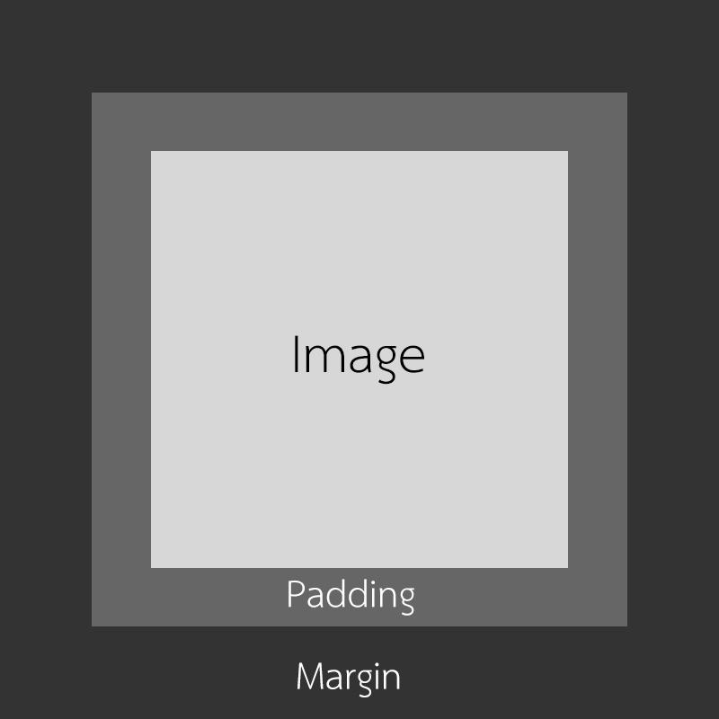

ตอนนี้ก็หายไปหลายวันอยู่ ช่วงนี้กำลังเดินทัวร์ถ่ายรูปเล่นอยู่ เลยไม่ค่อยมีเวลามานั่งเขียน Blog เลย เสียจุย.. เข้าเรื่องกันดีกว่า วันนี้เราจะมาพูดถึงเรื่องที่มือใหม่หลาย ๆ คน งง กันนั่นคือ Padding กับ Margin
Padding กับ Margin ใช้ทำอะไร ?
ทั้ง 2 อย่างนี้มันเอาไว้จัดขนาดของวัตถุเราได้เหมือนกัน แต่ก่อนจะไปถึงเรื่องความแตกต่าง เราต้องมาเข้าใจถึงเรื่องของการสร้างกล่องหรือ Box Model กันก่อนเลย

จะเห็นได้ว่า ในความเป็นจริงเบื้องหลังของ Object สักอันนึงที่วางอยู่ในหน้าเว็บหรือ App ของเรานั้น ไม่ได้มีแค่ตัวมันที่เรามองเห็นได้เท่านั้น นอกจากตัว Object แล้วมันยังมีทั้ง Padding และ Margin เข้ามาเกี่ยวข้องอีกด้วย

## Padding คืออะไร?
**ให้เรามองว่า Object (Text หรือแม้กะทั่ง Image) ทุก ๆ อย่างมีกรอบครอบมันอยู่อีกชั้นนึง เหมือนกำแพงบ้านของเรา** แต่โดยปกติแล้ว ขนาดของกรอบจะเท่ากับขนาดของ Object ของเราแป๊ะเลย ทำให้เราไม่เห็นกรอบของมัน แต่ถ้าเรา**เพิ่ม Padding เข้าไป มันก็คือการขยายกรอบที่เอาไว้ครอบตัว Object ของเรานั่นเอง**

## Margin คืออะไร ?
**ถ้าเมื่อกี้ Padding คือการขยาย ขนาดของกำแพงบ้านเรา Margin ก็คือการขยาย รั้วบ้านเรา** นึกภาพง่าย ๆ ว่า เรามีบ้านอยู่หลังนึง ถ้าเราไม่มีรั้ว บ้านข้าง ๆ ก็จะมาสร้างติดบ้านเราได้เลย แต่ถ้าเรามีรั้ว บ้านข้าง ๆ ก็จะไม่สามารถสร้างทับรั้วเราได้ ทำให้บ้านเรามันไม่ดูอึดอัด ในหน้าจอก็เหมือนกัน ถ้าเราเติม Margin เข้าไปจะเป็นการบอกว่า Object นี้จะต้องอยู่ห่าง Object ข้าง ๆ เท่าไหร่ก็ว่ากันไปตามที่เราใส่เท่านั้นเอง

## สรุป
สรุปแล้ว หลักการง่าย ๆ ในการเลือกคำสั่งระหว่าง Padding และ Margin คือ ถ้าเราต้องการเพิ่มขนาดของกล่องให้เราเลือกใช้ Padding แต่กลับกัน ถ้าเราอยากจะเว้นระยะห่างระหว่าง Object ข้าง ๆ แล้วล่ะก็ ให้เราเลือกใช้ Margin นั่นเอง
