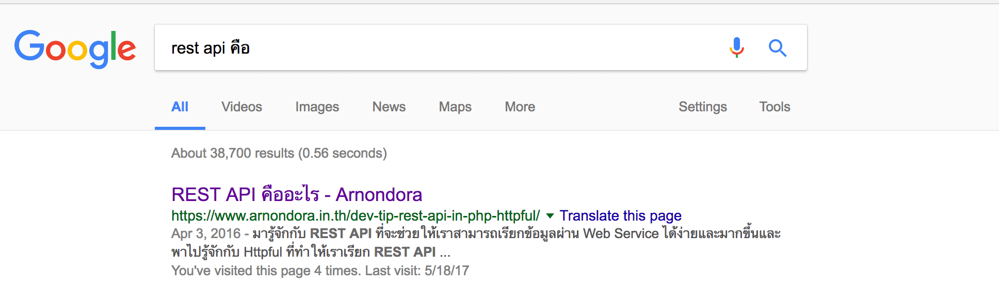
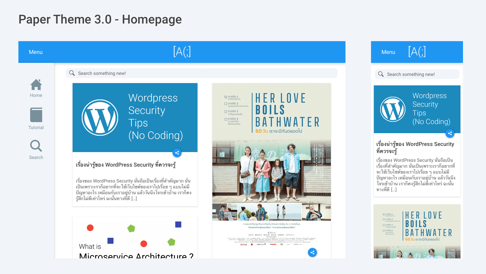
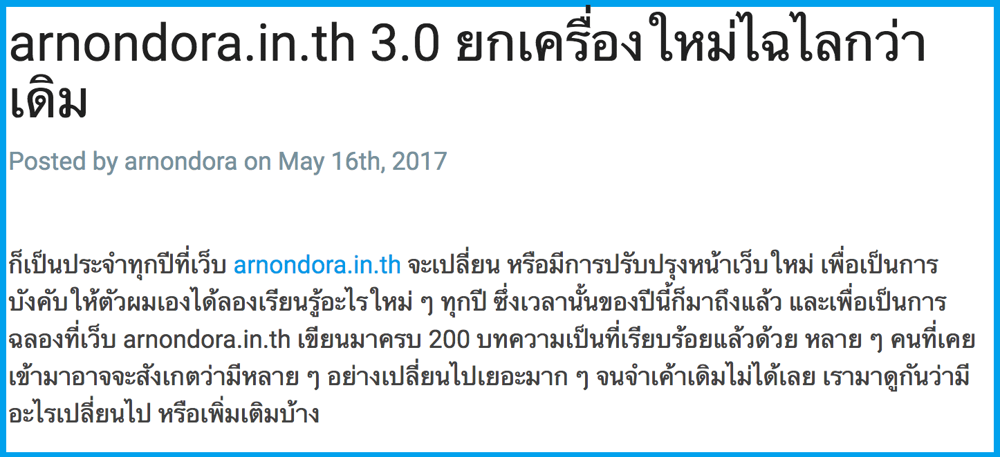
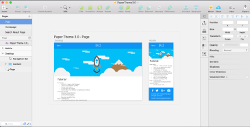
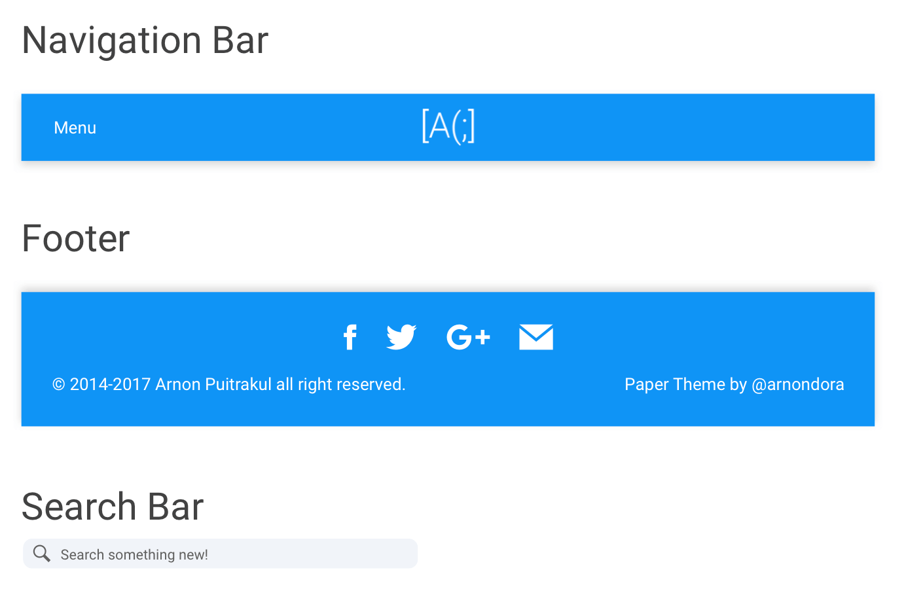
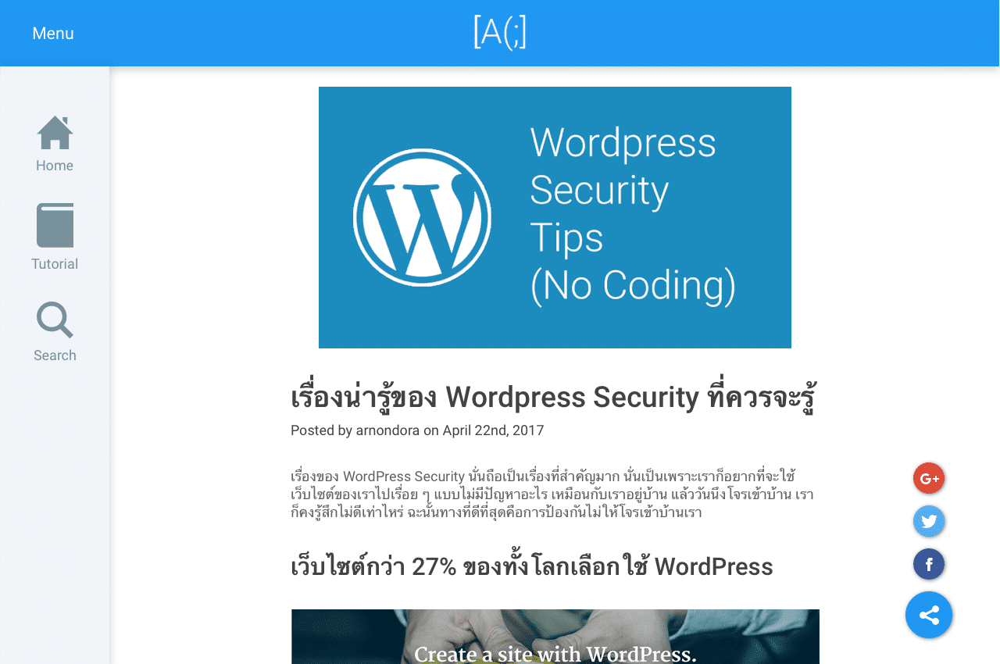

มาตามสัญญาที่จะเล่าเรื่องว่าเจ้า PaperTheme ที่กำลังใช้นี้มันมีที่มาอย่างไร ก็จะค่อย ๆ เล่าไปทีละ Process เรื่อย ๆ ละกัน ต้องเกริ่นก่อนว่า เว็บนี้จะมีการเปลี่ยน หรืออัพเกรดใหม่ในทุกช่วงเดือน พฤษภาคม ถึง มิถุนายนของทุกปี

จุดประสงค์ที่ทำแบบนี้เป็นเพราะว่า อยากให้ตัวเองนั้นได้เรียนรู้อะไรใหม่ ๆ อย่างน้อยก็สักเรื่องในปีนั้น ๆ อาทิเช่นปีนี้ ผมขอยกให้เป็นปีแห่ง Frontend เพราะที่ผ่านมาทำอยู่ทางฝั่ง Backend และ Database Design ซะเป็นส่วนใหญ่ เลยอยากที่จะมาเรียนอีกฝั่งหนึ่งที่เป็นเหมือนเขาวงกตในปัจจุบันนั่นคือ Frontend นั่นเอง

## Understanding users

นอกเรื่องมาพอสมควรละ เข้าเรื่องกันเลยดีกว่า ก่อนที่จะได้ Design ของ Theme นี้ออกมา ผมได้ลองศึกษาพฤติกรรมของคนที่เข้ามาอ่านเว็บ ว่าเข้าไปที่หน้าไหนบ้าง อย่างไร แล้วออกไปที่หน้าไหน หรือพูดในศัพท์เทคนิคคือ **กำลังสร้าง** **User Persona** ขึ้นมาคร่าว ๆ โดยใช้ **Google Analysis** ที่ผมฝังไว้ในเว็บเพื่อเก็บสถิติของผู้เข้าเว็บ และมี Tools อีกนิดหน่อยเพื่อให้ได้ข้อมูลมา

พบว่าส่วนใหญ่มักจะเข้ามาผ่าน Search Engine (เว็บเราอยู่บนอันดับต้น ๆ ของ Google เมื่อไหร่ก็ไม่รู้ฮ่า ๆ) ซะเป็นส่วนใหญ่ แล้วจะเข้ามาอ่านสิ่งที่ตัวเองหา แล้วก็ออกไป หรือเปิดเข้าไปใน Tag ที่ตัวเองสนใจต่อ ฉะนั้น เรื่องของการเลือก และแสดงผล Tag และ Category ถือเป็นเรื่องที่สำคัญมาก

แล้วทำให้สงสัยต่อว่า แล้วจริง ๆ แล้ว **Tag หรือ Category ที่คนน่าจะสนใจมากกว่ากัน** คำตอบนั้นอยู่ที่ **การเข้ามาของผู้อ่าน** นั่นคือส่วนใหญ่จะเข้าผ่าน **Search Engine** เนื่องจากคนมักจะค้นหาสิ่งที่ตัวเองอยากรู้ เช่นบอกว่า อยากรู้เกี่ยวกับ Restful ว่าจริง ๆ แล้วมันคืออะไร คนอาจจะค้นหาว่า **"Rest API คือ"** ผลการค้นหาก็จะเป็นดั่งภาพด้านบน ที่เว็บของเราอยู่อันดับแรก ซึ่งสอดคล้องกับสถิติการเข้าดูหน้า [\[Dev Tip\] เรียก REST API ง่าย ๆ บน PHP ด้วย Httpful][2] ที่ถูกเรียกเป็นอันดับหนึ่ง

จากข้อมูลใน Google Analytic ในส่วนของ Behavior Flow พบว่าผู้อ่านมักจะเข้ามาในหน้าของบทความโดยตรง และส่วนใหญ่ก็จะออกในหน้าบทความไปเลย ซึ่งทำให้สามารถสรุปได้ว่า ผู้อ่านส่วนใหญ่เข้ามาโดยมีเรื่องที่ตัวเองนั้นสนใจอยู่แล้ว ไม่ใช่อยู่ ๆ จะเข้าก็เข้ามา เหมือนเว็บข่าว

นอกจากเราจะออกแบบ Theme ได้เข้าพฤติกรรมของผู้อ่านแล้ว เรายังต้องเข้าใจว่าผู้อ่านส่วนใหญ่ของเราเข้าเว็บไซต์ด้วยอะไร ซึ่งข้อมูลที่ได้นั่นบอกว่า ผู้อ่านของเรากว่า 59% เข้าเว็บผ่าน Windows โดยใช้ Google Chrome เป็น Web Browser และอันดับถัดไปเป็น Android เข้าผ่าน Google Chrome ที่มีหน้าจอที่ค่อนข้างเล็ก

ฉะนั้นจากข้อมูลทั้งหมด สามารถทำให้เราเข้าใช้ผู้อ่านของเว็บเราได้แล้วว่า **ผู้อ่านมักจะเป็นคนที่ Search หา และเข้ามาผ่าน Search Engine ที่มีเรื่องที่ตนเองต้องการอยู่แล้ว ไม่ใช่เข้ามาหาอะไรอ่านไปเรื่อย และที่มักจะเข้าผ่านเครื่อง PC ที่รัน Windows และใช้ Google Chrome ซะเป็นส่วนใหญ่ และทางฝั่ง Mobile ก็จะเป็น Android ที่มีขนาดหน้าจอที่ค่อนข้างเล็กซะเป็นส่วนใหญ่**

## Applying Design Principle

หลังจากที่เราเข้าใจแล้วว่า ผู้อ่านที่เข้ามานั้นมีลักษณะเป็นอย่างไร ผมก็นำข้อมูลเหล่านี้มาออกแบบมาให้เป็น Wireframe ในการออกแบบ มันจะมีเรื่องของ **ทัศนศิลป์**เข้ามาเกี่ยวข้อง เช่นเรื่องของ สี, เส้น และองค์ประกอบต่าง ๆ มาที่เรื่องแรกคือเรื่องของสี ผมเลือกใช้**สีฟ้า**เป็นหลัก

เพราะสีฟ้านี้ถูกใช้เป็นสีหลักมาตั้งแต่เริ่มเว็บไซต์นี้ขึ้นมา จริง ๆ เพราะเป็นสีที่ตัวเองชอบแหละ แต่พอใช้ไปมันก็กลายเป็นสิ่งที่ผู้อ่านมักจะจำไปโดยปริยาย

ในเรื่องของเส้น และองค์ประกอบ ผมให้โจทย์กับตัวเองว่า **ต้องใช้เส้นให้น้อยที่สุด แต่ยังทำให้คนแยกออกว่า นี่คือประเภทเดียวกัน หรือมันคือของคนละอย่าง **ซึ่งทำให้ผมนึกถึงเรื่อง **Grouping Laws** ของ **Gestalt Principles** ขึ้นมาซึ่งกฏนี้กล่าวไว้ 5 ข้อคือ

1. **The Law of Similarity**
2. **The Law of Proximity**
3. **The Law of Familiarity**
4. **The Law of Common Fate**
5. **The Principle of Closure**

จริง ๆ ทั้ง 5 ข้อนี้ถูกนำมาใช้ทั้งหมดเลย แต่ข้อที่อยากจะเน้นคือ **ข้อที่ 1 และ 2** เพราะนำมาใช้เยอะมาก อย่างที่บอกไปว่า โจทย์ของผมคือ ใช้เส้นแบ่งหน้า แบ่งส่วน Content ต่าง ๆ ให้น้อยที่สุด กฏข้อที่ 1 และ 2 จึงถูกนำมาใช้

ถ้าสังเกตจากภาพด้านบนจะเห็นว่า ส่วนของ ชื่อหัวเรื่องและวันที่ลงจะอยู่ใกล้ ๆ กัน แต่วันที่ลงจะเป็นสีเทาและตัวเล็กกว่า ในขณะที่ ส่วนของบทความถูกเว้นลงมาเยอะกว่า เป็นการทำให้ผู้อ่านสามารถเข้าใจได้ในทันทีว่า หัวเรื่อง กับ บทความมันเป็นของคนละอย่างกัน ซึ่งจะเข้ากฏข้อที่ 2 แต่เหตุผลที่เอาวันที่ตัวสีที่อ่อนกว่า เป็นการบอกความแตกต่างโดยใช้กฏข้อที่ 1

จะเห็นได้ว่า เราสามารถทำให้ผู้อ่าน เข้าใจได้ในแว่บแรกเลยว่า หัวข้อ นั้นไม่ใช่ Heading ของบทความเราได้อย่างง่ายดาย และทำให้หน้าเว็บของเราดู อ่านสบาย เป็นสัดส่วนด้วย เพราะมนุษย์เป็นสิ่งที่ชอบความเป็นระเบียบอยู่แล้ว

ภาพด้านบนเป็น ปุ่มแชร์จากเว็บในเวอร์ชั่นก่อน ที่จะอยู่ด้านล่างของบทความ **ทำให้ผู้อ่านนั้นเห็นได้ยาก และทำให้โอกาสที่บทความจะถูกแชร์ออกไปน้อยลง** มาในเวอร์ชั่นนี้ ผมเลยทำให้ปุ่มมันค้างอยู่ด้านขวาของหน้าจอไปเลย อยากจะกดเมื่อไหร่ก็กดได้ทันที

## Developing Design

ในขั้นตอนของการออกแบบทั้งหมด ผมเลือกใช้โปรแกรมที่ชื่อว่า Sketch ในการทำ **Wireframe** ทั้งหมด สำหรับใครที่ไม่รู้จัก Sketch มันคือโปรแกรมสำหรับใช้ในการออกแบบ **Graphic Design** ต่าง ๆ ที่ส่วนใหญ่นั้นจะเอามาออกแบบในเรื่องของ **UI/UX** เป็นหลัก ซึ่งตัวโปรแกรมนั่นเสียตังค์ และรันบน macOS เท่านั้นนะ ถ้าใครใช้ Windows อยู่ก็ย้ายมา macOS สิ ฮ่า ๆๆๆ

ขั้นตอนแรกของการออกแบบ ผมเริ่มจากการสร้างรูปแบบของสิ่งของต่าง ๆ ที่ต้องใช้ก่อน เช่น สี และขนาดของข้อความต่าง ๆ จากที่เห็นในภาพด้านบน ผมเริ่มจากการสร้าง**รูปแบบอักษรในขนาดต่าง ๆ** ตั้งแต่ H1-H4 และ P Tag **รวมถึงสีที่จะใช้อีกด้วย** เพื่อให้เวลาเราเริ่มลงแบบของหน้าจอจริง เราจะได้ไม่ต้องกังวลว่าขนาดจะตรงมั้ยหรือยังไง เพราะเราเซฟมันไว้แล้ว ก็แค่เรียกใช้เท่านั้น

ถัดไปก็ต้องมาออกแบบของที่ต้องใช้ต่อ แต่จะเป็นสิ่งที่ซับซ้อนมาขึ้น จากภาพด้านบน จะเป็นพวก **Nagivation Bar** หรือ Footer เป็นต้น ข้อดีของ Sketch คือมันสามารถเซฟวัตถุเหล่านี้เป็น **Symbol** แล้วเรียกใช้ที่ไหนก็ได้ในไฟล์เดียวกัน

และแล้วก็ถึงขั้นตอนของการ เอาวัตถุที่เราสร้างไว้มาแปะลงในหน้าเว็บ มันก็จะง่ายแล้ว เพราะเราสร้างวัตถุที่เราใช้บ่อย ๆ ไว้แล้ว เราก็แค่หยิบมันลงมาแปะในหน้าเว็บ สิ่งที่ Sketch มีให้เราอีกนั่นคือ **ขนาดของหน้าจอแบบต่าง ๆ** มาให้เลย เราไม่ต้องป้อนเอง เช่น Desktop, Iphone อะไรทำนองนั้น

ในการแปะของลงไปในหน้าเว็บ เราก็ต้องมานั่งคำนึงถึงว่า เราจะมี Margin ระหว่างวัตถุเท่าไหร่ ซึ่งตรงนี้ผมหยิบเรื่องของ **Fitts's Law** มาจับเพื่อใช้ใน**การคำนวณ Margin ระหว่างวัตถุแต่ละอัน**ในหน้าเว็บ เพื่อให้เว็บออกมา ดูแล้วรู้สึก**โล่ง สบายตา และ เข้าใจความหมาย**ของแต่ละอย่างได้ง่ายขึ้น

แต่ในการออกแบบหน้าแต่ละหน้า ผมจะใช้ **Mobile First** เป็นหลักในการออกแบบ **โดยเริ่มออกแบบจากหน้าจอที่มีขนาดเล็กก่อน แล้วค่อยเอามาขยายให้ใหญ่ทีหลัง** เพื่อทำให้เราสามารถ Focus กับสิ่งที่เราจะสื่อมากขึ้น เพราะการที่หน้าจอนั้นมีขนาดเล็ก แค่เราใส่สิ่งที่เราต้องการจะสื่อก็เต็มแล้ว มันก็เป็นวิธีการจำกัด Content ที่ไม่จำเป็นได้ดีเหมือนกัน

## It's just the beginning of PaperTheme
ทั้งหมดที่ได้เขียนมา เป็นเพียงแค่จุดเริ่มต้น แต่ก็กินเวลาไปเป็นส่วนใหญ่ของการทำ PaperTheme ออกมา จริง ๆ แล้วยังมีอีกหลายจุดที่ได้นำหลักการทั้งทางจิตวิทยา และทัศนศิลป์รวมเข้าด้วยกัน ตัวเลขทุกค่าบน Wireframe นั่นมีที่มาหมดทุกตัว โดยส่วนตัวนั้นไม่ใช่คนที่มาในสายออกแบบ แต่ปีที่ผ่านมา ก็ได้เรียนรู้ในเรื่องของทัศนศิลป์มาจากการถ่ายภาพ และวิชาชื่อว่า **Human Computer Interface (HCI)** ที่คณะเลยเอามาปรับใช้กับงานนี้เป็นงานแรก

บทความอาจจะยาว และมีสาระมากไปหน่อย ฮ่า ๆ ไม่ต้องแปลกใจแต่อย่างไร ตอนต่อไปจะเป็นการที่เราเอา Wireframe ที่ทำจาก Sketch ไป Implement เป็น Theme ออกมาจริง ๆ กัน จะสนุก จะฮ่า จะมึนแค่ไหน รออ่านตอนต่อไปได้เลย

งานขาย ! ตอนนี้ PaperTheme3 ก็ถูก Public ขึ้น [Github][14] แล้วลองเข้ามาดูกันได้ ถ้าพบปัญหาก็แจ้ง Issue ได้เลยนะครับ

[14]: https://github.com/arnondora/wordpress-paper-theme-redux
